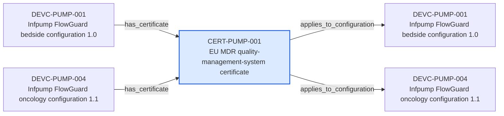

---
{
  "id": "CERT-PUMP-001",
  "type": "certificate",
  "title": "EU MDR quality-management-system certificate",
  "aliases": [
    "CERT-PUMP-001",
    "CERT-PUMP-001-eu-mdr-quality-management-system-certificate",
    "18-ontology-notes/certificate/CERT-PUMP-001-eu-mdr-quality-management-system-certificate",
    "03-Ontology notes/certificate/CERT-PUMP-001-eu-mdr-quality-management-system-certificate"
  ],
  "status": "approved",
  "version": "1",
  "created": "2026-08-15",
  "modified": "2026-08-15",
  "tags": [
    "ontology-note/certificate",
    "device/infpump-flowguard"
  ],
  "draft": false,
  "note_origin": "human-reviewed synthetic example",
  "technical_file": "TF-10 Conformity/MDR Certificates Register.xlsx",
  "technical_file_identifier": "CERT-PUMP-001",
  "valid_from": "2026-08-15",
  "review_status": "approved",
  "device_context": "[[06-Infpump FlowGuard ontology notes/device-configuration/DEVC-PUMP-001-infpump-flowguard-bedside-configuration-10|DEVC-PUMP-001]]",
  "valid_to": "2029-08-14",
  "certificate_state": "valid",
  "applies_to_configuration": [
    "[[06-Infpump FlowGuard ontology notes/device-configuration/DEVC-PUMP-001-infpump-flowguard-bedside-configuration-10|DEVC-PUMP-001]]",
    "[[06-Infpump FlowGuard ontology notes/device-configuration/DEVC-PUMP-004-infpump-flowguard-oncology-configuration-11|DEVC-PUMP-004]]"
  ]
}
---

# EU MDR quality-management-system certificate

## Semantic role

Represents one certificate, its configuration coverage and temporal validity state.

## Note

Human-readable rendering of this note's YAML/JSON frontmatter:

- **id:** `CERT-PUMP-001`
- **type:** `certificate`
- **title:** `EU MDR quality-management-system certificate`
- **aliases:** `CERT-PUMP-001`, `CERT-PUMP-001-eu-mdr-quality-management-system-certificate`, `18-ontology-notes/certificate/CERT-PUMP-001-eu-mdr-quality-management-system-certificate`, `03-Ontology notes/certificate/CERT-PUMP-001-eu-mdr-quality-management-system-certificate`
- **status:** `approved`
- **version:** `1`
- **created:** `2026-08-15`
- **modified:** `2026-08-15`
- **tags:** `ontology-note/certificate`, `device/infpump-flowguard`
- **draft:** `false`
- **note_origin:** `human-reviewed synthetic example`
- **technical_file:** `TF-10 Conformity/MDR Certificates Register.xlsx`
- **technical_file_identifier:** `CERT-PUMP-001`
- **valid_from:** `2026-08-15`
- **review_status:** `approved`
- **device_context:** [[06-Infpump FlowGuard ontology notes/device-configuration/DEVC-PUMP-001-infpump-flowguard-bedside-configuration-10|DEVC-PUMP-001]]
- **valid_to:** `2029-08-14`
- **certificate_state:** `valid`
- **applies_to_configuration:** [[06-Infpump FlowGuard ontology notes/device-configuration/DEVC-PUMP-001-infpump-flowguard-bedside-configuration-10|DEVC-PUMP-001]], [[06-Infpump FlowGuard ontology notes/device-configuration/DEVC-PUMP-004-infpump-flowguard-oncology-configuration-11|DEVC-PUMP-004]]

## Traceability

Previous dependencies are ontology notes that lead into this record. They reach it through `has_certificate` from [[06-Infpump FlowGuard ontology notes/device-configuration/DEVC-PUMP-001-infpump-flowguard-bedside-configuration-10|DEVC-PUMP-001 — Infpump FlowGuard bedside configuration 1.0]], [[06-Infpump FlowGuard ontology notes/device-configuration/DEVC-PUMP-004-infpump-flowguard-oncology-configuration-11|DEVC-PUMP-004 — Infpump FlowGuard oncology configuration 1.1]]. These incoming links show which product, decision, process or evidence records depend on the current note.

Succeeding dependencies are ontology notes to which this record leads. The trace continues through `applies_to_configuration` to [[06-Infpump FlowGuard ontology notes/device-configuration/DEVC-PUMP-001-infpump-flowguard-bedside-configuration-10|DEVC-PUMP-001 — Infpump FlowGuard bedside configuration 1.0]], [[06-Infpump FlowGuard ontology notes/device-configuration/DEVC-PUMP-004-infpump-flowguard-oncology-configuration-11|DEVC-PUMP-004 — Infpump FlowGuard oncology configuration 1.1]]. These outgoing links identify the next product, risk, control, evidence, change or lifecycle records used by downstream reasoning.

The left-to-right diagram shows up to five asserted previous and five asserted succeeding ontology-note dependencies. When more links exist, the additional-dependency node states how many remain available through the verbal links and structured metadata above.

