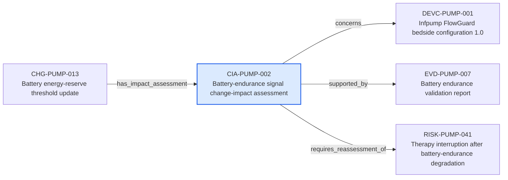

---
{
  "id": "CIA-PUMP-002",
  "type": "change-impact-assessment",
  "title": "Battery-endurance signal change-impact assessment",
  "aliases": [
    "CIA-PUMP-002",
    "CIA-PUMP-002-battery-endurance-signal-change-impact-assessment",
    "18-ontology-notes/change-impact-assessment/CIA-PUMP-002-battery-endurance-signal-change-impact-assessment",
    "03-Ontology notes/change-impact-assessment/CIA-PUMP-002-battery-endurance-signal-change-impact-assessment"
  ],
  "status": "approved",
  "version": "1",
  "created": "2026-08-15",
  "modified": "2026-08-15",
  "tags": [
    "ontology-note/change-impact-assessment",
    "device/infpump-flowguard"
  ],
  "draft": false,
  "note_origin": "human-reviewed synthetic example",
  "technical_file": "TF-08 Change Control/Change Impact Assessments.xlsx",
  "technical_file_identifier": "CIA-PUMP-002",
  "valid_from": "2026-08-15",
  "review_status": "approved",
  "device_context": "[[06-Infpump FlowGuard ontology notes/device-configuration/DEVC-PUMP-001-infpump-flowguard-bedside-configuration-10|DEVC-PUMP-001]]",
  "assessment_scope": "Battery endurance, supplier controls, residual risk and verification impact of CHG-PUMP-001",
  "assessment_state": "completed",
  "topic": "completed-battery-endurance-lifecycle",
  "concerns": [
    "[[06-Infpump FlowGuard ontology notes/device-configuration/DEVC-PUMP-001-infpump-flowguard-bedside-configuration-10|DEVC-PUMP-001]]"
  ],
  "supported_by": [
    "[[06-Infpump FlowGuard ontology notes/verification-evidence/EVD-PUMP-007-battery-endurance-validation-report|EVD-PUMP-007]]"
  ],
  "requires_reassessment_of": [
    "[[06-Infpump FlowGuard ontology notes/risk/RISK-PUMP-041-therapy-interruption-after-battery-endurance-degradation|RISK-PUMP-041]]"
  ]
}
---

# Battery-endurance signal change-impact assessment

## Semantic role

Documents the controlled assessment of how a proposed change affects requirements, configuration, risk, evidence and required follow-up actions.

## Note

Human-readable rendering of this note's YAML/JSON frontmatter:

- **id:** `CIA-PUMP-002`
- **type:** `change-impact-assessment`
- **title:** `Battery-endurance signal change-impact assessment`
- **aliases:** `CIA-PUMP-002`, `CIA-PUMP-002-battery-endurance-signal-change-impact-assessment`, `18-ontology-notes/change-impact-assessment/CIA-PUMP-002-battery-endurance-signal-change-impact-assessment`, `03-Ontology notes/change-impact-assessment/CIA-PUMP-002-battery-endurance-signal-change-impact-assessment`
- **status:** `approved`
- **version:** `1`
- **created:** `2026-08-15`
- **modified:** `2026-08-15`
- **tags:** `ontology-note/change-impact-assessment`, `device/infpump-flowguard`
- **draft:** `false`
- **note_origin:** `human-reviewed synthetic example`
- **technical_file:** `TF-08 Change Control/Change Impact Assessments.xlsx`
- **technical_file_identifier:** `CIA-PUMP-002`
- **valid_from:** `2026-08-15`
- **review_status:** `approved`
- **device_context:** [[06-Infpump FlowGuard ontology notes/device-configuration/DEVC-PUMP-001-infpump-flowguard-bedside-configuration-10|DEVC-PUMP-001]]
- **assessment_scope:** `Battery endurance, supplier controls, residual risk and verification impact of CHG-PUMP-001`
- **assessment_state:** `completed`
- **topic:** `completed-battery-endurance-lifecycle`
- **concerns:** [[06-Infpump FlowGuard ontology notes/device-configuration/DEVC-PUMP-001-infpump-flowguard-bedside-configuration-10|DEVC-PUMP-001]]
- **supported_by:** [[06-Infpump FlowGuard ontology notes/verification-evidence/EVD-PUMP-007-battery-endurance-validation-report|EVD-PUMP-007]]
- **requires_reassessment_of:** [[06-Infpump FlowGuard ontology notes/risk/RISK-PUMP-041-therapy-interruption-after-battery-endurance-degradation|RISK-PUMP-041]]

## Traceability

Previous dependencies are ontology notes that lead into this record. They reach it through `has_impact_assessment` from [[06-Infpump FlowGuard ontology notes/change/CHG-PUMP-013-battery-energy-reserve-threshold-update|CHG-PUMP-013 — Battery energy-reserve threshold update]]. These incoming links show which product, decision, process or evidence records depend on the current note.

Succeeding dependencies are ontology notes to which this record leads. The trace continues through `concerns` to [[06-Infpump FlowGuard ontology notes/device-configuration/DEVC-PUMP-001-infpump-flowguard-bedside-configuration-10|DEVC-PUMP-001 — Infpump FlowGuard bedside configuration 1.0]]; `supported_by` to [[06-Infpump FlowGuard ontology notes/verification-evidence/EVD-PUMP-007-battery-endurance-validation-report|EVD-PUMP-007 — Battery endurance validation report]]; `requires_reassessment_of` to [[06-Infpump FlowGuard ontology notes/risk/RISK-PUMP-041-therapy-interruption-after-battery-endurance-degradation|RISK-PUMP-041 — Therapy interruption after battery-endurance degradation]]. These outgoing links identify the next product, risk, control, evidence, change or lifecycle records used by downstream reasoning.

The left-to-right diagram shows up to five asserted previous and five asserted succeeding ontology-note dependencies. When more links exist, the additional-dependency node states how many remain available through the verbal links and structured metadata above.

