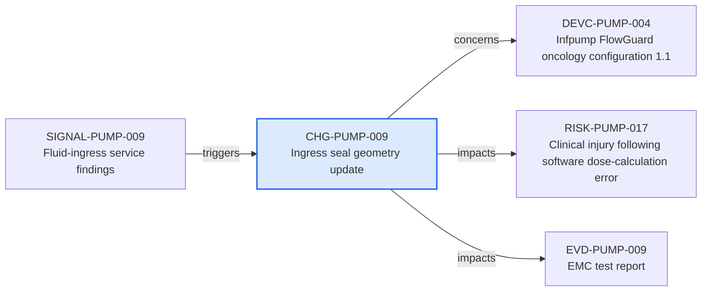

---
{
  "id": "CHG-PUMP-009",
  "type": "change",
  "title": "Ingress seal geometry update",
  "aliases": [
    "CHG-PUMP-009",
    "CHG-PUMP-009-ingress-seal-geometry-update",
    "18-ontology-notes/change/CHG-PUMP-009-ingress-seal-geometry-update",
    "03-Ontology notes/change/CHG-PUMP-009-ingress-seal-geometry-update"
  ],
  "status": "under-assessment",
  "version": "1",
  "created": "2026-08-15",
  "modified": "2026-08-15",
  "tags": [
    "ontology-note/change",
    "device/infpump-flowguard"
  ],
  "draft": false,
  "note_origin": "human-reviewed synthetic example",
  "technical_file": "TF-08 Change Control/Design Change Register.xlsx",
  "technical_file_identifier": "CHG-PUMP-009",
  "valid_from": "2026-08-15",
  "review_status": "approved",
  "device_context": "[[06-Infpump FlowGuard ontology notes/device-configuration/DEVC-PUMP-004-infpump-flowguard-oncology-configuration-11|DEVC-PUMP-004]]",
  "impact_level": "medium",
  "change_state": "under-assessment",
  "concerns": [
    "[[06-Infpump FlowGuard ontology notes/device-configuration/DEVC-PUMP-004-infpump-flowguard-oncology-configuration-11|DEVC-PUMP-004]]"
  ],
  "impacts": [
    "[[06-Infpump FlowGuard ontology notes/risk/RISK-PUMP-017-clinical-injury-following-software-dose-calculation-error|RISK-PUMP-017]]",
    "[[06-Infpump FlowGuard ontology notes/verification-evidence/EVD-PUMP-009-emc-test-report|EVD-PUMP-009]]"
  ]
}
---

# Ingress seal geometry update

## Semantic role

Represents one proposed product or process change whose regulatory impact must be assessed before implementation.

## Note

Human-readable rendering of this note's YAML/JSON frontmatter:

- **id:** `CHG-PUMP-009`
- **type:** `change`
- **title:** `Ingress seal geometry update`
- **aliases:** `CHG-PUMP-009`, `CHG-PUMP-009-ingress-seal-geometry-update`, `18-ontology-notes/change/CHG-PUMP-009-ingress-seal-geometry-update`, `03-Ontology notes/change/CHG-PUMP-009-ingress-seal-geometry-update`
- **status:** `under-assessment`
- **version:** `1`
- **created:** `2026-08-15`
- **modified:** `2026-08-15`
- **tags:** `ontology-note/change`, `device/infpump-flowguard`
- **draft:** `false`
- **note_origin:** `human-reviewed synthetic example`
- **technical_file:** `TF-08 Change Control/Design Change Register.xlsx`
- **technical_file_identifier:** `CHG-PUMP-009`
- **valid_from:** `2026-08-15`
- **review_status:** `approved`
- **device_context:** [[06-Infpump FlowGuard ontology notes/device-configuration/DEVC-PUMP-004-infpump-flowguard-oncology-configuration-11|DEVC-PUMP-004]]
- **impact_level:** `medium`
- **change_state:** `under-assessment`
- **concerns:** [[06-Infpump FlowGuard ontology notes/device-configuration/DEVC-PUMP-004-infpump-flowguard-oncology-configuration-11|DEVC-PUMP-004]]
- **impacts:** [[06-Infpump FlowGuard ontology notes/risk/RISK-PUMP-017-clinical-injury-following-software-dose-calculation-error|RISK-PUMP-017]], [[06-Infpump FlowGuard ontology notes/verification-evidence/EVD-PUMP-009-emc-test-report|EVD-PUMP-009]]

## Traceability

Previous dependencies are ontology notes that lead into this record. They reach it through `triggers` from [[06-Infpump FlowGuard ontology notes/signal/SIGNAL-PUMP-009-fluid-ingress-service-findings|SIGNAL-PUMP-009 — Fluid-ingress service findings]]. These incoming links show which product, decision, process or evidence records depend on the current note.

Succeeding dependencies are ontology notes to which this record leads. The trace continues through `concerns` to [[06-Infpump FlowGuard ontology notes/device-configuration/DEVC-PUMP-004-infpump-flowguard-oncology-configuration-11|DEVC-PUMP-004 — Infpump FlowGuard oncology configuration 1.1]]; `impacts` to [[06-Infpump FlowGuard ontology notes/risk/RISK-PUMP-017-clinical-injury-following-software-dose-calculation-error|RISK-PUMP-017 — Clinical injury following software dose-calculation error]], [[06-Infpump FlowGuard ontology notes/verification-evidence/EVD-PUMP-009-emc-test-report|EVD-PUMP-009 — EMC test report]]. These outgoing links identify the next product, risk, control, evidence, change or lifecycle records used by downstream reasoning.

The left-to-right diagram shows up to five asserted previous and five asserted succeeding ontology-note dependencies. When more links exist, the additional-dependency node states how many remain available through the verbal links and structured metadata above.

