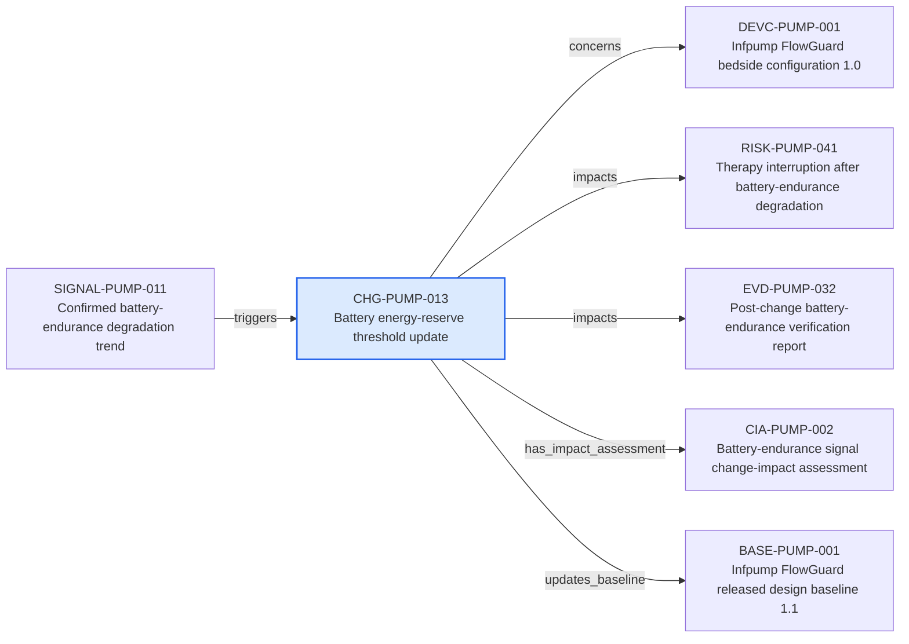

---
{
  "id": "CHG-PUMP-013",
  "type": "change",
  "title": "Battery energy-reserve threshold update",
  "aliases": [
    "CHG-PUMP-013",
    "CHG-PUMP-013-battery-energy-reserve-threshold-update",
    "18-ontology-notes/change/CHG-PUMP-013-battery-energy-reserve-threshold-update",
    "03-Ontology notes/change/CHG-PUMP-013-battery-energy-reserve-threshold-update"
  ],
  "status": "implemented",
  "version": "1",
  "created": "2026-08-15",
  "modified": "2026-08-15",
  "tags": [
    "ontology-note/change",
    "device/infpump-flowguard"
  ],
  "draft": false,
  "note_origin": "human-reviewed synthetic example",
  "technical_file": "TF-08 Change Control/Design Change Register.xlsx",
  "technical_file_identifier": "CHG-PUMP-013",
  "valid_from": "2026-08-15",
  "review_status": "approved",
  "device_context": "[[06-Infpump FlowGuard ontology notes/device-configuration/DEVC-PUMP-001-infpump-flowguard-bedside-configuration-10|DEVC-PUMP-001]]",
  "impact_level": "high",
  "change_state": "implemented-after-approved-impact-assessment-and-verification",
  "topic": "completed-battery-endurance-lifecycle",
  "concerns": [
    "[[06-Infpump FlowGuard ontology notes/device-configuration/DEVC-PUMP-001-infpump-flowguard-bedside-configuration-10|DEVC-PUMP-001]]"
  ],
  "impacts": [
    "[[06-Infpump FlowGuard ontology notes/risk/RISK-PUMP-041-therapy-interruption-after-battery-endurance-degradation|RISK-PUMP-041]]",
    "[[06-Infpump FlowGuard ontology notes/verification-evidence/EVD-PUMP-032-post-change-battery-endurance-verification-report|EVD-PUMP-032]]"
  ],
  "has_impact_assessment": [
    "[[06-Infpump FlowGuard ontology notes/change-impact-assessment/CIA-PUMP-002-battery-endurance-signal-change-impact-assessment|CIA-PUMP-002]]"
  ],
  "updates_baseline": [
    "[[06-Infpump FlowGuard ontology notes/configuration-baseline/BASE-PUMP-001-infpump-flowguard-released-design-baseline-11|BASE-PUMP-001]]"
  ]
}
---

# Battery energy-reserve threshold update

## Semantic role

Represents one proposed product or process change whose regulatory impact must be assessed before implementation.

## Note

Human-readable rendering of this note's YAML/JSON frontmatter:

- **id:** `CHG-PUMP-013`
- **type:** `change`
- **title:** `Battery energy-reserve threshold update`
- **aliases:** `CHG-PUMP-013`, `CHG-PUMP-013-battery-energy-reserve-threshold-update`, `18-ontology-notes/change/CHG-PUMP-013-battery-energy-reserve-threshold-update`, `03-Ontology notes/change/CHG-PUMP-013-battery-energy-reserve-threshold-update`
- **status:** `implemented`
- **version:** `1`
- **created:** `2026-08-15`
- **modified:** `2026-08-15`
- **tags:** `ontology-note/change`, `device/infpump-flowguard`
- **draft:** `false`
- **note_origin:** `human-reviewed synthetic example`
- **technical_file:** `TF-08 Change Control/Design Change Register.xlsx`
- **technical_file_identifier:** `CHG-PUMP-013`
- **valid_from:** `2026-08-15`
- **review_status:** `approved`
- **device_context:** [[06-Infpump FlowGuard ontology notes/device-configuration/DEVC-PUMP-001-infpump-flowguard-bedside-configuration-10|DEVC-PUMP-001]]
- **impact_level:** `high`
- **change_state:** `implemented-after-approved-impact-assessment-and-verification`
- **topic:** `completed-battery-endurance-lifecycle`
- **concerns:** [[06-Infpump FlowGuard ontology notes/device-configuration/DEVC-PUMP-001-infpump-flowguard-bedside-configuration-10|DEVC-PUMP-001]]
- **impacts:** [[06-Infpump FlowGuard ontology notes/risk/RISK-PUMP-041-therapy-interruption-after-battery-endurance-degradation|RISK-PUMP-041]], [[06-Infpump FlowGuard ontology notes/verification-evidence/EVD-PUMP-032-post-change-battery-endurance-verification-report|EVD-PUMP-032]]
- **has_impact_assessment:** [[06-Infpump FlowGuard ontology notes/change-impact-assessment/CIA-PUMP-002-battery-endurance-signal-change-impact-assessment|CIA-PUMP-002]]
- **updates_baseline:** [[06-Infpump FlowGuard ontology notes/configuration-baseline/BASE-PUMP-001-infpump-flowguard-released-design-baseline-11|BASE-PUMP-001]]

## Traceability

Previous dependencies are ontology notes that lead into this record. They reach it through `triggers` from [[06-Infpump FlowGuard ontology notes/signal/SIGNAL-PUMP-011-confirmed-battery-endurance-degradation-trend|SIGNAL-PUMP-011 — Confirmed battery-endurance degradation trend]]. These incoming links show which product, decision, process or evidence records depend on the current note.

Succeeding dependencies are ontology notes to which this record leads. The trace continues through `concerns` to [[06-Infpump FlowGuard ontology notes/device-configuration/DEVC-PUMP-001-infpump-flowguard-bedside-configuration-10|DEVC-PUMP-001 — Infpump FlowGuard bedside configuration 1.0]]; `impacts` to [[06-Infpump FlowGuard ontology notes/risk/RISK-PUMP-041-therapy-interruption-after-battery-endurance-degradation|RISK-PUMP-041 — Therapy interruption after battery-endurance degradation]], [[06-Infpump FlowGuard ontology notes/verification-evidence/EVD-PUMP-032-post-change-battery-endurance-verification-report|EVD-PUMP-032 — Post-change battery-endurance verification report]]; `has_impact_assessment` to [[06-Infpump FlowGuard ontology notes/change-impact-assessment/CIA-PUMP-002-battery-endurance-signal-change-impact-assessment|CIA-PUMP-002 — Battery-endurance signal change-impact assessment]]; `updates_baseline` to [[06-Infpump FlowGuard ontology notes/configuration-baseline/BASE-PUMP-001-infpump-flowguard-released-design-baseline-11|BASE-PUMP-001 — Infpump FlowGuard released design baseline 1.1]]. These outgoing links identify the next product, risk, control, evidence, change or lifecycle records used by downstream reasoning.

The left-to-right diagram shows up to five asserted previous and five asserted succeeding ontology-note dependencies. When more links exist, the additional-dependency node states how many remain available through the verbal links and structured metadata above.

