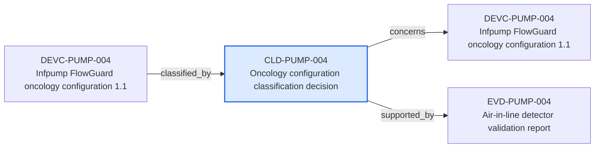

---
{
  "id": "CLD-PUMP-004",
  "type": "classification-decision",
  "title": "Oncology configuration classification decision",
  "aliases": [
    "CLD-PUMP-004",
    "CLD-PUMP-004-oncology-configuration-classification-decision",
    "18-ontology-notes/classification-decision/CLD-PUMP-004-oncology-configuration-classification-decision",
    "03-Ontology notes/classification-decision/CLD-PUMP-004-oncology-configuration-classification-decision"
  ],
  "status": "approved",
  "version": "1",
  "created": "2026-08-15",
  "modified": "2026-08-15",
  "tags": [
    "ontology-note/classification-decision",
    "device/infpump-flowguard"
  ],
  "draft": false,
  "note_origin": "human-reviewed synthetic example",
  "technical_file": "TF-03 Classification/Classification Rationale.docx",
  "technical_file_identifier": "CLD-PUMP-004",
  "valid_from": "2026-08-15",
  "review_status": "approved",
  "device_context": "[[06-Infpump FlowGuard ontology notes/device-configuration/DEVC-PUMP-004-infpump-flowguard-oncology-configuration-11|DEVC-PUMP-004]]",
  "conclusion": "IIb",
  "decision_date": "2026-08-15",
  "concerns": [
    "[[06-Infpump FlowGuard ontology notes/device-configuration/DEVC-PUMP-004-infpump-flowguard-oncology-configuration-11|DEVC-PUMP-004]]"
  ],
  "concludes_class": [
    "[[01-Ontology instances/03-devices/classification/CLASS-IIb-class-iib|CLASS-IIb]]"
  ],
  "considers_rule": [
    "[[01-Ontology instances/03-devices/classification/CRULE-MDR-12-mdr-annex-viii-rule-12|CRULE-MDR-12]]"
  ],
  "supported_by": [
    "[[06-Infpump FlowGuard ontology notes/verification-evidence/EVD-PUMP-004-air-in-line-detector-validation-report|EVD-PUMP-004]]"
  ],
  "derived_from": [
    "[[02-Sources/legislation/PROV-MDR-ANNEX-VIII-mdr-annex-viii-classification|PROV-MDR-ANNEX-VIII]]"
  ],
  "source_provisions": [
    "[[02-Sources/guidance/SRC-MDCG-2021-24-R1-mdcg-2021-24-rev1-classification-of-medical-devices|SRC-MDCG-2021-24-R1]]",
    "[[02-Sources/guidance/SRC-MDCG-INDEX-mdcg-endorsed-documents-and-other-guidance|SRC-MDCG-INDEX]]"
  ]
}
---

# Oncology configuration classification decision

## Semantic role

Captures the classification conclusion, controlling configuration, rule basis and supporting rationale as an independently reviewable decision.

## Note

Human-readable rendering of this note's YAML/JSON frontmatter:

- **id:** `CLD-PUMP-004`
- **type:** `classification-decision`
- **title:** `Oncology configuration classification decision`
- **aliases:** `CLD-PUMP-004`, `CLD-PUMP-004-oncology-configuration-classification-decision`, `18-ontology-notes/classification-decision/CLD-PUMP-004-oncology-configuration-classification-decision`, `03-Ontology notes/classification-decision/CLD-PUMP-004-oncology-configuration-classification-decision`
- **status:** `approved`
- **version:** `1`
- **created:** `2026-08-15`
- **modified:** `2026-08-15`
- **tags:** `ontology-note/classification-decision`, `device/infpump-flowguard`
- **draft:** `false`
- **note_origin:** `human-reviewed synthetic example`
- **technical_file:** `TF-03 Classification/Classification Rationale.docx`
- **technical_file_identifier:** `CLD-PUMP-004`
- **valid_from:** `2026-08-15`
- **review_status:** `approved`
- **device_context:** [[06-Infpump FlowGuard ontology notes/device-configuration/DEVC-PUMP-004-infpump-flowguard-oncology-configuration-11|DEVC-PUMP-004]]
- **conclusion:** `IIb`
- **decision_date:** `2026-08-15`
- **concerns:** [[06-Infpump FlowGuard ontology notes/device-configuration/DEVC-PUMP-004-infpump-flowguard-oncology-configuration-11|DEVC-PUMP-004]]
- **concludes_class:** [[01-Ontology instances/03-devices/classification/CLASS-IIb-class-iib|CLASS-IIb]]
- **considers_rule:** [[01-Ontology instances/03-devices/classification/CRULE-MDR-12-mdr-annex-viii-rule-12|CRULE-MDR-12]]
- **supported_by:** [[06-Infpump FlowGuard ontology notes/verification-evidence/EVD-PUMP-004-air-in-line-detector-validation-report|EVD-PUMP-004]]
- **derived_from:** [[02-Sources/legislation/PROV-MDR-ANNEX-VIII-mdr-annex-viii-classification|PROV-MDR-ANNEX-VIII]]
- **source_provisions:** [[02-Sources/guidance/SRC-MDCG-2021-24-R1-mdcg-2021-24-rev1-classification-of-medical-devices|SRC-MDCG-2021-24-R1]], [[02-Sources/guidance/SRC-MDCG-INDEX-mdcg-endorsed-documents-and-other-guidance|SRC-MDCG-INDEX]]

## Traceability

Previous dependencies are ontology notes that lead into this record. They reach it through `classified_by` from [[06-Infpump FlowGuard ontology notes/device-configuration/DEVC-PUMP-004-infpump-flowguard-oncology-configuration-11|DEVC-PUMP-004 — Infpump FlowGuard oncology configuration 1.1]]. These incoming links show which product, decision, process or evidence records depend on the current note.

Succeeding dependencies are ontology notes to which this record leads. The trace continues through `concerns` to [[06-Infpump FlowGuard ontology notes/device-configuration/DEVC-PUMP-004-infpump-flowguard-oncology-configuration-11|DEVC-PUMP-004 — Infpump FlowGuard oncology configuration 1.1]]; `supported_by` to [[06-Infpump FlowGuard ontology notes/verification-evidence/EVD-PUMP-004-air-in-line-detector-validation-report|EVD-PUMP-004 — Air-in-line detector validation report]]. These outgoing links identify the next product, risk, control, evidence, change or lifecycle records used by downstream reasoning.

The left-to-right diagram shows up to five asserted previous and five asserted succeeding ontology-note dependencies. When more links exist, the additional-dependency node states how many remain available through the verbal links and structured metadata above.

