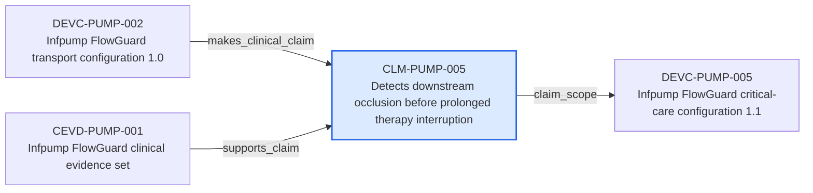

---
{
  "id": "CLM-PUMP-005",
  "type": "clinical-claim",
  "title": "Detects downstream occlusion before prolonged therapy interruption",
  "aliases": [
    "CLM-PUMP-005",
    "CLM-PUMP-005-detects-downstream-occlusion-before-prolonged-therapy-interruption",
    "18-ontology-notes/clinical-claim/CLM-PUMP-005-detects-downstream-occlusion-before-prolonged-therapy-interruption",
    "03-Ontology notes/clinical-claim/CLM-PUMP-005-detects-downstream-occlusion-before-prolonged-therapy-interruption"
  ],
  "status": "approved",
  "version": "1",
  "created": "2026-08-15",
  "modified": "2026-08-15",
  "tags": [
    "ontology-note/clinical-claim",
    "device/infpump-flowguard"
  ],
  "draft": false,
  "note_origin": "human-reviewed synthetic example",
  "technical_file": "TF-06 Clinical Evaluation/Clinical Claims Matrix.xlsx",
  "technical_file_identifier": "CLM-PUMP-005",
  "valid_from": "2026-08-15",
  "review_status": "approved",
  "device_context": "[[06-Infpump FlowGuard ontology notes/device-configuration/DEVC-PUMP-005-infpump-flowguard-critical-care-configuration-11|DEVC-PUMP-005]]",
  "claim_status": "supported",
  "claim_scope": "[[06-Infpump FlowGuard ontology notes/device-configuration/DEVC-PUMP-005-infpump-flowguard-critical-care-configuration-11|DEVC-PUMP-005]]"
}
---

# Detects downstream occlusion before prolonged therapy interruption

## Semantic role

Defines one device-performance or clinical-use claim that requires controlled clinical support.

## Note

Human-readable rendering of this note's YAML/JSON frontmatter:

- **id:** `CLM-PUMP-005`
- **type:** `clinical-claim`
- **title:** `Detects downstream occlusion before prolonged therapy interruption`
- **aliases:** `CLM-PUMP-005`, `CLM-PUMP-005-detects-downstream-occlusion-before-prolonged-therapy-interruption`, `18-ontology-notes/clinical-claim/CLM-PUMP-005-detects-downstream-occlusion-before-prolonged-therapy-interruption`, `03-Ontology notes/clinical-claim/CLM-PUMP-005-detects-downstream-occlusion-before-prolonged-therapy-interruption`
- **status:** `approved`
- **version:** `1`
- **created:** `2026-08-15`
- **modified:** `2026-08-15`
- **tags:** `ontology-note/clinical-claim`, `device/infpump-flowguard`
- **draft:** `false`
- **note_origin:** `human-reviewed synthetic example`
- **technical_file:** `TF-06 Clinical Evaluation/Clinical Claims Matrix.xlsx`
- **technical_file_identifier:** `CLM-PUMP-005`
- **valid_from:** `2026-08-15`
- **review_status:** `approved`
- **device_context:** [[06-Infpump FlowGuard ontology notes/device-configuration/DEVC-PUMP-005-infpump-flowguard-critical-care-configuration-11|DEVC-PUMP-005]]
- **claim_status:** `supported`
- **claim_scope:** [[06-Infpump FlowGuard ontology notes/device-configuration/DEVC-PUMP-005-infpump-flowguard-critical-care-configuration-11|DEVC-PUMP-005]]

## Traceability

Previous dependencies are ontology notes that lead into this record. They reach it through `makes_clinical_claim` from [[06-Infpump FlowGuard ontology notes/device-configuration/DEVC-PUMP-002-infpump-flowguard-transport-configuration-10|DEVC-PUMP-002 — Infpump FlowGuard transport configuration 1.0]]; `supports_claim` from [[06-Infpump FlowGuard ontology notes/clinical-evidence/CEVD-PUMP-001-infpump-flowguard-clinical-evidence-set|CEVD-PUMP-001 — Infpump FlowGuard clinical evidence set]]. These incoming links show which product, decision, process or evidence records depend on the current note.

Succeeding dependencies are ontology notes to which this record leads. The trace continues through `claim_scope` to [[06-Infpump FlowGuard ontology notes/device-configuration/DEVC-PUMP-005-infpump-flowguard-critical-care-configuration-11|DEVC-PUMP-005 — Infpump FlowGuard critical-care configuration 1.1]]. These outgoing links identify the next product, risk, control, evidence, change or lifecycle records used by downstream reasoning.

The left-to-right diagram shows up to five asserted previous and five asserted succeeding ontology-note dependencies. When more links exist, the additional-dependency node states how many remain available through the verbal links and structured metadata above.

