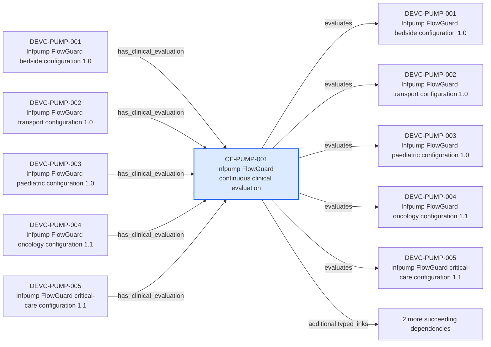

---
{
  "id": "CE-PUMP-001",
  "type": "clinical-evaluation",
  "title": "Infpump FlowGuard continuous clinical evaluation",
  "aliases": [
    "CE-PUMP-001",
    "CE-PUMP-001-infpump-flowguard-continuous-clinical-evaluation",
    "18-ontology-notes/clinical-evaluation/CE-PUMP-001-infpump-flowguard-continuous-clinical-evaluation",
    "03-Ontology notes/clinical-evaluation/CE-PUMP-001-infpump-flowguard-continuous-clinical-evaluation"
  ],
  "status": "approved",
  "version": "1",
  "created": "2026-08-15",
  "modified": "2026-08-15",
  "tags": [
    "ontology-note/clinical-evaluation",
    "device/infpump-flowguard"
  ],
  "draft": false,
  "note_origin": "human-reviewed synthetic example",
  "technical_file": "TF-06 Clinical Evaluation/Clinical Evaluation Plan and Report.docx",
  "technical_file_identifier": "CE-PUMP-001",
  "valid_from": "2026-08-15",
  "review_status": "approved",
  "device_context": "[[06-Infpump FlowGuard ontology notes/device-configuration/DEVC-PUMP-001-infpump-flowguard-bedside-configuration-10|DEVC-PUMP-001]]",
  "evaluation_state": "current",
  "evaluates": [
    "[[06-Infpump FlowGuard ontology notes/device-configuration/DEVC-PUMP-001-infpump-flowguard-bedside-configuration-10|DEVC-PUMP-001]]",
    "[[06-Infpump FlowGuard ontology notes/device-configuration/DEVC-PUMP-002-infpump-flowguard-transport-configuration-10|DEVC-PUMP-002]]",
    "[[06-Infpump FlowGuard ontology notes/device-configuration/DEVC-PUMP-003-infpump-flowguard-paediatric-configuration-10|DEVC-PUMP-003]]",
    "[[06-Infpump FlowGuard ontology notes/device-configuration/DEVC-PUMP-004-infpump-flowguard-oncology-configuration-11|DEVC-PUMP-004]]",
    "[[06-Infpump FlowGuard ontology notes/device-configuration/DEVC-PUMP-005-infpump-flowguard-critical-care-configuration-11|DEVC-PUMP-005]]"
  ],
  "uses_evidence": [
    "[[06-Infpump FlowGuard ontology notes/clinical-evidence/CEVD-PUMP-001-infpump-flowguard-clinical-evidence-set|CEVD-PUMP-001]]"
  ],
  "documented_by": [
    "[[06-Infpump FlowGuard ontology notes/clinical-evaluation-report/CER-PUMP-001-infpump-flowguard-clinical-evaluation-report-rev-d|CER-PUMP-001]]"
  ],
  "source_provisions": [
    "[[02-Sources/legislation/PROV-MDR-ARTICLE-61-mdr-article-61-clinical-evaluation|PROV-MDR-ARTICLE-61]]",
    "[[02-Sources/guidance/SRC-MDCG-INDEX-mdcg-endorsed-documents-and-other-guidance|SRC-MDCG-INDEX]]"
  ]
}
---

# Infpump FlowGuard continuous clinical evaluation

## Semantic role

Represents the continuing clinical-evaluation activity, its device scope, evidence set and controlled report.

## Note

Human-readable rendering of this note's YAML/JSON frontmatter:

- **id:** `CE-PUMP-001`
- **type:** `clinical-evaluation`
- **title:** `Infpump FlowGuard continuous clinical evaluation`
- **aliases:** `CE-PUMP-001`, `CE-PUMP-001-infpump-flowguard-continuous-clinical-evaluation`, `18-ontology-notes/clinical-evaluation/CE-PUMP-001-infpump-flowguard-continuous-clinical-evaluation`, `03-Ontology notes/clinical-evaluation/CE-PUMP-001-infpump-flowguard-continuous-clinical-evaluation`
- **status:** `approved`
- **version:** `1`
- **created:** `2026-08-15`
- **modified:** `2026-08-15`
- **tags:** `ontology-note/clinical-evaluation`, `device/infpump-flowguard`
- **draft:** `false`
- **note_origin:** `human-reviewed synthetic example`
- **technical_file:** `TF-06 Clinical Evaluation/Clinical Evaluation Plan and Report.docx`
- **technical_file_identifier:** `CE-PUMP-001`
- **valid_from:** `2026-08-15`
- **review_status:** `approved`
- **device_context:** [[06-Infpump FlowGuard ontology notes/device-configuration/DEVC-PUMP-001-infpump-flowguard-bedside-configuration-10|DEVC-PUMP-001]]
- **evaluation_state:** `current`
- **evaluates:** [[06-Infpump FlowGuard ontology notes/device-configuration/DEVC-PUMP-001-infpump-flowguard-bedside-configuration-10|DEVC-PUMP-001]], [[06-Infpump FlowGuard ontology notes/device-configuration/DEVC-PUMP-002-infpump-flowguard-transport-configuration-10|DEVC-PUMP-002]], [[06-Infpump FlowGuard ontology notes/device-configuration/DEVC-PUMP-003-infpump-flowguard-paediatric-configuration-10|DEVC-PUMP-003]], [[06-Infpump FlowGuard ontology notes/device-configuration/DEVC-PUMP-004-infpump-flowguard-oncology-configuration-11|DEVC-PUMP-004]], [[06-Infpump FlowGuard ontology notes/device-configuration/DEVC-PUMP-005-infpump-flowguard-critical-care-configuration-11|DEVC-PUMP-005]]
- **uses_evidence:** [[06-Infpump FlowGuard ontology notes/clinical-evidence/CEVD-PUMP-001-infpump-flowguard-clinical-evidence-set|CEVD-PUMP-001]]
- **documented_by:** [[06-Infpump FlowGuard ontology notes/clinical-evaluation-report/CER-PUMP-001-infpump-flowguard-clinical-evaluation-report-rev-d|CER-PUMP-001]]
- **source_provisions:** [[02-Sources/legislation/PROV-MDR-ARTICLE-61-mdr-article-61-clinical-evaluation|PROV-MDR-ARTICLE-61]], [[02-Sources/guidance/SRC-MDCG-INDEX-mdcg-endorsed-documents-and-other-guidance|SRC-MDCG-INDEX]]

## Traceability

Previous dependencies are ontology notes that lead into this record. They reach it through `has_clinical_evaluation` from [[06-Infpump FlowGuard ontology notes/device-configuration/DEVC-PUMP-001-infpump-flowguard-bedside-configuration-10|DEVC-PUMP-001 — Infpump FlowGuard bedside configuration 1.0]], [[06-Infpump FlowGuard ontology notes/device-configuration/DEVC-PUMP-002-infpump-flowguard-transport-configuration-10|DEVC-PUMP-002 — Infpump FlowGuard transport configuration 1.0]], [[06-Infpump FlowGuard ontology notes/device-configuration/DEVC-PUMP-003-infpump-flowguard-paediatric-configuration-10|DEVC-PUMP-003 — Infpump FlowGuard paediatric configuration 1.0]] and 2 more linked notes. These incoming links show which product, decision, process or evidence records depend on the current note.

Succeeding dependencies are ontology notes to which this record leads. The trace continues through `evaluates` to [[06-Infpump FlowGuard ontology notes/device-configuration/DEVC-PUMP-001-infpump-flowguard-bedside-configuration-10|DEVC-PUMP-001 — Infpump FlowGuard bedside configuration 1.0]], [[06-Infpump FlowGuard ontology notes/device-configuration/DEVC-PUMP-002-infpump-flowguard-transport-configuration-10|DEVC-PUMP-002 — Infpump FlowGuard transport configuration 1.0]], [[06-Infpump FlowGuard ontology notes/device-configuration/DEVC-PUMP-003-infpump-flowguard-paediatric-configuration-10|DEVC-PUMP-003 — Infpump FlowGuard paediatric configuration 1.0]] and 2 more linked notes; `uses_evidence` to [[06-Infpump FlowGuard ontology notes/clinical-evidence/CEVD-PUMP-001-infpump-flowguard-clinical-evidence-set|CEVD-PUMP-001 — Infpump FlowGuard clinical evidence set]]; `documented_by` to [[06-Infpump FlowGuard ontology notes/clinical-evaluation-report/CER-PUMP-001-infpump-flowguard-clinical-evaluation-report-rev-d|CER-PUMP-001 — Infpump FlowGuard clinical evaluation report Rev D]]. These outgoing links identify the next product, risk, control, evidence, change or lifecycle records used by downstream reasoning.

The left-to-right diagram shows up to five asserted previous and five asserted succeeding ontology-note dependencies. When more links exist, the additional-dependency node states how many remain available through the verbal links and structured metadata above.

