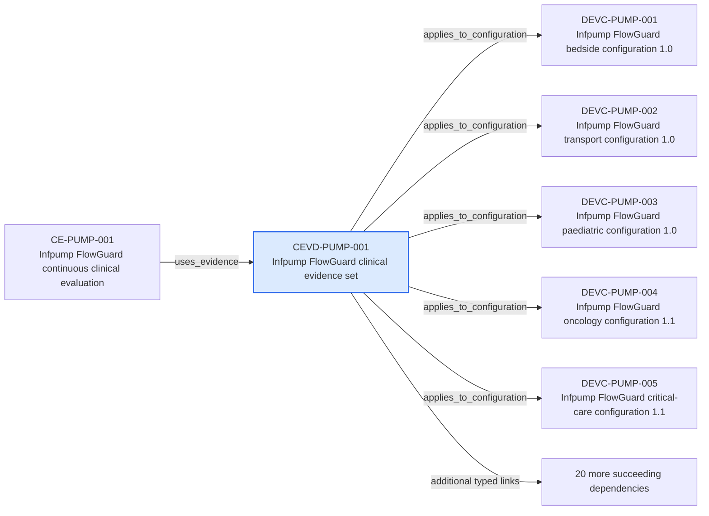

---
{
  "id": "CEVD-PUMP-001",
  "type": "clinical-evidence",
  "title": "Infpump FlowGuard clinical evidence set",
  "aliases": [
    "CEVD-PUMP-001",
    "CEVD-PUMP-001-infpump-flowguard-clinical-evidence-set",
    "18-ontology-notes/clinical-evidence/CEVD-PUMP-001-infpump-flowguard-clinical-evidence-set",
    "03-Ontology notes/clinical-evidence/CEVD-PUMP-001-infpump-flowguard-clinical-evidence-set"
  ],
  "status": "approved",
  "version": "1",
  "created": "2026-08-15",
  "modified": "2026-08-15",
  "tags": [
    "ontology-note/clinical-evidence",
    "device/infpump-flowguard"
  ],
  "draft": false,
  "note_origin": "human-reviewed synthetic example",
  "technical_file": "TF-06 Clinical Evaluation/Clinical Evidence Appraisal.xlsx",
  "technical_file_identifier": "CEVD-PUMP-001",
  "valid_from": "2026-08-15",
  "review_status": "approved",
  "device_context": "[[06-Infpump FlowGuard ontology notes/device-configuration/DEVC-PUMP-001-infpump-flowguard-bedside-configuration-10|DEVC-PUMP-001]]",
  "evidence_scope": "Safety, performance and clinical-benefit claims for the Infpump FlowGuard family",
  "applies_to_configuration": [
    "[[06-Infpump FlowGuard ontology notes/device-configuration/DEVC-PUMP-001-infpump-flowguard-bedside-configuration-10|DEVC-PUMP-001]]",
    "[[06-Infpump FlowGuard ontology notes/device-configuration/DEVC-PUMP-002-infpump-flowguard-transport-configuration-10|DEVC-PUMP-002]]",
    "[[06-Infpump FlowGuard ontology notes/device-configuration/DEVC-PUMP-003-infpump-flowguard-paediatric-configuration-10|DEVC-PUMP-003]]",
    "[[06-Infpump FlowGuard ontology notes/device-configuration/DEVC-PUMP-004-infpump-flowguard-oncology-configuration-11|DEVC-PUMP-004]]",
    "[[06-Infpump FlowGuard ontology notes/device-configuration/DEVC-PUMP-005-infpump-flowguard-critical-care-configuration-11|DEVC-PUMP-005]]"
  ],
  "supports_claim": [
    "[[06-Infpump FlowGuard ontology notes/clinical-claim/CLM-PUMP-001-maintains-programmed-volumetric-flow-within-specified-accuracy|CLM-PUMP-001]]",
    "[[06-Infpump FlowGuard ontology notes/clinical-claim/CLM-PUMP-002-supports-continuous-intravenous-therapy|CLM-PUMP-002]]",
    "[[06-Infpump FlowGuard ontology notes/clinical-claim/CLM-PUMP-003-supports-intermittent-intravenous-therapy|CLM-PUMP-003]]",
    "[[06-Infpump FlowGuard ontology notes/clinical-claim/CLM-PUMP-004-reduces-unintended-free-flow-exposure|CLM-PUMP-004]]",
    "[[06-Infpump FlowGuard ontology notes/clinical-claim/CLM-PUMP-005-detects-downstream-occlusion-before-prolonged-therapy-interruption|CLM-PUMP-005]]",
    "[[06-Infpump FlowGuard ontology notes/clinical-claim/CLM-PUMP-006-detects-clinically-relevant-air-in-line|CLM-PUMP-006]]",
    "[[06-Infpump FlowGuard ontology notes/clinical-claim/CLM-PUMP-007-provides-timely-high-priority-alarm-notification|CLM-PUMP-007]]",
    "[[06-Infpump FlowGuard ontology notes/clinical-claim/CLM-PUMP-008-supports-low-volume-paediatric-infusion|CLM-PUMP-008]]",
    "[[06-Infpump FlowGuard ontology notes/clinical-claim/CLM-PUMP-009-supports-weight-based-dose-programming|CLM-PUMP-009]]",
    "[[06-Infpump FlowGuard ontology notes/clinical-claim/CLM-PUMP-010-supports-oncology-infusion-protocols|CLM-PUMP-010]]",
    "[[06-Infpump FlowGuard ontology notes/clinical-claim/CLM-PUMP-011-supports-vasoactive-medicine-delivery|CLM-PUMP-011]]",
    "[[06-Infpump FlowGuard ontology notes/clinical-claim/CLM-PUMP-012-supports-intra-hospital-transport-use|CLM-PUMP-012]]",
    "[[06-Infpump FlowGuard ontology notes/clinical-claim/CLM-PUMP-013-maintains-therapy-during-specified-battery-operation|CLM-PUMP-013]]",
    "[[06-Infpump FlowGuard ontology notes/clinical-claim/CLM-PUMP-014-provides-traceable-therapy-history|CLM-PUMP-014]]",
    "[[06-Infpump FlowGuard ontology notes/clinical-claim/CLM-PUMP-015-supports-trained-healthcare-professional-operation|CLM-PUMP-015]]",
    "[[06-Infpump FlowGuard ontology notes/clinical-claim/CLM-PUMP-016-reduces-medication-programming-errors-through-drug-limits|CLM-PUMP-016]]",
    "[[06-Infpump FlowGuard ontology notes/clinical-claim/CLM-PUMP-017-supports-cleaning-between-patient-uses|CLM-PUMP-017]]",
    "[[06-Infpump FlowGuard ontology notes/clinical-claim/CLM-PUMP-018-maintains-performance-near-specified-electromagnetic-sources|CLM-PUMP-018]]",
    "[[06-Infpump FlowGuard ontology notes/clinical-claim/CLM-PUMP-019-supports-secure-networked-configuration|CLM-PUMP-019]]",
    "[[06-Infpump FlowGuard ontology notes/clinical-claim/CLM-PUMP-020-provides-clinically-interpretable-event-chronology|CLM-PUMP-020]]"
  ],
  "source_provisions": [
    "[[02-Sources/legislation/PROV-MDR-ARTICLE-61-mdr-article-61-clinical-evaluation|PROV-MDR-ARTICLE-61]]",
    "[[02-Sources/guidance/SRC-MDCG-INDEX-mdcg-endorsed-documents-and-other-guidance|SRC-MDCG-INDEX]]"
  ]
}
---

# Infpump FlowGuard clinical evidence set

## Semantic role

Represents the appraised clinical evidence supporting the safety, performance and clinical claims of the defined configurations.

## Note

Human-readable rendering of this note's YAML/JSON frontmatter:

- **id:** `CEVD-PUMP-001`
- **type:** `clinical-evidence`
- **title:** `Infpump FlowGuard clinical evidence set`
- **aliases:** `CEVD-PUMP-001`, `CEVD-PUMP-001-infpump-flowguard-clinical-evidence-set`, `18-ontology-notes/clinical-evidence/CEVD-PUMP-001-infpump-flowguard-clinical-evidence-set`, `03-Ontology notes/clinical-evidence/CEVD-PUMP-001-infpump-flowguard-clinical-evidence-set`
- **status:** `approved`
- **version:** `1`
- **created:** `2026-08-15`
- **modified:** `2026-08-15`
- **tags:** `ontology-note/clinical-evidence`, `device/infpump-flowguard`
- **draft:** `false`
- **note_origin:** `human-reviewed synthetic example`
- **technical_file:** `TF-06 Clinical Evaluation/Clinical Evidence Appraisal.xlsx`
- **technical_file_identifier:** `CEVD-PUMP-001`
- **valid_from:** `2026-08-15`
- **review_status:** `approved`
- **device_context:** [[06-Infpump FlowGuard ontology notes/device-configuration/DEVC-PUMP-001-infpump-flowguard-bedside-configuration-10|DEVC-PUMP-001]]
- **evidence_scope:** `Safety, performance and clinical-benefit claims for the Infpump FlowGuard family`
- **applies_to_configuration:** [[06-Infpump FlowGuard ontology notes/device-configuration/DEVC-PUMP-001-infpump-flowguard-bedside-configuration-10|DEVC-PUMP-001]], [[06-Infpump FlowGuard ontology notes/device-configuration/DEVC-PUMP-002-infpump-flowguard-transport-configuration-10|DEVC-PUMP-002]], [[06-Infpump FlowGuard ontology notes/device-configuration/DEVC-PUMP-003-infpump-flowguard-paediatric-configuration-10|DEVC-PUMP-003]], [[06-Infpump FlowGuard ontology notes/device-configuration/DEVC-PUMP-004-infpump-flowguard-oncology-configuration-11|DEVC-PUMP-004]], [[06-Infpump FlowGuard ontology notes/device-configuration/DEVC-PUMP-005-infpump-flowguard-critical-care-configuration-11|DEVC-PUMP-005]]
- **supports_claim:** [[06-Infpump FlowGuard ontology notes/clinical-claim/CLM-PUMP-001-maintains-programmed-volumetric-flow-within-specified-accuracy|CLM-PUMP-001]], [[06-Infpump FlowGuard ontology notes/clinical-claim/CLM-PUMP-002-supports-continuous-intravenous-therapy|CLM-PUMP-002]], [[06-Infpump FlowGuard ontology notes/clinical-claim/CLM-PUMP-003-supports-intermittent-intravenous-therapy|CLM-PUMP-003]], [[06-Infpump FlowGuard ontology notes/clinical-claim/CLM-PUMP-004-reduces-unintended-free-flow-exposure|CLM-PUMP-004]], [[06-Infpump FlowGuard ontology notes/clinical-claim/CLM-PUMP-005-detects-downstream-occlusion-before-prolonged-therapy-interruption|CLM-PUMP-005]], [[06-Infpump FlowGuard ontology notes/clinical-claim/CLM-PUMP-006-detects-clinically-relevant-air-in-line|CLM-PUMP-006]], [[06-Infpump FlowGuard ontology notes/clinical-claim/CLM-PUMP-007-provides-timely-high-priority-alarm-notification|CLM-PUMP-007]], [[06-Infpump FlowGuard ontology notes/clinical-claim/CLM-PUMP-008-supports-low-volume-paediatric-infusion|CLM-PUMP-008]], [[06-Infpump FlowGuard ontology notes/clinical-claim/CLM-PUMP-009-supports-weight-based-dose-programming|CLM-PUMP-009]], [[06-Infpump FlowGuard ontology notes/clinical-claim/CLM-PUMP-010-supports-oncology-infusion-protocols|CLM-PUMP-010]], [[06-Infpump FlowGuard ontology notes/clinical-claim/CLM-PUMP-011-supports-vasoactive-medicine-delivery|CLM-PUMP-011]], [[06-Infpump FlowGuard ontology notes/clinical-claim/CLM-PUMP-012-supports-intra-hospital-transport-use|CLM-PUMP-012]], [[06-Infpump FlowGuard ontology notes/clinical-claim/CLM-PUMP-013-maintains-therapy-during-specified-battery-operation|CLM-PUMP-013]], [[06-Infpump FlowGuard ontology notes/clinical-claim/CLM-PUMP-014-provides-traceable-therapy-history|CLM-PUMP-014]], [[06-Infpump FlowGuard ontology notes/clinical-claim/CLM-PUMP-015-supports-trained-healthcare-professional-operation|CLM-PUMP-015]], [[06-Infpump FlowGuard ontology notes/clinical-claim/CLM-PUMP-016-reduces-medication-programming-errors-through-drug-limits|CLM-PUMP-016]], [[06-Infpump FlowGuard ontology notes/clinical-claim/CLM-PUMP-017-supports-cleaning-between-patient-uses|CLM-PUMP-017]], [[06-Infpump FlowGuard ontology notes/clinical-claim/CLM-PUMP-018-maintains-performance-near-specified-electromagnetic-sources|CLM-PUMP-018]], [[06-Infpump FlowGuard ontology notes/clinical-claim/CLM-PUMP-019-supports-secure-networked-configuration|CLM-PUMP-019]], [[06-Infpump FlowGuard ontology notes/clinical-claim/CLM-PUMP-020-provides-clinically-interpretable-event-chronology|CLM-PUMP-020]]
- **source_provisions:** [[02-Sources/legislation/PROV-MDR-ARTICLE-61-mdr-article-61-clinical-evaluation|PROV-MDR-ARTICLE-61]], [[02-Sources/guidance/SRC-MDCG-INDEX-mdcg-endorsed-documents-and-other-guidance|SRC-MDCG-INDEX]]

## Traceability

Previous dependencies are ontology notes that lead into this record. They reach it through `uses_evidence` from [[06-Infpump FlowGuard ontology notes/clinical-evaluation/CE-PUMP-001-infpump-flowguard-continuous-clinical-evaluation|CE-PUMP-001 — Infpump FlowGuard continuous clinical evaluation]]. These incoming links show which product, decision, process or evidence records depend on the current note.

Succeeding dependencies are ontology notes to which this record leads. The trace continues through `applies_to_configuration` to [[06-Infpump FlowGuard ontology notes/device-configuration/DEVC-PUMP-001-infpump-flowguard-bedside-configuration-10|DEVC-PUMP-001 — Infpump FlowGuard bedside configuration 1.0]], [[06-Infpump FlowGuard ontology notes/device-configuration/DEVC-PUMP-002-infpump-flowguard-transport-configuration-10|DEVC-PUMP-002 — Infpump FlowGuard transport configuration 1.0]], [[06-Infpump FlowGuard ontology notes/device-configuration/DEVC-PUMP-003-infpump-flowguard-paediatric-configuration-10|DEVC-PUMP-003 — Infpump FlowGuard paediatric configuration 1.0]] and 2 more linked notes; `supports_claim` to [[06-Infpump FlowGuard ontology notes/clinical-claim/CLM-PUMP-001-maintains-programmed-volumetric-flow-within-specified-accuracy|CLM-PUMP-001 — Maintains programmed volumetric flow within specified accuracy]], [[06-Infpump FlowGuard ontology notes/clinical-claim/CLM-PUMP-002-supports-continuous-intravenous-therapy|CLM-PUMP-002 — Supports continuous intravenous therapy]], [[06-Infpump FlowGuard ontology notes/clinical-claim/CLM-PUMP-003-supports-intermittent-intravenous-therapy|CLM-PUMP-003 — Supports intermittent intravenous therapy]] and 17 more linked notes. These outgoing links identify the next product, risk, control, evidence, change or lifecycle records used by downstream reasoning.

The left-to-right diagram shows up to five asserted previous and five asserted succeeding ontology-note dependencies. When more links exist, the additional-dependency node states how many remain available through the verbal links and structured metadata above.

