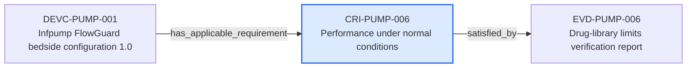

---
{
  "id": "CRI-PUMP-006",
  "type": "compliance-requirement-instance",
  "title": "Performance under normal conditions",
  "aliases": [
    "CRI-PUMP-006",
    "CRI-PUMP-006-performance-under-normal-conditions",
    "18-ontology-notes/compliance-requirement-instance/CRI-PUMP-006-performance-under-normal-conditions",
    "03-Ontology notes/compliance-requirement-instance/CRI-PUMP-006-performance-under-normal-conditions"
  ],
  "status": "approved",
  "version": "1",
  "created": "2026-08-15",
  "modified": "2026-08-15",
  "tags": [
    "ontology-note/compliance-requirement-instance",
    "device/infpump-flowguard"
  ],
  "draft": false,
  "note_origin": "human-reviewed synthetic example",
  "technical_file": "TF-04 GSPR/GSPR Checklist.xlsx",
  "technical_file_identifier": "CRI-PUMP-006",
  "valid_from": "2026-08-15",
  "review_status": "approved",
  "device_context": "[[06-Infpump FlowGuard ontology notes/device-configuration/DEVC-PUMP-001-infpump-flowguard-bedside-configuration-10|DEVC-PUMP-001]]",
  "applicable": true,
  "applicability_rationale": "Applicable to DEVC-PUMP-001 because the configured function or lifecycle control is within the requirement scope.",
  "compliance_method": "Verification and controlled-document review for CRI-PUMP-006",
  "compliance_status": "satisfied",
  "instantiates_requirement": [
    "[[01-Ontology instances/04-requirements/gspr/GSPR-0002-software-and-cybersecurity|GSPR-0002]]"
  ],
  "derived_from": [
    "[[02-Sources/legislation/PROV-MDR-ANNEX-I-mdr-annex-i-gsprs|PROV-MDR-ANNEX-I]]"
  ],
  "satisfied_by": [
    "[[06-Infpump FlowGuard ontology notes/verification-evidence/EVD-PUMP-006-drug-library-limits-verification-report|EVD-PUMP-006]]"
  ]
}
---

# Performance under normal conditions

## Semantic role

Represents one generic obligation as applied to a specific infusion-pump configuration, with an explicit compliance method and evidence link.

## Note

Human-readable rendering of this note's YAML/JSON frontmatter:

- **id:** `CRI-PUMP-006`
- **type:** `compliance-requirement-instance`
- **title:** `Performance under normal conditions`
- **aliases:** `CRI-PUMP-006`, `CRI-PUMP-006-performance-under-normal-conditions`, `18-ontology-notes/compliance-requirement-instance/CRI-PUMP-006-performance-under-normal-conditions`, `03-Ontology notes/compliance-requirement-instance/CRI-PUMP-006-performance-under-normal-conditions`
- **status:** `approved`
- **version:** `1`
- **created:** `2026-08-15`
- **modified:** `2026-08-15`
- **tags:** `ontology-note/compliance-requirement-instance`, `device/infpump-flowguard`
- **draft:** `false`
- **note_origin:** `human-reviewed synthetic example`
- **technical_file:** `TF-04 GSPR/GSPR Checklist.xlsx`
- **technical_file_identifier:** `CRI-PUMP-006`
- **valid_from:** `2026-08-15`
- **review_status:** `approved`
- **device_context:** [[06-Infpump FlowGuard ontology notes/device-configuration/DEVC-PUMP-001-infpump-flowguard-bedside-configuration-10|DEVC-PUMP-001]]
- **applicable:** `true`
- **applicability_rationale:** `Applicable to DEVC-PUMP-001 because the configured function or lifecycle control is within the requirement scope.`
- **compliance_method:** `Verification and controlled-document review for CRI-PUMP-006`
- **compliance_status:** `satisfied`
- **instantiates_requirement:** [[01-Ontology instances/04-requirements/gspr/GSPR-0002-software-and-cybersecurity|GSPR-0002]]
- **derived_from:** [[02-Sources/legislation/PROV-MDR-ANNEX-I-mdr-annex-i-gsprs|PROV-MDR-ANNEX-I]]
- **satisfied_by:** [[06-Infpump FlowGuard ontology notes/verification-evidence/EVD-PUMP-006-drug-library-limits-verification-report|EVD-PUMP-006]]

## Traceability

Previous dependencies are ontology notes that lead into this record. They reach it through `has_applicable_requirement` from [[06-Infpump FlowGuard ontology notes/device-configuration/DEVC-PUMP-001-infpump-flowguard-bedside-configuration-10|DEVC-PUMP-001 — Infpump FlowGuard bedside configuration 1.0]]. These incoming links show which product, decision, process or evidence records depend on the current note.

Succeeding dependencies are ontology notes to which this record leads. The trace continues through `satisfied_by` to [[06-Infpump FlowGuard ontology notes/verification-evidence/EVD-PUMP-006-drug-library-limits-verification-report|EVD-PUMP-006 — Drug-library limits verification report]]. These outgoing links identify the next product, risk, control, evidence, change or lifecycle records used by downstream reasoning.

The left-to-right diagram shows up to five asserted previous and five asserted succeeding ontology-note dependencies. When more links exist, the additional-dependency node states how many remain available through the verbal links and structured metadata above.

