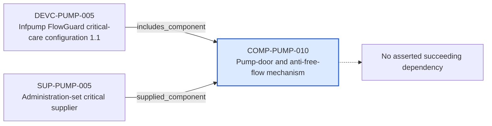

---
{
  "id": "COMP-PUMP-010",
  "type": "component",
  "title": "Pump-door and anti-free-flow mechanism",
  "aliases": [
    "COMP-PUMP-010",
    "COMP-PUMP-010-pump-door-and-anti-free-flow-mechanism",
    "18-ontology-notes/component/COMP-PUMP-010-pump-door-and-anti-free-flow-mechanism",
    "03-Ontology notes/component/COMP-PUMP-010-pump-door-and-anti-free-flow-mechanism"
  ],
  "status": "approved",
  "version": "1",
  "created": "2026-08-15",
  "modified": "2026-08-15",
  "tags": [
    "ontology-note/component",
    "device/infpump-flowguard"
  ],
  "draft": false,
  "note_origin": "human-reviewed synthetic example",
  "technical_file": "TF-01 Device Description/Bill of Materials.xlsx",
  "technical_file_identifier": "COMP-PUMP-010",
  "valid_from": "2026-08-15",
  "review_status": "approved",
  "device_context": "[[06-Infpump FlowGuard ontology notes/device-configuration/DEVC-PUMP-005-infpump-flowguard-critical-care-configuration-11|DEVC-PUMP-005]]",
  "component_criticality": "major",
  "part_number": "FG-1010"
}
---

# Pump-door and anti-free-flow mechanism

## Semantic role

Gives a safety-relevant physical or software component an identity that can be referenced by configurations, suppliers, risks and changes.

## Note

Human-readable rendering of this note's YAML/JSON frontmatter:

- **id:** `COMP-PUMP-010`
- **type:** `component`
- **title:** `Pump-door and anti-free-flow mechanism`
- **aliases:** `COMP-PUMP-010`, `COMP-PUMP-010-pump-door-and-anti-free-flow-mechanism`, `18-ontology-notes/component/COMP-PUMP-010-pump-door-and-anti-free-flow-mechanism`, `03-Ontology notes/component/COMP-PUMP-010-pump-door-and-anti-free-flow-mechanism`
- **status:** `approved`
- **version:** `1`
- **created:** `2026-08-15`
- **modified:** `2026-08-15`
- **tags:** `ontology-note/component`, `device/infpump-flowguard`
- **draft:** `false`
- **note_origin:** `human-reviewed synthetic example`
- **technical_file:** `TF-01 Device Description/Bill of Materials.xlsx`
- **technical_file_identifier:** `COMP-PUMP-010`
- **valid_from:** `2026-08-15`
- **review_status:** `approved`
- **device_context:** [[06-Infpump FlowGuard ontology notes/device-configuration/DEVC-PUMP-005-infpump-flowguard-critical-care-configuration-11|DEVC-PUMP-005]]
- **component_criticality:** `major`
- **part_number:** `FG-1010`

## Traceability

Previous dependencies are ontology notes that lead into this record. They reach it through `includes_component` from [[06-Infpump FlowGuard ontology notes/device-configuration/DEVC-PUMP-005-infpump-flowguard-critical-care-configuration-11|DEVC-PUMP-005 — Infpump FlowGuard critical-care configuration 1.1]]; `supplied_component` from [[06-Infpump FlowGuard ontology notes/supplier/SUP-PUMP-005-administration-set-critical-supplier|SUP-PUMP-005 — Administration-set critical supplier]]. These incoming links show which product, decision, process or evidence records depend on the current note.

No succeeding ontology-note dependency is currently asserted for this record. It remains scoped to [[06-Infpump FlowGuard ontology notes/device-configuration/DEVC-PUMP-005-infpump-flowguard-critical-care-configuration-11|DEVC-PUMP-005 — Infpump FlowGuard critical-care configuration 1.1]], and any future downstream dependency should be added as a typed relationship rather than inferred from prose.

The left-to-right diagram shows up to five asserted previous and five asserted succeeding ontology-note dependencies. When more links exist, the additional-dependency node states how many remain available through the verbal links and structured metadata above.

