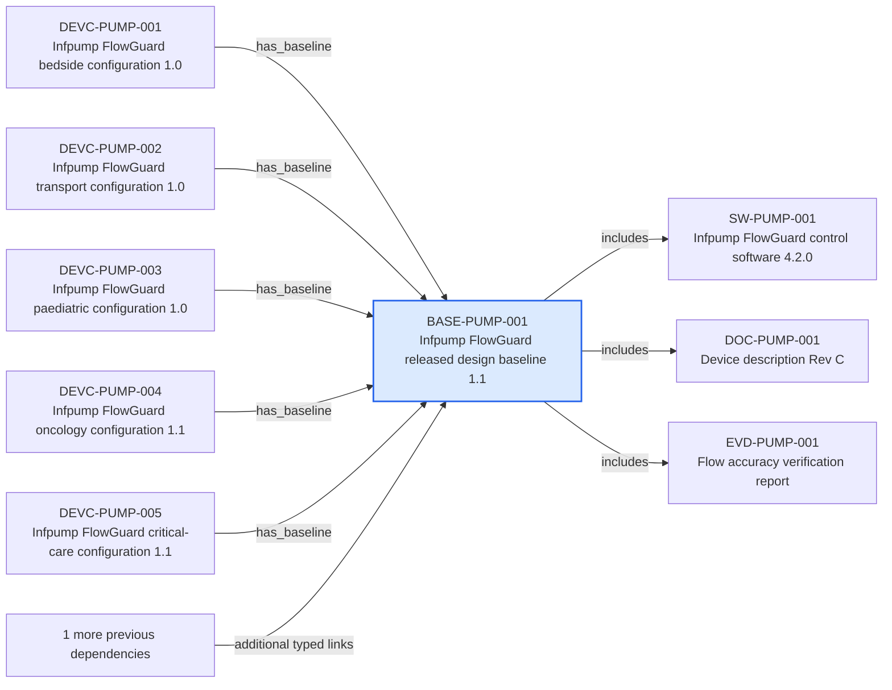

---
{
  "id": "BASE-PUMP-001",
  "type": "configuration-baseline",
  "title": "Infpump FlowGuard released design baseline 1.1",
  "aliases": [
    "BASE-PUMP-001",
    "BASE-PUMP-001-infpump-flowguard-released-design-baseline-11",
    "18-ontology-notes/configuration-baseline/BASE-PUMP-001-infpump-flowguard-released-design-baseline-11",
    "03-Ontology notes/configuration-baseline/BASE-PUMP-001-infpump-flowguard-released-design-baseline-11"
  ],
  "status": "approved",
  "version": "1",
  "created": "2026-08-15",
  "modified": "2026-08-15",
  "tags": [
    "ontology-note/configuration-baseline",
    "device/infpump-flowguard"
  ],
  "draft": false,
  "note_origin": "human-reviewed synthetic example",
  "technical_file": "TF-01 Device Description/Configuration Baseline Index.xlsx",
  "technical_file_identifier": "BASE-PUMP-001",
  "valid_from": "2026-08-15",
  "review_status": "approved",
  "device_context": "[[06-Infpump FlowGuard ontology notes/device-configuration/DEVC-PUMP-001-infpump-flowguard-bedside-configuration-10|DEVC-PUMP-001]]",
  "baseline_state": "released",
  "includes": [
    "[[06-Infpump FlowGuard ontology notes/software-version/SW-PUMP-001-infpump-flowguard-control-software-420|SW-PUMP-001]]",
    "[[06-Infpump FlowGuard ontology notes/document-version/DOC-PUMP-001-device-description-rev-c|DOC-PUMP-001]]",
    "[[06-Infpump FlowGuard ontology notes/verification-evidence/EVD-PUMP-001-flow-accuracy-verification-report|EVD-PUMP-001]]"
  ],
  "source_provisions": [
    "[[02-Sources/standards/SRC-HARMONISED-STANDARDS-european-commission-harmonised-standards|SRC-HARMONISED-STANDARDS]]"
  ]
}
---

# Infpump FlowGuard released design baseline 1.1

## Semantic role

Defines the released combination of software, documents and evidence used to establish configuration scope at a point in time.

## Note

Human-readable rendering of this note's YAML/JSON frontmatter:

- **id:** `BASE-PUMP-001`
- **type:** `configuration-baseline`
- **title:** `Infpump FlowGuard released design baseline 1.1`
- **aliases:** `BASE-PUMP-001`, `BASE-PUMP-001-infpump-flowguard-released-design-baseline-11`, `18-ontology-notes/configuration-baseline/BASE-PUMP-001-infpump-flowguard-released-design-baseline-11`, `03-Ontology notes/configuration-baseline/BASE-PUMP-001-infpump-flowguard-released-design-baseline-11`
- **status:** `approved`
- **version:** `1`
- **created:** `2026-08-15`
- **modified:** `2026-08-15`
- **tags:** `ontology-note/configuration-baseline`, `device/infpump-flowguard`
- **draft:** `false`
- **note_origin:** `human-reviewed synthetic example`
- **technical_file:** `TF-01 Device Description/Configuration Baseline Index.xlsx`
- **technical_file_identifier:** `BASE-PUMP-001`
- **valid_from:** `2026-08-15`
- **review_status:** `approved`
- **device_context:** [[06-Infpump FlowGuard ontology notes/device-configuration/DEVC-PUMP-001-infpump-flowguard-bedside-configuration-10|DEVC-PUMP-001]]
- **baseline_state:** `released`
- **includes:** [[06-Infpump FlowGuard ontology notes/software-version/SW-PUMP-001-infpump-flowguard-control-software-420|SW-PUMP-001]], [[06-Infpump FlowGuard ontology notes/document-version/DOC-PUMP-001-device-description-rev-c|DOC-PUMP-001]], [[06-Infpump FlowGuard ontology notes/verification-evidence/EVD-PUMP-001-flow-accuracy-verification-report|EVD-PUMP-001]]
- **source_provisions:** [[02-Sources/standards/SRC-HARMONISED-STANDARDS-european-commission-harmonised-standards|SRC-HARMONISED-STANDARDS]]

## Traceability

Previous dependencies are ontology notes that lead into this record. They reach it through `has_baseline` from [[06-Infpump FlowGuard ontology notes/device-configuration/DEVC-PUMP-001-infpump-flowguard-bedside-configuration-10|DEVC-PUMP-001 — Infpump FlowGuard bedside configuration 1.0]], [[06-Infpump FlowGuard ontology notes/device-configuration/DEVC-PUMP-002-infpump-flowguard-transport-configuration-10|DEVC-PUMP-002 — Infpump FlowGuard transport configuration 1.0]], [[06-Infpump FlowGuard ontology notes/device-configuration/DEVC-PUMP-003-infpump-flowguard-paediatric-configuration-10|DEVC-PUMP-003 — Infpump FlowGuard paediatric configuration 1.0]] and 2 more linked notes; `updates_baseline` from [[06-Infpump FlowGuard ontology notes/change/CHG-PUMP-013-battery-energy-reserve-threshold-update|CHG-PUMP-013 — Battery energy-reserve threshold update]]. These incoming links show which product, decision, process or evidence records depend on the current note.

Succeeding dependencies are ontology notes to which this record leads. The trace continues through `includes` to [[06-Infpump FlowGuard ontology notes/software-version/SW-PUMP-001-infpump-flowguard-control-software-420|SW-PUMP-001 — Infpump FlowGuard control software 4.2.0]], [[06-Infpump FlowGuard ontology notes/document-version/DOC-PUMP-001-device-description-rev-c|DOC-PUMP-001 — Device description Rev C]], [[06-Infpump FlowGuard ontology notes/verification-evidence/EVD-PUMP-001-flow-accuracy-verification-report|EVD-PUMP-001 — Flow accuracy verification report]]. These outgoing links identify the next product, risk, control, evidence, change or lifecycle records used by downstream reasoning.

The left-to-right diagram shows up to five asserted previous and five asserted succeeding ontology-note dependencies. When more links exist, the additional-dependency node states how many remain available through the verbal links and structured metadata above.

