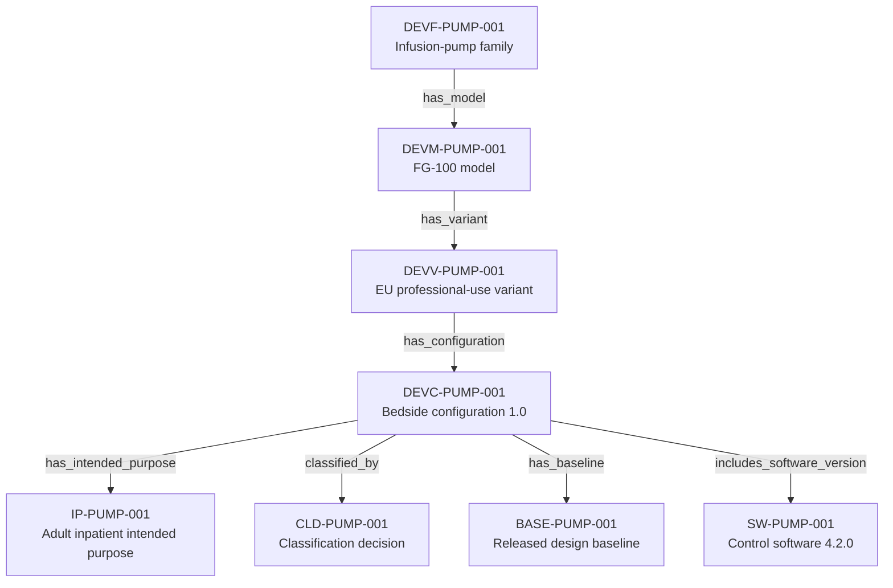

---
{
  "title": "Device identity and regulatory context",
  "aliases": [
    "Ontology note connection — Device identity and regulatory context",
    "03-Ontology notes/connections/01-device-identity-and-regulatory-context"
  ],
  "created": "2026-08-16",
  "modified": "2026-08-16",
  "tags": [
    "ontology-note/connection-diagram",
    "device/infpump-flowguard"
  ],
  "draft": false
}
---

# Device identity and regulatory context

Shows how the regulated product is narrowed from family to released configuration and then anchored to its intended purpose, classification, baseline and software version.

Every arrow reproduces a typed relation asserted in the linked ontology notes. Select a diagram node, or use the links below, to inspect the underlying semantic record.

## Linked ontology notes

- [[06-Infpump FlowGuard ontology notes/device-family/DEVF-PUMP-001-infpump-flowguard-infusion-pump-family|DEVF-PUMP-001 — Infusion-pump family]]
- [[06-Infpump FlowGuard ontology notes/device-model/DEVM-PUMP-001-infpump-flowguard-fg-100-model|DEVM-PUMP-001 — FG-100 model]]
- [[06-Infpump FlowGuard ontology notes/device-variant/DEVV-PUMP-001-infpump-flowguard-fg-100-eu-professional-use-variant|DEVV-PUMP-001 — EU professional-use variant]]
- [[06-Infpump FlowGuard ontology notes/device-configuration/DEVC-PUMP-001-infpump-flowguard-bedside-configuration-10|DEVC-PUMP-001 — Bedside configuration 1.0]]
- [[06-Infpump FlowGuard ontology notes/intended-purpose/IP-PUMP-001-controlled-infusion-of-prescribed-fluids-for-adult-inpatients|IP-PUMP-001 — Adult inpatient intended purpose]]
- [[06-Infpump FlowGuard ontology notes/classification-decision/CLD-PUMP-001-bedside-configuration-classification-decision|CLD-PUMP-001 — Classification decision]]
- [[06-Infpump FlowGuard ontology notes/configuration-baseline/BASE-PUMP-001-infpump-flowguard-released-design-baseline-11|BASE-PUMP-001 — Released design baseline]]
- [[06-Infpump FlowGuard ontology notes/software-version/SW-PUMP-001-infpump-flowguard-control-software-420|SW-PUMP-001 — Control software 4.2.0]]

These connections are graph projections and navigation aids. The linked notes and their governed metadata remain the semantic source; the diagram does not create additional regulatory facts.
