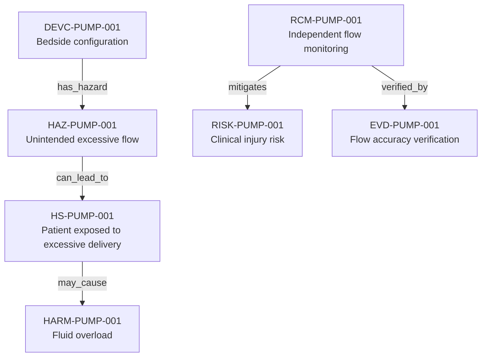

---
{
  "title": "Excessive-flow risk-control chain",
  "aliases": [
    "Ontology note connection — Excessive-flow risk-control chain",
    "03-Ontology notes/connections/02-excessive-flow-risk-control-chain"
  ],
  "created": "2026-08-16",
  "modified": "2026-08-16",
  "tags": [
    "ontology-note/connection-diagram",
    "device/infpump-flowguard"
  ],
  "draft": false
}
---

# Excessive-flow risk-control chain

Connects a device context to a hazardous sequence, assessed risk, resulting harm, implemented control and verification evidence.

Every arrow reproduces a typed relation asserted in the linked ontology notes. Select a diagram node, or use the links below, to inspect the underlying semantic record.

## Linked ontology notes

- [[06-Infpump FlowGuard ontology notes/device-configuration/DEVC-PUMP-001-infpump-flowguard-bedside-configuration-10|DEVC-PUMP-001 — Bedside configuration]]
- [[06-Infpump FlowGuard ontology notes/hazard/HAZ-PUMP-001-unintended-excessive-flow|HAZ-PUMP-001 — Unintended excessive flow]]
- [[06-Infpump FlowGuard ontology notes/hazardous-situation/HS-PUMP-001-patient-connected-while-pump-delivers-above-programmed-rate|HS-PUMP-001 — Patient exposed to excessive delivery]]
- [[06-Infpump FlowGuard ontology notes/harm/HARM-PUMP-001-fluid-overload|HARM-PUMP-001 — Fluid overload]]
- [[06-Infpump FlowGuard ontology notes/risk/RISK-PUMP-001-clinical-injury-following-unintended-excessive-flow|RISK-PUMP-001 — Clinical injury risk]]
- [[06-Infpump FlowGuard ontology notes/risk-control-measure/RCM-PUMP-001-independent-flow-monitoring|RCM-PUMP-001 — Independent flow monitoring]]
- [[06-Infpump FlowGuard ontology notes/verification-evidence/EVD-PUMP-001-flow-accuracy-verification-report|EVD-PUMP-001 — Flow accuracy verification]]

These connections are graph projections and navigation aids. The linked notes and their governed metadata remain the semantic source; the diagram does not create additional regulatory facts.
