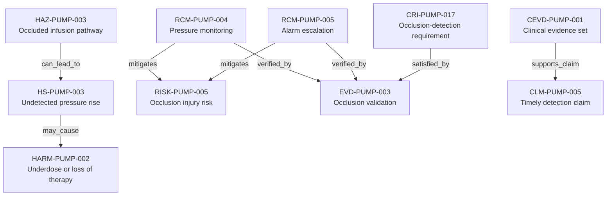

---
{
  "title": "Occlusion-detection safety case",
  "aliases": [
    "Ontology note connection — Occlusion-detection safety case",
    "03-Ontology notes/connections/03-occlusion-detection-safety-case"
  ],
  "created": "2026-08-16",
  "modified": "2026-08-16",
  "tags": [
    "ontology-note/connection-diagram",
    "device/infpump-flowguard"
  ],
  "draft": false
}
---

# Occlusion-detection safety case

Shows how an occlusion hazard is connected to its clinical claim, device-specific requirement, controls and validation evidence.

Every arrow reproduces a typed relation asserted in the linked ontology notes. Select a diagram node, or use the links below, to inspect the underlying semantic record.

## Linked ontology notes

- [[06-Infpump FlowGuard ontology notes/hazard/HAZ-PUMP-003-occluded-infusion-pathway|HAZ-PUMP-003 — Occluded infusion pathway]]
- [[06-Infpump FlowGuard ontology notes/hazardous-situation/HS-PUMP-003-pressure-rises-while-downstream-occlusion-is-undetected|HS-PUMP-003 — Undetected pressure rise]]
- [[06-Infpump FlowGuard ontology notes/harm/HARM-PUMP-002-underdose-or-loss-of-therapy|HARM-PUMP-002 — Underdose or loss of therapy]]
- [[06-Infpump FlowGuard ontology notes/risk/RISK-PUMP-005-clinical-injury-following-occluded-infusion-pathway|RISK-PUMP-005 — Occlusion injury risk]]
- [[06-Infpump FlowGuard ontology notes/risk-control-measure/RCM-PUMP-004-occlusion-pressure-monitoring|RCM-PUMP-004 — Pressure monitoring]]
- [[06-Infpump FlowGuard ontology notes/risk-control-measure/RCM-PUMP-005-occlusion-alarm-escalation|RCM-PUMP-005 — Alarm escalation]]
- [[06-Infpump FlowGuard ontology notes/verification-evidence/EVD-PUMP-003-occlusion-detection-validation-report|EVD-PUMP-003 — Occlusion validation]]
- [[06-Infpump FlowGuard ontology notes/compliance-requirement-instance/CRI-PUMP-017-occlusion-detection|CRI-PUMP-017 — Occlusion-detection requirement]]
- [[06-Infpump FlowGuard ontology notes/clinical-claim/CLM-PUMP-005-detects-downstream-occlusion-before-prolonged-therapy-interruption|CLM-PUMP-005 — Timely detection claim]]
- [[06-Infpump FlowGuard ontology notes/clinical-evidence/CEVD-PUMP-001-infpump-flowguard-clinical-evidence-set|CEVD-PUMP-001 — Clinical evidence set]]

These connections are graph projections and navigation aids. The linked notes and their governed metadata remain the semantic source; the diagram does not create additional regulatory facts.
