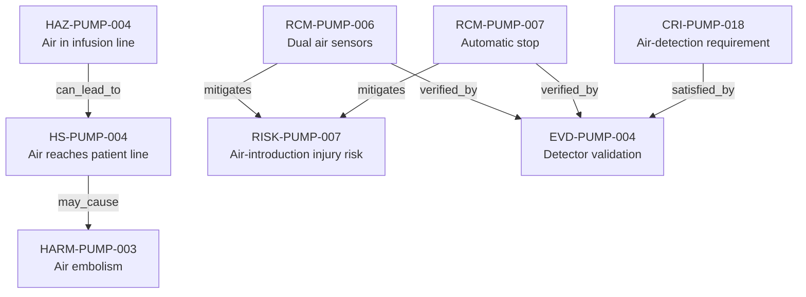

---
{
  "title": "Air-in-line protection chain",
  "aliases": [
    "Ontology note connection — Air-in-line protection chain",
    "03-Ontology notes/connections/04-air-in-line-protection-chain"
  ],
  "created": "2026-08-16",
  "modified": "2026-08-16",
  "tags": [
    "ontology-note/connection-diagram",
    "device/infpump-flowguard"
  ],
  "draft": false
}
---

# Air-in-line protection chain

Connects the air-in-line hazard to patient exposure, harm, device-specific compliance, complementary controls and their validation evidence.

Every arrow reproduces a typed relation asserted in the linked ontology notes. Select a diagram node, or use the links below, to inspect the underlying semantic record.

## Linked ontology notes

- [[06-Infpump FlowGuard ontology notes/hazard/HAZ-PUMP-004-air-introduced-into-infusion-line|HAZ-PUMP-004 — Air in infusion line]]
- [[06-Infpump FlowGuard ontology notes/hazardous-situation/HS-PUMP-004-air-reaches-the-patient-line|HS-PUMP-004 — Air reaches patient line]]
- [[06-Infpump FlowGuard ontology notes/risk/RISK-PUMP-007-clinical-injury-following-air-introduced-into-infusion-line|RISK-PUMP-007 — Air-introduction injury risk]]
- [[06-Infpump FlowGuard ontology notes/harm/HARM-PUMP-003-air-embolism|HARM-PUMP-003 — Air embolism]]
- [[06-Infpump FlowGuard ontology notes/risk-control-measure/RCM-PUMP-006-dual-air-in-line-sensors|RCM-PUMP-006 — Dual air sensors]]
- [[06-Infpump FlowGuard ontology notes/risk-control-measure/RCM-PUMP-007-air-in-line-automatic-stop|RCM-PUMP-007 — Automatic stop]]
- [[06-Infpump FlowGuard ontology notes/verification-evidence/EVD-PUMP-004-air-in-line-detector-validation-report|EVD-PUMP-004 — Detector validation]]
- [[06-Infpump FlowGuard ontology notes/compliance-requirement-instance/CRI-PUMP-018-air-in-line-detection|CRI-PUMP-018 — Air-detection requirement]]

These connections are graph projections and navigation aids. The linked notes and their governed metadata remain the semantic source; the diagram does not create additional regulatory facts.
