---
{
  "title": "Battery signal to change assessment",
  "aliases": [
    "Ontology note connection — Battery signal to change assessment",
    "03-Ontology notes/connections/05-battery-signal-to-change-assessment",
    "18-ontology-notes/connections/05-battery-signal-to-change-assessment"
  ],
  "created": "2026-08-16",
  "modified": "2026-08-20",
  "tags": [
    "ontology-note/connection-diagram",
    "device/infpump-flowguard"
  ],
  "draft": false
}
---

# Battery signal to change assessment

Shows the controlled battery baseline that existed before a post-market signal and the resulting regulatory sequence from signal confirmation to planned post-change evidence.

The graph deliberately uses one top-to-bottom sequence. Each connection is therefore a straight vertical link and no links cross. The labels show class-specific lifecycle fields instead of treating `status` as one universal state machine. Select a box, or use the links below, to open the underlying ontology note.

```mermaid
flowchart TD
  N1["COMP-PUMP-004<br/>Battery pack<br/>component: safety-critical"]
  N2["RCM-PUMP-013<br/>State-of-charge estimation<br/>implementation: implemented"]
  N3["EVD-PUMP-007<br/>Battery endurance validation<br/>evidence: approved baseline"]
  N4["RISK-PUMP-013<br/>Premature depletion risk<br/>acceptance: baseline accepted<br/>reassessment: required"]
  N5["SIGNAL-PUMP-001<br/>Runtime reduction signal<br/>signal: accepted"]
  N6["CHG-PUMP-001<br/>Supplier replacement<br/>change: under assessment"]
  N7["CIA-PUMP-001<br/>Change-impact assessment<br/>assessment: under assessment"]
  N8["CRI-PUMP-051<br/>Post-change endurance requirement<br/>requirement: draft<br/>compliance: planned"]
  N9["SUP-PUMP-006<br/>Proposed replacement cell supplier<br/>qualification: in progress"]
  N10["EVD-PUMP-031<br/>Post-change endurance verification<br/>evidence: planned"]
  N1 -->|controlled by| N2
  N2 -->|verified by| N3
  N3 -->|supports baseline acceptance| N4
  N4 -->|challenged by PMS signal| N5
  N5 -->|triggers| N6
  N6 -->|has impact assessment| N7
  N7 -->|defines verification need| N8
  N8 -->|sets qualification criteria| N9
  N9 -->|enables post-change verification| N10
  click N1 "/06-infpump-flowguard-ontology-notes/component/comp-pump-004-rechargeable-battery-pack" "Open COMP-PUMP-004"
  click N2 "/06-infpump-flowguard-ontology-notes/risk-control-measure/rcm-pump-013-battery-state-of-charge-estimation" "Open RCM-PUMP-013"
  click N3 "/06-infpump-flowguard-ontology-notes/verification-evidence/evd-pump-007-battery-endurance-validation-report" "Open EVD-PUMP-007"
  click N4 "/06-infpump-flowguard-ontology-notes/risk/risk-pump-013-clinical-injury-following-premature-battery-depletion" "Open RISK-PUMP-013"
  click N5 "/06-infpump-flowguard-ontology-notes/signal/signal-pump-001-unexpected-battery-runtime-reduction" "Open SIGNAL-PUMP-001"
  click N6 "/06-infpump-flowguard-ontology-notes/change/chg-pump-001-battery-cell-supplier-replacement" "Open CHG-PUMP-001"
  click N7 "/06-infpump-flowguard-ontology-notes/change-impact-assessment/cia-pump-001-battery-cell-supplier-change-impact-assessment" "Open CIA-PUMP-001"
  click N8 "/06-infpump-flowguard-ontology-notes/compliance-requirement-instance/cri-pump-051-battery-endurance-after-cell-supplier-change" "Open CRI-PUMP-051"
  click N9 "/06-infpump-flowguard-ontology-notes/supplier/sup-pump-006-proposed-replacement-battery-cell-supplier" "Open SUP-PUMP-006"
  click N10 "/06-infpump-flowguard-ontology-notes/verification-evidence/evd-pump-031-post-change-battery-endurance-verification" "Open EVD-PUMP-031"
```

## Lifecycle reading

This is a regulatory lifecycle sequence, not a universal status state machine. The first four notes describe the controlled baseline. The accepted PMS signal challenges that baseline and opens a change package. The impact assessment then drives a draft device-specific requirement, qualification of the proposed replacement supplier and planned post-change evidence. The change must not be released until the evidence is approved and the affected risk is reassessed and accepted for the changed configuration.

## Linked ontology notes

- [[06-Infpump FlowGuard ontology notes/component/COMP-PUMP-004-rechargeable-battery-pack|COMP-PUMP-004 — Battery pack]]
- [[06-Infpump FlowGuard ontology notes/risk-control-measure/RCM-PUMP-013-battery-state-of-charge-estimation|RCM-PUMP-013 — State-of-charge estimation]]
- [[06-Infpump FlowGuard ontology notes/verification-evidence/EVD-PUMP-007-battery-endurance-validation-report|EVD-PUMP-007 — Battery endurance validation]]
- [[06-Infpump FlowGuard ontology notes/risk/RISK-PUMP-013-clinical-injury-following-premature-battery-depletion|RISK-PUMP-013 — Premature depletion risk]]
- [[06-Infpump FlowGuard ontology notes/signal/SIGNAL-PUMP-001-unexpected-battery-runtime-reduction|SIGNAL-PUMP-001 — Runtime reduction signal]]
- [[06-Infpump FlowGuard ontology notes/change/CHG-PUMP-001-battery-cell-supplier-replacement|CHG-PUMP-001 — Supplier replacement]]
- [[06-Infpump FlowGuard ontology notes/change-impact-assessment/CIA-PUMP-001-battery-cell-supplier-change-impact-assessment|CIA-PUMP-001 — Battery cell-supplier change impact assessment]]
- [[06-Infpump FlowGuard ontology notes/compliance-requirement-instance/CRI-PUMP-051-battery-endurance-after-cell-supplier-change|CRI-PUMP-051 — Battery endurance after cell-supplier change]]
- [[06-Infpump FlowGuard ontology notes/supplier/SUP-PUMP-006-proposed-replacement-battery-cell-supplier|SUP-PUMP-006 — Proposed replacement battery-cell supplier]]
- [[06-Infpump FlowGuard ontology notes/verification-evidence/EVD-PUMP-031-post-change-battery-endurance-verification|EVD-PUMP-031 — Post-change battery endurance verification]]

These connections are navigation and reasoning aids. The linked notes and their governed metadata remain the semantic source; the diagram does not create additional regulatory facts.
