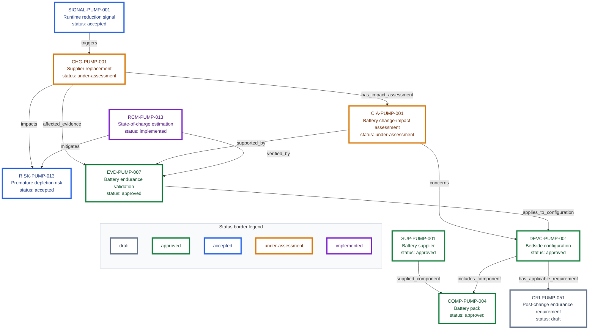

---
{
  "title": "Battery signal to change assessment",
  "aliases": [
    "Ontology note connection — Battery signal to change assessment",
    "03-Ontology notes/connections/05-battery-signal-to-change-assessment",
    "18-ontology-notes/connections/05-battery-signal-to-change-assessment"
  ],
  "created": "2026-08-16",
  "modified": "2026-08-19",
  "tags": [
    "ontology-note/connection-diagram",
    "device/infpump-flowguard"
  ],
  "draft": false
}
---

# Battery signal to change assessment

Shows a post-market battery signal flowing through supplier and component context into a controlled change, its change-impact assessment, a newly drafted compliance-requirement instance and the evidence needed to reassess residual risk.

The arrows reproduce typed relationships in the linked ontology-note metadata. Select a diagram node, or use the links below, to open the underlying ontology note. Border colour indicates the note's current `status`; the deliberately thick borders remain distinguishable when the diagram is scaled.

## Lifecycle reading

The statuses form a realistic technical-file snapshot rather than one universal state machine. The configuration, critical supplier, battery component and existing endurance evidence are `approved`; the post-market signal has been `accepted` as a confirmed input; the related change and impact assessment remain `under-assessment`; the post-change endurance requirement is still `draft`; the existing state-of-charge control is `implemented`; and the currently documented residual risk is `accepted`. Before the change can close, the draft requirement must be approved, the assessment completed and the evidence reconfirmed so the risk acceptance remains valid for the changed configuration.

## Linked ontology notes

- [[06-Infpump FlowGuard ontology notes/device-configuration/DEVC-PUMP-001-infpump-flowguard-bedside-configuration-10|DEVC-PUMP-001 — Bedside configuration]]
- [[06-Infpump FlowGuard ontology notes/supplier/SUP-PUMP-001-battery-pack-critical-supplier|SUP-PUMP-001 — Battery supplier]]
- [[06-Infpump FlowGuard ontology notes/component/COMP-PUMP-004-rechargeable-battery-pack|COMP-PUMP-004 — Battery pack]]
- [[06-Infpump FlowGuard ontology notes/signal/SIGNAL-PUMP-001-unexpected-battery-runtime-reduction|SIGNAL-PUMP-001 — Runtime reduction signal]]
- [[06-Infpump FlowGuard ontology notes/change/CHG-PUMP-001-battery-cell-supplier-replacement|CHG-PUMP-001 — Supplier replacement]]
- [[06-Infpump FlowGuard ontology notes/risk/RISK-PUMP-013-clinical-injury-following-premature-battery-depletion|RISK-PUMP-013 — Premature depletion risk]]
- [[06-Infpump FlowGuard ontology notes/risk-control-measure/RCM-PUMP-013-battery-state-of-charge-estimation|RCM-PUMP-013 — State-of-charge estimation]]
- [[06-Infpump FlowGuard ontology notes/verification-evidence/EVD-PUMP-007-battery-endurance-validation-report|EVD-PUMP-007 — Battery endurance validation]]
- [[06-Infpump FlowGuard ontology notes/compliance-requirement-instance/CRI-PUMP-051-battery-endurance-after-cell-supplier-change|CRI-PUMP-051 — Battery endurance after cell-supplier change]]
- [[06-Infpump FlowGuard ontology notes/change-impact-assessment/CIA-PUMP-001-battery-cell-supplier-change-impact-assessment|CIA-PUMP-001 — Battery cell-supplier change impact assessment]]

These connections are navigation and reasoning aids. The linked notes and their governed metadata remain the semantic source; the diagram does not create additional regulatory facts.
