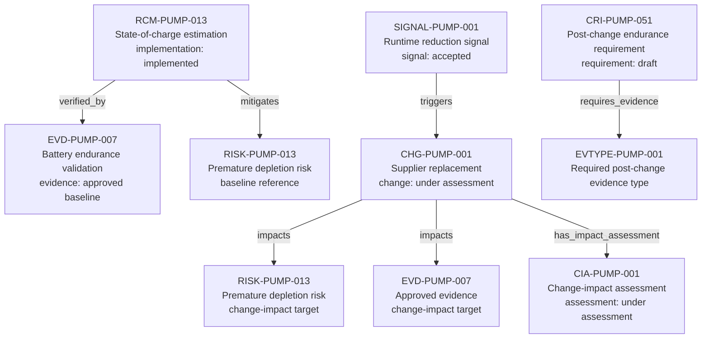

---
{
  "title": "Battery signal to change assessment",
  "aliases": [
    "Ontology note connection — Battery signal to change assessment",
    "03-Ontology notes/connections/05-battery-signal-to-change-assessment"
  ],
  "created": "2026-08-16",
  "modified": "2026-08-16",
  "tags": [
    "ontology-note/connection-diagram",
    "device/infpump-flowguard"
  ],
  "draft": false
}
---

# Battery signal to change assessment

Separates the approved battery baseline from the accepted signal, the change assessment it triggers, and the new evidence type required before release.

Every arrow reproduces a typed relation asserted in the linked ontology notes. Select a diagram node, or use the links below, to inspect the underlying semantic record.

## Lifecycle reading

This is a regulatory lifecycle view, not a universal status state machine. The implemented control and approved evidence describe the released baseline, while the accepted post-market signal triggers a change that remains under assessment. The draft compliance requirement identifies the evidence type needed for the changed configuration; it is deliberately not shown as satisfied by planned evidence. Release remains blocked until actual evidence is generated and approved, the impact assessment is completed, and the affected risk is reassessed and accepted.

## Linked ontology notes

- [[06-Infpump FlowGuard ontology notes/risk-control-measure/RCM-PUMP-013-battery-state-of-charge-estimation|RCM-PUMP-013 — State-of-charge estimation implementation: implemented]]
- [[06-Infpump FlowGuard ontology notes/verification-evidence/EVD-PUMP-007-battery-endurance-validation-report|EVD-PUMP-007 — Battery endurance validation evidence: approved baseline]]
- [[06-Infpump FlowGuard ontology notes/risk/RISK-PUMP-013-clinical-injury-following-premature-battery-depletion|RISK-PUMP-013 — Premature depletion risk acceptance: baseline accepted reassessment: required]]
- [[06-Infpump FlowGuard ontology notes/signal/SIGNAL-PUMP-001-unexpected-battery-runtime-reduction|SIGNAL-PUMP-001 — Runtime reduction signal signal: accepted]]
- [[06-Infpump FlowGuard ontology notes/change/CHG-PUMP-001-battery-cell-supplier-replacement|CHG-PUMP-001 — Supplier replacement change: under assessment]]
- [[06-Infpump FlowGuard ontology notes/change-impact-assessment/CIA-PUMP-001-battery-cell-supplier-change-impact-assessment|CIA-PUMP-001 — Change-impact assessment assessment: under assessment]]
- [[06-Infpump FlowGuard ontology notes/compliance-requirement-instance/CRI-PUMP-051-battery-endurance-after-cell-supplier-change|CRI-PUMP-051 — Post-change endurance requirement requirement: draft compliance: planned]]
- [[01-Ontology instances/08-technical-documentation/evidence-types/EVTYPE-PUMP-001-post-change-battery-endurance-verification|EVTYPE-PUMP-001 — Required post-change evidence type]]

These connections are graph projections and navigation aids. The linked notes and their governed metadata remain the semantic source; the diagram does not create additional regulatory facts.
