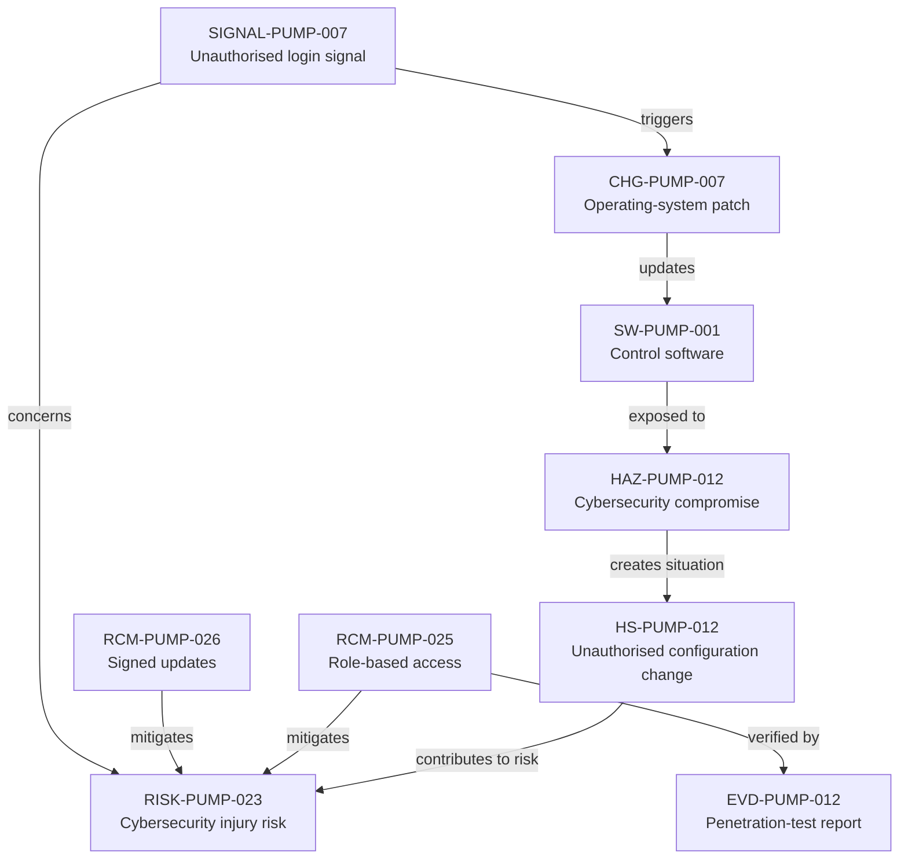

---
{
  "title": "Cybersecurity control and feedback loop",
  "aliases": [
    "Ontology note connection — Cybersecurity control and feedback loop",
    "03-Ontology notes/connections/06-cybersecurity-control-and-feedback-loop",
    "18-ontology-notes/connections/06-cybersecurity-control-and-feedback-loop"
  ],
  "created": "2026-08-16",
  "modified": "2026-08-16",
  "tags": [
    "ontology-note/connection-diagram",
    "device/infpump-flowguard"
  ],
  "draft": false
}
---

# Cybersecurity control and feedback loop

Connects software, cybersecurity hazard and risk, preventive controls, penetration evidence, post-market signal and security-patch change.

The arrows show the reasoning path used in this example. Select a diagram node, or use the links below, to open the underlying ontology note.

## Linked ontology notes

- [[06-Infpump FlowGuard ontology notes/software-version/SW-PUMP-001-infpump-flowguard-control-software-420|SW-PUMP-001 — Control software]]
- [[06-Infpump FlowGuard ontology notes/hazard/HAZ-PUMP-012-cybersecurity-compromise|HAZ-PUMP-012 — Cybersecurity compromise]]
- [[06-Infpump FlowGuard ontology notes/hazardous-situation/HS-PUMP-012-unauthorised-actor-changes-therapy-or-device-configuration|HS-PUMP-012 — Unauthorised configuration change]]
- [[06-Infpump FlowGuard ontology notes/risk/RISK-PUMP-023-clinical-injury-following-cybersecurity-compromise|RISK-PUMP-023 — Cybersecurity injury risk]]
- [[06-Infpump FlowGuard ontology notes/risk-control-measure/RCM-PUMP-025-role-based-access-control|RCM-PUMP-025 — Role-based access]]
- [[06-Infpump FlowGuard ontology notes/risk-control-measure/RCM-PUMP-026-signed-software-update-packages|RCM-PUMP-026 — Signed updates]]
- [[06-Infpump FlowGuard ontology notes/verification-evidence/EVD-PUMP-012-cybersecurity-penetration-test-report|EVD-PUMP-012 — Penetration-test report]]
- [[06-Infpump FlowGuard ontology notes/signal/SIGNAL-PUMP-007-repeated-unauthorised-login-attempts|SIGNAL-PUMP-007 — Unauthorised login signal]]
- [[06-Infpump FlowGuard ontology notes/change/CHG-PUMP-007-cybersecurity-operating-system-patch|CHG-PUMP-007 — Operating-system patch]]

These connections are navigation and reasoning aids. The linked notes and their governed metadata remain the semantic source; the diagram does not create additional regulatory facts.
