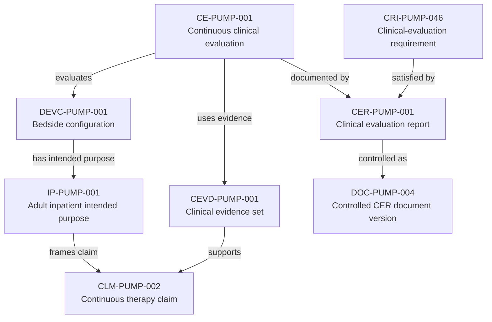

---
{
  "title": "Clinical claim to evaluation report",
  "aliases": [
    "Ontology note connection — Clinical claim to evaluation report",
    "03-Ontology notes/connections/07-clinical-claim-to-evaluation-report",
    "18-ontology-notes/connections/07-clinical-claim-to-evaluation-report"
  ],
  "created": "2026-08-16",
  "modified": "2026-08-16",
  "tags": [
    "ontology-note/connection-diagram",
    "device/infpump-flowguard"
  ],
  "draft": false
}
---

# Clinical claim to evaluation report

Shows how a device and intended purpose frame a clinical claim that is assessed through evidence, evaluation and controlled reporting.

The arrows show the reasoning path used in this example. Select a diagram node, or use the links below, to open the underlying ontology note.

## Linked ontology notes

- [[06-Infpump FlowGuard ontology notes/device-configuration/DEVC-PUMP-001-infpump-flowguard-bedside-configuration-10|DEVC-PUMP-001 — Bedside configuration]]
- [[06-Infpump FlowGuard ontology notes/intended-purpose/IP-PUMP-001-controlled-infusion-of-prescribed-fluids-for-adult-inpatients|IP-PUMP-001 — Adult inpatient intended purpose]]
- [[06-Infpump FlowGuard ontology notes/clinical-claim/CLM-PUMP-002-supports-continuous-intravenous-therapy|CLM-PUMP-002 — Continuous therapy claim]]
- [[06-Infpump FlowGuard ontology notes/clinical-evidence/CEVD-PUMP-001-infpump-flowguard-clinical-evidence-set|CEVD-PUMP-001 — Clinical evidence set]]
- [[06-Infpump FlowGuard ontology notes/clinical-evaluation/CE-PUMP-001-infpump-flowguard-continuous-clinical-evaluation|CE-PUMP-001 — Continuous clinical evaluation]]
- [[06-Infpump FlowGuard ontology notes/clinical-evaluation-report/CER-PUMP-001-infpump-flowguard-clinical-evaluation-report-rev-d|CER-PUMP-001 — Clinical evaluation report]]
- [[06-Infpump FlowGuard ontology notes/document-version/DOC-PUMP-004-clinical-evaluation-report-rev-c|DOC-PUMP-004 — Controlled CER document version]]
- [[06-Infpump FlowGuard ontology notes/compliance-requirement-instance/CRI-PUMP-046-clinical-evaluation-support|CRI-PUMP-046 — Clinical-evaluation requirement]]

These connections are navigation and reasoning aids. The linked notes and their governed metadata remain the semantic source; the diagram does not create additional regulatory facts.
