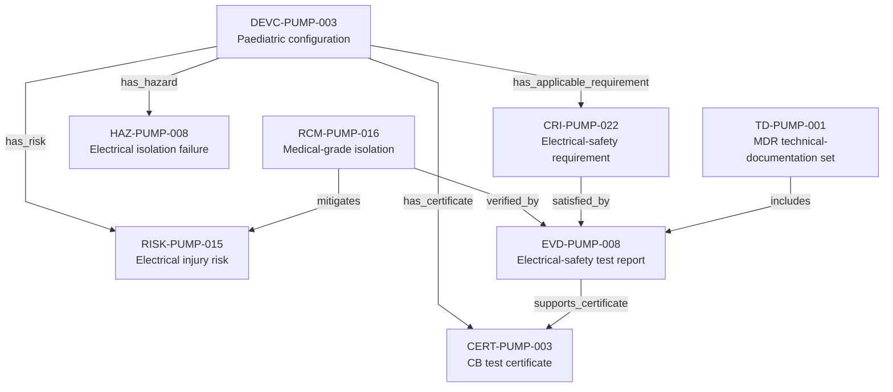

---
{
  "title": "Electrical-safety compliance trace",
  "aliases": [
    "Ontology note connection — Electrical-safety compliance trace",
    "03-Ontology notes/connections/08-electrical-safety-compliance-trace"
  ],
  "created": "2026-08-16",
  "modified": "2026-08-16",
  "tags": [
    "ontology-note/connection-diagram",
    "device/infpump-flowguard"
  ],
  "draft": false
}
---

# Electrical-safety compliance trace

Connects the current device configuration to its electrical-safety requirement, hazard, risk, isolation control, test evidence, certificate and technical-documentation set.

Every arrow reproduces a typed relation asserted in the linked ontology notes. Select a diagram node, or use the links below, to inspect the underlying semantic record.

## Linked ontology notes

- [[06-Infpump FlowGuard ontology notes/device-configuration/DEVC-PUMP-003-infpump-flowguard-paediatric-configuration-10|DEVC-PUMP-003 — Paediatric configuration]]
- [[06-Infpump FlowGuard ontology notes/compliance-requirement-instance/CRI-PUMP-022-electrical-safety|CRI-PUMP-022 — Electrical-safety requirement]]
- [[06-Infpump FlowGuard ontology notes/hazard/HAZ-PUMP-008-electrical-isolation-failure|HAZ-PUMP-008 — Electrical isolation failure]]
- [[06-Infpump FlowGuard ontology notes/risk/RISK-PUMP-015-clinical-injury-following-electrical-isolation-failure|RISK-PUMP-015 — Electrical injury risk]]
- [[06-Infpump FlowGuard ontology notes/risk-control-measure/RCM-PUMP-016-medical-grade-isolation-barrier|RCM-PUMP-016 — Medical-grade isolation]]
- [[06-Infpump FlowGuard ontology notes/verification-evidence/EVD-PUMP-008-electrical-safety-test-report|EVD-PUMP-008 — Electrical-safety test report]]
- [[06-Infpump FlowGuard ontology notes/certificate/CERT-PUMP-003-electrical-safety-cb-test-certificate|CERT-PUMP-003 — CB test certificate]]
- [[06-Infpump FlowGuard ontology notes/technical-documentation-set/TD-PUMP-001-infpump-flowguard-mdr-technical-documentation-set|TD-PUMP-001 — MDR technical-documentation set]]

These connections are graph projections and navigation aids. The linked notes and their governed metadata remain the semantic source; the diagram does not create additional regulatory facts.
