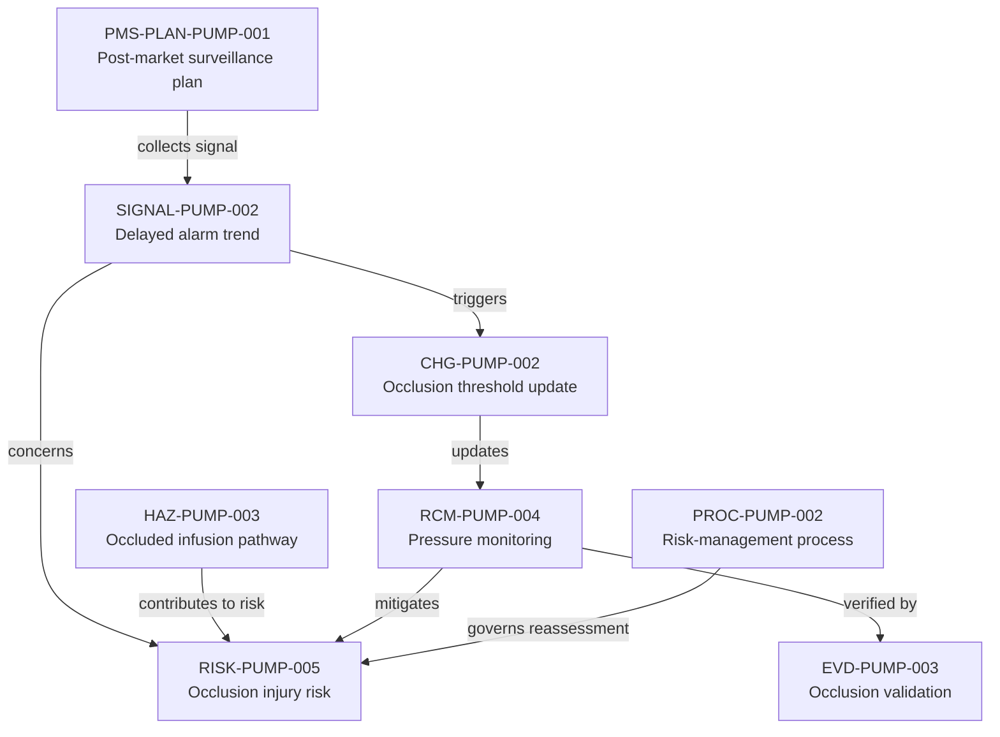

---
{
  "title": "PMS signal and change feedback",
  "aliases": [
    "Ontology note connection — PMS signal and change feedback",
    "03-Ontology notes/connections/09-pms-signal-and-change-feedback",
    "18-ontology-notes/connections/09-pms-signal-and-change-feedback"
  ],
  "created": "2026-08-16",
  "modified": "2026-08-16",
  "tags": [
    "ontology-note/connection-diagram",
    "device/infpump-flowguard"
  ],
  "draft": false
}
---

# PMS signal and change feedback

Shows how the PMS plan receives an occlusion signal, initiates change assessment and feeds updated controls and evidence back into risk management.

The arrows show the reasoning path used in this example. Select a diagram node, or use the links below, to open the underlying ontology note.

## Linked ontology notes

- [[06-Infpump FlowGuard ontology notes/pms-plan/PMS-PLAN-PUMP-001-infpump-flowguard-post-market-surveillance-plan|PMS-PLAN-PUMP-001 — Post-market surveillance plan]]
- [[06-Infpump FlowGuard ontology notes/signal/SIGNAL-PUMP-002-delayed-occlusion-alarm-trend|SIGNAL-PUMP-002 — Delayed alarm trend]]
- [[06-Infpump FlowGuard ontology notes/change/CHG-PUMP-002-occlusion-algorithm-threshold-update|CHG-PUMP-002 — Occlusion threshold update]]
- [[06-Infpump FlowGuard ontology notes/hazard/HAZ-PUMP-003-occluded-infusion-pathway|HAZ-PUMP-003 — Occluded infusion pathway]]
- [[06-Infpump FlowGuard ontology notes/risk/RISK-PUMP-005-clinical-injury-following-occluded-infusion-pathway|RISK-PUMP-005 — Occlusion injury risk]]
- [[06-Infpump FlowGuard ontology notes/risk-control-measure/RCM-PUMP-004-occlusion-pressure-monitoring|RCM-PUMP-004 — Pressure monitoring]]
- [[06-Infpump FlowGuard ontology notes/verification-evidence/EVD-PUMP-003-occlusion-detection-validation-report|EVD-PUMP-003 — Occlusion validation]]
- [[06-Infpump FlowGuard ontology notes/qms-process/PROC-PUMP-002-infusion-pump-risk-management-process|PROC-PUMP-002 — Risk-management process]]

These connections are navigation and reasoning aids. The linked notes and their governed metadata remain the semantic source; the diagram does not create additional regulatory facts.
