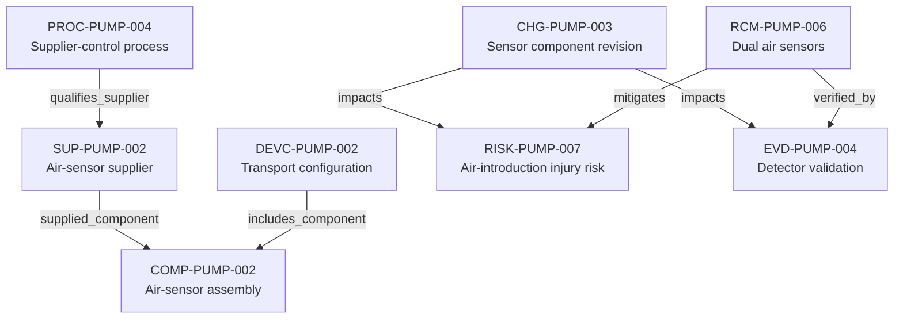

---
{
  "title": "Supplier and component change control",
  "aliases": [
    "Ontology note connection — Supplier and component change control",
    "03-Ontology notes/connections/10-supplier-component-change-control"
  ],
  "created": "2026-08-16",
  "modified": "2026-08-16",
  "tags": [
    "ontology-note/connection-diagram",
    "device/infpump-flowguard"
  ],
  "draft": false
}
---

# Supplier and component change control

Connects supplier control, an air-sensor component revision and its downstream risk, control, evidence and released baseline implications.

Every arrow reproduces a typed relation asserted in the linked ontology notes. Select a diagram node, or use the links below, to inspect the underlying semantic record.

## Linked ontology notes

- [[06-Infpump FlowGuard ontology notes/qms-process/PROC-PUMP-004-infusion-pump-supplier-control-process|PROC-PUMP-004 — Supplier-control process]]
- [[06-Infpump FlowGuard ontology notes/supplier/SUP-PUMP-002-air-sensor-critical-supplier|SUP-PUMP-002 — Air-sensor supplier]]
- [[06-Infpump FlowGuard ontology notes/component/COMP-PUMP-002-air-in-line-sensor-assembly|COMP-PUMP-002 — Air-sensor assembly]]
- [[06-Infpump FlowGuard ontology notes/device-configuration/DEVC-PUMP-002-infpump-flowguard-transport-configuration-10|DEVC-PUMP-002 — Transport configuration]]
- [[06-Infpump FlowGuard ontology notes/change/CHG-PUMP-003-air-sensor-component-revision|CHG-PUMP-003 — Sensor component revision]]
- [[06-Infpump FlowGuard ontology notes/risk/RISK-PUMP-007-clinical-injury-following-air-introduced-into-infusion-line|RISK-PUMP-007 — Air-introduction injury risk]]
- [[06-Infpump FlowGuard ontology notes/risk-control-measure/RCM-PUMP-006-dual-air-in-line-sensors|RCM-PUMP-006 — Dual air sensors]]
- [[06-Infpump FlowGuard ontology notes/verification-evidence/EVD-PUMP-004-air-in-line-detector-validation-report|EVD-PUMP-004 — Detector validation]]

These connections are graph projections and navigation aids. The linked notes and their governed metadata remain the semantic source; the diagram does not create additional regulatory facts.
