---
{
  "title": "Completed battery-endurance lifecycle",
  "aliases": [
    "Ontology note connection — Completed battery-endurance lifecycle",
    "03-Ontology notes/connections/11-completed-battery-endurance-lifecycle"
  ],
  "created": "2026-08-16",
  "modified": "2026-08-16",
  "tags": [
    "ontology-note/connection-diagram",
    "device/infpump-flowguard"
  ],
  "draft": false
}
---

# Completed battery-endurance lifecycle

Shows the current-state traceability for one completed, configuration-specific regulatory change. The arrows express typed dependencies; the status line in each box reports the note's present governed state and must not be read as the date on which that state was reached.

Every arrow reproduces a typed relation asserted in the linked ontology notes. Select a diagram node, or use the links below, to inspect the underlying semantic record.

```mermaid
%%{init: {"block": {"useMaxWidth": false}}}%%
block-beta
  columns 7
  N1["DEVC-PUMP-001<br/><a href='../../06-infpump-flowguard-ontology-notes/device-configuration/devc-pump-001-infpump-flowguard-bedside-configuration-10'>Bedside configuration 1.0<br/>Status: Released</a>"] L1["covered_by_pms_<br/>plan"] N2["PMS-PLAN-PUMP-002<br/><a href='../../06-infpump-flowguard-ontology-notes/pms-plan/pms-plan-pump-002-bedside-battery-endurance-post-market-surveillance-plan'>Battery-endurance PMS plan<br/>Status: Approved and effective</a>"] L2["provides_detection_criteria_<br/>for"] N3["SIGNAL-PUMP-011<br/><a href='../../06-infpump-flowguard-ontology-notes/signal/signal-pump-011-confirmed-battery-endurance-degradation-trend'>Battery-endurance degradation signal<br/>Status: Accepted</a>"] L3["triggers"] N4["CHG-PUMP-013<br/><a href='../../06-infpump-flowguard-ontology-notes/change/chg-pump-013-battery-energy-reserve-threshold-update'>Battery-reserve change request and record<br/>Status: Implemented<br/>After approved assessment and verification</a>"]
  P1[" "] space:2 L4["has_impact_<br/>assessment"] space:2 P4[" "]
  N5["CIA-PUMP-002<br/><a href='../../06-infpump-flowguard-ontology-notes/change-impact-assessment/cia-pump-002-battery-endurance-signal-change-impact-assessment'>Change-impact assessment<br/>Status: Approved<br/>Before implementation</a>"] L5["requires_reassessment_<br/>of"] N6["RISK-PUMP-041<br/><a href='../../06-infpump-flowguard-ontology-notes/risk/risk-pump-041-therapy-interruption-after-battery-endurance-degradation'>Therapy-interruption risk reassessment<br/>Status: Accepted<br/>After control verification</a>"] L6["informs_<br/>requirement"] N7["CRI-PUMP-052<br/><a href='../../06-infpump-flowguard-ontology-notes/compliance-requirement-instance/cri-pump-052-minimum-post-change-battery-endurance'>Post-change battery-endurance requirement<br/>Status: Satisfied<br/>By approved evidence</a>"] space:2
  Q1[" "] space L7["implemented_by_<br/>control"] space Q5[" "] space:2
  N8["RCM-PUMP-046<br/><a href='../../06-infpump-flowguard-ontology-notes/risk-control-measure/rcm-pump-046-conservative-low-battery-shutdown-reserve'>Low-battery shutdown-reserve control<br/>Status: Implemented</a>"] L8["verified_<br/>by"] N9["EVD-PUMP-032<br/><a href='../../06-infpump-flowguard-ontology-notes/verification-evidence/evd-pump-032-post-change-battery-endurance-verification-report'>Post-change battery-endurance verification<br/>Status: Approved</a>"] L9["supports_<br/>claim"] N10["CLM-PUMP-021<br/><a href='../../06-infpump-flowguard-ontology-notes/clinical-claim/clm-pump-021-maintains-specified-battery-backed-therapy-duration'>Battery-backed therapy-duration claim<br/>Status: Supported in part<br/>Clinical evaluation also required</a>"] space:2
  N1 --- L1
  L1 --> N2
  N2 --- L2
  L2 --> N3
  N3 --- L3
  L3 --> N4
  N4 --- P4
  P4 --- L4
  L4 --- P1
  P1 --> N5
  N5 --- L5
  L5 --> N6
  N6 --- L6
  L6 --> N7
  N7 --- Q5
  Q5 --- L7
  L7 --- Q1
  Q1 --> N8
  N8 --- L8
  L8 --> N9
  N9 --- L9
  L9 --> N10
  classDef edgeLabel fill:transparent,stroke:transparent
  classDef route fill:transparent,stroke:transparent,color:transparent
  class L1,L2,L3,L4,L5,L6,L7,L8,L9 edgeLabel
  class P1,P4,Q1,Q5 route
  %% typed-edge N1|covered_by_pms_plan|N2
  %% typed-edge N2|provides_detection_criteria_for|N3
  %% typed-edge N3|triggers|N4
  %% typed-edge N4|has_impact_assessment|N5
  %% typed-edge N5|requires_reassessment_of|N6
  %% typed-edge N6|informs_requirement|N7
  %% typed-edge N7|implemented_by_control|N8
  %% typed-edge N8|verified_by|N9
  %% typed-edge N9|supports_claim|N10
```

## Lifecycle reading

Read the arrows as traceability dependencies and the box statuses as the present state of the completed record set. The effective PMS plan supplies the detection criteria and handling route under which surveillance data produced the accepted signal; the plan document is not represented as if it were the data itself. The signal triggered a controlled change request. CHG-PUMP-013 now has an implemented status, but its linked impact assessment was approved before implementation. That assessment required reassessment of RISK-PUMP-041, whose pre-control decision required an additional control. The resulting requirement was implemented by RCM-PUMP-046 and verified by EVD-PUMP-032. Only after that verification was the residual risk accepted and the requirement marked satisfied. These additional acceptance and satisfaction dependencies are asserted directly in the linked risk and requirement notes even though the compact, non-crossing diagram shows only the principal forward path.

The change record also updates the released design baseline for DEVC-PUMP-001, so the configuration identity remains stable while its governed baseline records the post-change state. CRI-PUMP-052 retains its direct link to GSPR-0003 for regulatory provenance. EVD-PUMP-032 contributes technical battery-performance evidence to CLM-PUMP-021; it is not presented as sufficient clinical substantiation by itself, because continued clinical support remains governed by the clinical evaluation. The graph therefore separates traceability, current state and evidentiary scope instead of treating every arrow as a simple chronological transition.

## Linked ontology notes

- [[06-Infpump FlowGuard ontology notes/device-configuration/DEVC-PUMP-001-infpump-flowguard-bedside-configuration-10|DEVC-PUMP-001 — Bedside configuration 1.0 — Status: Released]]
- [[06-Infpump FlowGuard ontology notes/pms-plan/PMS-PLAN-PUMP-002-bedside-battery-endurance-post-market-surveillance-plan|PMS-PLAN-PUMP-002 — Battery-endurance PMS plan — Status: Approved and effective]]
- [[06-Infpump FlowGuard ontology notes/signal/SIGNAL-PUMP-011-confirmed-battery-endurance-degradation-trend|SIGNAL-PUMP-011 — Battery-endurance degradation signal — Status: Accepted]]
- [[06-Infpump FlowGuard ontology notes/change/CHG-PUMP-013-battery-energy-reserve-threshold-update|CHG-PUMP-013 — Battery-reserve change request and record — Status: Implemented — After approved assessment and verification]]
- [[06-Infpump FlowGuard ontology notes/change-impact-assessment/CIA-PUMP-002-battery-endurance-signal-change-impact-assessment|CIA-PUMP-002 — Change-impact assessment — Status: Approved — Before implementation]]
- [[06-Infpump FlowGuard ontology notes/risk/RISK-PUMP-041-therapy-interruption-after-battery-endurance-degradation|RISK-PUMP-041 — Therapy-interruption risk reassessment — Status: Accepted — After control verification]]
- [[06-Infpump FlowGuard ontology notes/compliance-requirement-instance/CRI-PUMP-052-minimum-post-change-battery-endurance|CRI-PUMP-052 — Post-change battery-endurance requirement — Status: Satisfied — By approved evidence]]
- [[06-Infpump FlowGuard ontology notes/risk-control-measure/RCM-PUMP-046-conservative-low-battery-shutdown-reserve|RCM-PUMP-046 — Low-battery shutdown-reserve control — Status: Implemented]]
- [[06-Infpump FlowGuard ontology notes/verification-evidence/EVD-PUMP-032-post-change-battery-endurance-verification-report|EVD-PUMP-032 — Post-change battery-endurance verification — Status: Approved]]
- [[06-Infpump FlowGuard ontology notes/clinical-claim/CLM-PUMP-021-maintains-specified-battery-backed-therapy-duration|CLM-PUMP-021 — Battery-backed therapy-duration claim — Status: Supported in part — Clinical evaluation also required]]

These connections are graph projections and navigation aids. The linked notes and their governed metadata remain the semantic source; the diagram does not create additional regulatory facts.
