---
{
  "title": "Completed battery-endurance lifecycle",
  "aliases": [
    "Ontology note connection — Completed battery-endurance lifecycle",
    "03-Ontology notes/connections/11-completed-battery-endurance-lifecycle"
  ],
  "created": "2026-08-16",
  "modified": "2026-08-16",
  "tags": [
    "ontology-note/connection-diagram",
    "device/infpump-flowguard"
  ],
  "draft": false
}
---

# Completed battery-endurance lifecycle

Shows one completed, configuration-specific regulatory sequence from planned post-market surveillance through signal handling, change assessment, risk reassessment, requirement implementation and verification to a supported clinical claim.

Every arrow reproduces a typed relation asserted in the linked ontology notes. Select a diagram node, or use the links below, to inspect the underlying semantic record.

```mermaid
block-beta
  columns 4
  N1["DEVC-PUMP-001<br/><a href='../../06-infpump-flowguard-ontology-notes/device-configuration/devc-pump-001-infpump-flowguard-bedside-configuration-10'>Released bedside configuration</a>"]
  N2["PMS-PLAN-PUMP-002<br/><a href='../../06-infpump-flowguard-ontology-notes/pms-plan/pms-plan-pump-002-bedside-battery-endurance-post-market-surveillance-plan'>Battery-endurance PMS plan</a>"]
  N3["SIGNAL-PUMP-011<br/><a href='../../06-infpump-flowguard-ontology-notes/signal/signal-pump-011-confirmed-battery-endurance-degradation-trend'>Accepted degradation signal</a>"]
  N4["CHG-PUMP-013<br/><a href='../../06-infpump-flowguard-ontology-notes/change/chg-pump-013-battery-energy-reserve-threshold-update'>Implemented change record</a>"]
  N5["CIA-PUMP-002<br/><a href='../../06-infpump-flowguard-ontology-notes/change-impact-assessment/cia-pump-002-battery-endurance-signal-change-impact-assessment'>Completed impact assessment</a>"]
  N6["RISK-PUMP-041<br/><a href='../../06-infpump-flowguard-ontology-notes/risk/risk-pump-041-therapy-interruption-after-battery-endurance-degradation'>Reassessed and accepted risk</a>"]
  N7["CRI-PUMP-052<br/><a href='../../06-infpump-flowguard-ontology-notes/compliance-requirement-instance/cri-pump-052-minimum-post-change-battery-endurance'>Satisfied endurance requirement</a>"]
  space
  N8["RCM-PUMP-046<br/><a href='../../06-infpump-flowguard-ontology-notes/risk-control-measure/rcm-pump-046-conservative-low-battery-shutdown-reserve'>Implemented shutdown reserve</a>"]
  N9["EVD-PUMP-032<br/><a href='../../06-infpump-flowguard-ontology-notes/verification-evidence/evd-pump-032-post-change-battery-endurance-verification-report'>Approved verification report</a>"]
  N10["CLM-PUMP-021<br/><a href='../../06-infpump-flowguard-ontology-notes/clinical-claim/clm-pump-021-maintains-specified-battery-backed-therapy-duration'>Supported battery-duration claim</a>"]
  space
  N1 -- "covered_by_pms_plan" --> N2
  N2 -- "identifies_signal" --> N3
  N3 -- "triggers" --> N4
  N4 -- "has_impact_assessment" --> N5
  N5 -- "requires_reassessment_of" --> N6
  N6 -- "informs_requirement" --> N7
  N7 -- "implemented_by_control" --> N8
  N8 -- "verified_by" --> N9
  N9 -- "supports_claim" --> N10
```

## Lifecycle reading

The sequence represents a completed regulatory workflow for DEVC-PUMP-001. An effective PMS plan identifies an accepted battery-endurance signal; the signal opens a controlled change record and its impact assessment; the assessment requires risk reassessment; the accepted risk result informs a device-specific requirement; an implemented risk control fulfils the design intent; approved verification evidence demonstrates the control; and that evidence supports the continued battery-duration claim. The change record is created before assessment but reaches its displayed implemented state only after assessment, control implementation and verification are complete. The ordering does not imply that initial risk management or the original claim began only after market release—it records the governed post-market reassessment and confirmation cycle for the changed configuration.

## Linked ontology notes

- [[06-Infpump FlowGuard ontology notes/device-configuration/DEVC-PUMP-001-infpump-flowguard-bedside-configuration-10|DEVC-PUMP-001 — Released bedside configuration]]
- [[06-Infpump FlowGuard ontology notes/pms-plan/PMS-PLAN-PUMP-002-bedside-battery-endurance-post-market-surveillance-plan|PMS-PLAN-PUMP-002 — Battery-endurance PMS plan]]
- [[06-Infpump FlowGuard ontology notes/signal/SIGNAL-PUMP-011-confirmed-battery-endurance-degradation-trend|SIGNAL-PUMP-011 — Accepted degradation signal]]
- [[06-Infpump FlowGuard ontology notes/change/CHG-PUMP-013-battery-energy-reserve-threshold-update|CHG-PUMP-013 — Implemented change record]]
- [[06-Infpump FlowGuard ontology notes/change-impact-assessment/CIA-PUMP-002-battery-endurance-signal-change-impact-assessment|CIA-PUMP-002 — Completed impact assessment]]
- [[06-Infpump FlowGuard ontology notes/risk/RISK-PUMP-041-therapy-interruption-after-battery-endurance-degradation|RISK-PUMP-041 — Reassessed and accepted risk]]
- [[06-Infpump FlowGuard ontology notes/compliance-requirement-instance/CRI-PUMP-052-minimum-post-change-battery-endurance|CRI-PUMP-052 — Satisfied endurance requirement]]
- [[06-Infpump FlowGuard ontology notes/risk-control-measure/RCM-PUMP-046-conservative-low-battery-shutdown-reserve|RCM-PUMP-046 — Implemented shutdown reserve]]
- [[06-Infpump FlowGuard ontology notes/verification-evidence/EVD-PUMP-032-post-change-battery-endurance-verification-report|EVD-PUMP-032 — Approved verification report]]
- [[06-Infpump FlowGuard ontology notes/clinical-claim/CLM-PUMP-021-maintains-specified-battery-backed-therapy-duration|CLM-PUMP-021 — Supported battery-duration claim]]

These connections are graph projections and navigation aids. The linked notes and their governed metadata remain the semantic source; the diagram does not create additional regulatory facts.
