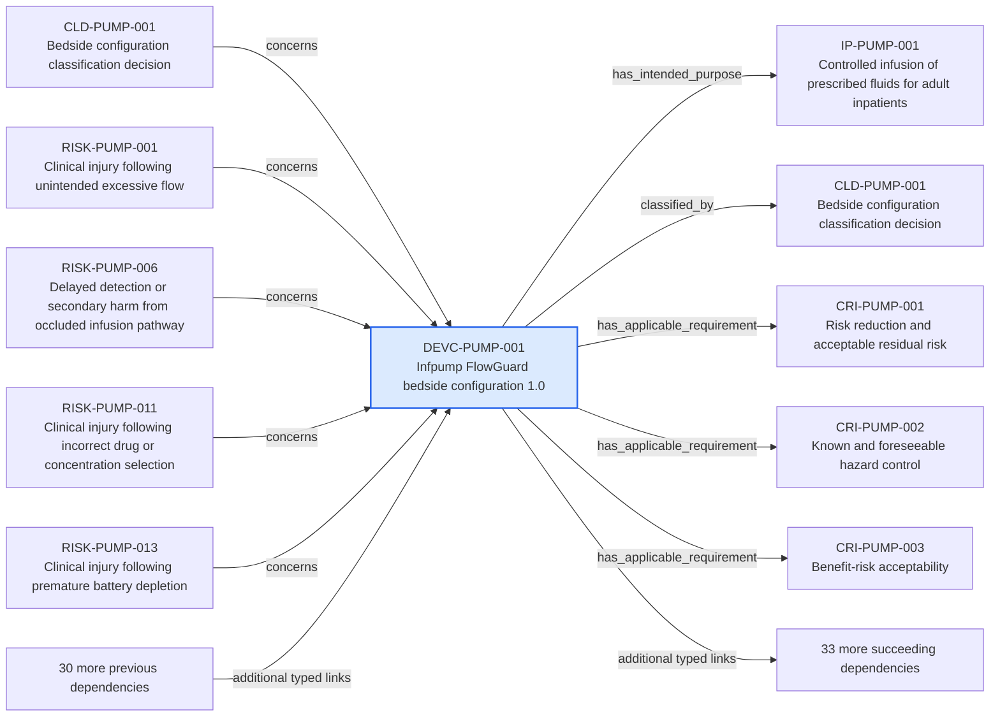

---
{
  "id": "DEVC-PUMP-001",
  "type": "device-configuration",
  "title": "Infpump FlowGuard bedside configuration 1.0",
  "aliases": [
    "DEVC-PUMP-001",
    "DEVC-PUMP-001-infpump-flowguard-bedside-configuration-10",
    "18-ontology-notes/device-configuration/DEVC-PUMP-001-infpump-flowguard-bedside-configuration-10",
    "03-Ontology notes/device-configuration/DEVC-PUMP-001-infpump-flowguard-bedside-configuration-10"
  ],
  "status": "approved",
  "version": "1",
  "created": "2026-08-15",
  "modified": "2026-08-15",
  "tags": [
    "ontology-note/device-configuration",
    "device/infpump-flowguard"
  ],
  "draft": false,
  "note_origin": "human-reviewed synthetic example",
  "technical_file": "TF-01 Device Description/Device Configuration Index.xlsx",
  "technical_file_identifier": "DEVC-PUMP-001",
  "valid_from": "2026-08-15",
  "review_status": "approved",
  "device_context": "[[06-Infpump FlowGuard ontology notes/device-configuration/DEVC-PUMP-001-infpump-flowguard-bedside-configuration-10|DEVC-PUMP-001]]",
  "lifecycle_state": "design-verification",
  "market_status": "not-marketed",
  "market_release_candidate": false,
  "risk_class": "IIb",
  "manufactured_by": [
    "[[01-Ontology instances/02-organisations/manufacturers/ORG-MFR-0001-example-medical-oy|ORG-MFR-0001]]"
  ],
  "has_intended_purpose": [
    "[[06-Infpump FlowGuard ontology notes/intended-purpose/IP-PUMP-001-controlled-infusion-of-prescribed-fluids-for-adult-inpatients|IP-PUMP-001]]"
  ],
  "classified_by": [
    "[[06-Infpump FlowGuard ontology notes/classification-decision/CLD-PUMP-001-bedside-configuration-classification-decision|CLD-PUMP-001]]"
  ],
  "has_applicable_requirement": [
    "[[06-Infpump FlowGuard ontology notes/compliance-requirement-instance/CRI-PUMP-001-risk-reduction-and-acceptable-residual-risk|CRI-PUMP-001]]",
    "[[06-Infpump FlowGuard ontology notes/compliance-requirement-instance/CRI-PUMP-002-known-and-foreseeable-hazard-control|CRI-PUMP-002]]",
    "[[06-Infpump FlowGuard ontology notes/compliance-requirement-instance/CRI-PUMP-003-benefit-risk-acceptability|CRI-PUMP-003]]",
    "[[06-Infpump FlowGuard ontology notes/compliance-requirement-instance/CRI-PUMP-004-risk-control-verification|CRI-PUMP-004]]",
    "[[06-Infpump FlowGuard ontology notes/compliance-requirement-instance/CRI-PUMP-005-use-error-reduction|CRI-PUMP-005]]",
    "[[06-Infpump FlowGuard ontology notes/compliance-requirement-instance/CRI-PUMP-006-performance-under-normal-conditions|CRI-PUMP-006]]",
    "[[06-Infpump FlowGuard ontology notes/compliance-requirement-instance/CRI-PUMP-007-device-lifetime-definition|CRI-PUMP-007]]",
    "[[06-Infpump FlowGuard ontology notes/compliance-requirement-instance/CRI-PUMP-008-transport-and-storage-protection|CRI-PUMP-008]]",
    "[[06-Infpump FlowGuard ontology notes/compliance-requirement-instance/CRI-PUMP-009-compatibility-with-medicinal-products|CRI-PUMP-009]]",
    "[[06-Infpump FlowGuard ontology notes/compliance-requirement-instance/CRI-PUMP-010-biological-safety-of-fluid-path-materials|CRI-PUMP-010]]",
    "[[06-Infpump FlowGuard ontology notes/compliance-requirement-instance/CRI-PUMP-051-battery-endurance-after-cell-supplier-change|CRI-PUMP-051]]"
  ],
  "has_hazard": [
    "[[06-Infpump FlowGuard ontology notes/hazard/HAZ-PUMP-001-unintended-excessive-flow|HAZ-PUMP-001]]",
    "[[06-Infpump FlowGuard ontology notes/hazard/HAZ-PUMP-002-insufficient-delivered-flow|HAZ-PUMP-002]]",
    "[[06-Infpump FlowGuard ontology notes/hazard/HAZ-PUMP-003-occluded-infusion-pathway|HAZ-PUMP-003]]",
    "[[06-Infpump FlowGuard ontology notes/hazard/HAZ-PUMP-004-air-introduced-into-infusion-line|HAZ-PUMP-004]]"
  ],
  "has_risk": [
    "[[06-Infpump FlowGuard ontology notes/risk/RISK-PUMP-001-clinical-injury-following-unintended-excessive-flow|RISK-PUMP-001]]",
    "[[06-Infpump FlowGuard ontology notes/risk/RISK-PUMP-002-delayed-detection-or-secondary-harm-from-unintended-excessive-flow|RISK-PUMP-002]]",
    "[[06-Infpump FlowGuard ontology notes/risk/RISK-PUMP-003-clinical-injury-following-insufficient-delivered-flow|RISK-PUMP-003]]",
    "[[06-Infpump FlowGuard ontology notes/risk/RISK-PUMP-004-delayed-detection-or-secondary-harm-from-insufficient-delivered-flow|RISK-PUMP-004]]",
    "[[06-Infpump FlowGuard ontology notes/risk/RISK-PUMP-005-clinical-injury-following-occluded-infusion-pathway|RISK-PUMP-005]]",
    "[[06-Infpump FlowGuard ontology notes/risk/RISK-PUMP-006-delayed-detection-or-secondary-harm-from-occluded-infusion-pathway|RISK-PUMP-006]]",
    "[[06-Infpump FlowGuard ontology notes/risk/RISK-PUMP-007-clinical-injury-following-air-introduced-into-infusion-line|RISK-PUMP-007]]",
    "[[06-Infpump FlowGuard ontology notes/risk/RISK-PUMP-008-delayed-detection-or-secondary-harm-from-air-introduced-into-infusion-line|RISK-PUMP-008]]"
  ],
  "includes_component": [
    "[[06-Infpump FlowGuard ontology notes/component/COMP-PUMP-001-infusion-pumping-mechanism|COMP-PUMP-001]]",
    "[[06-Infpump FlowGuard ontology notes/component/COMP-PUMP-002-air-in-line-sensor-assembly|COMP-PUMP-002]]",
    "[[06-Infpump FlowGuard ontology notes/component/COMP-PUMP-004-rechargeable-battery-pack|COMP-PUMP-004]]"
  ],
  "makes_clinical_claim": [
    "[[06-Infpump FlowGuard ontology notes/clinical-claim/CLM-PUMP-001-maintains-programmed-volumetric-flow-within-specified-accuracy|CLM-PUMP-001]]",
    "[[06-Infpump FlowGuard ontology notes/clinical-claim/CLM-PUMP-002-supports-continuous-intravenous-therapy|CLM-PUMP-002]]",
    "[[06-Infpump FlowGuard ontology notes/clinical-claim/CLM-PUMP-003-supports-intermittent-intravenous-therapy|CLM-PUMP-003]]",
    "[[06-Infpump FlowGuard ontology notes/clinical-claim/CLM-PUMP-004-reduces-unintended-free-flow-exposure|CLM-PUMP-004]]"
  ],
  "has_certificate": [
    "[[06-Infpump FlowGuard ontology notes/certificate/CERT-PUMP-001-eu-mdr-quality-management-system-certificate|CERT-PUMP-001]]"
  ],
  "has_baseline": [
    "[[06-Infpump FlowGuard ontology notes/configuration-baseline/BASE-PUMP-001-infpump-flowguard-released-design-baseline-11|BASE-PUMP-001]]"
  ],
  "includes_software_version": [
    "[[06-Infpump FlowGuard ontology notes/software-version/SW-PUMP-001-infpump-flowguard-control-software-420|SW-PUMP-001]]"
  ],
  "has_clinical_evaluation": [
    "[[06-Infpump FlowGuard ontology notes/clinical-evaluation/CE-PUMP-001-infpump-flowguard-continuous-clinical-evaluation|CE-PUMP-001]]"
  ],
  "has_technical_documentation": [
    "[[06-Infpump FlowGuard ontology notes/technical-documentation-set/TD-PUMP-001-infpump-flowguard-mdr-technical-documentation-set|TD-PUMP-001]]"
  ],
  "covered_by_pms_plan": [
    "[[06-Infpump FlowGuard ontology notes/pms-plan/PMS-PLAN-PUMP-001-infpump-flowguard-post-market-surveillance-plan|PMS-PLAN-PUMP-001]]"
  ],
  "source_provisions": [
    "[[02-Sources/standards/SRC-EMDN-european-medical-devices-nomenclature|SRC-EMDN]]",
    "[[02-Sources/standards/SRC-EUDAMED-european-commission-eudamed-overview|SRC-EUDAMED]]",
    "[[02-Sources/standards/SRC-UDI-european-commission-udi-overview|SRC-UDI]]",
    "[[02-Sources/standards/SRC-HARMONISED-STANDARDS-european-commission-harmonised-standards|SRC-HARMONISED-STANDARDS]]"
  ]
}
---

# Infpump FlowGuard bedside configuration 1.0

## Semantic role

Defines one exact regulated product configuration so that requirements, evidence and decisions are not applied to an ambiguous device revision.

## Note

Human-readable rendering of this note's YAML/JSON frontmatter:

- **id:** `DEVC-PUMP-001`
- **type:** `device-configuration`
- **title:** `Infpump FlowGuard bedside configuration 1.0`
- **aliases:** `DEVC-PUMP-001`, `DEVC-PUMP-001-infpump-flowguard-bedside-configuration-10`, `18-ontology-notes/device-configuration/DEVC-PUMP-001-infpump-flowguard-bedside-configuration-10`, `03-Ontology notes/device-configuration/DEVC-PUMP-001-infpump-flowguard-bedside-configuration-10`
- **status:** `approved`
- **version:** `1`
- **created:** `2026-08-15`
- **modified:** `2026-08-15`
- **tags:** `ontology-note/device-configuration`, `device/infpump-flowguard`
- **draft:** `false`
- **note_origin:** `human-reviewed synthetic example`
- **technical_file:** `TF-01 Device Description/Device Configuration Index.xlsx`
- **technical_file_identifier:** `DEVC-PUMP-001`
- **valid_from:** `2026-08-15`
- **review_status:** `approved`
- **device_context:** [[06-Infpump FlowGuard ontology notes/device-configuration/DEVC-PUMP-001-infpump-flowguard-bedside-configuration-10|DEVC-PUMP-001]]
- **lifecycle_state:** `design-verification`
- **market_status:** `not-marketed`
- **market_release_candidate:** `false`
- **risk_class:** `IIb`
- **manufactured_by:** [[01-Ontology instances/02-organisations/manufacturers/ORG-MFR-0001-example-medical-oy|ORG-MFR-0001]]
- **has_intended_purpose:** [[06-Infpump FlowGuard ontology notes/intended-purpose/IP-PUMP-001-controlled-infusion-of-prescribed-fluids-for-adult-inpatients|IP-PUMP-001]]
- **classified_by:** [[06-Infpump FlowGuard ontology notes/classification-decision/CLD-PUMP-001-bedside-configuration-classification-decision|CLD-PUMP-001]]
- **has_applicable_requirement:** [[06-Infpump FlowGuard ontology notes/compliance-requirement-instance/CRI-PUMP-001-risk-reduction-and-acceptable-residual-risk|CRI-PUMP-001]], [[06-Infpump FlowGuard ontology notes/compliance-requirement-instance/CRI-PUMP-002-known-and-foreseeable-hazard-control|CRI-PUMP-002]], [[06-Infpump FlowGuard ontology notes/compliance-requirement-instance/CRI-PUMP-003-benefit-risk-acceptability|CRI-PUMP-003]], [[06-Infpump FlowGuard ontology notes/compliance-requirement-instance/CRI-PUMP-004-risk-control-verification|CRI-PUMP-004]], [[06-Infpump FlowGuard ontology notes/compliance-requirement-instance/CRI-PUMP-005-use-error-reduction|CRI-PUMP-005]], [[06-Infpump FlowGuard ontology notes/compliance-requirement-instance/CRI-PUMP-006-performance-under-normal-conditions|CRI-PUMP-006]], [[06-Infpump FlowGuard ontology notes/compliance-requirement-instance/CRI-PUMP-007-device-lifetime-definition|CRI-PUMP-007]], [[06-Infpump FlowGuard ontology notes/compliance-requirement-instance/CRI-PUMP-008-transport-and-storage-protection|CRI-PUMP-008]], [[06-Infpump FlowGuard ontology notes/compliance-requirement-instance/CRI-PUMP-009-compatibility-with-medicinal-products|CRI-PUMP-009]], [[06-Infpump FlowGuard ontology notes/compliance-requirement-instance/CRI-PUMP-010-biological-safety-of-fluid-path-materials|CRI-PUMP-010]], [[06-Infpump FlowGuard ontology notes/compliance-requirement-instance/CRI-PUMP-051-battery-endurance-after-cell-supplier-change|CRI-PUMP-051]]
- **has_hazard:** [[06-Infpump FlowGuard ontology notes/hazard/HAZ-PUMP-001-unintended-excessive-flow|HAZ-PUMP-001]], [[06-Infpump FlowGuard ontology notes/hazard/HAZ-PUMP-002-insufficient-delivered-flow|HAZ-PUMP-002]], [[06-Infpump FlowGuard ontology notes/hazard/HAZ-PUMP-003-occluded-infusion-pathway|HAZ-PUMP-003]], [[06-Infpump FlowGuard ontology notes/hazard/HAZ-PUMP-004-air-introduced-into-infusion-line|HAZ-PUMP-004]]
- **has_risk:** [[06-Infpump FlowGuard ontology notes/risk/RISK-PUMP-001-clinical-injury-following-unintended-excessive-flow|RISK-PUMP-001]], [[06-Infpump FlowGuard ontology notes/risk/RISK-PUMP-002-delayed-detection-or-secondary-harm-from-unintended-excessive-flow|RISK-PUMP-002]], [[06-Infpump FlowGuard ontology notes/risk/RISK-PUMP-003-clinical-injury-following-insufficient-delivered-flow|RISK-PUMP-003]], [[06-Infpump FlowGuard ontology notes/risk/RISK-PUMP-004-delayed-detection-or-secondary-harm-from-insufficient-delivered-flow|RISK-PUMP-004]], [[06-Infpump FlowGuard ontology notes/risk/RISK-PUMP-005-clinical-injury-following-occluded-infusion-pathway|RISK-PUMP-005]], [[06-Infpump FlowGuard ontology notes/risk/RISK-PUMP-006-delayed-detection-or-secondary-harm-from-occluded-infusion-pathway|RISK-PUMP-006]], [[06-Infpump FlowGuard ontology notes/risk/RISK-PUMP-007-clinical-injury-following-air-introduced-into-infusion-line|RISK-PUMP-007]], [[06-Infpump FlowGuard ontology notes/risk/RISK-PUMP-008-delayed-detection-or-secondary-harm-from-air-introduced-into-infusion-line|RISK-PUMP-008]]
- **includes_component:** [[06-Infpump FlowGuard ontology notes/component/COMP-PUMP-001-infusion-pumping-mechanism|COMP-PUMP-001]], [[06-Infpump FlowGuard ontology notes/component/COMP-PUMP-002-air-in-line-sensor-assembly|COMP-PUMP-002]], [[06-Infpump FlowGuard ontology notes/component/COMP-PUMP-004-rechargeable-battery-pack|COMP-PUMP-004]]
- **makes_clinical_claim:** [[06-Infpump FlowGuard ontology notes/clinical-claim/CLM-PUMP-001-maintains-programmed-volumetric-flow-within-specified-accuracy|CLM-PUMP-001]], [[06-Infpump FlowGuard ontology notes/clinical-claim/CLM-PUMP-002-supports-continuous-intravenous-therapy|CLM-PUMP-002]], [[06-Infpump FlowGuard ontology notes/clinical-claim/CLM-PUMP-003-supports-intermittent-intravenous-therapy|CLM-PUMP-003]], [[06-Infpump FlowGuard ontology notes/clinical-claim/CLM-PUMP-004-reduces-unintended-free-flow-exposure|CLM-PUMP-004]]
- **has_certificate:** [[06-Infpump FlowGuard ontology notes/certificate/CERT-PUMP-001-eu-mdr-quality-management-system-certificate|CERT-PUMP-001]]
- **has_baseline:** [[06-Infpump FlowGuard ontology notes/configuration-baseline/BASE-PUMP-001-infpump-flowguard-released-design-baseline-11|BASE-PUMP-001]]
- **includes_software_version:** [[06-Infpump FlowGuard ontology notes/software-version/SW-PUMP-001-infpump-flowguard-control-software-420|SW-PUMP-001]]
- **has_clinical_evaluation:** [[06-Infpump FlowGuard ontology notes/clinical-evaluation/CE-PUMP-001-infpump-flowguard-continuous-clinical-evaluation|CE-PUMP-001]]
- **has_technical_documentation:** [[06-Infpump FlowGuard ontology notes/technical-documentation-set/TD-PUMP-001-infpump-flowguard-mdr-technical-documentation-set|TD-PUMP-001]]
- **covered_by_pms_plan:** [[06-Infpump FlowGuard ontology notes/pms-plan/PMS-PLAN-PUMP-001-infpump-flowguard-post-market-surveillance-plan|PMS-PLAN-PUMP-001]]
- **source_provisions:** [[02-Sources/standards/SRC-EMDN-european-medical-devices-nomenclature|SRC-EMDN]], [[02-Sources/standards/SRC-EUDAMED-european-commission-eudamed-overview|SRC-EUDAMED]], [[02-Sources/standards/SRC-UDI-european-commission-udi-overview|SRC-UDI]], [[02-Sources/standards/SRC-HARMONISED-STANDARDS-european-commission-harmonised-standards|SRC-HARMONISED-STANDARDS]]

## Traceability

Previous dependencies are ontology notes that lead into this record. They reach it through `concerns` from [[06-Infpump FlowGuard ontology notes/classification-decision/CLD-PUMP-001-bedside-configuration-classification-decision|CLD-PUMP-001 — Bedside configuration classification decision]], [[06-Infpump FlowGuard ontology notes/risk/RISK-PUMP-001-clinical-injury-following-unintended-excessive-flow|RISK-PUMP-001 — Clinical injury following unintended excessive flow]], [[06-Infpump FlowGuard ontology notes/risk/RISK-PUMP-006-delayed-detection-or-secondary-harm-from-occluded-infusion-pathway|RISK-PUMP-006 — Delayed detection or secondary harm from occluded infusion pathway]] and 13 more linked notes; `claim_scope` from [[06-Infpump FlowGuard ontology notes/clinical-claim/CLM-PUMP-001-maintains-programmed-volumetric-flow-within-specified-accuracy|CLM-PUMP-001 — Maintains programmed volumetric flow within specified accuracy]], [[06-Infpump FlowGuard ontology notes/clinical-claim/CLM-PUMP-006-detects-clinically-relevant-air-in-line|CLM-PUMP-006 — Detects clinically relevant air in line]], [[06-Infpump FlowGuard ontology notes/clinical-claim/CLM-PUMP-011-supports-vasoactive-medicine-delivery|CLM-PUMP-011 — Supports vasoactive medicine delivery]] and 1 more linked note; `applies_to_configuration` from [[06-Infpump FlowGuard ontology notes/verification-evidence/EVD-PUMP-001-flow-accuracy-verification-report|EVD-PUMP-001 — Flow accuracy verification report]], [[06-Infpump FlowGuard ontology notes/verification-evidence/EVD-PUMP-006-drug-library-limits-verification-report|EVD-PUMP-006 — Drug-library limits verification report]], [[06-Infpump FlowGuard ontology notes/verification-evidence/EVD-PUMP-007-battery-endurance-validation-report|EVD-PUMP-007 — Battery endurance validation report]] and 10 more linked notes; `has_configuration` from [[06-Infpump FlowGuard ontology notes/device-variant/DEVV-PUMP-001-infpump-flowguard-fg-100-eu-professional-use-variant|DEVV-PUMP-001 — Infpump FlowGuard FG-100 EU professional-use variant]]; `evaluates` from [[06-Infpump FlowGuard ontology notes/clinical-evaluation/CE-PUMP-001-infpump-flowguard-continuous-clinical-evaluation|CE-PUMP-001 — Infpump FlowGuard continuous clinical evaluation]]. These incoming links show which product, decision, process or evidence records depend on the current note.

Succeeding dependencies are ontology notes to which this record leads. The trace continues through `has_intended_purpose` to [[06-Infpump FlowGuard ontology notes/intended-purpose/IP-PUMP-001-controlled-infusion-of-prescribed-fluids-for-adult-inpatients|IP-PUMP-001 — Controlled infusion of prescribed fluids for adult inpatients]]; `classified_by` to [[06-Infpump FlowGuard ontology notes/classification-decision/CLD-PUMP-001-bedside-configuration-classification-decision|CLD-PUMP-001 — Bedside configuration classification decision]]; `has_applicable_requirement` to [[06-Infpump FlowGuard ontology notes/compliance-requirement-instance/CRI-PUMP-001-risk-reduction-and-acceptable-residual-risk|CRI-PUMP-001 — Risk reduction and acceptable residual risk]], [[06-Infpump FlowGuard ontology notes/compliance-requirement-instance/CRI-PUMP-002-known-and-foreseeable-hazard-control|CRI-PUMP-002 — Known and foreseeable hazard control]], [[06-Infpump FlowGuard ontology notes/compliance-requirement-instance/CRI-PUMP-003-benefit-risk-acceptability|CRI-PUMP-003 — Benefit-risk acceptability]] and 8 more linked notes; `has_hazard` to [[06-Infpump FlowGuard ontology notes/hazard/HAZ-PUMP-001-unintended-excessive-flow|HAZ-PUMP-001 — Unintended excessive flow]], [[06-Infpump FlowGuard ontology notes/hazard/HAZ-PUMP-002-insufficient-delivered-flow|HAZ-PUMP-002 — Insufficient delivered flow]], [[06-Infpump FlowGuard ontology notes/hazard/HAZ-PUMP-003-occluded-infusion-pathway|HAZ-PUMP-003 — Occluded infusion pathway]] and 1 more linked note; `has_risk` to [[06-Infpump FlowGuard ontology notes/risk/RISK-PUMP-001-clinical-injury-following-unintended-excessive-flow|RISK-PUMP-001 — Clinical injury following unintended excessive flow]], [[06-Infpump FlowGuard ontology notes/risk/RISK-PUMP-002-delayed-detection-or-secondary-harm-from-unintended-excessive-flow|RISK-PUMP-002 — Delayed detection or secondary harm from unintended excessive flow]], [[06-Infpump FlowGuard ontology notes/risk/RISK-PUMP-003-clinical-injury-following-insufficient-delivered-flow|RISK-PUMP-003 — Clinical injury following insufficient delivered flow]] and 5 more linked notes; `includes_component` to [[06-Infpump FlowGuard ontology notes/component/COMP-PUMP-001-infusion-pumping-mechanism|COMP-PUMP-001 — Infusion pumping mechanism]], [[06-Infpump FlowGuard ontology notes/component/COMP-PUMP-002-air-in-line-sensor-assembly|COMP-PUMP-002 — Air-in-line sensor assembly]], [[06-Infpump FlowGuard ontology notes/component/COMP-PUMP-004-rechargeable-battery-pack|COMP-PUMP-004 — Rechargeable battery pack]]; `makes_clinical_claim` to [[06-Infpump FlowGuard ontology notes/clinical-claim/CLM-PUMP-001-maintains-programmed-volumetric-flow-within-specified-accuracy|CLM-PUMP-001 — Maintains programmed volumetric flow within specified accuracy]], [[06-Infpump FlowGuard ontology notes/clinical-claim/CLM-PUMP-002-supports-continuous-intravenous-therapy|CLM-PUMP-002 — Supports continuous intravenous therapy]], [[06-Infpump FlowGuard ontology notes/clinical-claim/CLM-PUMP-003-supports-intermittent-intravenous-therapy|CLM-PUMP-003 — Supports intermittent intravenous therapy]] and 1 more linked note; `has_certificate` to [[06-Infpump FlowGuard ontology notes/certificate/CERT-PUMP-001-eu-mdr-quality-management-system-certificate|CERT-PUMP-001 — EU MDR quality-management-system certificate]]; `has_baseline` to [[06-Infpump FlowGuard ontology notes/configuration-baseline/BASE-PUMP-001-infpump-flowguard-released-design-baseline-11|BASE-PUMP-001 — Infpump FlowGuard released design baseline 1.1]]; `includes_software_version` to [[06-Infpump FlowGuard ontology notes/software-version/SW-PUMP-001-infpump-flowguard-control-software-420|SW-PUMP-001 — Infpump FlowGuard control software 4.2.0]]; `has_clinical_evaluation` to [[06-Infpump FlowGuard ontology notes/clinical-evaluation/CE-PUMP-001-infpump-flowguard-continuous-clinical-evaluation|CE-PUMP-001 — Infpump FlowGuard continuous clinical evaluation]]; `has_technical_documentation` to [[06-Infpump FlowGuard ontology notes/technical-documentation-set/TD-PUMP-001-infpump-flowguard-mdr-technical-documentation-set|TD-PUMP-001 — Infpump FlowGuard MDR technical documentation set]]; `covered_by_pms_plan` to [[06-Infpump FlowGuard ontology notes/pms-plan/PMS-PLAN-PUMP-001-infpump-flowguard-post-market-surveillance-plan|PMS-PLAN-PUMP-001 — Infpump FlowGuard post-market surveillance plan]]. These outgoing links identify the next product, risk, control, evidence, change or lifecycle records used by downstream reasoning.

The left-to-right diagram shows up to five asserted previous and five asserted succeeding ontology-note dependencies. When more links exist, the additional-dependency node states how many remain available through the verbal links and structured metadata above.

