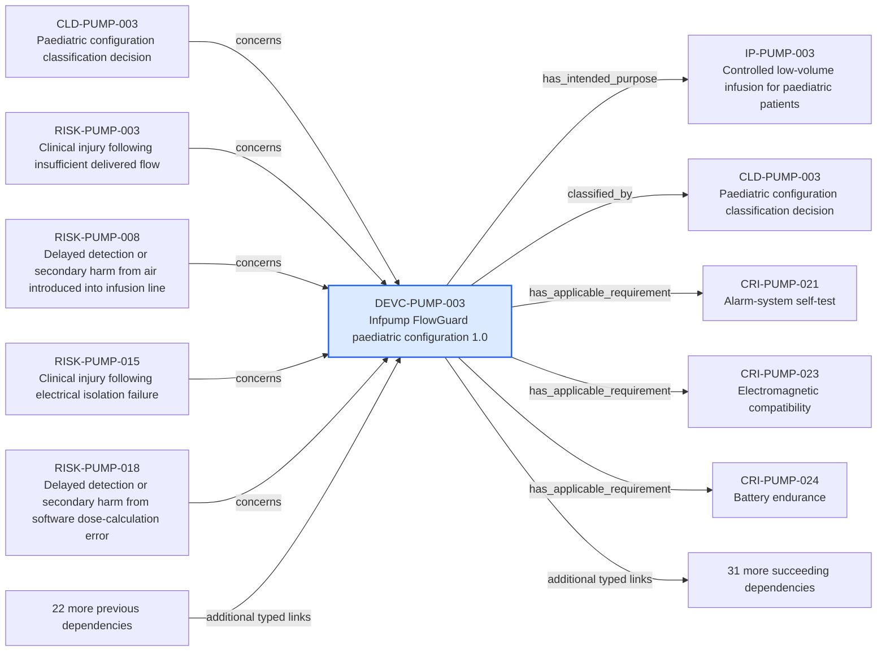

---
{
  "id": "DEVC-PUMP-003",
  "type": "device-configuration",
  "title": "Infpump FlowGuard paediatric configuration 1.0",
  "aliases": [
    "DEVC-PUMP-003",
    "DEVC-PUMP-003-infpump-flowguard-paediatric-configuration-10",
    "18-ontology-notes/device-configuration/DEVC-PUMP-003-infpump-flowguard-paediatric-configuration-10",
    "03-Ontology notes/device-configuration/DEVC-PUMP-003-infpump-flowguard-paediatric-configuration-10"
  ],
  "status": "approved",
  "version": "1",
  "created": "2026-08-15",
  "modified": "2026-08-15",
  "tags": [
    "ontology-note/device-configuration",
    "device/infpump-flowguard"
  ],
  "draft": false,
  "note_origin": "human-reviewed synthetic example",
  "technical_file": "TF-01 Device Description/Device Configuration Index.xlsx",
  "technical_file_identifier": "DEVC-PUMP-003",
  "valid_from": "2026-08-15",
  "review_status": "approved",
  "device_context": "[[06-Infpump FlowGuard ontology notes/device-configuration/DEVC-PUMP-003-infpump-flowguard-paediatric-configuration-10|DEVC-PUMP-003]]",
  "lifecycle_state": "design-verification",
  "market_status": "not-marketed",
  "market_release_candidate": false,
  "risk_class": "IIb",
  "manufactured_by": [
    "[[01-Ontology instances/02-organisations/manufacturers/ORG-MFR-0001-example-medical-oy|ORG-MFR-0001]]"
  ],
  "has_intended_purpose": [
    "[[06-Infpump FlowGuard ontology notes/intended-purpose/IP-PUMP-003-controlled-low-volume-infusion-for-paediatric-patients|IP-PUMP-003]]"
  ],
  "classified_by": [
    "[[06-Infpump FlowGuard ontology notes/classification-decision/CLD-PUMP-003-paediatric-configuration-classification-decision|CLD-PUMP-003]]"
  ],
  "has_applicable_requirement": [
    "[[06-Infpump FlowGuard ontology notes/compliance-requirement-instance/CRI-PUMP-021-alarm-system-self-test|CRI-PUMP-021]]",
    "[[06-Infpump FlowGuard ontology notes/compliance-requirement-instance/CRI-PUMP-023-electromagnetic-compatibility|CRI-PUMP-023]]",
    "[[06-Infpump FlowGuard ontology notes/compliance-requirement-instance/CRI-PUMP-024-battery-endurance|CRI-PUMP-024]]",
    "[[06-Infpump FlowGuard ontology notes/compliance-requirement-instance/CRI-PUMP-025-protective-earth-and-isolation|CRI-PUMP-025]]",
    "[[06-Infpump FlowGuard ontology notes/compliance-requirement-instance/CRI-PUMP-026-mechanical-stability|CRI-PUMP-026]]",
    "[[06-Infpump FlowGuard ontology notes/compliance-requirement-instance/CRI-PUMP-027-pole-clamp-integrity|CRI-PUMP-027]]",
    "[[06-Infpump FlowGuard ontology notes/compliance-requirement-instance/CRI-PUMP-028-fluid-ingress-protection|CRI-PUMP-028]]",
    "[[06-Infpump FlowGuard ontology notes/compliance-requirement-instance/CRI-PUMP-029-thermal-safety|CRI-PUMP-029]]",
    "[[06-Infpump FlowGuard ontology notes/compliance-requirement-instance/CRI-PUMP-030-software-lifecycle-control|CRI-PUMP-030]]",
    "[[06-Infpump FlowGuard ontology notes/compliance-requirement-instance/CRI-PUMP-022-electrical-safety|CRI-PUMP-022]]"
  ],
  "has_hazard": [
    "[[06-Infpump FlowGuard ontology notes/hazard/HAZ-PUMP-009-software-dose-calculation-error|HAZ-PUMP-009]]",
    "[[06-Infpump FlowGuard ontology notes/hazard/HAZ-PUMP-010-suppressed-or-missed-alarm|HAZ-PUMP-010]]",
    "[[06-Infpump FlowGuard ontology notes/hazard/HAZ-PUMP-011-incorrect-touch-interface-input|HAZ-PUMP-011]]",
    "[[06-Infpump FlowGuard ontology notes/hazard/HAZ-PUMP-008-electrical-isolation-failure|HAZ-PUMP-008]]"
  ],
  "has_risk": [
    "[[06-Infpump FlowGuard ontology notes/risk/RISK-PUMP-017-clinical-injury-following-software-dose-calculation-error|RISK-PUMP-017]]",
    "[[06-Infpump FlowGuard ontology notes/risk/RISK-PUMP-018-delayed-detection-or-secondary-harm-from-software-dose-calculation-error|RISK-PUMP-018]]",
    "[[06-Infpump FlowGuard ontology notes/risk/RISK-PUMP-019-clinical-injury-following-suppressed-or-missed-alarm|RISK-PUMP-019]]",
    "[[06-Infpump FlowGuard ontology notes/risk/RISK-PUMP-020-delayed-detection-or-secondary-harm-from-suppressed-or-missed-alarm|RISK-PUMP-020]]",
    "[[06-Infpump FlowGuard ontology notes/risk/RISK-PUMP-021-clinical-injury-following-incorrect-touch-interface-input|RISK-PUMP-021]]",
    "[[06-Infpump FlowGuard ontology notes/risk/RISK-PUMP-022-delayed-detection-or-secondary-harm-from-incorrect-touch-interface-input|RISK-PUMP-022]]",
    "[[06-Infpump FlowGuard ontology notes/risk/RISK-PUMP-024-delayed-detection-or-secondary-harm-from-cybersecurity-compromise|RISK-PUMP-024]]",
    "[[06-Infpump FlowGuard ontology notes/risk/RISK-PUMP-015-clinical-injury-following-electrical-isolation-failure|RISK-PUMP-015]]"
  ],
  "includes_component": [
    "[[06-Infpump FlowGuard ontology notes/component/COMP-PUMP-005-touchscreen-user-interface|COMP-PUMP-005]]",
    "[[06-Infpump FlowGuard ontology notes/component/COMP-PUMP-006-alarm-speaker-assembly|COMP-PUMP-006]]"
  ],
  "makes_clinical_claim": [
    "[[06-Infpump FlowGuard ontology notes/clinical-claim/CLM-PUMP-009-supports-weight-based-dose-programming|CLM-PUMP-009]]",
    "[[06-Infpump FlowGuard ontology notes/clinical-claim/CLM-PUMP-010-supports-oncology-infusion-protocols|CLM-PUMP-010]]",
    "[[06-Infpump FlowGuard ontology notes/clinical-claim/CLM-PUMP-011-supports-vasoactive-medicine-delivery|CLM-PUMP-011]]",
    "[[06-Infpump FlowGuard ontology notes/clinical-claim/CLM-PUMP-012-supports-intra-hospital-transport-use|CLM-PUMP-012]]"
  ],
  "has_certificate": [
    "[[06-Infpump FlowGuard ontology notes/certificate/CERT-PUMP-003-electrical-safety-cb-test-certificate|CERT-PUMP-003]]"
  ],
  "has_baseline": [
    "[[06-Infpump FlowGuard ontology notes/configuration-baseline/BASE-PUMP-001-infpump-flowguard-released-design-baseline-11|BASE-PUMP-001]]"
  ],
  "includes_software_version": [
    "[[06-Infpump FlowGuard ontology notes/software-version/SW-PUMP-001-infpump-flowguard-control-software-420|SW-PUMP-001]]"
  ],
  "has_clinical_evaluation": [
    "[[06-Infpump FlowGuard ontology notes/clinical-evaluation/CE-PUMP-001-infpump-flowguard-continuous-clinical-evaluation|CE-PUMP-001]]"
  ],
  "has_technical_documentation": [
    "[[06-Infpump FlowGuard ontology notes/technical-documentation-set/TD-PUMP-001-infpump-flowguard-mdr-technical-documentation-set|TD-PUMP-001]]"
  ],
  "covered_by_pms_plan": [
    "[[06-Infpump FlowGuard ontology notes/pms-plan/PMS-PLAN-PUMP-001-infpump-flowguard-post-market-surveillance-plan|PMS-PLAN-PUMP-001]]"
  ],
  "source_provisions": [
    "[[02-Sources/standards/SRC-EMDN-european-medical-devices-nomenclature|SRC-EMDN]]",
    "[[02-Sources/standards/SRC-EUDAMED-european-commission-eudamed-overview|SRC-EUDAMED]]",
    "[[02-Sources/standards/SRC-UDI-european-commission-udi-overview|SRC-UDI]]",
    "[[02-Sources/standards/SRC-HARMONISED-STANDARDS-european-commission-harmonised-standards|SRC-HARMONISED-STANDARDS]]"
  ]
}
---

# Infpump FlowGuard paediatric configuration 1.0

## Semantic role

Defines one exact regulated product configuration so that requirements, evidence and decisions are not applied to an ambiguous device revision.

## Note

Human-readable rendering of this note's YAML/JSON frontmatter:

- **id:** `DEVC-PUMP-003`
- **type:** `device-configuration`
- **title:** `Infpump FlowGuard paediatric configuration 1.0`
- **aliases:** `DEVC-PUMP-003`, `DEVC-PUMP-003-infpump-flowguard-paediatric-configuration-10`, `18-ontology-notes/device-configuration/DEVC-PUMP-003-infpump-flowguard-paediatric-configuration-10`, `03-Ontology notes/device-configuration/DEVC-PUMP-003-infpump-flowguard-paediatric-configuration-10`
- **status:** `approved`
- **version:** `1`
- **created:** `2026-08-15`
- **modified:** `2026-08-15`
- **tags:** `ontology-note/device-configuration`, `device/infpump-flowguard`
- **draft:** `false`
- **note_origin:** `human-reviewed synthetic example`
- **technical_file:** `TF-01 Device Description/Device Configuration Index.xlsx`
- **technical_file_identifier:** `DEVC-PUMP-003`
- **valid_from:** `2026-08-15`
- **review_status:** `approved`
- **device_context:** [[06-Infpump FlowGuard ontology notes/device-configuration/DEVC-PUMP-003-infpump-flowguard-paediatric-configuration-10|DEVC-PUMP-003]]
- **lifecycle_state:** `design-verification`
- **market_status:** `not-marketed`
- **market_release_candidate:** `false`
- **risk_class:** `IIb`
- **manufactured_by:** [[01-Ontology instances/02-organisations/manufacturers/ORG-MFR-0001-example-medical-oy|ORG-MFR-0001]]
- **has_intended_purpose:** [[06-Infpump FlowGuard ontology notes/intended-purpose/IP-PUMP-003-controlled-low-volume-infusion-for-paediatric-patients|IP-PUMP-003]]
- **classified_by:** [[06-Infpump FlowGuard ontology notes/classification-decision/CLD-PUMP-003-paediatric-configuration-classification-decision|CLD-PUMP-003]]
- **has_applicable_requirement:** [[06-Infpump FlowGuard ontology notes/compliance-requirement-instance/CRI-PUMP-021-alarm-system-self-test|CRI-PUMP-021]], [[06-Infpump FlowGuard ontology notes/compliance-requirement-instance/CRI-PUMP-023-electromagnetic-compatibility|CRI-PUMP-023]], [[06-Infpump FlowGuard ontology notes/compliance-requirement-instance/CRI-PUMP-024-battery-endurance|CRI-PUMP-024]], [[06-Infpump FlowGuard ontology notes/compliance-requirement-instance/CRI-PUMP-025-protective-earth-and-isolation|CRI-PUMP-025]], [[06-Infpump FlowGuard ontology notes/compliance-requirement-instance/CRI-PUMP-026-mechanical-stability|CRI-PUMP-026]], [[06-Infpump FlowGuard ontology notes/compliance-requirement-instance/CRI-PUMP-027-pole-clamp-integrity|CRI-PUMP-027]], [[06-Infpump FlowGuard ontology notes/compliance-requirement-instance/CRI-PUMP-028-fluid-ingress-protection|CRI-PUMP-028]], [[06-Infpump FlowGuard ontology notes/compliance-requirement-instance/CRI-PUMP-029-thermal-safety|CRI-PUMP-029]], [[06-Infpump FlowGuard ontology notes/compliance-requirement-instance/CRI-PUMP-030-software-lifecycle-control|CRI-PUMP-030]], [[06-Infpump FlowGuard ontology notes/compliance-requirement-instance/CRI-PUMP-022-electrical-safety|CRI-PUMP-022]]
- **has_hazard:** [[06-Infpump FlowGuard ontology notes/hazard/HAZ-PUMP-009-software-dose-calculation-error|HAZ-PUMP-009]], [[06-Infpump FlowGuard ontology notes/hazard/HAZ-PUMP-010-suppressed-or-missed-alarm|HAZ-PUMP-010]], [[06-Infpump FlowGuard ontology notes/hazard/HAZ-PUMP-011-incorrect-touch-interface-input|HAZ-PUMP-011]], [[06-Infpump FlowGuard ontology notes/hazard/HAZ-PUMP-008-electrical-isolation-failure|HAZ-PUMP-008]]
- **has_risk:** [[06-Infpump FlowGuard ontology notes/risk/RISK-PUMP-017-clinical-injury-following-software-dose-calculation-error|RISK-PUMP-017]], [[06-Infpump FlowGuard ontology notes/risk/RISK-PUMP-018-delayed-detection-or-secondary-harm-from-software-dose-calculation-error|RISK-PUMP-018]], [[06-Infpump FlowGuard ontology notes/risk/RISK-PUMP-019-clinical-injury-following-suppressed-or-missed-alarm|RISK-PUMP-019]], [[06-Infpump FlowGuard ontology notes/risk/RISK-PUMP-020-delayed-detection-or-secondary-harm-from-suppressed-or-missed-alarm|RISK-PUMP-020]], [[06-Infpump FlowGuard ontology notes/risk/RISK-PUMP-021-clinical-injury-following-incorrect-touch-interface-input|RISK-PUMP-021]], [[06-Infpump FlowGuard ontology notes/risk/RISK-PUMP-022-delayed-detection-or-secondary-harm-from-incorrect-touch-interface-input|RISK-PUMP-022]], [[06-Infpump FlowGuard ontology notes/risk/RISK-PUMP-024-delayed-detection-or-secondary-harm-from-cybersecurity-compromise|RISK-PUMP-024]], [[06-Infpump FlowGuard ontology notes/risk/RISK-PUMP-015-clinical-injury-following-electrical-isolation-failure|RISK-PUMP-015]]
- **includes_component:** [[06-Infpump FlowGuard ontology notes/component/COMP-PUMP-005-touchscreen-user-interface|COMP-PUMP-005]], [[06-Infpump FlowGuard ontology notes/component/COMP-PUMP-006-alarm-speaker-assembly|COMP-PUMP-006]]
- **makes_clinical_claim:** [[06-Infpump FlowGuard ontology notes/clinical-claim/CLM-PUMP-009-supports-weight-based-dose-programming|CLM-PUMP-009]], [[06-Infpump FlowGuard ontology notes/clinical-claim/CLM-PUMP-010-supports-oncology-infusion-protocols|CLM-PUMP-010]], [[06-Infpump FlowGuard ontology notes/clinical-claim/CLM-PUMP-011-supports-vasoactive-medicine-delivery|CLM-PUMP-011]], [[06-Infpump FlowGuard ontology notes/clinical-claim/CLM-PUMP-012-supports-intra-hospital-transport-use|CLM-PUMP-012]]
- **has_certificate:** [[06-Infpump FlowGuard ontology notes/certificate/CERT-PUMP-003-electrical-safety-cb-test-certificate|CERT-PUMP-003]]
- **has_baseline:** [[06-Infpump FlowGuard ontology notes/configuration-baseline/BASE-PUMP-001-infpump-flowguard-released-design-baseline-11|BASE-PUMP-001]]
- **includes_software_version:** [[06-Infpump FlowGuard ontology notes/software-version/SW-PUMP-001-infpump-flowguard-control-software-420|SW-PUMP-001]]
- **has_clinical_evaluation:** [[06-Infpump FlowGuard ontology notes/clinical-evaluation/CE-PUMP-001-infpump-flowguard-continuous-clinical-evaluation|CE-PUMP-001]]
- **has_technical_documentation:** [[06-Infpump FlowGuard ontology notes/technical-documentation-set/TD-PUMP-001-infpump-flowguard-mdr-technical-documentation-set|TD-PUMP-001]]
- **covered_by_pms_plan:** [[06-Infpump FlowGuard ontology notes/pms-plan/PMS-PLAN-PUMP-001-infpump-flowguard-post-market-surveillance-plan|PMS-PLAN-PUMP-001]]
- **source_provisions:** [[02-Sources/standards/SRC-EMDN-european-medical-devices-nomenclature|SRC-EMDN]], [[02-Sources/standards/SRC-EUDAMED-european-commission-eudamed-overview|SRC-EUDAMED]], [[02-Sources/standards/SRC-UDI-european-commission-udi-overview|SRC-UDI]], [[02-Sources/standards/SRC-HARMONISED-STANDARDS-european-commission-harmonised-standards|SRC-HARMONISED-STANDARDS]]

## Traceability

Previous dependencies are ontology notes that lead into this record. They reach it through `concerns` from [[06-Infpump FlowGuard ontology notes/classification-decision/CLD-PUMP-003-paediatric-configuration-classification-decision|CLD-PUMP-003 — Paediatric configuration classification decision]], [[06-Infpump FlowGuard ontology notes/risk/RISK-PUMP-003-clinical-injury-following-insufficient-delivered-flow|RISK-PUMP-003 — Clinical injury following insufficient delivered flow]], [[06-Infpump FlowGuard ontology notes/risk/RISK-PUMP-008-delayed-detection-or-secondary-harm-from-air-introduced-into-infusion-line|RISK-PUMP-008 — Delayed detection or secondary harm from air introduced into infusion line]] and 8 more linked notes; `claim_scope` from [[06-Infpump FlowGuard ontology notes/clinical-claim/CLM-PUMP-003-supports-intermittent-intravenous-therapy|CLM-PUMP-003 — Supports intermittent intravenous therapy]], [[06-Infpump FlowGuard ontology notes/clinical-claim/CLM-PUMP-008-supports-low-volume-paediatric-infusion|CLM-PUMP-008 — Supports low-volume paediatric infusion]], [[06-Infpump FlowGuard ontology notes/clinical-claim/CLM-PUMP-013-maintains-therapy-during-specified-battery-operation|CLM-PUMP-013 — Maintains therapy during specified battery operation]] and 1 more linked note; `applies_to_configuration` from [[06-Infpump FlowGuard ontology notes/verification-evidence/EVD-PUMP-008-electrical-safety-test-report|EVD-PUMP-008 — Electrical safety test report]], [[06-Infpump FlowGuard ontology notes/verification-evidence/EVD-PUMP-013-security-update-verification-report|EVD-PUMP-013 — Security update verification report]], [[06-Infpump FlowGuard ontology notes/verification-evidence/EVD-PUMP-018-ingress-protection-test-report|EVD-PUMP-018 — Ingress protection test report]] and 7 more linked notes; `has_configuration` from [[06-Infpump FlowGuard ontology notes/device-variant/DEVV-PUMP-001-infpump-flowguard-fg-100-eu-professional-use-variant|DEVV-PUMP-001 — Infpump FlowGuard FG-100 EU professional-use variant]]; `evaluates` from [[06-Infpump FlowGuard ontology notes/clinical-evaluation/CE-PUMP-001-infpump-flowguard-continuous-clinical-evaluation|CE-PUMP-001 — Infpump FlowGuard continuous clinical evaluation]]. These incoming links show which product, decision, process or evidence records depend on the current note.

Succeeding dependencies are ontology notes to which this record leads. The trace continues through `has_intended_purpose` to [[06-Infpump FlowGuard ontology notes/intended-purpose/IP-PUMP-003-controlled-low-volume-infusion-for-paediatric-patients|IP-PUMP-003 — Controlled low-volume infusion for paediatric patients]]; `classified_by` to [[06-Infpump FlowGuard ontology notes/classification-decision/CLD-PUMP-003-paediatric-configuration-classification-decision|CLD-PUMP-003 — Paediatric configuration classification decision]]; `has_applicable_requirement` to [[06-Infpump FlowGuard ontology notes/compliance-requirement-instance/CRI-PUMP-021-alarm-system-self-test|CRI-PUMP-021 — Alarm-system self-test]], [[06-Infpump FlowGuard ontology notes/compliance-requirement-instance/CRI-PUMP-023-electromagnetic-compatibility|CRI-PUMP-023 — Electromagnetic compatibility]], [[06-Infpump FlowGuard ontology notes/compliance-requirement-instance/CRI-PUMP-024-battery-endurance|CRI-PUMP-024 — Battery endurance]] and 7 more linked notes; `has_hazard` to [[06-Infpump FlowGuard ontology notes/hazard/HAZ-PUMP-009-software-dose-calculation-error|HAZ-PUMP-009 — Software dose-calculation error]], [[06-Infpump FlowGuard ontology notes/hazard/HAZ-PUMP-010-suppressed-or-missed-alarm|HAZ-PUMP-010 — Suppressed or missed alarm]], [[06-Infpump FlowGuard ontology notes/hazard/HAZ-PUMP-011-incorrect-touch-interface-input|HAZ-PUMP-011 — Incorrect touch-interface input]] and 1 more linked note; `has_risk` to [[06-Infpump FlowGuard ontology notes/risk/RISK-PUMP-017-clinical-injury-following-software-dose-calculation-error|RISK-PUMP-017 — Clinical injury following software dose-calculation error]], [[06-Infpump FlowGuard ontology notes/risk/RISK-PUMP-018-delayed-detection-or-secondary-harm-from-software-dose-calculation-error|RISK-PUMP-018 — Delayed detection or secondary harm from software dose-calculation error]], [[06-Infpump FlowGuard ontology notes/risk/RISK-PUMP-019-clinical-injury-following-suppressed-or-missed-alarm|RISK-PUMP-019 — Clinical injury following suppressed or missed alarm]] and 5 more linked notes; `includes_component` to [[06-Infpump FlowGuard ontology notes/component/COMP-PUMP-005-touchscreen-user-interface|COMP-PUMP-005 — Touchscreen user interface]], [[06-Infpump FlowGuard ontology notes/component/COMP-PUMP-006-alarm-speaker-assembly|COMP-PUMP-006 — Alarm speaker assembly]]; `makes_clinical_claim` to [[06-Infpump FlowGuard ontology notes/clinical-claim/CLM-PUMP-009-supports-weight-based-dose-programming|CLM-PUMP-009 — Supports weight-based dose programming]], [[06-Infpump FlowGuard ontology notes/clinical-claim/CLM-PUMP-010-supports-oncology-infusion-protocols|CLM-PUMP-010 — Supports oncology infusion protocols]], [[06-Infpump FlowGuard ontology notes/clinical-claim/CLM-PUMP-011-supports-vasoactive-medicine-delivery|CLM-PUMP-011 — Supports vasoactive medicine delivery]] and 1 more linked note; `has_certificate` to [[06-Infpump FlowGuard ontology notes/certificate/CERT-PUMP-003-electrical-safety-cb-test-certificate|CERT-PUMP-003 — Electrical safety CB test certificate]]; `has_baseline` to [[06-Infpump FlowGuard ontology notes/configuration-baseline/BASE-PUMP-001-infpump-flowguard-released-design-baseline-11|BASE-PUMP-001 — Infpump FlowGuard released design baseline 1.1]]; `includes_software_version` to [[06-Infpump FlowGuard ontology notes/software-version/SW-PUMP-001-infpump-flowguard-control-software-420|SW-PUMP-001 — Infpump FlowGuard control software 4.2.0]]; `has_clinical_evaluation` to [[06-Infpump FlowGuard ontology notes/clinical-evaluation/CE-PUMP-001-infpump-flowguard-continuous-clinical-evaluation|CE-PUMP-001 — Infpump FlowGuard continuous clinical evaluation]]; `has_technical_documentation` to [[06-Infpump FlowGuard ontology notes/technical-documentation-set/TD-PUMP-001-infpump-flowguard-mdr-technical-documentation-set|TD-PUMP-001 — Infpump FlowGuard MDR technical documentation set]]; `covered_by_pms_plan` to [[06-Infpump FlowGuard ontology notes/pms-plan/PMS-PLAN-PUMP-001-infpump-flowguard-post-market-surveillance-plan|PMS-PLAN-PUMP-001 — Infpump FlowGuard post-market surveillance plan]]. These outgoing links identify the next product, risk, control, evidence, change or lifecycle records used by downstream reasoning.

The left-to-right diagram shows up to five asserted previous and five asserted succeeding ontology-note dependencies. When more links exist, the additional-dependency node states how many remain available through the verbal links and structured metadata above.

