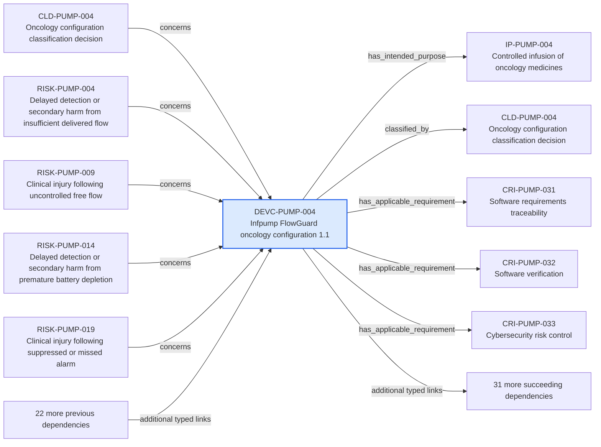

---
{
  "id": "DEVC-PUMP-004",
  "type": "device-configuration",
  "title": "Infpump FlowGuard oncology configuration 1.1",
  "aliases": [
    "DEVC-PUMP-004",
    "DEVC-PUMP-004-infpump-flowguard-oncology-configuration-11",
    "18-ontology-notes/device-configuration/DEVC-PUMP-004-infpump-flowguard-oncology-configuration-11",
    "03-Ontology notes/device-configuration/DEVC-PUMP-004-infpump-flowguard-oncology-configuration-11"
  ],
  "status": "approved",
  "version": "1",
  "created": "2026-08-15",
  "modified": "2026-08-15",
  "tags": [
    "ontology-note/device-configuration",
    "device/infpump-flowguard"
  ],
  "draft": false,
  "note_origin": "human-reviewed synthetic example",
  "technical_file": "TF-01 Device Description/Device Configuration Index.xlsx",
  "technical_file_identifier": "DEVC-PUMP-004",
  "valid_from": "2026-08-15",
  "review_status": "approved",
  "device_context": "[[06-Infpump FlowGuard ontology notes/device-configuration/DEVC-PUMP-004-infpump-flowguard-oncology-configuration-11|DEVC-PUMP-004]]",
  "lifecycle_state": "design-verification",
  "market_status": "not-marketed",
  "market_release_candidate": false,
  "risk_class": "IIb",
  "manufactured_by": [
    "[[01-Ontology instances/02-organisations/manufacturers/ORG-MFR-0001-example-medical-oy|ORG-MFR-0001]]"
  ],
  "has_intended_purpose": [
    "[[06-Infpump FlowGuard ontology notes/intended-purpose/IP-PUMP-004-controlled-infusion-of-oncology-medicines|IP-PUMP-004]]"
  ],
  "classified_by": [
    "[[06-Infpump FlowGuard ontology notes/classification-decision/CLD-PUMP-004-oncology-configuration-classification-decision|CLD-PUMP-004]]"
  ],
  "has_applicable_requirement": [
    "[[06-Infpump FlowGuard ontology notes/compliance-requirement-instance/CRI-PUMP-031-software-requirements-traceability|CRI-PUMP-031]]",
    "[[06-Infpump FlowGuard ontology notes/compliance-requirement-instance/CRI-PUMP-032-software-verification|CRI-PUMP-032]]",
    "[[06-Infpump FlowGuard ontology notes/compliance-requirement-instance/CRI-PUMP-033-cybersecurity-risk-control|CRI-PUMP-033]]",
    "[[06-Infpump FlowGuard ontology notes/compliance-requirement-instance/CRI-PUMP-034-access-control|CRI-PUMP-034]]",
    "[[06-Infpump FlowGuard ontology notes/compliance-requirement-instance/CRI-PUMP-035-security-logging|CRI-PUMP-035]]",
    "[[06-Infpump FlowGuard ontology notes/compliance-requirement-instance/CRI-PUMP-036-data-integrity|CRI-PUMP-036]]",
    "[[06-Infpump FlowGuard ontology notes/compliance-requirement-instance/CRI-PUMP-037-clock-and-event-chronology|CRI-PUMP-037]]",
    "[[06-Infpump FlowGuard ontology notes/compliance-requirement-instance/CRI-PUMP-038-interoperability|CRI-PUMP-038]]",
    "[[06-Infpump FlowGuard ontology notes/compliance-requirement-instance/CRI-PUMP-039-network-disconnection-behaviour|CRI-PUMP-039]]",
    "[[06-Infpump FlowGuard ontology notes/compliance-requirement-instance/CRI-PUMP-040-human-factors-validation|CRI-PUMP-040]]"
  ],
  "has_hazard": [
    "[[06-Infpump FlowGuard ontology notes/hazard/HAZ-PUMP-013-electromagnetic-disturbance|HAZ-PUMP-013]]",
    "[[06-Infpump FlowGuard ontology notes/hazard/HAZ-PUMP-014-fluid-ingress-into-enclosure|HAZ-PUMP-014]]",
    "[[06-Infpump FlowGuard ontology notes/hazard/HAZ-PUMP-015-pole-clamp-mechanical-failure|HAZ-PUMP-015]]",
    "[[06-Infpump FlowGuard ontology notes/hazard/HAZ-PUMP-016-tubing-misconnection|HAZ-PUMP-016]]"
  ],
  "has_risk": [
    "[[06-Infpump FlowGuard ontology notes/risk/RISK-PUMP-025-clinical-injury-following-electromagnetic-disturbance|RISK-PUMP-025]]",
    "[[06-Infpump FlowGuard ontology notes/risk/RISK-PUMP-026-delayed-detection-or-secondary-harm-from-electromagnetic-disturbance|RISK-PUMP-026]]",
    "[[06-Infpump FlowGuard ontology notes/risk/RISK-PUMP-027-clinical-injury-following-fluid-ingress-into-enclosure|RISK-PUMP-027]]",
    "[[06-Infpump FlowGuard ontology notes/risk/RISK-PUMP-028-delayed-detection-or-secondary-harm-from-fluid-ingress-into-enclosure|RISK-PUMP-028]]",
    "[[06-Infpump FlowGuard ontology notes/risk/RISK-PUMP-029-clinical-injury-following-pole-clamp-mechanical-failure|RISK-PUMP-029]]",
    "[[06-Infpump FlowGuard ontology notes/risk/RISK-PUMP-030-delayed-detection-or-secondary-harm-from-pole-clamp-mechanical-failure|RISK-PUMP-030]]",
    "[[06-Infpump FlowGuard ontology notes/risk/RISK-PUMP-031-clinical-injury-following-tubing-misconnection|RISK-PUMP-031]]",
    "[[06-Infpump FlowGuard ontology notes/risk/RISK-PUMP-032-delayed-detection-or-secondary-harm-from-tubing-misconnection|RISK-PUMP-032]]"
  ],
  "includes_component": [
    "[[06-Infpump FlowGuard ontology notes/component/COMP-PUMP-007-main-control-board|COMP-PUMP-007]]",
    "[[06-Infpump FlowGuard ontology notes/component/COMP-PUMP-008-network-communication-module|COMP-PUMP-008]]"
  ],
  "makes_clinical_claim": [
    "[[06-Infpump FlowGuard ontology notes/clinical-claim/CLM-PUMP-013-maintains-therapy-during-specified-battery-operation|CLM-PUMP-013]]",
    "[[06-Infpump FlowGuard ontology notes/clinical-claim/CLM-PUMP-014-provides-traceable-therapy-history|CLM-PUMP-014]]",
    "[[06-Infpump FlowGuard ontology notes/clinical-claim/CLM-PUMP-015-supports-trained-healthcare-professional-operation|CLM-PUMP-015]]",
    "[[06-Infpump FlowGuard ontology notes/clinical-claim/CLM-PUMP-016-reduces-medication-programming-errors-through-drug-limits|CLM-PUMP-016]]"
  ],
  "has_certificate": [
    "[[06-Infpump FlowGuard ontology notes/certificate/CERT-PUMP-001-eu-mdr-quality-management-system-certificate|CERT-PUMP-001]]"
  ],
  "has_baseline": [
    "[[06-Infpump FlowGuard ontology notes/configuration-baseline/BASE-PUMP-001-infpump-flowguard-released-design-baseline-11|BASE-PUMP-001]]"
  ],
  "includes_software_version": [
    "[[06-Infpump FlowGuard ontology notes/software-version/SW-PUMP-001-infpump-flowguard-control-software-420|SW-PUMP-001]]"
  ],
  "has_clinical_evaluation": [
    "[[06-Infpump FlowGuard ontology notes/clinical-evaluation/CE-PUMP-001-infpump-flowguard-continuous-clinical-evaluation|CE-PUMP-001]]"
  ],
  "has_technical_documentation": [
    "[[06-Infpump FlowGuard ontology notes/technical-documentation-set/TD-PUMP-001-infpump-flowguard-mdr-technical-documentation-set|TD-PUMP-001]]"
  ],
  "covered_by_pms_plan": [
    "[[06-Infpump FlowGuard ontology notes/pms-plan/PMS-PLAN-PUMP-001-infpump-flowguard-post-market-surveillance-plan|PMS-PLAN-PUMP-001]]"
  ],
  "source_provisions": [
    "[[02-Sources/standards/SRC-EMDN-european-medical-devices-nomenclature|SRC-EMDN]]",
    "[[02-Sources/standards/SRC-EUDAMED-european-commission-eudamed-overview|SRC-EUDAMED]]",
    "[[02-Sources/standards/SRC-UDI-european-commission-udi-overview|SRC-UDI]]",
    "[[02-Sources/standards/SRC-HARMONISED-STANDARDS-european-commission-harmonised-standards|SRC-HARMONISED-STANDARDS]]"
  ]
}
---

# Infpump FlowGuard oncology configuration 1.1

## Semantic role

Defines one exact regulated product configuration so that requirements, evidence and decisions are not applied to an ambiguous device revision.

## Note

Human-readable rendering of this note's YAML/JSON frontmatter:

- **id:** `DEVC-PUMP-004`
- **type:** `device-configuration`
- **title:** `Infpump FlowGuard oncology configuration 1.1`
- **aliases:** `DEVC-PUMP-004`, `DEVC-PUMP-004-infpump-flowguard-oncology-configuration-11`, `18-ontology-notes/device-configuration/DEVC-PUMP-004-infpump-flowguard-oncology-configuration-11`, `03-Ontology notes/device-configuration/DEVC-PUMP-004-infpump-flowguard-oncology-configuration-11`
- **status:** `approved`
- **version:** `1`
- **created:** `2026-08-15`
- **modified:** `2026-08-15`
- **tags:** `ontology-note/device-configuration`, `device/infpump-flowguard`
- **draft:** `false`
- **note_origin:** `human-reviewed synthetic example`
- **technical_file:** `TF-01 Device Description/Device Configuration Index.xlsx`
- **technical_file_identifier:** `DEVC-PUMP-004`
- **valid_from:** `2026-08-15`
- **review_status:** `approved`
- **device_context:** [[06-Infpump FlowGuard ontology notes/device-configuration/DEVC-PUMP-004-infpump-flowguard-oncology-configuration-11|DEVC-PUMP-004]]
- **lifecycle_state:** `design-verification`
- **market_status:** `not-marketed`
- **market_release_candidate:** `false`
- **risk_class:** `IIb`
- **manufactured_by:** [[01-Ontology instances/02-organisations/manufacturers/ORG-MFR-0001-example-medical-oy|ORG-MFR-0001]]
- **has_intended_purpose:** [[06-Infpump FlowGuard ontology notes/intended-purpose/IP-PUMP-004-controlled-infusion-of-oncology-medicines|IP-PUMP-004]]
- **classified_by:** [[06-Infpump FlowGuard ontology notes/classification-decision/CLD-PUMP-004-oncology-configuration-classification-decision|CLD-PUMP-004]]
- **has_applicable_requirement:** [[06-Infpump FlowGuard ontology notes/compliance-requirement-instance/CRI-PUMP-031-software-requirements-traceability|CRI-PUMP-031]], [[06-Infpump FlowGuard ontology notes/compliance-requirement-instance/CRI-PUMP-032-software-verification|CRI-PUMP-032]], [[06-Infpump FlowGuard ontology notes/compliance-requirement-instance/CRI-PUMP-033-cybersecurity-risk-control|CRI-PUMP-033]], [[06-Infpump FlowGuard ontology notes/compliance-requirement-instance/CRI-PUMP-034-access-control|CRI-PUMP-034]], [[06-Infpump FlowGuard ontology notes/compliance-requirement-instance/CRI-PUMP-035-security-logging|CRI-PUMP-035]], [[06-Infpump FlowGuard ontology notes/compliance-requirement-instance/CRI-PUMP-036-data-integrity|CRI-PUMP-036]], [[06-Infpump FlowGuard ontology notes/compliance-requirement-instance/CRI-PUMP-037-clock-and-event-chronology|CRI-PUMP-037]], [[06-Infpump FlowGuard ontology notes/compliance-requirement-instance/CRI-PUMP-038-interoperability|CRI-PUMP-038]], [[06-Infpump FlowGuard ontology notes/compliance-requirement-instance/CRI-PUMP-039-network-disconnection-behaviour|CRI-PUMP-039]], [[06-Infpump FlowGuard ontology notes/compliance-requirement-instance/CRI-PUMP-040-human-factors-validation|CRI-PUMP-040]]
- **has_hazard:** [[06-Infpump FlowGuard ontology notes/hazard/HAZ-PUMP-013-electromagnetic-disturbance|HAZ-PUMP-013]], [[06-Infpump FlowGuard ontology notes/hazard/HAZ-PUMP-014-fluid-ingress-into-enclosure|HAZ-PUMP-014]], [[06-Infpump FlowGuard ontology notes/hazard/HAZ-PUMP-015-pole-clamp-mechanical-failure|HAZ-PUMP-015]], [[06-Infpump FlowGuard ontology notes/hazard/HAZ-PUMP-016-tubing-misconnection|HAZ-PUMP-016]]
- **has_risk:** [[06-Infpump FlowGuard ontology notes/risk/RISK-PUMP-025-clinical-injury-following-electromagnetic-disturbance|RISK-PUMP-025]], [[06-Infpump FlowGuard ontology notes/risk/RISK-PUMP-026-delayed-detection-or-secondary-harm-from-electromagnetic-disturbance|RISK-PUMP-026]], [[06-Infpump FlowGuard ontology notes/risk/RISK-PUMP-027-clinical-injury-following-fluid-ingress-into-enclosure|RISK-PUMP-027]], [[06-Infpump FlowGuard ontology notes/risk/RISK-PUMP-028-delayed-detection-or-secondary-harm-from-fluid-ingress-into-enclosure|RISK-PUMP-028]], [[06-Infpump FlowGuard ontology notes/risk/RISK-PUMP-029-clinical-injury-following-pole-clamp-mechanical-failure|RISK-PUMP-029]], [[06-Infpump FlowGuard ontology notes/risk/RISK-PUMP-030-delayed-detection-or-secondary-harm-from-pole-clamp-mechanical-failure|RISK-PUMP-030]], [[06-Infpump FlowGuard ontology notes/risk/RISK-PUMP-031-clinical-injury-following-tubing-misconnection|RISK-PUMP-031]], [[06-Infpump FlowGuard ontology notes/risk/RISK-PUMP-032-delayed-detection-or-secondary-harm-from-tubing-misconnection|RISK-PUMP-032]]
- **includes_component:** [[06-Infpump FlowGuard ontology notes/component/COMP-PUMP-007-main-control-board|COMP-PUMP-007]], [[06-Infpump FlowGuard ontology notes/component/COMP-PUMP-008-network-communication-module|COMP-PUMP-008]]
- **makes_clinical_claim:** [[06-Infpump FlowGuard ontology notes/clinical-claim/CLM-PUMP-013-maintains-therapy-during-specified-battery-operation|CLM-PUMP-013]], [[06-Infpump FlowGuard ontology notes/clinical-claim/CLM-PUMP-014-provides-traceable-therapy-history|CLM-PUMP-014]], [[06-Infpump FlowGuard ontology notes/clinical-claim/CLM-PUMP-015-supports-trained-healthcare-professional-operation|CLM-PUMP-015]], [[06-Infpump FlowGuard ontology notes/clinical-claim/CLM-PUMP-016-reduces-medication-programming-errors-through-drug-limits|CLM-PUMP-016]]
- **has_certificate:** [[06-Infpump FlowGuard ontology notes/certificate/CERT-PUMP-001-eu-mdr-quality-management-system-certificate|CERT-PUMP-001]]
- **has_baseline:** [[06-Infpump FlowGuard ontology notes/configuration-baseline/BASE-PUMP-001-infpump-flowguard-released-design-baseline-11|BASE-PUMP-001]]
- **includes_software_version:** [[06-Infpump FlowGuard ontology notes/software-version/SW-PUMP-001-infpump-flowguard-control-software-420|SW-PUMP-001]]
- **has_clinical_evaluation:** [[06-Infpump FlowGuard ontology notes/clinical-evaluation/CE-PUMP-001-infpump-flowguard-continuous-clinical-evaluation|CE-PUMP-001]]
- **has_technical_documentation:** [[06-Infpump FlowGuard ontology notes/technical-documentation-set/TD-PUMP-001-infpump-flowguard-mdr-technical-documentation-set|TD-PUMP-001]]
- **covered_by_pms_plan:** [[06-Infpump FlowGuard ontology notes/pms-plan/PMS-PLAN-PUMP-001-infpump-flowguard-post-market-surveillance-plan|PMS-PLAN-PUMP-001]]
- **source_provisions:** [[02-Sources/standards/SRC-EMDN-european-medical-devices-nomenclature|SRC-EMDN]], [[02-Sources/standards/SRC-EUDAMED-european-commission-eudamed-overview|SRC-EUDAMED]], [[02-Sources/standards/SRC-UDI-european-commission-udi-overview|SRC-UDI]], [[02-Sources/standards/SRC-HARMONISED-STANDARDS-european-commission-harmonised-standards|SRC-HARMONISED-STANDARDS]]

## Traceability

Previous dependencies are ontology notes that lead into this record. They reach it through `concerns` from [[06-Infpump FlowGuard ontology notes/classification-decision/CLD-PUMP-004-oncology-configuration-classification-decision|CLD-PUMP-004 — Oncology configuration classification decision]], [[06-Infpump FlowGuard ontology notes/risk/RISK-PUMP-004-delayed-detection-or-secondary-harm-from-insufficient-delivered-flow|RISK-PUMP-004 — Delayed detection or secondary harm from insufficient delivered flow]], [[06-Infpump FlowGuard ontology notes/risk/RISK-PUMP-009-clinical-injury-following-uncontrolled-free-flow|RISK-PUMP-009 — Clinical injury following uncontrolled free flow]] and 10 more linked notes; `claim_scope` from [[06-Infpump FlowGuard ontology notes/clinical-claim/CLM-PUMP-004-reduces-unintended-free-flow-exposure|CLM-PUMP-004 — Reduces unintended free-flow exposure]], [[06-Infpump FlowGuard ontology notes/clinical-claim/CLM-PUMP-009-supports-weight-based-dose-programming|CLM-PUMP-009 — Supports weight-based dose programming]], [[06-Infpump FlowGuard ontology notes/clinical-claim/CLM-PUMP-014-provides-traceable-therapy-history|CLM-PUMP-014 — Provides traceable therapy history]] and 1 more linked note; `applies_to_configuration` from [[06-Infpump FlowGuard ontology notes/verification-evidence/EVD-PUMP-009-emc-test-report|EVD-PUMP-009 — EMC test report]], [[06-Infpump FlowGuard ontology notes/verification-evidence/EVD-PUMP-014-alarm-system-validation-report|EVD-PUMP-014 — Alarm-system validation report]], [[06-Infpump FlowGuard ontology notes/verification-evidence/EVD-PUMP-019-thermal-safety-test-report|EVD-PUMP-019 — Thermal safety test report]] and 5 more linked notes; `has_configuration` from [[06-Infpump FlowGuard ontology notes/device-variant/DEVV-PUMP-001-infpump-flowguard-fg-100-eu-professional-use-variant|DEVV-PUMP-001 — Infpump FlowGuard FG-100 EU professional-use variant]]; `evaluates` from [[06-Infpump FlowGuard ontology notes/clinical-evaluation/CE-PUMP-001-infpump-flowguard-continuous-clinical-evaluation|CE-PUMP-001 — Infpump FlowGuard continuous clinical evaluation]]. These incoming links show which product, decision, process or evidence records depend on the current note.

Succeeding dependencies are ontology notes to which this record leads. The trace continues through `has_intended_purpose` to [[06-Infpump FlowGuard ontology notes/intended-purpose/IP-PUMP-004-controlled-infusion-of-oncology-medicines|IP-PUMP-004 — Controlled infusion of oncology medicines]]; `classified_by` to [[06-Infpump FlowGuard ontology notes/classification-decision/CLD-PUMP-004-oncology-configuration-classification-decision|CLD-PUMP-004 — Oncology configuration classification decision]]; `has_applicable_requirement` to [[06-Infpump FlowGuard ontology notes/compliance-requirement-instance/CRI-PUMP-031-software-requirements-traceability|CRI-PUMP-031 — Software requirements traceability]], [[06-Infpump FlowGuard ontology notes/compliance-requirement-instance/CRI-PUMP-032-software-verification|CRI-PUMP-032 — Software verification]], [[06-Infpump FlowGuard ontology notes/compliance-requirement-instance/CRI-PUMP-033-cybersecurity-risk-control|CRI-PUMP-033 — Cybersecurity risk control]] and 7 more linked notes; `has_hazard` to [[06-Infpump FlowGuard ontology notes/hazard/HAZ-PUMP-013-electromagnetic-disturbance|HAZ-PUMP-013 — Electromagnetic disturbance]], [[06-Infpump FlowGuard ontology notes/hazard/HAZ-PUMP-014-fluid-ingress-into-enclosure|HAZ-PUMP-014 — Fluid ingress into enclosure]], [[06-Infpump FlowGuard ontology notes/hazard/HAZ-PUMP-015-pole-clamp-mechanical-failure|HAZ-PUMP-015 — Pole-clamp mechanical failure]] and 1 more linked note; `has_risk` to [[06-Infpump FlowGuard ontology notes/risk/RISK-PUMP-025-clinical-injury-following-electromagnetic-disturbance|RISK-PUMP-025 — Clinical injury following electromagnetic disturbance]], [[06-Infpump FlowGuard ontology notes/risk/RISK-PUMP-026-delayed-detection-or-secondary-harm-from-electromagnetic-disturbance|RISK-PUMP-026 — Delayed detection or secondary harm from electromagnetic disturbance]], [[06-Infpump FlowGuard ontology notes/risk/RISK-PUMP-027-clinical-injury-following-fluid-ingress-into-enclosure|RISK-PUMP-027 — Clinical injury following fluid ingress into enclosure]] and 5 more linked notes; `includes_component` to [[06-Infpump FlowGuard ontology notes/component/COMP-PUMP-007-main-control-board|COMP-PUMP-007 — Main control board]], [[06-Infpump FlowGuard ontology notes/component/COMP-PUMP-008-network-communication-module|COMP-PUMP-008 — Network communication module]]; `makes_clinical_claim` to [[06-Infpump FlowGuard ontology notes/clinical-claim/CLM-PUMP-013-maintains-therapy-during-specified-battery-operation|CLM-PUMP-013 — Maintains therapy during specified battery operation]], [[06-Infpump FlowGuard ontology notes/clinical-claim/CLM-PUMP-014-provides-traceable-therapy-history|CLM-PUMP-014 — Provides traceable therapy history]], [[06-Infpump FlowGuard ontology notes/clinical-claim/CLM-PUMP-015-supports-trained-healthcare-professional-operation|CLM-PUMP-015 — Supports trained healthcare-professional operation]] and 1 more linked note; `has_certificate` to [[06-Infpump FlowGuard ontology notes/certificate/CERT-PUMP-001-eu-mdr-quality-management-system-certificate|CERT-PUMP-001 — EU MDR quality-management-system certificate]]; `has_baseline` to [[06-Infpump FlowGuard ontology notes/configuration-baseline/BASE-PUMP-001-infpump-flowguard-released-design-baseline-11|BASE-PUMP-001 — Infpump FlowGuard released design baseline 1.1]]; `includes_software_version` to [[06-Infpump FlowGuard ontology notes/software-version/SW-PUMP-001-infpump-flowguard-control-software-420|SW-PUMP-001 — Infpump FlowGuard control software 4.2.0]]; `has_clinical_evaluation` to [[06-Infpump FlowGuard ontology notes/clinical-evaluation/CE-PUMP-001-infpump-flowguard-continuous-clinical-evaluation|CE-PUMP-001 — Infpump FlowGuard continuous clinical evaluation]]; `has_technical_documentation` to [[06-Infpump FlowGuard ontology notes/technical-documentation-set/TD-PUMP-001-infpump-flowguard-mdr-technical-documentation-set|TD-PUMP-001 — Infpump FlowGuard MDR technical documentation set]]; `covered_by_pms_plan` to [[06-Infpump FlowGuard ontology notes/pms-plan/PMS-PLAN-PUMP-001-infpump-flowguard-post-market-surveillance-plan|PMS-PLAN-PUMP-001 — Infpump FlowGuard post-market surveillance plan]]. These outgoing links identify the next product, risk, control, evidence, change or lifecycle records used by downstream reasoning.

The left-to-right diagram shows up to five asserted previous and five asserted succeeding ontology-note dependencies. When more links exist, the additional-dependency node states how many remain available through the verbal links and structured metadata above.

