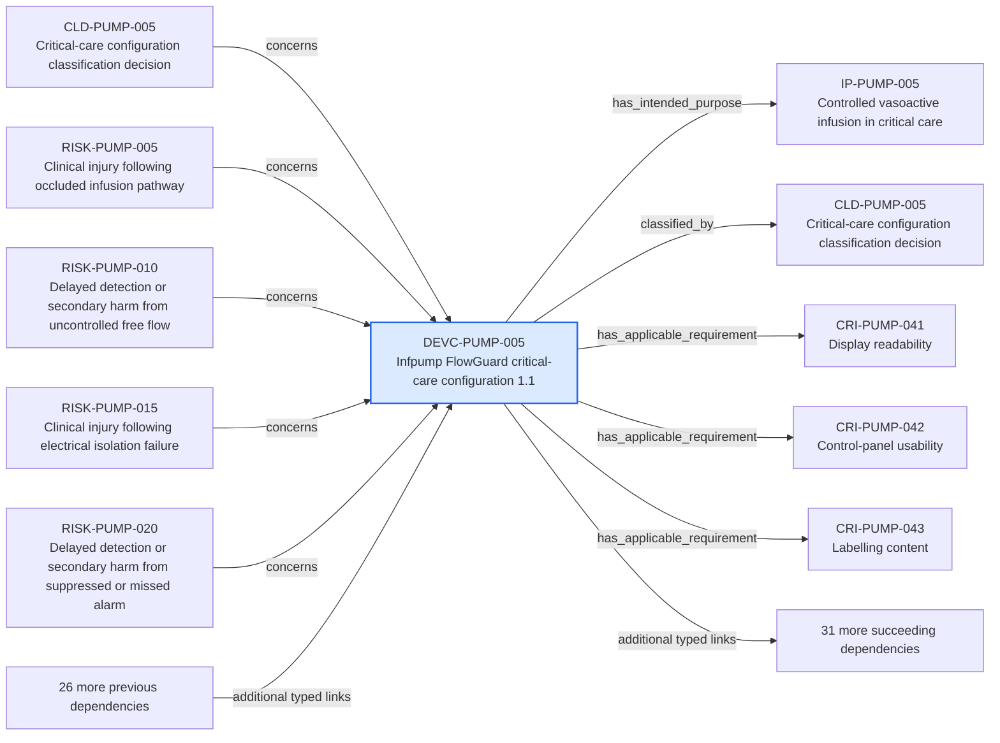

---
{
  "id": "DEVC-PUMP-005",
  "type": "device-configuration",
  "title": "Infpump FlowGuard critical-care configuration 1.1",
  "aliases": [
    "DEVC-PUMP-005",
    "DEVC-PUMP-005-infpump-flowguard-critical-care-configuration-11",
    "18-ontology-notes/device-configuration/DEVC-PUMP-005-infpump-flowguard-critical-care-configuration-11",
    "03-Ontology notes/device-configuration/DEVC-PUMP-005-infpump-flowguard-critical-care-configuration-11"
  ],
  "status": "approved",
  "version": "1",
  "created": "2026-08-15",
  "modified": "2026-08-15",
  "tags": [
    "ontology-note/device-configuration",
    "device/infpump-flowguard"
  ],
  "draft": false,
  "note_origin": "human-reviewed synthetic example",
  "technical_file": "TF-01 Device Description/Device Configuration Index.xlsx",
  "technical_file_identifier": "DEVC-PUMP-005",
  "valid_from": "2026-08-15",
  "review_status": "approved",
  "device_context": "[[06-Infpump FlowGuard ontology notes/device-configuration/DEVC-PUMP-005-infpump-flowguard-critical-care-configuration-11|DEVC-PUMP-005]]",
  "lifecycle_state": "design-verification",
  "market_status": "not-marketed",
  "market_release_candidate": false,
  "risk_class": "IIb",
  "manufactured_by": [
    "[[01-Ontology instances/02-organisations/manufacturers/ORG-MFR-0001-example-medical-oy|ORG-MFR-0001]]"
  ],
  "has_intended_purpose": [
    "[[06-Infpump FlowGuard ontology notes/intended-purpose/IP-PUMP-005-controlled-vasoactive-infusion-in-critical-care|IP-PUMP-005]]"
  ],
  "classified_by": [
    "[[06-Infpump FlowGuard ontology notes/classification-decision/CLD-PUMP-005-critical-care-configuration-classification-decision|CLD-PUMP-005]]"
  ],
  "has_applicable_requirement": [
    "[[06-Infpump FlowGuard ontology notes/compliance-requirement-instance/CRI-PUMP-041-display-readability|CRI-PUMP-041]]",
    "[[06-Infpump FlowGuard ontology notes/compliance-requirement-instance/CRI-PUMP-042-control-panel-usability|CRI-PUMP-042]]",
    "[[06-Infpump FlowGuard ontology notes/compliance-requirement-instance/CRI-PUMP-043-labelling-content|CRI-PUMP-043]]",
    "[[06-Infpump FlowGuard ontology notes/compliance-requirement-instance/CRI-PUMP-044-instructions-for-use-completeness|CRI-PUMP-044]]",
    "[[06-Infpump FlowGuard ontology notes/compliance-requirement-instance/CRI-PUMP-045-udi-traceability|CRI-PUMP-045]]",
    "[[06-Infpump FlowGuard ontology notes/compliance-requirement-instance/CRI-PUMP-046-clinical-evaluation-support|CRI-PUMP-046]]",
    "[[06-Infpump FlowGuard ontology notes/compliance-requirement-instance/CRI-PUMP-047-pms-planning|CRI-PUMP-047]]",
    "[[06-Infpump FlowGuard ontology notes/compliance-requirement-instance/CRI-PUMP-048-vigilance-readiness|CRI-PUMP-048]]",
    "[[06-Infpump FlowGuard ontology notes/compliance-requirement-instance/CRI-PUMP-049-production-release-controls|CRI-PUMP-049]]",
    "[[06-Infpump FlowGuard ontology notes/compliance-requirement-instance/CRI-PUMP-050-configuration-and-change-control|CRI-PUMP-050]]"
  ],
  "has_hazard": [
    "[[06-Infpump FlowGuard ontology notes/hazard/HAZ-PUMP-017-excessive-enclosure-temperature|HAZ-PUMP-017]]",
    "[[06-Infpump FlowGuard ontology notes/hazard/HAZ-PUMP-018-loss-of-records-or-clock-drift|HAZ-PUMP-018]]",
    "[[06-Infpump FlowGuard ontology notes/hazard/HAZ-PUMP-019-microbial-contamination|HAZ-PUMP-019]]",
    "[[06-Infpump FlowGuard ontology notes/hazard/HAZ-PUMP-020-use-error-during-setup|HAZ-PUMP-020]]"
  ],
  "has_risk": [
    "[[06-Infpump FlowGuard ontology notes/risk/RISK-PUMP-033-clinical-injury-following-excessive-enclosure-temperature|RISK-PUMP-033]]",
    "[[06-Infpump FlowGuard ontology notes/risk/RISK-PUMP-034-delayed-detection-or-secondary-harm-from-excessive-enclosure-temperature|RISK-PUMP-034]]",
    "[[06-Infpump FlowGuard ontology notes/risk/RISK-PUMP-035-clinical-injury-following-loss-of-records-or-clock-drift|RISK-PUMP-035]]",
    "[[06-Infpump FlowGuard ontology notes/risk/RISK-PUMP-036-delayed-detection-or-secondary-harm-from-loss-of-records-or-clock-drift|RISK-PUMP-036]]",
    "[[06-Infpump FlowGuard ontology notes/risk/RISK-PUMP-037-clinical-injury-following-microbial-contamination|RISK-PUMP-037]]",
    "[[06-Infpump FlowGuard ontology notes/risk/RISK-PUMP-038-delayed-detection-or-secondary-harm-from-microbial-contamination|RISK-PUMP-038]]",
    "[[06-Infpump FlowGuard ontology notes/risk/RISK-PUMP-039-clinical-injury-following-use-error-during-setup|RISK-PUMP-039]]",
    "[[06-Infpump FlowGuard ontology notes/risk/RISK-PUMP-040-delayed-detection-or-secondary-harm-from-use-error-during-setup|RISK-PUMP-040]]"
  ],
  "includes_component": [
    "[[06-Infpump FlowGuard ontology notes/component/COMP-PUMP-009-pole-clamp-assembly|COMP-PUMP-009]]",
    "[[06-Infpump FlowGuard ontology notes/component/COMP-PUMP-010-pump-door-and-anti-free-flow-mechanism|COMP-PUMP-010]]"
  ],
  "makes_clinical_claim": [
    "[[06-Infpump FlowGuard ontology notes/clinical-claim/CLM-PUMP-017-supports-cleaning-between-patient-uses|CLM-PUMP-017]]",
    "[[06-Infpump FlowGuard ontology notes/clinical-claim/CLM-PUMP-018-maintains-performance-near-specified-electromagnetic-sources|CLM-PUMP-018]]",
    "[[06-Infpump FlowGuard ontology notes/clinical-claim/CLM-PUMP-019-supports-secure-networked-configuration|CLM-PUMP-019]]",
    "[[06-Infpump FlowGuard ontology notes/clinical-claim/CLM-PUMP-020-provides-clinically-interpretable-event-chronology|CLM-PUMP-020]]"
  ],
  "has_certificate": [
    "[[06-Infpump FlowGuard ontology notes/certificate/CERT-PUMP-002-eu-mdr-technical-documentation-assessment-certificate|CERT-PUMP-002]]"
  ],
  "has_baseline": [
    "[[06-Infpump FlowGuard ontology notes/configuration-baseline/BASE-PUMP-001-infpump-flowguard-released-design-baseline-11|BASE-PUMP-001]]"
  ],
  "includes_software_version": [
    "[[06-Infpump FlowGuard ontology notes/software-version/SW-PUMP-001-infpump-flowguard-control-software-420|SW-PUMP-001]]"
  ],
  "has_clinical_evaluation": [
    "[[06-Infpump FlowGuard ontology notes/clinical-evaluation/CE-PUMP-001-infpump-flowguard-continuous-clinical-evaluation|CE-PUMP-001]]"
  ],
  "has_technical_documentation": [
    "[[06-Infpump FlowGuard ontology notes/technical-documentation-set/TD-PUMP-001-infpump-flowguard-mdr-technical-documentation-set|TD-PUMP-001]]"
  ],
  "covered_by_pms_plan": [
    "[[06-Infpump FlowGuard ontology notes/pms-plan/PMS-PLAN-PUMP-001-infpump-flowguard-post-market-surveillance-plan|PMS-PLAN-PUMP-001]]"
  ],
  "source_provisions": [
    "[[02-Sources/standards/SRC-EMDN-european-medical-devices-nomenclature|SRC-EMDN]]",
    "[[02-Sources/standards/SRC-EUDAMED-european-commission-eudamed-overview|SRC-EUDAMED]]",
    "[[02-Sources/standards/SRC-UDI-european-commission-udi-overview|SRC-UDI]]",
    "[[02-Sources/standards/SRC-HARMONISED-STANDARDS-european-commission-harmonised-standards|SRC-HARMONISED-STANDARDS]]"
  ]
}
---

# Infpump FlowGuard critical-care configuration 1.1

## Semantic role

Defines one exact regulated product configuration so that requirements, evidence and decisions are not applied to an ambiguous device revision.

## Note

Human-readable rendering of this note's YAML/JSON frontmatter:

- **id:** `DEVC-PUMP-005`
- **type:** `device-configuration`
- **title:** `Infpump FlowGuard critical-care configuration 1.1`
- **aliases:** `DEVC-PUMP-005`, `DEVC-PUMP-005-infpump-flowguard-critical-care-configuration-11`, `18-ontology-notes/device-configuration/DEVC-PUMP-005-infpump-flowguard-critical-care-configuration-11`, `03-Ontology notes/device-configuration/DEVC-PUMP-005-infpump-flowguard-critical-care-configuration-11`
- **status:** `approved`
- **version:** `1`
- **created:** `2026-08-15`
- **modified:** `2026-08-15`
- **tags:** `ontology-note/device-configuration`, `device/infpump-flowguard`
- **draft:** `false`
- **note_origin:** `human-reviewed synthetic example`
- **technical_file:** `TF-01 Device Description/Device Configuration Index.xlsx`
- **technical_file_identifier:** `DEVC-PUMP-005`
- **valid_from:** `2026-08-15`
- **review_status:** `approved`
- **device_context:** [[06-Infpump FlowGuard ontology notes/device-configuration/DEVC-PUMP-005-infpump-flowguard-critical-care-configuration-11|DEVC-PUMP-005]]
- **lifecycle_state:** `design-verification`
- **market_status:** `not-marketed`
- **market_release_candidate:** `false`
- **risk_class:** `IIb`
- **manufactured_by:** [[01-Ontology instances/02-organisations/manufacturers/ORG-MFR-0001-example-medical-oy|ORG-MFR-0001]]
- **has_intended_purpose:** [[06-Infpump FlowGuard ontology notes/intended-purpose/IP-PUMP-005-controlled-vasoactive-infusion-in-critical-care|IP-PUMP-005]]
- **classified_by:** [[06-Infpump FlowGuard ontology notes/classification-decision/CLD-PUMP-005-critical-care-configuration-classification-decision|CLD-PUMP-005]]
- **has_applicable_requirement:** [[06-Infpump FlowGuard ontology notes/compliance-requirement-instance/CRI-PUMP-041-display-readability|CRI-PUMP-041]], [[06-Infpump FlowGuard ontology notes/compliance-requirement-instance/CRI-PUMP-042-control-panel-usability|CRI-PUMP-042]], [[06-Infpump FlowGuard ontology notes/compliance-requirement-instance/CRI-PUMP-043-labelling-content|CRI-PUMP-043]], [[06-Infpump FlowGuard ontology notes/compliance-requirement-instance/CRI-PUMP-044-instructions-for-use-completeness|CRI-PUMP-044]], [[06-Infpump FlowGuard ontology notes/compliance-requirement-instance/CRI-PUMP-045-udi-traceability|CRI-PUMP-045]], [[06-Infpump FlowGuard ontology notes/compliance-requirement-instance/CRI-PUMP-046-clinical-evaluation-support|CRI-PUMP-046]], [[06-Infpump FlowGuard ontology notes/compliance-requirement-instance/CRI-PUMP-047-pms-planning|CRI-PUMP-047]], [[06-Infpump FlowGuard ontology notes/compliance-requirement-instance/CRI-PUMP-048-vigilance-readiness|CRI-PUMP-048]], [[06-Infpump FlowGuard ontology notes/compliance-requirement-instance/CRI-PUMP-049-production-release-controls|CRI-PUMP-049]], [[06-Infpump FlowGuard ontology notes/compliance-requirement-instance/CRI-PUMP-050-configuration-and-change-control|CRI-PUMP-050]]
- **has_hazard:** [[06-Infpump FlowGuard ontology notes/hazard/HAZ-PUMP-017-excessive-enclosure-temperature|HAZ-PUMP-017]], [[06-Infpump FlowGuard ontology notes/hazard/HAZ-PUMP-018-loss-of-records-or-clock-drift|HAZ-PUMP-018]], [[06-Infpump FlowGuard ontology notes/hazard/HAZ-PUMP-019-microbial-contamination|HAZ-PUMP-019]], [[06-Infpump FlowGuard ontology notes/hazard/HAZ-PUMP-020-use-error-during-setup|HAZ-PUMP-020]]
- **has_risk:** [[06-Infpump FlowGuard ontology notes/risk/RISK-PUMP-033-clinical-injury-following-excessive-enclosure-temperature|RISK-PUMP-033]], [[06-Infpump FlowGuard ontology notes/risk/RISK-PUMP-034-delayed-detection-or-secondary-harm-from-excessive-enclosure-temperature|RISK-PUMP-034]], [[06-Infpump FlowGuard ontology notes/risk/RISK-PUMP-035-clinical-injury-following-loss-of-records-or-clock-drift|RISK-PUMP-035]], [[06-Infpump FlowGuard ontology notes/risk/RISK-PUMP-036-delayed-detection-or-secondary-harm-from-loss-of-records-or-clock-drift|RISK-PUMP-036]], [[06-Infpump FlowGuard ontology notes/risk/RISK-PUMP-037-clinical-injury-following-microbial-contamination|RISK-PUMP-037]], [[06-Infpump FlowGuard ontology notes/risk/RISK-PUMP-038-delayed-detection-or-secondary-harm-from-microbial-contamination|RISK-PUMP-038]], [[06-Infpump FlowGuard ontology notes/risk/RISK-PUMP-039-clinical-injury-following-use-error-during-setup|RISK-PUMP-039]], [[06-Infpump FlowGuard ontology notes/risk/RISK-PUMP-040-delayed-detection-or-secondary-harm-from-use-error-during-setup|RISK-PUMP-040]]
- **includes_component:** [[06-Infpump FlowGuard ontology notes/component/COMP-PUMP-009-pole-clamp-assembly|COMP-PUMP-009]], [[06-Infpump FlowGuard ontology notes/component/COMP-PUMP-010-pump-door-and-anti-free-flow-mechanism|COMP-PUMP-010]]
- **makes_clinical_claim:** [[06-Infpump FlowGuard ontology notes/clinical-claim/CLM-PUMP-017-supports-cleaning-between-patient-uses|CLM-PUMP-017]], [[06-Infpump FlowGuard ontology notes/clinical-claim/CLM-PUMP-018-maintains-performance-near-specified-electromagnetic-sources|CLM-PUMP-018]], [[06-Infpump FlowGuard ontology notes/clinical-claim/CLM-PUMP-019-supports-secure-networked-configuration|CLM-PUMP-019]], [[06-Infpump FlowGuard ontology notes/clinical-claim/CLM-PUMP-020-provides-clinically-interpretable-event-chronology|CLM-PUMP-020]]
- **has_certificate:** [[06-Infpump FlowGuard ontology notes/certificate/CERT-PUMP-002-eu-mdr-technical-documentation-assessment-certificate|CERT-PUMP-002]]
- **has_baseline:** [[06-Infpump FlowGuard ontology notes/configuration-baseline/BASE-PUMP-001-infpump-flowguard-released-design-baseline-11|BASE-PUMP-001]]
- **includes_software_version:** [[06-Infpump FlowGuard ontology notes/software-version/SW-PUMP-001-infpump-flowguard-control-software-420|SW-PUMP-001]]
- **has_clinical_evaluation:** [[06-Infpump FlowGuard ontology notes/clinical-evaluation/CE-PUMP-001-infpump-flowguard-continuous-clinical-evaluation|CE-PUMP-001]]
- **has_technical_documentation:** [[06-Infpump FlowGuard ontology notes/technical-documentation-set/TD-PUMP-001-infpump-flowguard-mdr-technical-documentation-set|TD-PUMP-001]]
- **covered_by_pms_plan:** [[06-Infpump FlowGuard ontology notes/pms-plan/PMS-PLAN-PUMP-001-infpump-flowguard-post-market-surveillance-plan|PMS-PLAN-PUMP-001]]
- **source_provisions:** [[02-Sources/standards/SRC-EMDN-european-medical-devices-nomenclature|SRC-EMDN]], [[02-Sources/standards/SRC-EUDAMED-european-commission-eudamed-overview|SRC-EUDAMED]], [[02-Sources/standards/SRC-UDI-european-commission-udi-overview|SRC-UDI]], [[02-Sources/standards/SRC-HARMONISED-STANDARDS-european-commission-harmonised-standards|SRC-HARMONISED-STANDARDS]]

## Traceability

Previous dependencies are ontology notes that lead into this record. They reach it through `concerns` from [[06-Infpump FlowGuard ontology notes/classification-decision/CLD-PUMP-005-critical-care-configuration-classification-decision|CLD-PUMP-005 — Critical-care configuration classification decision]], [[06-Infpump FlowGuard ontology notes/risk/RISK-PUMP-005-clinical-injury-following-occluded-infusion-pathway|RISK-PUMP-005 — Clinical injury following occluded infusion pathway]], [[06-Infpump FlowGuard ontology notes/risk/RISK-PUMP-010-delayed-detection-or-secondary-harm-from-uncontrolled-free-flow|RISK-PUMP-010 — Delayed detection or secondary harm from uncontrolled free flow]] and 10 more linked notes; `claim_scope` from [[06-Infpump FlowGuard ontology notes/clinical-claim/CLM-PUMP-005-detects-downstream-occlusion-before-prolonged-therapy-interruption|CLM-PUMP-005 — Detects downstream occlusion before prolonged therapy interruption]], [[06-Infpump FlowGuard ontology notes/clinical-claim/CLM-PUMP-010-supports-oncology-infusion-protocols|CLM-PUMP-010 — Supports oncology infusion protocols]], [[06-Infpump FlowGuard ontology notes/clinical-claim/CLM-PUMP-015-supports-trained-healthcare-professional-operation|CLM-PUMP-015 — Supports trained healthcare-professional operation]] and 1 more linked note; `applies_to_configuration` from [[06-Infpump FlowGuard ontology notes/verification-evidence/EVD-PUMP-005-free-flow-protection-verification-report|EVD-PUMP-005 — Free-flow protection verification report]], [[06-Infpump FlowGuard ontology notes/verification-evidence/EVD-PUMP-010-software-system-test-report|EVD-PUMP-010 — Software system test report]], [[06-Infpump FlowGuard ontology notes/verification-evidence/EVD-PUMP-015-human-factors-validation-report|EVD-PUMP-015 — Human factors validation report]] and 9 more linked notes; `has_configuration` from [[06-Infpump FlowGuard ontology notes/device-variant/DEVV-PUMP-001-infpump-flowguard-fg-100-eu-professional-use-variant|DEVV-PUMP-001 — Infpump FlowGuard FG-100 EU professional-use variant]]; `evaluates` from [[06-Infpump FlowGuard ontology notes/clinical-evaluation/CE-PUMP-001-infpump-flowguard-continuous-clinical-evaluation|CE-PUMP-001 — Infpump FlowGuard continuous clinical evaluation]]. These incoming links show which product, decision, process or evidence records depend on the current note.

Succeeding dependencies are ontology notes to which this record leads. The trace continues through `has_intended_purpose` to [[06-Infpump FlowGuard ontology notes/intended-purpose/IP-PUMP-005-controlled-vasoactive-infusion-in-critical-care|IP-PUMP-005 — Controlled vasoactive infusion in critical care]]; `classified_by` to [[06-Infpump FlowGuard ontology notes/classification-decision/CLD-PUMP-005-critical-care-configuration-classification-decision|CLD-PUMP-005 — Critical-care configuration classification decision]]; `has_applicable_requirement` to [[06-Infpump FlowGuard ontology notes/compliance-requirement-instance/CRI-PUMP-041-display-readability|CRI-PUMP-041 — Display readability]], [[06-Infpump FlowGuard ontology notes/compliance-requirement-instance/CRI-PUMP-042-control-panel-usability|CRI-PUMP-042 — Control-panel usability]], [[06-Infpump FlowGuard ontology notes/compliance-requirement-instance/CRI-PUMP-043-labelling-content|CRI-PUMP-043 — Labelling content]] and 7 more linked notes; `has_hazard` to [[06-Infpump FlowGuard ontology notes/hazard/HAZ-PUMP-017-excessive-enclosure-temperature|HAZ-PUMP-017 — Excessive enclosure temperature]], [[06-Infpump FlowGuard ontology notes/hazard/HAZ-PUMP-018-loss-of-records-or-clock-drift|HAZ-PUMP-018 — Loss of records or clock drift]], [[06-Infpump FlowGuard ontology notes/hazard/HAZ-PUMP-019-microbial-contamination|HAZ-PUMP-019 — Microbial contamination]] and 1 more linked note; `has_risk` to [[06-Infpump FlowGuard ontology notes/risk/RISK-PUMP-033-clinical-injury-following-excessive-enclosure-temperature|RISK-PUMP-033 — Clinical injury following excessive enclosure temperature]], [[06-Infpump FlowGuard ontology notes/risk/RISK-PUMP-034-delayed-detection-or-secondary-harm-from-excessive-enclosure-temperature|RISK-PUMP-034 — Delayed detection or secondary harm from excessive enclosure temperature]], [[06-Infpump FlowGuard ontology notes/risk/RISK-PUMP-035-clinical-injury-following-loss-of-records-or-clock-drift|RISK-PUMP-035 — Clinical injury following loss of records or clock drift]] and 5 more linked notes; `includes_component` to [[06-Infpump FlowGuard ontology notes/component/COMP-PUMP-009-pole-clamp-assembly|COMP-PUMP-009 — Pole-clamp assembly]], [[06-Infpump FlowGuard ontology notes/component/COMP-PUMP-010-pump-door-and-anti-free-flow-mechanism|COMP-PUMP-010 — Pump-door and anti-free-flow mechanism]]; `makes_clinical_claim` to [[06-Infpump FlowGuard ontology notes/clinical-claim/CLM-PUMP-017-supports-cleaning-between-patient-uses|CLM-PUMP-017 — Supports cleaning between patient uses]], [[06-Infpump FlowGuard ontology notes/clinical-claim/CLM-PUMP-018-maintains-performance-near-specified-electromagnetic-sources|CLM-PUMP-018 — Maintains performance near specified electromagnetic sources]], [[06-Infpump FlowGuard ontology notes/clinical-claim/CLM-PUMP-019-supports-secure-networked-configuration|CLM-PUMP-019 — Supports secure networked configuration]] and 1 more linked note; `has_certificate` to [[06-Infpump FlowGuard ontology notes/certificate/CERT-PUMP-002-eu-mdr-technical-documentation-assessment-certificate|CERT-PUMP-002 — EU MDR technical-documentation assessment certificate]]; `has_baseline` to [[06-Infpump FlowGuard ontology notes/configuration-baseline/BASE-PUMP-001-infpump-flowguard-released-design-baseline-11|BASE-PUMP-001 — Infpump FlowGuard released design baseline 1.1]]; `includes_software_version` to [[06-Infpump FlowGuard ontology notes/software-version/SW-PUMP-001-infpump-flowguard-control-software-420|SW-PUMP-001 — Infpump FlowGuard control software 4.2.0]]; `has_clinical_evaluation` to [[06-Infpump FlowGuard ontology notes/clinical-evaluation/CE-PUMP-001-infpump-flowguard-continuous-clinical-evaluation|CE-PUMP-001 — Infpump FlowGuard continuous clinical evaluation]]; `has_technical_documentation` to [[06-Infpump FlowGuard ontology notes/technical-documentation-set/TD-PUMP-001-infpump-flowguard-mdr-technical-documentation-set|TD-PUMP-001 — Infpump FlowGuard MDR technical documentation set]]; `covered_by_pms_plan` to [[06-Infpump FlowGuard ontology notes/pms-plan/PMS-PLAN-PUMP-001-infpump-flowguard-post-market-surveillance-plan|PMS-PLAN-PUMP-001 — Infpump FlowGuard post-market surveillance plan]]. These outgoing links identify the next product, risk, control, evidence, change or lifecycle records used by downstream reasoning.

The left-to-right diagram shows up to five asserted previous and five asserted succeeding ontology-note dependencies. When more links exist, the additional-dependency node states how many remain available through the verbal links and structured metadata above.

