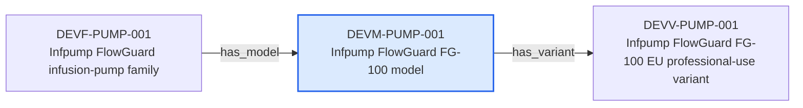

---
{
  "id": "DEVM-PUMP-001",
  "type": "device-model",
  "title": "Infpump FlowGuard FG-100 model",
  "aliases": [
    "DEVM-PUMP-001",
    "DEVM-PUMP-001-infpump-flowguard-fg-100-model",
    "18-ontology-notes/device-model/DEVM-PUMP-001-infpump-flowguard-fg-100-model",
    "03-Ontology notes/device-model/DEVM-PUMP-001-infpump-flowguard-fg-100-model"
  ],
  "status": "approved",
  "version": "1",
  "created": "2026-08-15",
  "modified": "2026-08-15",
  "tags": [
    "ontology-note/device-model",
    "device/infpump-flowguard"
  ],
  "draft": false,
  "note_origin": "human-reviewed synthetic example",
  "technical_file": "TF-01 Device Description/Product Hierarchy.xlsx",
  "technical_file_identifier": "DEVM-PUMP-001",
  "valid_from": "2026-08-15",
  "review_status": "approved",
  "device_context": "[[06-Infpump FlowGuard ontology notes/device-configuration/DEVC-PUMP-001-infpump-flowguard-bedside-configuration-10|DEVC-PUMP-001]]",
  "has_variant": [
    "[[06-Infpump FlowGuard ontology notes/device-variant/DEVV-PUMP-001-infpump-flowguard-fg-100-eu-professional-use-variant|DEVV-PUMP-001]]"
  ],
  "source_provisions": [
    "[[02-Sources/standards/SRC-UDI-european-commission-udi-overview|SRC-UDI]]",
    "[[02-Sources/standards/SRC-EUDAMED-european-commission-eudamed-overview|SRC-EUDAMED]]"
  ]
}
---

# Infpump FlowGuard FG-100 model

## Semantic role

Represents the controlled commercial and design model that groups related variants of the Infpump FlowGuard device.

## Note

Human-readable rendering of this note's YAML/JSON frontmatter:

- **id:** `DEVM-PUMP-001`
- **type:** `device-model`
- **title:** `Infpump FlowGuard FG-100 model`
- **aliases:** `DEVM-PUMP-001`, `DEVM-PUMP-001-infpump-flowguard-fg-100-model`, `18-ontology-notes/device-model/DEVM-PUMP-001-infpump-flowguard-fg-100-model`, `03-Ontology notes/device-model/DEVM-PUMP-001-infpump-flowguard-fg-100-model`
- **status:** `approved`
- **version:** `1`
- **created:** `2026-08-15`
- **modified:** `2026-08-15`
- **tags:** `ontology-note/device-model`, `device/infpump-flowguard`
- **draft:** `false`
- **note_origin:** `human-reviewed synthetic example`
- **technical_file:** `TF-01 Device Description/Product Hierarchy.xlsx`
- **technical_file_identifier:** `DEVM-PUMP-001`
- **valid_from:** `2026-08-15`
- **review_status:** `approved`
- **device_context:** [[06-Infpump FlowGuard ontology notes/device-configuration/DEVC-PUMP-001-infpump-flowguard-bedside-configuration-10|DEVC-PUMP-001]]
- **has_variant:** [[06-Infpump FlowGuard ontology notes/device-variant/DEVV-PUMP-001-infpump-flowguard-fg-100-eu-professional-use-variant|DEVV-PUMP-001]]
- **source_provisions:** [[02-Sources/standards/SRC-UDI-european-commission-udi-overview|SRC-UDI]], [[02-Sources/standards/SRC-EUDAMED-european-commission-eudamed-overview|SRC-EUDAMED]]

## Traceability

Previous dependencies are ontology notes that lead into this record. They reach it through `has_model` from [[06-Infpump FlowGuard ontology notes/device-family/DEVF-PUMP-001-infpump-flowguard-infusion-pump-family|DEVF-PUMP-001 — Infpump FlowGuard infusion-pump family]]. These incoming links show which product, decision, process or evidence records depend on the current note.

Succeeding dependencies are ontology notes to which this record leads. The trace continues through `has_variant` to [[06-Infpump FlowGuard ontology notes/device-variant/DEVV-PUMP-001-infpump-flowguard-fg-100-eu-professional-use-variant|DEVV-PUMP-001 — Infpump FlowGuard FG-100 EU professional-use variant]]. These outgoing links identify the next product, risk, control, evidence, change or lifecycle records used by downstream reasoning.

The left-to-right diagram shows up to five asserted previous and five asserted succeeding ontology-note dependencies. When more links exist, the additional-dependency node states how many remain available through the verbal links and structured metadata above.

