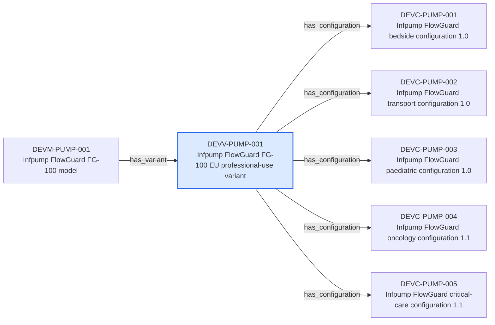

---
{
  "id": "DEVV-PUMP-001",
  "type": "device-variant",
  "title": "Infpump FlowGuard FG-100 EU professional-use variant",
  "aliases": [
    "DEVV-PUMP-001",
    "DEVV-PUMP-001-infpump-flowguard-fg-100-eu-professional-use-variant",
    "18-ontology-notes/device-variant/DEVV-PUMP-001-infpump-flowguard-fg-100-eu-professional-use-variant",
    "03-Ontology notes/device-variant/DEVV-PUMP-001-infpump-flowguard-fg-100-eu-professional-use-variant"
  ],
  "status": "approved",
  "version": "1",
  "created": "2026-08-15",
  "modified": "2026-08-15",
  "tags": [
    "ontology-note/device-variant",
    "device/infpump-flowguard"
  ],
  "draft": false,
  "note_origin": "human-reviewed synthetic example",
  "technical_file": "TF-01 Device Description/Product Hierarchy.xlsx",
  "technical_file_identifier": "DEVV-PUMP-001",
  "valid_from": "2026-08-15",
  "review_status": "approved",
  "device_context": "[[06-Infpump FlowGuard ontology notes/device-configuration/DEVC-PUMP-001-infpump-flowguard-bedside-configuration-10|DEVC-PUMP-001]]",
  "has_configuration": [
    "[[06-Infpump FlowGuard ontology notes/device-configuration/DEVC-PUMP-001-infpump-flowguard-bedside-configuration-10|DEVC-PUMP-001]]",
    "[[06-Infpump FlowGuard ontology notes/device-configuration/DEVC-PUMP-002-infpump-flowguard-transport-configuration-10|DEVC-PUMP-002]]",
    "[[06-Infpump FlowGuard ontology notes/device-configuration/DEVC-PUMP-003-infpump-flowguard-paediatric-configuration-10|DEVC-PUMP-003]]",
    "[[06-Infpump FlowGuard ontology notes/device-configuration/DEVC-PUMP-004-infpump-flowguard-oncology-configuration-11|DEVC-PUMP-004]]",
    "[[06-Infpump FlowGuard ontology notes/device-configuration/DEVC-PUMP-005-infpump-flowguard-critical-care-configuration-11|DEVC-PUMP-005]]"
  ],
  "source_provisions": [
    "[[02-Sources/standards/SRC-UDI-european-commission-udi-overview|SRC-UDI]]"
  ]
}
---

# Infpump FlowGuard FG-100 EU professional-use variant

## Semantic role

Represents the distinguishable EU professional-use variant and links it to the exact regulated configurations assessed for compliance.

## Note

Human-readable rendering of this note's YAML/JSON frontmatter:

- **id:** `DEVV-PUMP-001`
- **type:** `device-variant`
- **title:** `Infpump FlowGuard FG-100 EU professional-use variant`
- **aliases:** `DEVV-PUMP-001`, `DEVV-PUMP-001-infpump-flowguard-fg-100-eu-professional-use-variant`, `18-ontology-notes/device-variant/DEVV-PUMP-001-infpump-flowguard-fg-100-eu-professional-use-variant`, `03-Ontology notes/device-variant/DEVV-PUMP-001-infpump-flowguard-fg-100-eu-professional-use-variant`
- **status:** `approved`
- **version:** `1`
- **created:** `2026-08-15`
- **modified:** `2026-08-15`
- **tags:** `ontology-note/device-variant`, `device/infpump-flowguard`
- **draft:** `false`
- **note_origin:** `human-reviewed synthetic example`
- **technical_file:** `TF-01 Device Description/Product Hierarchy.xlsx`
- **technical_file_identifier:** `DEVV-PUMP-001`
- **valid_from:** `2026-08-15`
- **review_status:** `approved`
- **device_context:** [[06-Infpump FlowGuard ontology notes/device-configuration/DEVC-PUMP-001-infpump-flowguard-bedside-configuration-10|DEVC-PUMP-001]]
- **has_configuration:** [[06-Infpump FlowGuard ontology notes/device-configuration/DEVC-PUMP-001-infpump-flowguard-bedside-configuration-10|DEVC-PUMP-001]], [[06-Infpump FlowGuard ontology notes/device-configuration/DEVC-PUMP-002-infpump-flowguard-transport-configuration-10|DEVC-PUMP-002]], [[06-Infpump FlowGuard ontology notes/device-configuration/DEVC-PUMP-003-infpump-flowguard-paediatric-configuration-10|DEVC-PUMP-003]], [[06-Infpump FlowGuard ontology notes/device-configuration/DEVC-PUMP-004-infpump-flowguard-oncology-configuration-11|DEVC-PUMP-004]], [[06-Infpump FlowGuard ontology notes/device-configuration/DEVC-PUMP-005-infpump-flowguard-critical-care-configuration-11|DEVC-PUMP-005]]
- **source_provisions:** [[02-Sources/standards/SRC-UDI-european-commission-udi-overview|SRC-UDI]]

## Traceability

Previous dependencies are ontology notes that lead into this record. They reach it through `has_variant` from [[06-Infpump FlowGuard ontology notes/device-model/DEVM-PUMP-001-infpump-flowguard-fg-100-model|DEVM-PUMP-001 — Infpump FlowGuard FG-100 model]]. These incoming links show which product, decision, process or evidence records depend on the current note.

Succeeding dependencies are ontology notes to which this record leads. The trace continues through `has_configuration` to [[06-Infpump FlowGuard ontology notes/device-configuration/DEVC-PUMP-001-infpump-flowguard-bedside-configuration-10|DEVC-PUMP-001 — Infpump FlowGuard bedside configuration 1.0]], [[06-Infpump FlowGuard ontology notes/device-configuration/DEVC-PUMP-002-infpump-flowguard-transport-configuration-10|DEVC-PUMP-002 — Infpump FlowGuard transport configuration 1.0]], [[06-Infpump FlowGuard ontology notes/device-configuration/DEVC-PUMP-003-infpump-flowguard-paediatric-configuration-10|DEVC-PUMP-003 — Infpump FlowGuard paediatric configuration 1.0]] and 2 more linked notes. These outgoing links identify the next product, risk, control, evidence, change or lifecycle records used by downstream reasoning.

The left-to-right diagram shows up to five asserted previous and five asserted succeeding ontology-note dependencies. When more links exist, the additional-dependency node states how many remain available through the verbal links and structured metadata above.

