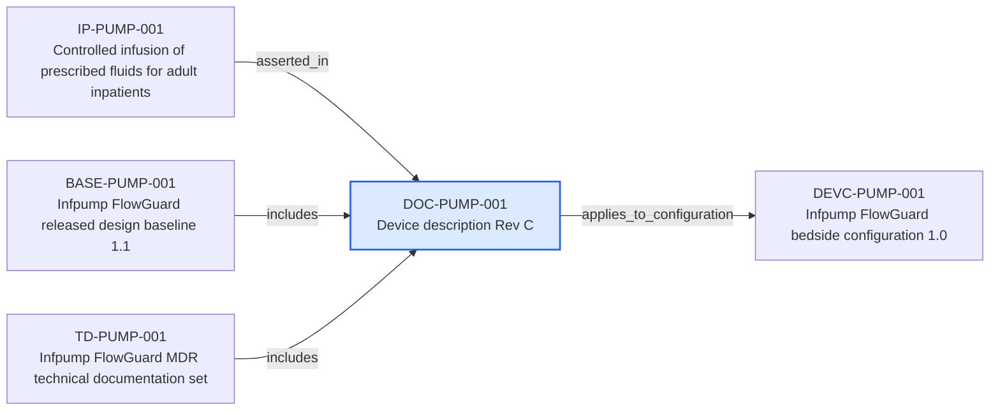

---
{
  "id": "DOC-PUMP-001",
  "type": "document-version",
  "title": "Device description Rev C",
  "aliases": [
    "DOC-PUMP-001",
    "DOC-PUMP-001-device-description-rev-c",
    "18-ontology-notes/document-version/DOC-PUMP-001-device-description-rev-c",
    "03-Ontology notes/document-version/DOC-PUMP-001-device-description-rev-c"
  ],
  "status": "approved",
  "version": "1",
  "created": "2026-08-15",
  "modified": "2026-08-15",
  "tags": [
    "ontology-note/document-version",
    "device/infpump-flowguard"
  ],
  "draft": false,
  "note_origin": "human-reviewed synthetic example",
  "technical_file": "TF-00 Technical Documentation/Document Master List.xlsx",
  "technical_file_identifier": "DOC-PUMP-001",
  "valid_from": "2026-08-15",
  "review_status": "approved",
  "device_context": "[[06-Infpump FlowGuard ontology notes/device-configuration/DEVC-PUMP-001-infpump-flowguard-bedside-configuration-10|DEVC-PUMP-001]]",
  "document_revision": "A",
  "approved_by": [
    "[[01-Ontology instances/02-organisations/roles/ROLE-QUALITY-quality|ROLE-QUALITY]]"
  ],
  "applies_to_configuration": [
    "[[06-Infpump FlowGuard ontology notes/device-configuration/DEVC-PUMP-001-infpump-flowguard-bedside-configuration-10|DEVC-PUMP-001]]"
  ]
}
---

# Device description Rev C

## Semantic role

Represents one controlled technical-file document version separately from the semantic objects recorded in it.

## Note

Human-readable rendering of this note's YAML/JSON frontmatter:

- **id:** `DOC-PUMP-001`
- **type:** `document-version`
- **title:** `Device description Rev C`
- **aliases:** `DOC-PUMP-001`, `DOC-PUMP-001-device-description-rev-c`, `18-ontology-notes/document-version/DOC-PUMP-001-device-description-rev-c`, `03-Ontology notes/document-version/DOC-PUMP-001-device-description-rev-c`
- **status:** `approved`
- **version:** `1`
- **created:** `2026-08-15`
- **modified:** `2026-08-15`
- **tags:** `ontology-note/document-version`, `device/infpump-flowguard`
- **draft:** `false`
- **note_origin:** `human-reviewed synthetic example`
- **technical_file:** `TF-00 Technical Documentation/Document Master List.xlsx`
- **technical_file_identifier:** `DOC-PUMP-001`
- **valid_from:** `2026-08-15`
- **review_status:** `approved`
- **device_context:** [[06-Infpump FlowGuard ontology notes/device-configuration/DEVC-PUMP-001-infpump-flowguard-bedside-configuration-10|DEVC-PUMP-001]]
- **document_revision:** `A`
- **approved_by:** [[01-Ontology instances/02-organisations/roles/ROLE-QUALITY-quality|ROLE-QUALITY]]
- **applies_to_configuration:** [[06-Infpump FlowGuard ontology notes/device-configuration/DEVC-PUMP-001-infpump-flowguard-bedside-configuration-10|DEVC-PUMP-001]]

## Traceability

Previous dependencies are ontology notes that lead into this record. They reach it through `asserted_in` from [[06-Infpump FlowGuard ontology notes/intended-purpose/IP-PUMP-001-controlled-infusion-of-prescribed-fluids-for-adult-inpatients|IP-PUMP-001 — Controlled infusion of prescribed fluids for adult inpatients]]; `includes` from [[06-Infpump FlowGuard ontology notes/configuration-baseline/BASE-PUMP-001-infpump-flowguard-released-design-baseline-11|BASE-PUMP-001 — Infpump FlowGuard released design baseline 1.1]], [[06-Infpump FlowGuard ontology notes/technical-documentation-set/TD-PUMP-001-infpump-flowguard-mdr-technical-documentation-set|TD-PUMP-001 — Infpump FlowGuard MDR technical documentation set]]. These incoming links show which product, decision, process or evidence records depend on the current note.

Succeeding dependencies are ontology notes to which this record leads. The trace continues through `applies_to_configuration` to [[06-Infpump FlowGuard ontology notes/device-configuration/DEVC-PUMP-001-infpump-flowguard-bedside-configuration-10|DEVC-PUMP-001 — Infpump FlowGuard bedside configuration 1.0]]. These outgoing links identify the next product, risk, control, evidence, change or lifecycle records used by downstream reasoning.

The left-to-right diagram shows up to five asserted previous and five asserted succeeding ontology-note dependencies. When more links exist, the additional-dependency node states how many remain available through the verbal links and structured metadata above.

