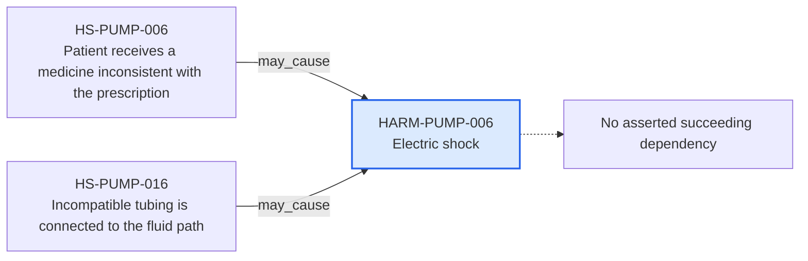

---
{
  "id": "HARM-PUMP-006",
  "type": "harm",
  "title": "Electric shock",
  "aliases": [
    "HARM-PUMP-006",
    "HARM-PUMP-006-electric-shock",
    "18-ontology-notes/harm/HARM-PUMP-006-electric-shock",
    "03-Ontology notes/harm/HARM-PUMP-006-electric-shock"
  ],
  "status": "approved",
  "version": "1",
  "created": "2026-08-15",
  "modified": "2026-08-15",
  "tags": [
    "ontology-note/harm",
    "device/infpump-flowguard"
  ],
  "draft": false,
  "note_origin": "human-reviewed synthetic example",
  "technical_file": "TF-05 Risk Management/Risk Analysis and Risk Matrix.xlsx",
  "technical_file_identifier": "HARM-PUMP-006",
  "valid_from": "2026-08-15",
  "review_status": "approved",
  "device_context": "[[06-Infpump FlowGuard ontology notes/device-configuration/DEVC-PUMP-001-infpump-flowguard-bedside-configuration-10|DEVC-PUMP-001]]"
}
---

# Electric shock

## Semantic role

Defines one clinically or physically meaningful consequence used by the risk analysis and benefit-risk evaluation.

## Note

Human-readable rendering of this note's YAML/JSON frontmatter:

- **id:** `HARM-PUMP-006`
- **type:** `harm`
- **title:** `Electric shock`
- **aliases:** `HARM-PUMP-006`, `HARM-PUMP-006-electric-shock`, `18-ontology-notes/harm/HARM-PUMP-006-electric-shock`, `03-Ontology notes/harm/HARM-PUMP-006-electric-shock`
- **status:** `approved`
- **version:** `1`
- **created:** `2026-08-15`
- **modified:** `2026-08-15`
- **tags:** `ontology-note/harm`, `device/infpump-flowguard`
- **draft:** `false`
- **note_origin:** `human-reviewed synthetic example`
- **technical_file:** `TF-05 Risk Management/Risk Analysis and Risk Matrix.xlsx`
- **technical_file_identifier:** `HARM-PUMP-006`
- **valid_from:** `2026-08-15`
- **review_status:** `approved`
- **device_context:** [[06-Infpump FlowGuard ontology notes/device-configuration/DEVC-PUMP-001-infpump-flowguard-bedside-configuration-10|DEVC-PUMP-001]]

## Traceability

Previous dependencies are ontology notes that lead into this record. They reach it through `may_cause` from [[06-Infpump FlowGuard ontology notes/hazardous-situation/HS-PUMP-006-patient-receives-a-medicine-inconsistent-with-the-prescription|HS-PUMP-006 — Patient receives a medicine inconsistent with the prescription]], [[06-Infpump FlowGuard ontology notes/hazardous-situation/HS-PUMP-016-incompatible-tubing-is-connected-to-the-fluid-path|HS-PUMP-016 — Incompatible tubing is connected to the fluid path]]. These incoming links show which product, decision, process or evidence records depend on the current note.

No succeeding ontology-note dependency is currently asserted for this record. It remains scoped to [[06-Infpump FlowGuard ontology notes/device-configuration/DEVC-PUMP-001-infpump-flowguard-bedside-configuration-10|DEVC-PUMP-001 — Infpump FlowGuard bedside configuration 1.0]], and any future downstream dependency should be added as a typed relationship rather than inferred from prose.

The left-to-right diagram shows up to five asserted previous and five asserted succeeding ontology-note dependencies. When more links exist, the additional-dependency node states how many remain available through the verbal links and structured metadata above.

