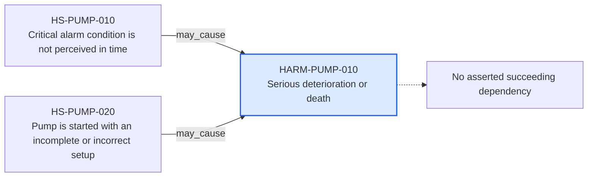

---
{
  "id": "HARM-PUMP-010",
  "type": "harm",
  "title": "Serious deterioration or death",
  "aliases": [
    "HARM-PUMP-010",
    "HARM-PUMP-010-serious-deterioration-or-death",
    "18-ontology-notes/harm/HARM-PUMP-010-serious-deterioration-or-death",
    "03-Ontology notes/harm/HARM-PUMP-010-serious-deterioration-or-death"
  ],
  "status": "approved",
  "version": "1",
  "created": "2026-08-15",
  "modified": "2026-08-15",
  "tags": [
    "ontology-note/harm",
    "device/infpump-flowguard"
  ],
  "draft": false,
  "note_origin": "human-reviewed synthetic example",
  "technical_file": "TF-05 Risk Management/Risk Analysis and Risk Matrix.xlsx",
  "technical_file_identifier": "HARM-PUMP-010",
  "valid_from": "2026-08-15",
  "review_status": "approved",
  "device_context": "[[06-Infpump FlowGuard ontology notes/device-configuration/DEVC-PUMP-005-infpump-flowguard-critical-care-configuration-11|DEVC-PUMP-005]]"
}
---

# Serious deterioration or death

## Semantic role

Defines one clinically or physically meaningful consequence used by the risk analysis and benefit-risk evaluation.

## Note

Human-readable rendering of this note's YAML/JSON frontmatter:

- **id:** `HARM-PUMP-010`
- **type:** `harm`
- **title:** `Serious deterioration or death`
- **aliases:** `HARM-PUMP-010`, `HARM-PUMP-010-serious-deterioration-or-death`, `18-ontology-notes/harm/HARM-PUMP-010-serious-deterioration-or-death`, `03-Ontology notes/harm/HARM-PUMP-010-serious-deterioration-or-death`
- **status:** `approved`
- **version:** `1`
- **created:** `2026-08-15`
- **modified:** `2026-08-15`
- **tags:** `ontology-note/harm`, `device/infpump-flowguard`
- **draft:** `false`
- **note_origin:** `human-reviewed synthetic example`
- **technical_file:** `TF-05 Risk Management/Risk Analysis and Risk Matrix.xlsx`
- **technical_file_identifier:** `HARM-PUMP-010`
- **valid_from:** `2026-08-15`
- **review_status:** `approved`
- **device_context:** [[06-Infpump FlowGuard ontology notes/device-configuration/DEVC-PUMP-005-infpump-flowguard-critical-care-configuration-11|DEVC-PUMP-005]]

## Traceability

Previous dependencies are ontology notes that lead into this record. They reach it through `may_cause` from [[06-Infpump FlowGuard ontology notes/hazardous-situation/HS-PUMP-010-critical-alarm-condition-is-not-perceived-in-time|HS-PUMP-010 — Critical alarm condition is not perceived in time]], [[06-Infpump FlowGuard ontology notes/hazardous-situation/HS-PUMP-020-pump-is-started-with-an-incomplete-or-incorrect-setup|HS-PUMP-020 — Pump is started with an incomplete or incorrect setup]]. These incoming links show which product, decision, process or evidence records depend on the current note.

No succeeding ontology-note dependency is currently asserted for this record. It remains scoped to [[06-Infpump FlowGuard ontology notes/device-configuration/DEVC-PUMP-005-infpump-flowguard-critical-care-configuration-11|DEVC-PUMP-005 — Infpump FlowGuard critical-care configuration 1.1]], and any future downstream dependency should be added as a typed relationship rather than inferred from prose.

The left-to-right diagram shows up to five asserted previous and five asserted succeeding ontology-note dependencies. When more links exist, the additional-dependency node states how many remain available through the verbal links and structured metadata above.

