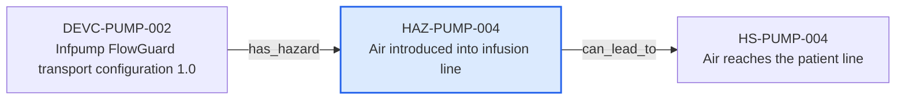

---
{
  "id": "HAZ-PUMP-004",
  "type": "hazard",
  "title": "Air introduced into infusion line",
  "aliases": [
    "HAZ-PUMP-004",
    "HAZ-PUMP-004-air-introduced-into-infusion-line",
    "18-ontology-notes/hazard/HAZ-PUMP-004-air-introduced-into-infusion-line",
    "03-Ontology notes/hazard/HAZ-PUMP-004-air-introduced-into-infusion-line"
  ],
  "status": "approved",
  "version": "1",
  "created": "2026-08-15",
  "modified": "2026-08-15",
  "tags": [
    "ontology-note/hazard",
    "device/infpump-flowguard"
  ],
  "draft": false,
  "note_origin": "human-reviewed synthetic example",
  "technical_file": "TF-05 Risk Management/Risk Analysis and Risk Matrix.xlsx",
  "technical_file_identifier": "HAZ-PUMP-004",
  "valid_from": "2026-08-15",
  "review_status": "approved",
  "device_context": "[[06-Infpump FlowGuard ontology notes/device-configuration/DEVC-PUMP-002-infpump-flowguard-transport-configuration-10|DEVC-PUMP-002]]",
  "hazard_category": "therapy-delivery",
  "topic": "air-in-line",
  "can_lead_to": [
    "[[06-Infpump FlowGuard ontology notes/hazardous-situation/HS-PUMP-004-air-reaches-the-patient-line|HS-PUMP-004]]"
  ]
}
---

# Air introduced into infusion line

## Semantic role

Identifies one potential source of harm that must remain traceable through hazardous situations, risks and controls.

## Note

Human-readable rendering of this note's YAML/JSON frontmatter:

- **id:** `HAZ-PUMP-004`
- **type:** `hazard`
- **title:** `Air introduced into infusion line`
- **aliases:** `HAZ-PUMP-004`, `HAZ-PUMP-004-air-introduced-into-infusion-line`, `18-ontology-notes/hazard/HAZ-PUMP-004-air-introduced-into-infusion-line`, `03-Ontology notes/hazard/HAZ-PUMP-004-air-introduced-into-infusion-line`
- **status:** `approved`
- **version:** `1`
- **created:** `2026-08-15`
- **modified:** `2026-08-15`
- **tags:** `ontology-note/hazard`, `device/infpump-flowguard`
- **draft:** `false`
- **note_origin:** `human-reviewed synthetic example`
- **technical_file:** `TF-05 Risk Management/Risk Analysis and Risk Matrix.xlsx`
- **technical_file_identifier:** `HAZ-PUMP-004`
- **valid_from:** `2026-08-15`
- **review_status:** `approved`
- **device_context:** [[06-Infpump FlowGuard ontology notes/device-configuration/DEVC-PUMP-002-infpump-flowguard-transport-configuration-10|DEVC-PUMP-002]]
- **hazard_category:** `therapy-delivery`
- **topic:** `air-in-line`
- **can_lead_to:** [[06-Infpump FlowGuard ontology notes/hazardous-situation/HS-PUMP-004-air-reaches-the-patient-line|HS-PUMP-004]]

## Traceability

Previous dependencies are ontology notes that lead into this record. They reach it through `has_hazard` from [[06-Infpump FlowGuard ontology notes/device-configuration/DEVC-PUMP-002-infpump-flowguard-transport-configuration-10|DEVC-PUMP-002 — Infpump FlowGuard transport configuration 1.0]]. These incoming links show which product, decision, process or evidence records depend on the current note.

Succeeding dependencies are ontology notes to which this record leads. The trace continues through `can_lead_to` to [[06-Infpump FlowGuard ontology notes/hazardous-situation/HS-PUMP-004-air-reaches-the-patient-line|HS-PUMP-004 — Air reaches the patient line]]. These outgoing links identify the next product, risk, control, evidence, change or lifecycle records used by downstream reasoning.

The left-to-right diagram shows up to five asserted previous and five asserted succeeding ontology-note dependencies. When more links exist, the additional-dependency node states how many remain available through the verbal links and structured metadata above.

