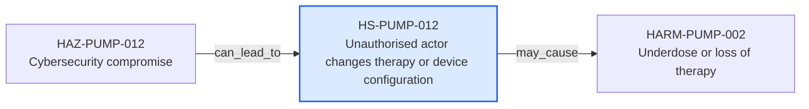

---
{
  "id": "HS-PUMP-012",
  "type": "hazardous-situation",
  "title": "Unauthorised actor changes therapy or device configuration",
  "aliases": [
    "HS-PUMP-012",
    "HS-PUMP-012-unauthorised-actor-changes-therapy-or-device-configuration",
    "18-ontology-notes/hazardous-situation/HS-PUMP-012-unauthorised-actor-changes-therapy-or-device-configuration",
    "03-Ontology notes/hazardous-situation/HS-PUMP-012-unauthorised-actor-changes-therapy-or-device-configuration"
  ],
  "status": "approved",
  "version": "1",
  "created": "2026-08-15",
  "modified": "2026-08-15",
  "tags": [
    "ontology-note/hazardous-situation",
    "device/infpump-flowguard"
  ],
  "draft": false,
  "note_origin": "human-reviewed synthetic example",
  "technical_file": "TF-05 Risk Management/Risk Analysis and Risk Matrix.xlsx",
  "technical_file_identifier": "HS-PUMP-012",
  "valid_from": "2026-08-15",
  "review_status": "approved",
  "device_context": "[[06-Infpump FlowGuard ontology notes/device-configuration/DEVC-PUMP-002-infpump-flowguard-transport-configuration-10|DEVC-PUMP-002]]",
  "may_cause": [
    "[[06-Infpump FlowGuard ontology notes/harm/HARM-PUMP-002-underdose-or-loss-of-therapy|HARM-PUMP-002]]"
  ]
}
---

# Unauthorised actor changes therapy or device configuration

## Semantic role

Represents one circumstance in which a person, property or environment is exposed to an infusion-pump hazard.

## Note

Human-readable rendering of this note's YAML/JSON frontmatter:

- **id:** `HS-PUMP-012`
- **type:** `hazardous-situation`
- **title:** `Unauthorised actor changes therapy or device configuration`
- **aliases:** `HS-PUMP-012`, `HS-PUMP-012-unauthorised-actor-changes-therapy-or-device-configuration`, `18-ontology-notes/hazardous-situation/HS-PUMP-012-unauthorised-actor-changes-therapy-or-device-configuration`, `03-Ontology notes/hazardous-situation/HS-PUMP-012-unauthorised-actor-changes-therapy-or-device-configuration`
- **status:** `approved`
- **version:** `1`
- **created:** `2026-08-15`
- **modified:** `2026-08-15`
- **tags:** `ontology-note/hazardous-situation`, `device/infpump-flowguard`
- **draft:** `false`
- **note_origin:** `human-reviewed synthetic example`
- **technical_file:** `TF-05 Risk Management/Risk Analysis and Risk Matrix.xlsx`
- **technical_file_identifier:** `HS-PUMP-012`
- **valid_from:** `2026-08-15`
- **review_status:** `approved`
- **device_context:** [[06-Infpump FlowGuard ontology notes/device-configuration/DEVC-PUMP-002-infpump-flowguard-transport-configuration-10|DEVC-PUMP-002]]
- **may_cause:** [[06-Infpump FlowGuard ontology notes/harm/HARM-PUMP-002-underdose-or-loss-of-therapy|HARM-PUMP-002]]

## Traceability

Previous dependencies are ontology notes that lead into this record. They reach it through `can_lead_to` from [[06-Infpump FlowGuard ontology notes/hazard/HAZ-PUMP-012-cybersecurity-compromise|HAZ-PUMP-012 — Cybersecurity compromise]]. These incoming links show which product, decision, process or evidence records depend on the current note.

Succeeding dependencies are ontology notes to which this record leads. The trace continues through `may_cause` to [[06-Infpump FlowGuard ontology notes/harm/HARM-PUMP-002-underdose-or-loss-of-therapy|HARM-PUMP-002 — Underdose or loss of therapy]]. These outgoing links identify the next product, risk, control, evidence, change or lifecycle records used by downstream reasoning.

The left-to-right diagram shows up to five asserted previous and five asserted succeeding ontology-note dependencies. When more links exist, the additional-dependency node states how many remain available through the verbal links and structured metadata above.

