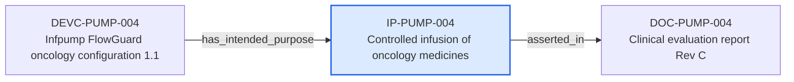

---
{
  "id": "IP-PUMP-004",
  "type": "intended-purpose",
  "title": "Controlled infusion of oncology medicines",
  "aliases": [
    "IP-PUMP-004",
    "IP-PUMP-004-controlled-infusion-of-oncology-medicines",
    "18-ontology-notes/intended-purpose/IP-PUMP-004-controlled-infusion-of-oncology-medicines",
    "03-Ontology notes/intended-purpose/IP-PUMP-004-controlled-infusion-of-oncology-medicines"
  ],
  "status": "approved",
  "version": "1",
  "created": "2026-08-15",
  "modified": "2026-08-15",
  "tags": [
    "ontology-note/intended-purpose",
    "device/infpump-flowguard"
  ],
  "draft": false,
  "note_origin": "human-reviewed synthetic example",
  "technical_file": "TF-02 Intended Purpose/Intended Purpose Specification.docx",
  "technical_file_identifier": "IP-PUMP-004",
  "valid_from": "2026-08-15",
  "review_status": "approved",
  "device_context": "[[06-Infpump FlowGuard ontology notes/device-configuration/DEVC-PUMP-004-infpump-flowguard-oncology-configuration-11|DEVC-PUMP-004]]",
  "medical_purpose": "Controlled infusion of oncology medicines",
  "operating_principle": "Volumetric peristaltic pumping with closed-loop sensing and alarms",
  "asserted_in": [
    "[[06-Infpump FlowGuard ontology notes/document-version/DOC-PUMP-004-clinical-evaluation-report-rev-c|DOC-PUMP-004]]"
  ],
  "has_target_population": [
    "[[01-Ontology instances/03-devices/intended-purpose/POP-0001-adult-patients|POP-0001]]"
  ],
  "has_intended_user": [
    "[[01-Ontology instances/03-devices/intended-purpose/USER-0001-trained-healthcare-professional|USER-0001]]"
  ],
  "has_use_environment": [
    "[[01-Ontology instances/03-devices/intended-purpose/ENV-0001-professional-healthcare-environment|ENV-0001]]"
  ]
}
---

# Controlled infusion of oncology medicines

## Semantic role

Preserves one controlled intended-purpose definition and the product, population, user and environment assumptions that depend on it.

## Note

Human-readable rendering of this note's YAML/JSON frontmatter:

- **id:** `IP-PUMP-004`
- **type:** `intended-purpose`
- **title:** `Controlled infusion of oncology medicines`
- **aliases:** `IP-PUMP-004`, `IP-PUMP-004-controlled-infusion-of-oncology-medicines`, `18-ontology-notes/intended-purpose/IP-PUMP-004-controlled-infusion-of-oncology-medicines`, `03-Ontology notes/intended-purpose/IP-PUMP-004-controlled-infusion-of-oncology-medicines`
- **status:** `approved`
- **version:** `1`
- **created:** `2026-08-15`
- **modified:** `2026-08-15`
- **tags:** `ontology-note/intended-purpose`, `device/infpump-flowguard`
- **draft:** `false`
- **note_origin:** `human-reviewed synthetic example`
- **technical_file:** `TF-02 Intended Purpose/Intended Purpose Specification.docx`
- **technical_file_identifier:** `IP-PUMP-004`
- **valid_from:** `2026-08-15`
- **review_status:** `approved`
- **device_context:** [[06-Infpump FlowGuard ontology notes/device-configuration/DEVC-PUMP-004-infpump-flowguard-oncology-configuration-11|DEVC-PUMP-004]]
- **medical_purpose:** `Controlled infusion of oncology medicines`
- **operating_principle:** `Volumetric peristaltic pumping with closed-loop sensing and alarms`
- **asserted_in:** [[06-Infpump FlowGuard ontology notes/document-version/DOC-PUMP-004-clinical-evaluation-report-rev-c|DOC-PUMP-004]]
- **has_target_population:** [[01-Ontology instances/03-devices/intended-purpose/POP-0001-adult-patients|POP-0001]]
- **has_intended_user:** [[01-Ontology instances/03-devices/intended-purpose/USER-0001-trained-healthcare-professional|USER-0001]]
- **has_use_environment:** [[01-Ontology instances/03-devices/intended-purpose/ENV-0001-professional-healthcare-environment|ENV-0001]]

## Traceability

Previous dependencies are ontology notes that lead into this record. They reach it through `has_intended_purpose` from [[06-Infpump FlowGuard ontology notes/device-configuration/DEVC-PUMP-004-infpump-flowguard-oncology-configuration-11|DEVC-PUMP-004 — Infpump FlowGuard oncology configuration 1.1]]. These incoming links show which product, decision, process or evidence records depend on the current note.

Succeeding dependencies are ontology notes to which this record leads. The trace continues through `asserted_in` to [[06-Infpump FlowGuard ontology notes/document-version/DOC-PUMP-004-clinical-evaluation-report-rev-c|DOC-PUMP-004 — Clinical evaluation report Rev C]]. These outgoing links identify the next product, risk, control, evidence, change or lifecycle records used by downstream reasoning.

The left-to-right diagram shows up to five asserted previous and five asserted succeeding ontology-note dependencies. When more links exist, the additional-dependency node states how many remain available through the verbal links and structured metadata above.

