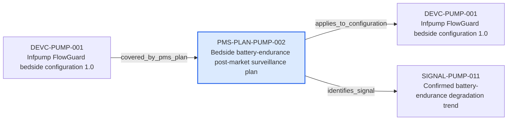

---
{
  "id": "PMS-PLAN-PUMP-002",
  "type": "pms-plan",
  "title": "Bedside battery-endurance post-market surveillance plan",
  "aliases": [
    "PMS-PLAN-PUMP-002",
    "PMS-PLAN-PUMP-002-bedside-battery-endurance-post-market-surveillance-plan",
    "18-ontology-notes/pms-plan/PMS-PLAN-PUMP-002-bedside-battery-endurance-post-market-surveillance-plan",
    "03-Ontology notes/pms-plan/PMS-PLAN-PUMP-002-bedside-battery-endurance-post-market-surveillance-plan"
  ],
  "status": "approved",
  "version": "1",
  "created": "2026-08-15",
  "modified": "2026-08-15",
  "tags": [
    "ontology-note/pms-plan",
    "device/infpump-flowguard"
  ],
  "draft": false,
  "note_origin": "human-reviewed synthetic example",
  "technical_file": "TF-09 PMS/Post-Market Surveillance Plan.docx",
  "technical_file_identifier": "PMS-PLAN-PUMP-002",
  "valid_from": "2026-08-15",
  "review_status": "approved",
  "device_context": "[[06-Infpump FlowGuard ontology notes/device-configuration/DEVC-PUMP-001-infpump-flowguard-bedside-configuration-10|DEVC-PUMP-001]]",
  "plan_state": "effective",
  "topic": "completed-battery-endurance-lifecycle",
  "applies_to_configuration": [
    "[[06-Infpump FlowGuard ontology notes/device-configuration/DEVC-PUMP-001-infpump-flowguard-bedside-configuration-10|DEVC-PUMP-001]]"
  ],
  "source_provisions": [
    "[[02-Sources/legislation/PROV-MDR-ARTICLE-83-mdr-article-83-pms-system|PROV-MDR-ARTICLE-83]]",
    "[[02-Sources/guidance/SRC-MDCG-2025-10-mdcg-2025-10-post-market-surveillance|SRC-MDCG-2025-10]]"
  ],
  "identifies_signal": [
    "[[06-Infpump FlowGuard ontology notes/signal/SIGNAL-PUMP-011-confirmed-battery-endurance-degradation-trend|SIGNAL-PUMP-011]]"
  ]
}
---

# Bedside battery-endurance post-market surveillance plan

## Semantic role

Represents the effective post-market surveillance plan, its marketed-device scope and its legal and guidance provenance.

## Note

Human-readable rendering of this note's YAML/JSON frontmatter:

- **id:** `PMS-PLAN-PUMP-002`
- **type:** `pms-plan`
- **title:** `Bedside battery-endurance post-market surveillance plan`
- **aliases:** `PMS-PLAN-PUMP-002`, `PMS-PLAN-PUMP-002-bedside-battery-endurance-post-market-surveillance-plan`, `18-ontology-notes/pms-plan/PMS-PLAN-PUMP-002-bedside-battery-endurance-post-market-surveillance-plan`, `03-Ontology notes/pms-plan/PMS-PLAN-PUMP-002-bedside-battery-endurance-post-market-surveillance-plan`
- **status:** `approved`
- **version:** `1`
- **created:** `2026-08-15`
- **modified:** `2026-08-15`
- **tags:** `ontology-note/pms-plan`, `device/infpump-flowguard`
- **draft:** `false`
- **note_origin:** `human-reviewed synthetic example`
- **technical_file:** `TF-09 PMS/Post-Market Surveillance Plan.docx`
- **technical_file_identifier:** `PMS-PLAN-PUMP-002`
- **valid_from:** `2026-08-15`
- **review_status:** `approved`
- **device_context:** [[06-Infpump FlowGuard ontology notes/device-configuration/DEVC-PUMP-001-infpump-flowguard-bedside-configuration-10|DEVC-PUMP-001]]
- **plan_state:** `effective`
- **topic:** `completed-battery-endurance-lifecycle`
- **applies_to_configuration:** [[06-Infpump FlowGuard ontology notes/device-configuration/DEVC-PUMP-001-infpump-flowguard-bedside-configuration-10|DEVC-PUMP-001]]
- **source_provisions:** [[02-Sources/legislation/PROV-MDR-ARTICLE-83-mdr-article-83-pms-system|PROV-MDR-ARTICLE-83]], [[02-Sources/guidance/SRC-MDCG-2025-10-mdcg-2025-10-post-market-surveillance|SRC-MDCG-2025-10]]
- **identifies_signal:** [[06-Infpump FlowGuard ontology notes/signal/SIGNAL-PUMP-011-confirmed-battery-endurance-degradation-trend|SIGNAL-PUMP-011]]

## Traceability

Previous dependencies are ontology notes that lead into this record. They reach it through `covered_by_pms_plan` from [[06-Infpump FlowGuard ontology notes/device-configuration/DEVC-PUMP-001-infpump-flowguard-bedside-configuration-10|DEVC-PUMP-001 — Infpump FlowGuard bedside configuration 1.0]]. These incoming links show which product, decision, process or evidence records depend on the current note.

Succeeding dependencies are ontology notes to which this record leads. The trace continues through `applies_to_configuration` to [[06-Infpump FlowGuard ontology notes/device-configuration/DEVC-PUMP-001-infpump-flowguard-bedside-configuration-10|DEVC-PUMP-001 — Infpump FlowGuard bedside configuration 1.0]]; `identifies_signal` to [[06-Infpump FlowGuard ontology notes/signal/SIGNAL-PUMP-011-confirmed-battery-endurance-degradation-trend|SIGNAL-PUMP-011 — Confirmed battery-endurance degradation trend]]. These outgoing links identify the next product, risk, control, evidence, change or lifecycle records used by downstream reasoning.

The left-to-right diagram shows up to five asserted previous and five asserted succeeding ontology-note dependencies. When more links exist, the additional-dependency node states how many remain available through the verbal links and structured metadata above.

