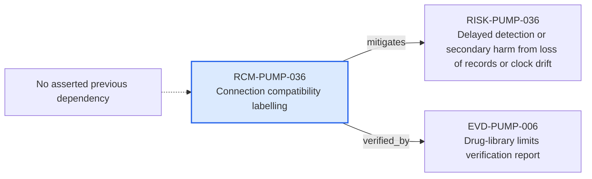

---
{
  "id": "RCM-PUMP-036",
  "type": "risk-control-measure",
  "title": "Connection compatibility labelling",
  "aliases": [
    "RCM-PUMP-036",
    "RCM-PUMP-036-connection-compatibility-labelling",
    "18-ontology-notes/risk-control-measure/RCM-PUMP-036-connection-compatibility-labelling",
    "03-Ontology notes/risk-control-measure/RCM-PUMP-036-connection-compatibility-labelling"
  ],
  "status": "approved",
  "version": "1",
  "created": "2026-08-15",
  "modified": "2026-08-15",
  "tags": [
    "ontology-note/risk-control-measure",
    "device/infpump-flowguard"
  ],
  "draft": false,
  "note_origin": "human-reviewed synthetic example",
  "technical_file": "TF-05 Risk Management/Risk Analysis and Risk Matrix.xlsx",
  "technical_file_identifier": "RCM-PUMP-036",
  "valid_from": "2026-08-15",
  "review_status": "approved",
  "device_context": "[[06-Infpump FlowGuard ontology notes/device-configuration/DEVC-PUMP-001-infpump-flowguard-bedside-configuration-10|DEVC-PUMP-001]]",
  "control_priority": "information-for-safety-or-production-control",
  "mitigates": [
    "[[06-Infpump FlowGuard ontology notes/risk/RISK-PUMP-036-delayed-detection-or-secondary-harm-from-loss-of-records-or-clock-drift|RISK-PUMP-036]]"
  ],
  "verified_by": [
    "[[06-Infpump FlowGuard ontology notes/verification-evidence/EVD-PUMP-006-drug-library-limits-verification-report|EVD-PUMP-006]]"
  ]
}
---

# Connection compatibility labelling

## Semantic role

Defines one control that reduces a specific risk and remains traceable to verification evidence.

## Note

Human-readable rendering of this note's YAML/JSON frontmatter:

- **id:** `RCM-PUMP-036`
- **type:** `risk-control-measure`
- **title:** `Connection compatibility labelling`
- **aliases:** `RCM-PUMP-036`, `RCM-PUMP-036-connection-compatibility-labelling`, `18-ontology-notes/risk-control-measure/RCM-PUMP-036-connection-compatibility-labelling`, `03-Ontology notes/risk-control-measure/RCM-PUMP-036-connection-compatibility-labelling`
- **status:** `approved`
- **version:** `1`
- **created:** `2026-08-15`
- **modified:** `2026-08-15`
- **tags:** `ontology-note/risk-control-measure`, `device/infpump-flowguard`
- **draft:** `false`
- **note_origin:** `human-reviewed synthetic example`
- **technical_file:** `TF-05 Risk Management/Risk Analysis and Risk Matrix.xlsx`
- **technical_file_identifier:** `RCM-PUMP-036`
- **valid_from:** `2026-08-15`
- **review_status:** `approved`
- **device_context:** [[06-Infpump FlowGuard ontology notes/device-configuration/DEVC-PUMP-001-infpump-flowguard-bedside-configuration-10|DEVC-PUMP-001]]
- **control_priority:** `information-for-safety-or-production-control`
- **mitigates:** [[06-Infpump FlowGuard ontology notes/risk/RISK-PUMP-036-delayed-detection-or-secondary-harm-from-loss-of-records-or-clock-drift|RISK-PUMP-036]]
- **verified_by:** [[06-Infpump FlowGuard ontology notes/verification-evidence/EVD-PUMP-006-drug-library-limits-verification-report|EVD-PUMP-006]]

## Traceability

No previous ontology-note dependency is currently asserted for this record. Its nearest governed context is [[06-Infpump FlowGuard ontology notes/device-configuration/DEVC-PUMP-001-infpump-flowguard-bedside-configuration-10|DEVC-PUMP-001 — Infpump FlowGuard bedside configuration 1.0]], which identifies the device configuration in which the note is interpreted.

Succeeding dependencies are ontology notes to which this record leads. The trace continues through `mitigates` to [[06-Infpump FlowGuard ontology notes/risk/RISK-PUMP-036-delayed-detection-or-secondary-harm-from-loss-of-records-or-clock-drift|RISK-PUMP-036 — Delayed detection or secondary harm from loss of records or clock drift]]; `verified_by` to [[06-Infpump FlowGuard ontology notes/verification-evidence/EVD-PUMP-006-drug-library-limits-verification-report|EVD-PUMP-006 — Drug-library limits verification report]]. These outgoing links identify the next product, risk, control, evidence, change or lifecycle records used by downstream reasoning.

The left-to-right diagram shows up to five asserted previous and five asserted succeeding ontology-note dependencies. When more links exist, the additional-dependency node states how many remain available through the verbal links and structured metadata above.

