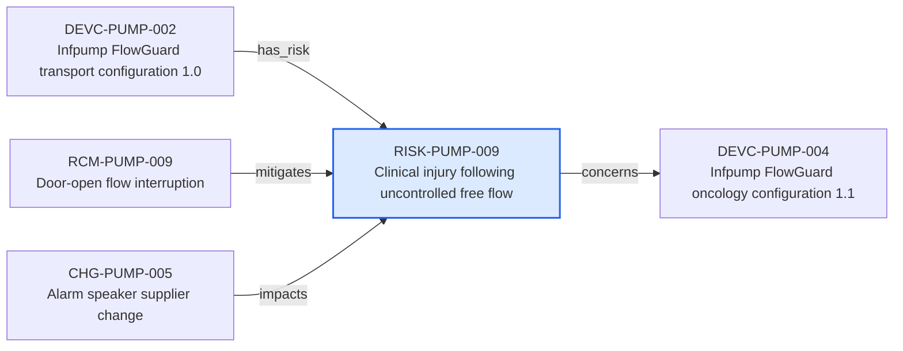

---
{
  "id": "RISK-PUMP-009",
  "type": "risk",
  "title": "Clinical injury following uncontrolled free flow",
  "aliases": [
    "RISK-PUMP-009",
    "RISK-PUMP-009-clinical-injury-following-uncontrolled-free-flow",
    "18-ontology-notes/risk/RISK-PUMP-009-clinical-injury-following-uncontrolled-free-flow",
    "03-Ontology notes/risk/RISK-PUMP-009-clinical-injury-following-uncontrolled-free-flow"
  ],
  "status": "accepted",
  "version": "1",
  "created": "2026-08-15",
  "modified": "2026-08-15",
  "tags": [
    "ontology-note/risk",
    "device/infpump-flowguard"
  ],
  "draft": false,
  "note_origin": "human-reviewed synthetic example",
  "technical_file": "TF-05 Risk Management/Risk Analysis and Risk Matrix.xlsx",
  "technical_file_identifier": "RISK-PUMP-009",
  "valid_from": "2026-08-15",
  "review_status": "approved",
  "device_context": "[[06-Infpump FlowGuard ontology notes/device-configuration/DEVC-PUMP-004-infpump-flowguard-oncology-configuration-11|DEVC-PUMP-004]]",
  "risk_matrix_identifier": "RISK-PUMP-009",
  "initial_risk": "medium",
  "residual_risk": "low",
  "concerns": [
    "[[06-Infpump FlowGuard ontology notes/device-configuration/DEVC-PUMP-004-infpump-flowguard-oncology-configuration-11|DEVC-PUMP-004]]"
  ]
}
---

# Clinical injury following uncontrolled free flow

## Semantic role

Represents one independently assessed infusion-pump risk with a stable risk-matrix identifier and configuration scope.

## Note

Human-readable rendering of this note's YAML/JSON frontmatter:

- **id:** `RISK-PUMP-009`
- **type:** `risk`
- **title:** `Clinical injury following uncontrolled free flow`
- **aliases:** `RISK-PUMP-009`, `RISK-PUMP-009-clinical-injury-following-uncontrolled-free-flow`, `18-ontology-notes/risk/RISK-PUMP-009-clinical-injury-following-uncontrolled-free-flow`, `03-Ontology notes/risk/RISK-PUMP-009-clinical-injury-following-uncontrolled-free-flow`
- **status:** `accepted`
- **version:** `1`
- **created:** `2026-08-15`
- **modified:** `2026-08-15`
- **tags:** `ontology-note/risk`, `device/infpump-flowguard`
- **draft:** `false`
- **note_origin:** `human-reviewed synthetic example`
- **technical_file:** `TF-05 Risk Management/Risk Analysis and Risk Matrix.xlsx`
- **technical_file_identifier:** `RISK-PUMP-009`
- **valid_from:** `2026-08-15`
- **review_status:** `approved`
- **device_context:** [[06-Infpump FlowGuard ontology notes/device-configuration/DEVC-PUMP-004-infpump-flowguard-oncology-configuration-11|DEVC-PUMP-004]]
- **risk_matrix_identifier:** `RISK-PUMP-009`
- **initial_risk:** `medium`
- **residual_risk:** `low`
- **concerns:** [[06-Infpump FlowGuard ontology notes/device-configuration/DEVC-PUMP-004-infpump-flowguard-oncology-configuration-11|DEVC-PUMP-004]]

## Traceability

Previous dependencies are ontology notes that lead into this record. They reach it through `has_risk` from [[06-Infpump FlowGuard ontology notes/device-configuration/DEVC-PUMP-002-infpump-flowguard-transport-configuration-10|DEVC-PUMP-002 — Infpump FlowGuard transport configuration 1.0]]; `mitigates` from [[06-Infpump FlowGuard ontology notes/risk-control-measure/RCM-PUMP-009-door-open-flow-interruption|RCM-PUMP-009 — Door-open flow interruption]]; `impacts` from [[06-Infpump FlowGuard ontology notes/change/CHG-PUMP-005-alarm-speaker-supplier-change|CHG-PUMP-005 — Alarm speaker supplier change]]. These incoming links show which product, decision, process or evidence records depend on the current note.

Succeeding dependencies are ontology notes to which this record leads. The trace continues through `concerns` to [[06-Infpump FlowGuard ontology notes/device-configuration/DEVC-PUMP-004-infpump-flowguard-oncology-configuration-11|DEVC-PUMP-004 — Infpump FlowGuard oncology configuration 1.1]]. These outgoing links identify the next product, risk, control, evidence, change or lifecycle records used by downstream reasoning.

The left-to-right diagram shows up to five asserted previous and five asserted succeeding ontology-note dependencies. When more links exist, the additional-dependency node states how many remain available through the verbal links and structured metadata above.

