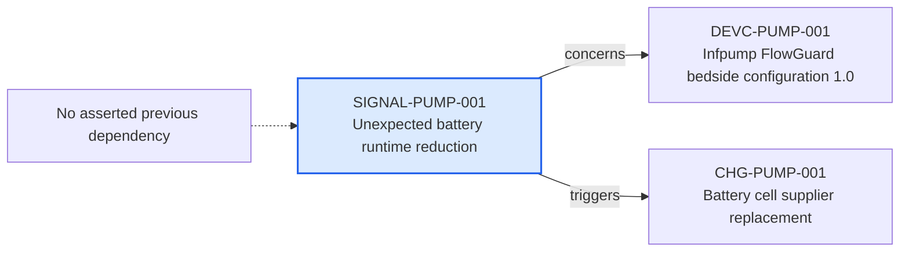

---
{
  "id": "SIGNAL-PUMP-001",
  "type": "signal",
  "title": "Unexpected battery runtime reduction",
  "aliases": [
    "SIGNAL-PUMP-001",
    "SIGNAL-PUMP-001-unexpected-battery-runtime-reduction",
    "18-ontology-notes/signal/SIGNAL-PUMP-001-unexpected-battery-runtime-reduction",
    "03-Ontology notes/signal/SIGNAL-PUMP-001-unexpected-battery-runtime-reduction"
  ],
  "status": "under-assessment",
  "version": "1",
  "created": "2026-08-15",
  "modified": "2026-08-15",
  "tags": [
    "ontology-note/signal",
    "device/infpump-flowguard"
  ],
  "draft": false,
  "note_origin": "human-reviewed synthetic example",
  "technical_file": "TF-09 PMS/PMS Signal Register.xlsx",
  "technical_file_identifier": "SIGNAL-PUMP-001",
  "valid_from": "2026-08-15",
  "review_status": "approved",
  "device_context": "[[06-Infpump FlowGuard ontology notes/device-configuration/DEVC-PUMP-001-infpump-flowguard-bedside-configuration-10|DEVC-PUMP-001]]",
  "signal_state": "under-assessment",
  "detected_at": "2026-08-15",
  "concerns": [
    "[[06-Infpump FlowGuard ontology notes/device-configuration/DEVC-PUMP-001-infpump-flowguard-bedside-configuration-10|DEVC-PUMP-001]]"
  ],
  "triggers": [
    "[[06-Infpump FlowGuard ontology notes/change/CHG-PUMP-001-battery-cell-supplier-replacement|CHG-PUMP-001]]"
  ]
}
---

# Unexpected battery runtime reduction

## Semantic role

Represents one post-market finding that requires assessment and can trigger a controlled change or other action.

## Note

Human-readable rendering of this note's YAML/JSON frontmatter:

- **id:** `SIGNAL-PUMP-001`
- **type:** `signal`
- **title:** `Unexpected battery runtime reduction`
- **aliases:** `SIGNAL-PUMP-001`, `SIGNAL-PUMP-001-unexpected-battery-runtime-reduction`, `18-ontology-notes/signal/SIGNAL-PUMP-001-unexpected-battery-runtime-reduction`, `03-Ontology notes/signal/SIGNAL-PUMP-001-unexpected-battery-runtime-reduction`
- **status:** `under-assessment`
- **version:** `1`
- **created:** `2026-08-15`
- **modified:** `2026-08-15`
- **tags:** `ontology-note/signal`, `device/infpump-flowguard`
- **draft:** `false`
- **note_origin:** `human-reviewed synthetic example`
- **technical_file:** `TF-09 PMS/PMS Signal Register.xlsx`
- **technical_file_identifier:** `SIGNAL-PUMP-001`
- **valid_from:** `2026-08-15`
- **review_status:** `approved`
- **device_context:** [[06-Infpump FlowGuard ontology notes/device-configuration/DEVC-PUMP-001-infpump-flowguard-bedside-configuration-10|DEVC-PUMP-001]]
- **signal_state:** `under-assessment`
- **detected_at:** `2026-08-15`
- **concerns:** [[06-Infpump FlowGuard ontology notes/device-configuration/DEVC-PUMP-001-infpump-flowguard-bedside-configuration-10|DEVC-PUMP-001]]
- **triggers:** [[06-Infpump FlowGuard ontology notes/change/CHG-PUMP-001-battery-cell-supplier-replacement|CHG-PUMP-001]]

## Traceability

No previous ontology-note dependency is currently asserted for this record. Its nearest governed context is [[06-Infpump FlowGuard ontology notes/device-configuration/DEVC-PUMP-001-infpump-flowguard-bedside-configuration-10|DEVC-PUMP-001 — Infpump FlowGuard bedside configuration 1.0]], which identifies the device configuration in which the note is interpreted.

Succeeding dependencies are ontology notes to which this record leads. The trace continues through `concerns` to [[06-Infpump FlowGuard ontology notes/device-configuration/DEVC-PUMP-001-infpump-flowguard-bedside-configuration-10|DEVC-PUMP-001 — Infpump FlowGuard bedside configuration 1.0]]; `triggers` to [[06-Infpump FlowGuard ontology notes/change/CHG-PUMP-001-battery-cell-supplier-replacement|CHG-PUMP-001 — Battery cell supplier replacement]]. These outgoing links identify the next product, risk, control, evidence, change or lifecycle records used by downstream reasoning.

The left-to-right diagram shows up to five asserted previous and five asserted succeeding ontology-note dependencies. When more links exist, the additional-dependency node states how many remain available through the verbal links and structured metadata above.

