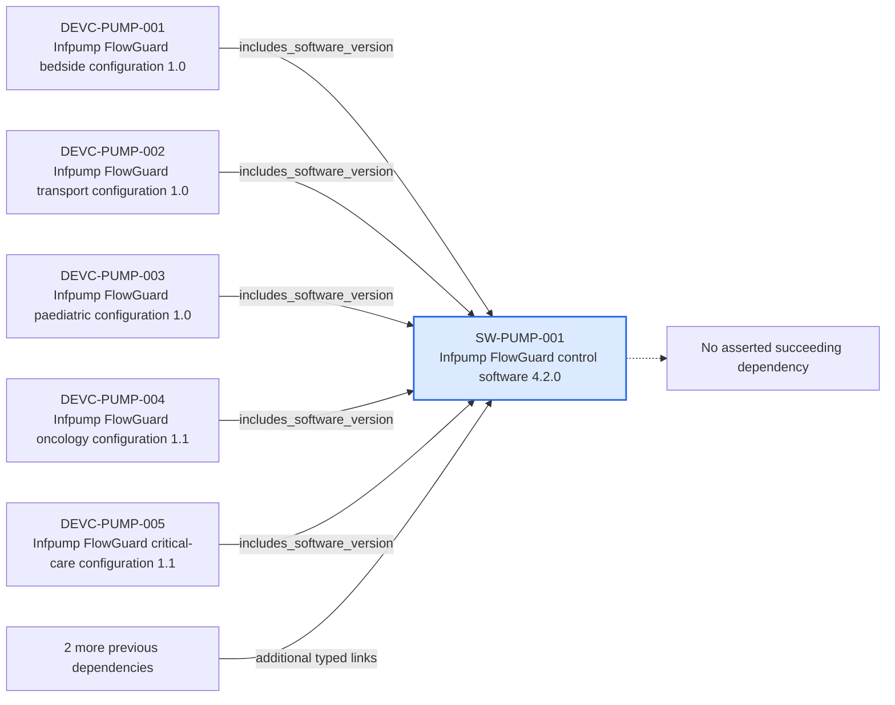

---
{
  "id": "SW-PUMP-001",
  "type": "software-version",
  "title": "Infpump FlowGuard control software 4.2.0",
  "aliases": [
    "SW-PUMP-001",
    "SW-PUMP-001-infpump-flowguard-control-software-420",
    "18-ontology-notes/software-version/SW-PUMP-001-infpump-flowguard-control-software-420",
    "03-Ontology notes/software-version/SW-PUMP-001-infpump-flowguard-control-software-420"
  ],
  "status": "approved",
  "version": "1",
  "created": "2026-08-15",
  "modified": "2026-08-15",
  "tags": [
    "ontology-note/software-version",
    "device/infpump-flowguard"
  ],
  "draft": false,
  "note_origin": "human-reviewed synthetic example",
  "technical_file": "TF-01 Device Description/Software Configuration Index.xlsx",
  "technical_file_identifier": "SW-PUMP-001",
  "valid_from": "2026-08-15",
  "review_status": "approved",
  "device_context": "[[06-Infpump FlowGuard ontology notes/device-configuration/DEVC-PUMP-002-infpump-flowguard-transport-configuration-10|DEVC-PUMP-002]]",
  "software_release_state": "released",
  "topic": "cybersecurity",
  "source_provisions": [
    "[[02-Sources/standards/SRC-EUDAMED-european-commission-eudamed-overview|SRC-EUDAMED]]",
    "[[02-Sources/standards/SRC-UDI-european-commission-udi-overview|SRC-UDI]]"
  ]
}
---

# Infpump FlowGuard control software 4.2.0

## Semantic role

Gives the released control-software version a stable identity so evidence and configuration validity can be evaluated precisely.

## Note

Human-readable rendering of this note's YAML/JSON frontmatter:

- **id:** `SW-PUMP-001`
- **type:** `software-version`
- **title:** `Infpump FlowGuard control software 4.2.0`
- **aliases:** `SW-PUMP-001`, `SW-PUMP-001-infpump-flowguard-control-software-420`, `18-ontology-notes/software-version/SW-PUMP-001-infpump-flowguard-control-software-420`, `03-Ontology notes/software-version/SW-PUMP-001-infpump-flowguard-control-software-420`
- **status:** `approved`
- **version:** `1`
- **created:** `2026-08-15`
- **modified:** `2026-08-15`
- **tags:** `ontology-note/software-version`, `device/infpump-flowguard`
- **draft:** `false`
- **note_origin:** `human-reviewed synthetic example`
- **technical_file:** `TF-01 Device Description/Software Configuration Index.xlsx`
- **technical_file_identifier:** `SW-PUMP-001`
- **valid_from:** `2026-08-15`
- **review_status:** `approved`
- **device_context:** [[06-Infpump FlowGuard ontology notes/device-configuration/DEVC-PUMP-002-infpump-flowguard-transport-configuration-10|DEVC-PUMP-002]]
- **software_release_state:** `released`
- **topic:** `cybersecurity`
- **source_provisions:** [[02-Sources/standards/SRC-EUDAMED-european-commission-eudamed-overview|SRC-EUDAMED]], [[02-Sources/standards/SRC-UDI-european-commission-udi-overview|SRC-UDI]]

## Traceability

Previous dependencies are ontology notes that lead into this record. They reach it through `includes_software_version` from [[06-Infpump FlowGuard ontology notes/device-configuration/DEVC-PUMP-001-infpump-flowguard-bedside-configuration-10|DEVC-PUMP-001 — Infpump FlowGuard bedside configuration 1.0]], [[06-Infpump FlowGuard ontology notes/device-configuration/DEVC-PUMP-002-infpump-flowguard-transport-configuration-10|DEVC-PUMP-002 — Infpump FlowGuard transport configuration 1.0]], [[06-Infpump FlowGuard ontology notes/device-configuration/DEVC-PUMP-003-infpump-flowguard-paediatric-configuration-10|DEVC-PUMP-003 — Infpump FlowGuard paediatric configuration 1.0]] and 2 more linked notes; `impacts` from [[06-Infpump FlowGuard ontology notes/change/CHG-PUMP-007-cybersecurity-operating-system-patch|CHG-PUMP-007 — Cybersecurity operating-system patch]]; `includes` from [[06-Infpump FlowGuard ontology notes/configuration-baseline/BASE-PUMP-001-infpump-flowguard-released-design-baseline-11|BASE-PUMP-001 — Infpump FlowGuard released design baseline 1.1]]. These incoming links show which product, decision, process or evidence records depend on the current note.

No succeeding ontology-note dependency is currently asserted for this record. It remains scoped to [[06-Infpump FlowGuard ontology notes/device-configuration/DEVC-PUMP-002-infpump-flowguard-transport-configuration-10|DEVC-PUMP-002 — Infpump FlowGuard transport configuration 1.0]], and any future downstream dependency should be added as a typed relationship rather than inferred from prose.

The left-to-right diagram shows up to five asserted previous and five asserted succeeding ontology-note dependencies. When more links exist, the additional-dependency node states how many remain available through the verbal links and structured metadata above.

