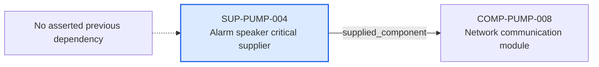

---
{
  "id": "SUP-PUMP-004",
  "type": "supplier",
  "title": "Alarm speaker critical supplier",
  "aliases": [
    "SUP-PUMP-004",
    "SUP-PUMP-004-alarm-speaker-critical-supplier",
    "18-ontology-notes/supplier/SUP-PUMP-004-alarm-speaker-critical-supplier",
    "03-Ontology notes/supplier/SUP-PUMP-004-alarm-speaker-critical-supplier"
  ],
  "status": "approved",
  "version": "1",
  "created": "2026-08-15",
  "modified": "2026-08-15",
  "tags": [
    "ontology-note/supplier",
    "device/infpump-flowguard"
  ],
  "draft": false,
  "note_origin": "human-reviewed synthetic example",
  "technical_file": "TF-11 Supplier Controls/Approved Supplier List.xlsx",
  "technical_file_identifier": "SUP-PUMP-004",
  "valid_from": "2026-08-15",
  "review_status": "approved",
  "device_context": "[[06-Infpump FlowGuard ontology notes/device-configuration/DEVC-PUMP-004-infpump-flowguard-oncology-configuration-11|DEVC-PUMP-004]]",
  "supplier_criticality": "critical",
  "approval_state": "approved",
  "supplied_component": [
    "[[06-Infpump FlowGuard ontology notes/component/COMP-PUMP-008-network-communication-module|COMP-PUMP-008]]"
  ]
}
---

# Alarm speaker critical supplier

## Semantic role

Represents one critical supplier whose approval and supplied component can be assessed independently.

## Note

Human-readable rendering of this note's YAML/JSON frontmatter:

- **id:** `SUP-PUMP-004`
- **type:** `supplier`
- **title:** `Alarm speaker critical supplier`
- **aliases:** `SUP-PUMP-004`, `SUP-PUMP-004-alarm-speaker-critical-supplier`, `18-ontology-notes/supplier/SUP-PUMP-004-alarm-speaker-critical-supplier`, `03-Ontology notes/supplier/SUP-PUMP-004-alarm-speaker-critical-supplier`
- **status:** `approved`
- **version:** `1`
- **created:** `2026-08-15`
- **modified:** `2026-08-15`
- **tags:** `ontology-note/supplier`, `device/infpump-flowguard`
- **draft:** `false`
- **note_origin:** `human-reviewed synthetic example`
- **technical_file:** `TF-11 Supplier Controls/Approved Supplier List.xlsx`
- **technical_file_identifier:** `SUP-PUMP-004`
- **valid_from:** `2026-08-15`
- **review_status:** `approved`
- **device_context:** [[06-Infpump FlowGuard ontology notes/device-configuration/DEVC-PUMP-004-infpump-flowguard-oncology-configuration-11|DEVC-PUMP-004]]
- **supplier_criticality:** `critical`
- **approval_state:** `approved`
- **supplied_component:** [[06-Infpump FlowGuard ontology notes/component/COMP-PUMP-008-network-communication-module|COMP-PUMP-008]]

## Traceability

No previous ontology-note dependency is currently asserted for this record. Its nearest governed context is [[06-Infpump FlowGuard ontology notes/device-configuration/DEVC-PUMP-004-infpump-flowguard-oncology-configuration-11|DEVC-PUMP-004 — Infpump FlowGuard oncology configuration 1.1]], which identifies the device configuration in which the note is interpreted.

Succeeding dependencies are ontology notes to which this record leads. The trace continues through `supplied_component` to [[06-Infpump FlowGuard ontology notes/component/COMP-PUMP-008-network-communication-module|COMP-PUMP-008 — Network communication module]]. These outgoing links identify the next product, risk, control, evidence, change or lifecycle records used by downstream reasoning.

The left-to-right diagram shows up to five asserted previous and five asserted succeeding ontology-note dependencies. When more links exist, the additional-dependency node states how many remain available through the verbal links and structured metadata above.

