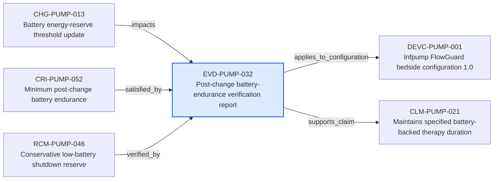

---
{
  "id": "EVD-PUMP-032",
  "type": "verification-evidence",
  "title": "Post-change battery-endurance verification report",
  "aliases": [
    "EVD-PUMP-032",
    "EVD-PUMP-032-post-change-battery-endurance-verification-report",
    "18-ontology-notes/verification-evidence/EVD-PUMP-032-post-change-battery-endurance-verification-report",
    "03-Ontology notes/verification-evidence/EVD-PUMP-032-post-change-battery-endurance-verification-report"
  ],
  "status": "approved",
  "version": "1",
  "created": "2026-08-15",
  "modified": "2026-08-15",
  "tags": [
    "ontology-note/verification-evidence",
    "device/infpump-flowguard"
  ],
  "draft": false,
  "note_origin": "human-reviewed synthetic example",
  "technical_file": "TF-07 Verification and Validation/V&V Evidence Index.xlsx",
  "technical_file_identifier": "EVD-PUMP-032",
  "valid_from": "2026-08-15",
  "review_status": "approved",
  "device_context": "[[06-Infpump FlowGuard ontology notes/device-configuration/DEVC-PUMP-001-infpump-flowguard-bedside-configuration-10|DEVC-PUMP-001]]",
  "approved_at": "2026-08-15",
  "evidence_scope": "Post-change battery-endurance verification report",
  "topic": "completed-battery-endurance-lifecycle",
  "evidence_state": "approved",
  "applies_to_configuration": [
    "[[06-Infpump FlowGuard ontology notes/device-configuration/DEVC-PUMP-001-infpump-flowguard-bedside-configuration-10|DEVC-PUMP-001]]"
  ],
  "supports_claim": [
    "[[06-Infpump FlowGuard ontology notes/clinical-claim/CLM-PUMP-021-maintains-specified-battery-backed-therapy-duration|CLM-PUMP-021]]"
  ]
}
---

# Post-change battery-endurance verification report

## Semantic role

Describes what one approved evidence item demonstrates and which exact device configuration it covers.

## Note

Human-readable rendering of this note's YAML/JSON frontmatter:

- **id:** `EVD-PUMP-032`
- **type:** `verification-evidence`
- **title:** `Post-change battery-endurance verification report`
- **aliases:** `EVD-PUMP-032`, `EVD-PUMP-032-post-change-battery-endurance-verification-report`, `18-ontology-notes/verification-evidence/EVD-PUMP-032-post-change-battery-endurance-verification-report`, `03-Ontology notes/verification-evidence/EVD-PUMP-032-post-change-battery-endurance-verification-report`
- **status:** `approved`
- **version:** `1`
- **created:** `2026-08-15`
- **modified:** `2026-08-15`
- **tags:** `ontology-note/verification-evidence`, `device/infpump-flowguard`
- **draft:** `false`
- **note_origin:** `human-reviewed synthetic example`
- **technical_file:** `TF-07 Verification and Validation/V&V Evidence Index.xlsx`
- **technical_file_identifier:** `EVD-PUMP-032`
- **valid_from:** `2026-08-15`
- **review_status:** `approved`
- **device_context:** [[06-Infpump FlowGuard ontology notes/device-configuration/DEVC-PUMP-001-infpump-flowguard-bedside-configuration-10|DEVC-PUMP-001]]
- **approved_at:** `2026-08-15`
- **evidence_scope:** `Post-change battery-endurance verification report`
- **topic:** `completed-battery-endurance-lifecycle`
- **evidence_state:** `approved`
- **applies_to_configuration:** [[06-Infpump FlowGuard ontology notes/device-configuration/DEVC-PUMP-001-infpump-flowguard-bedside-configuration-10|DEVC-PUMP-001]]
- **supports_claim:** [[06-Infpump FlowGuard ontology notes/clinical-claim/CLM-PUMP-021-maintains-specified-battery-backed-therapy-duration|CLM-PUMP-021]]

## Traceability

Previous dependencies are ontology notes that lead into this record. They reach it through `impacts` from [[06-Infpump FlowGuard ontology notes/change/CHG-PUMP-013-battery-energy-reserve-threshold-update|CHG-PUMP-013 — Battery energy-reserve threshold update]]; `satisfied_by` from [[06-Infpump FlowGuard ontology notes/compliance-requirement-instance/CRI-PUMP-052-minimum-post-change-battery-endurance|CRI-PUMP-052 — Minimum post-change battery endurance]]; `verified_by` from [[06-Infpump FlowGuard ontology notes/risk-control-measure/RCM-PUMP-046-conservative-low-battery-shutdown-reserve|RCM-PUMP-046 — Conservative low-battery shutdown reserve]]. These incoming links show which product, decision, process or evidence records depend on the current note.

Succeeding dependencies are ontology notes to which this record leads. The trace continues through `applies_to_configuration` to [[06-Infpump FlowGuard ontology notes/device-configuration/DEVC-PUMP-001-infpump-flowguard-bedside-configuration-10|DEVC-PUMP-001 — Infpump FlowGuard bedside configuration 1.0]]; `supports_claim` to [[06-Infpump FlowGuard ontology notes/clinical-claim/CLM-PUMP-021-maintains-specified-battery-backed-therapy-duration|CLM-PUMP-021 — Maintains specified battery-backed therapy duration]]. These outgoing links identify the next product, risk, control, evidence, change or lifecycle records used by downstream reasoning.

The left-to-right diagram shows up to five asserted previous and five asserted succeeding ontology-note dependencies. When more links exist, the additional-dependency node states how many remain available through the verbal links and structured metadata above.

