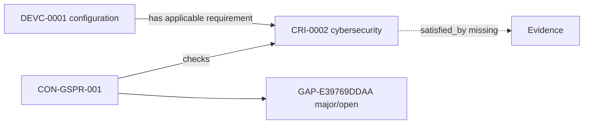

---
{
  "id": "UC-DEMO-02",
  "type": "use-case-demonstration",
  "title": "UC2 — Regulatory compliance gap assessment",
  "aliases": [
    "UC-DEMO-02",
    "17-use-cases/UC-DEMO-02-regulatory-compliance-gap-assessment",
    "06-Use case demonstrations/UC-DEMO-02-regulatory-compliance-gap-assessment"
  ],
  "status": "active",
  "version": "1",
  "created": "2026-08-14",
  "modified": "2026-08-14",
  "tags": [
    "use-cases",
    "compliance-gap"
  ],
  "draft": false,
  "use_case_number": 2,
  "impact_tier": "high",
  "demonstration_subject": [
    "[[DEVC-0001-example-infusion-pump-adult-10|DEVC-0001]]"
  ],
  "checks_constraints": [
    "[[CON-GSPR-001-applicable-requirements-have-compliance-traceability|CON-GSPR-001]]"
  ],
  "related_entities": [
    "[[CRI-0002-cybersecurity-requirement-instance|CRI-0002]]"
  ]
}
---

# UC2 — Regulatory compliance gap assessment

> [!failure] Demonstrated result
> One **major open gap** is present. The applicable cybersecurity requirement instance has no `satisfied_by` evidence relation.

## Manufacturer question

For the exact infusion-pump configuration, which applicable requirements are incomplete, why are they incomplete, and what should be fixed?

## Why this use case was selected

Gap assessment converts a large traceability graph into a focused remediation queue. It directly affects evidence completeness, audit readiness and downstream lifecycle gates.

## Demonstration

1. Start with [[DEVC-0001-example-infusion-pump-adult-10|the device configuration]].
2. Follow `has_applicable_requirement` to [[CRI-0001-electrical-safety-requirement-instance|the satisfied electrical-safety instance]] and [[CRI-0002-cybersecurity-requirement-instance|the cybersecurity instance]].
3. Evaluate [[CON-GSPR-001-applicable-requirements-have-compliance-traceability|the compliance-traceability constraint]], which requires at least one `satisfied_by` relation.
4. Compare the electrical-safety instance, which links to [[EVD-0001-electrical-safety-report-rev-a|verification evidence]], with the cybersecurity instance, which has no satisfying evidence.

## Result

| Field | Value |
|---|---|
| Gap | `GAP-E39769DDAA` |
| Subject | `CRI-0002` |
| Failed constraint | `CON-GSPR-001` |
| Severity / status | `major` / `open` |
| Diagnostic | `Relation satisfied_by has 0; minimum is 1` |
| Action | Add reviewed, configuration-scoped cybersecurity evidence or record an explicit justified state |

Open the [generated gap register](/07_other/_generated/compliance-gaps/) or compare all [generated requirement-compliance views](/07_other/_generated/requirement-compliance/).

## Reasoning trace

The result is deterministic: a device-specific applicable requirement exists; the constraint declares a minimum evidence cardinality of one; the current instance contains zero such relations; therefore the compiler preserves the failure as an explicit gap instead of treating missing data as compliance.

## Human-review boundary

The ontology can locate the structural deficiency. A qualified reviewer must decide whether proposed cybersecurity evidence is technically sufficient, current, applicable to this configuration and capable of satisfying the underlying GSPR.
