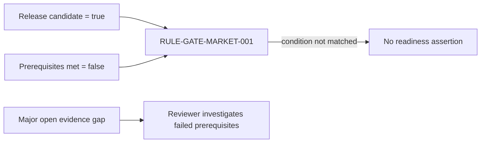

---
{
  "id": "UC-DEMO-03",
  "type": "use-case-demonstration",
  "title": "UC3 — Market-release readiness",
  "aliases": [
    "UC-DEMO-03",
    "17-use-cases/UC-DEMO-03-market-release-readiness",
    "06-Use case demonstrations/UC-DEMO-03-market-release-readiness"
  ],
  "status": "active",
  "version": "1",
  "created": "2026-08-14",
  "modified": "2026-08-14",
  "tags": [
    "use-cases",
    "market-release"
  ],
  "draft": false,
  "use_case_number": 3,
  "impact_tier": "high",
  "demonstration_subject": [
    "[[DEVC-0001-example-infusion-pump-adult-10|DEVC-0001]]"
  ],
  "uses_rules": [
    "[[RULE-GATE-MARKET-001-market-release-readiness|RULE-GATE-MARKET-001]]"
  ],
  "related_entities": [
    "[[CERT-0001-synthetic-mdr-certificate|CERT-0001]]",
    "[[CRI-0002-cybersecurity-requirement-instance|CRI-0002]]"
  ]
}
---

# UC3 — Market-release readiness

> [!failure] Demonstrated result
> **Release is blocked.** The configuration is a release candidate, but `release_prerequisites_met` is false, so the readiness rule does not derive `market_release_ready = true`.

## Manufacturer question

Can Example Medical Oy place the current infusion-pump configuration on the market, and what prevents a positive gate decision?

## Why this use case was selected

A release gate concentrates multiple regulatory dependencies into a high-consequence decision. It prevents incomplete compliance evidence from becoming a silent operational assumption.

## Demonstration

The ontology resolves the exact [[DEVC-0001-example-infusion-pump-adult-10|configuration]], then inspects its release-candidate flag, prerequisite state, [[CLD-0001-example-classification-decision|classification]], [[CERT-0001-synthetic-mdr-certificate|certificate]], technical documentation and applicable requirement instances. [[RULE-GATE-MARKET-001-market-release-readiness|The gate rule]] produces a positive assertion only when both the candidate flag and prerequisite flag are true.

| Gate input | Current state | Interpretation |
|---|---|---|
| `market_release_candidate` | `true` | The configuration is presented to the gate |
| `release_prerequisites_met` | `false` | A mandatory gate condition fails |
| Classification | `IIb` | Device-specific classification is represented |
| Certificate | linked | A certificate record exists, but cannot override a failed prerequisite |
| Open compliance gaps | 1 major | [[CRI-0002-cybersecurity-requirement-instance|Cybersecurity evidence traceability]] remains incomplete |

## Result

No positive `market_release_ready` derived assertion exists for this configuration. This is deliberately different from assuming readiness from the presence of a certificate or other documents. The [generated device-compliance view](/07_other/_generated/device-compliance/devc-0001) exposes the combined state.

## Reasoning trace

The rule does not infer the prerequisite flag from document presence, and it does not convert an absent positive result into an invented legal conclusion. It reports the represented state and the nearby open gap for review.

## Human-review boundary

Qualified Regulatory Affairs and Quality reviewers must define the complete release checklist, confirm certificate scope and validity, verify declaration and registration obligations, close or accept gaps under controlled procedures, and approve the actual release decision.
