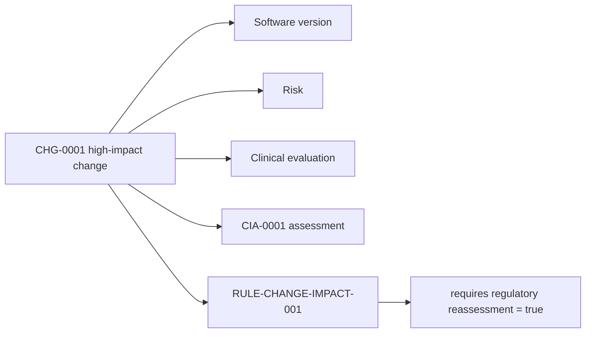

---
{
  "id": "UC-DEMO-05",
  "type": "use-case-demonstration",
  "title": "UC5 — Change-impact analysis",
  "aliases": [
    "UC-DEMO-05",
    "17-use-cases/UC-DEMO-05-change-impact-analysis",
    "06-Use case demonstrations/UC-DEMO-05-change-impact-analysis"
  ],
  "status": "active",
  "version": "1",
  "created": "2026-08-14",
  "modified": "2026-08-14",
  "tags": [
    "use-cases",
    "change-impact"
  ],
  "draft": false,
  "use_case_number": 5,
  "impact_tier": "high",
  "demonstration_subject": [
    "[[CHG-0001-software-alarm-refinement|CHG-0001]]"
  ],
  "uses_rules": [
    "[[RULE-CHANGE-IMPACT-001-high-impact-change-reassessment|RULE-CHANGE-IMPACT-001]]"
  ],
  "related_entities": [
    "[[CIA-0001-software-alarm-change-impact-assessment|CIA-0001]]"
  ]
}
---

# UC5 — Change-impact analysis

> [!warning] Demonstrated result
> The software alarm refinement requires regulatory reassessment. The rule derives `requires_regulatory_reassessment = true` with legal provenance.

## Manufacturer question

What regulatory, risk, clinical and evidence consequences follow from the proposed software alarm change?

## Why this use case was selected

Change control is where configuration, risk, clinical, documentation and market-access knowledge must work together. Missing an affected domain can invalidate evidence or an existing conformity rationale.

## Demonstration

Start with [[CHG-0001-software-alarm-refinement|the controlled change]] and its [[CIA-0001-software-alarm-change-impact-assessment|impact assessment]]. Its represented impact crosses the software version, a risk record and the clinical evaluation. Because the change is marked high impact, [[RULE-CHANGE-IMPACT-001-high-impact-change-reassessment|the active rule]] evaluates true.

## Result

| Output | Value |
|---|---|
| Derived assertion | `DA-D3A4DCF2DDDB` |
| Subject | `CHG-0001` |
| Predicate | `requires_regulatory_reassessment` |
| Value | `true` |
| Derived by | `RULE-CHANGE-IMPACT-001` |
| Source basis | MDR Article 10 manufacturer obligations |

The [generated change-impact view](/07_other/_generated/change-impact/chg-0001) provides the current machine-readable impact summary.

## Reasoning trace

The graph keeps the proposed change distinct from its assessment and from the derived regulatory flag. That separation makes it possible to see what was asserted by a person, what objects are affected, what the rule concluded and which source provision supports the rule.

## Human-review boundary

The derived flag starts a reassessment; it does not decide whether the change is substantial, whether notified-body involvement is required, or whether specific evidence remains valid. Those determinations need change-specific facts, governing procedures and qualified approval.
