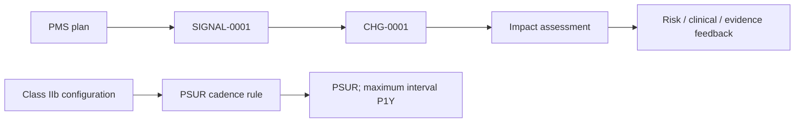

---
{
  "id": "UC-DEMO-08",
  "type": "use-case-demonstration",
  "title": "UC8 — PMS and vigilance closed loop",
  "aliases": [
    "UC-DEMO-08",
    "17-use-cases/UC-DEMO-08-pms-vigilance-closed-loop",
    "06-Use case demonstrations/UC-DEMO-08-pms-vigilance-closed-loop"
  ],
  "status": "active",
  "version": "1",
  "created": "2026-08-14",
  "modified": "2026-08-14",
  "tags": [
    "use-cases",
    "pms",
    "vigilance"
  ],
  "draft": false,
  "use_case_number": 8,
  "impact_tier": "high",
  "demonstration_subject": [
    "[[SIGNAL-0001-example-low-severity-signal|SIGNAL-0001]]"
  ],
  "uses_rules": [
    "[[RULE-PMS-PSUR-001-psur-cadence-for-class-iib-and-iii-devices|RULE-PMS-PSUR-001]]"
  ],
  "related_entities": [
    "[[PMS-PLAN-0001-example-pms-plan|PMS-PLAN-0001]]",
    "[[CHG-0001-software-alarm-refinement|CHG-0001]]"
  ]
}
---

# UC8 — PMS and vigilance closed loop

> [!success] Demonstrated result
> A post-market signal is traceable to a controlled change, while the Class IIb device independently derives a PSUR obligation with a maximum one-year update interval.

## Manufacturer question

How does a post-market signal feed back into risk, change control and recurring regulatory reporting for the marketed configuration?

## Why this use case was selected

The MDR lifecycle does not stop at release. A high-impact solution must connect market experience to assessment, action, updated evidence and recurring obligations without losing the device/configuration context.

## Demonstration

The marketed [[DEVC-0001-example-infusion-pump-adult-10|Class IIb configuration]] is covered by [[PMS-PLAN-0001-example-pms-plan|a PMS plan]]. [[SIGNAL-0001-example-low-severity-signal|A synthetic signal]] triggers [[CHG-0001-software-alarm-refinement|a controlled software change]], which has [[CIA-0001-software-alarm-change-impact-assessment|an impact assessment]]. Separately, [[RULE-PMS-PSUR-001-psur-cadence-for-class-iib-and-iii-devices|the PSUR cadence rule]] evaluates the device class.

## Result

| Derived output | Current value | Provenance |
|---|---|---|
| Required report type | `PSUR` | `RULE-PMS-PSUR-001` → MDR Article 86 |
| Maximum update interval | `P1Y` | `RULE-PMS-PSUR-001` → MDR Article 86 |
| Feedback action | Signal triggers `CHG-0001` | Explicit graph relation |
| Change consequence | Regulatory reassessment required | `RULE-CHANGE-IMPACT-001` |

This demonstrates UC9 scheduling inside the broader UC8 feedback loop. Use the [[VIEW-PMS-EXPLORER-pms-and-vigilance-explorer|PMS explorer]] and [generated change-impact view](/07_other/_generated/change-impact/chg-0001) to inspect both branches.

## Reasoning trace

The solution distinguishes observed post-market information, the chosen controlled action and rule-derived obligations. Provenance remains attached to each rule result, allowing a reviewer to explain why the report type and interval were selected.

## Human-review boundary

The seed does not establish event seriousness, reportability, statistical trend significance, exact authority deadlines, investigation completeness or whether the feedback loop is closed. Those states require richer case data and qualified vigilance decisions.
