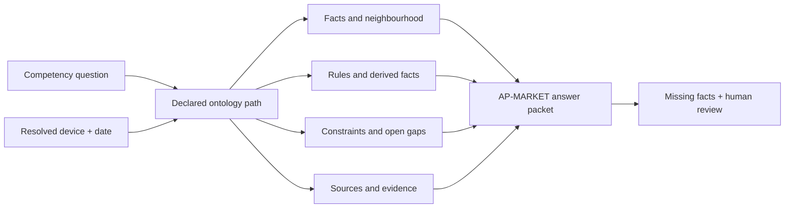

---
{
  "id": "UC-DEMO-18",
  "type": "use-case-demonstration",
  "title": "UC18 — Grounded LLM regulatory assistant",
  "aliases": [
    "UC-DEMO-18",
    "17-use-cases/UC-DEMO-18-grounded-llm-regulatory-assistant",
    "06-Use case demonstrations/UC-DEMO-18-grounded-llm-regulatory-assistant"
  ],
  "status": "active",
  "version": "1",
  "created": "2026-08-14",
  "modified": "2026-08-14",
  "tags": [
    "use-cases",
    "grounded-ai",
    "explainability"
  ],
  "draft": false,
  "use_case_number": 18,
  "impact_tier": "high",
  "demonstration_subject": [
    "[[DEVC-0001-example-infusion-pump-adult-10|DEVC-0001]]"
  ],
  "related_entities": [
    "[[CQ-07-08-what-conditions-must-be-satisfied-before-ce-marking-and-market-placement|CQ-07-08]]",
    "[[AP-MARKET-ap-market-answer-pattern|AP-MARKET]]"
  ]
}
---

# UC18 — Grounded LLM regulatory assistant

> [!info] Demonstrated result
> The context builder packages facts, rule outputs, evidence, gaps and source authority for the market-placement question. It explicitly reports `device_type` as missing and requires human review.

## Manufacturer question

How can an AI assistant answer “What conditions must be satisfied before CE marking and market placement?” without guessing or flattening legal authority?

## Why this use case was selected

The ontology becomes broadly useful when people can ask natural-language questions, but regulatory use demands bounded context, provenance, explicit missing facts and reproducible reasoning. This demonstration also operationalises UC19 explainable AI.

## Demonstration

The context builder resolves [[CQ-07-08-what-conditions-must-be-satisfied-before-ce-marking-and-market-placement|the competency question]] against [[DEVC-0001-example-infusion-pump-adult-10|the device configuration]] on `2026-08-14`. It follows the declared ontology path and returns a structured packet rather than an ungrounded prose answer.

```text
npm run ontology:context -- CQ-07-08 DEVC-0001 2026-08-14
```

| Packet section | Demonstrated content |
|---|---|
| Resolved context | `DEVC-0001`, manufacturer `ORG-MFR-0001`, relevant date |
| Facts | Configuration, classification, requirements, certificate, documentation and linked neighbourhood |
| Derived facts | Change reassessment, PSUR requirement and one-year maximum interval |
| Constraints / gaps | `GAP-E39769DDAA`, major and open |
| Evidence | Five approved evidence/document records in the resolved neighbourhood |
| Source ordering | Binding legal provenance before guidance and internal evidence |
| Answer structure | [[AP-MARKET-ap-market-answer-pattern|AP-MARKET]] |
| Missing facts | `device_type` |
| Review state | `human_review_required: true` |

Open the [generated CQ-07-08 context page](/07_other/_generated/question-context/cq-07-08) to inspect the website representation.

## Result

The assistant has enough grounded context to explain that the release prerequisites are not met and that a major evidence-traceability gap is open. It must also disclose the missing `device_type` input and preserve the distinction between facts, derived assertions, constraint failures and source authority.

## Reasoning trace



This is explainable because every important conclusion can be traced to a graph fact, rule, constraint, evidence record or source node; assumptions remain an explicit empty list rather than hidden model improvisation.

## Human-review boundary

The packet constrains and informs an LLM; it does not authorise autonomous regulatory decisions. A qualified reviewer must validate applicability, interpret unresolved legal or technical issues, assess evidence sufficiency and approve any device-specific conclusion.
