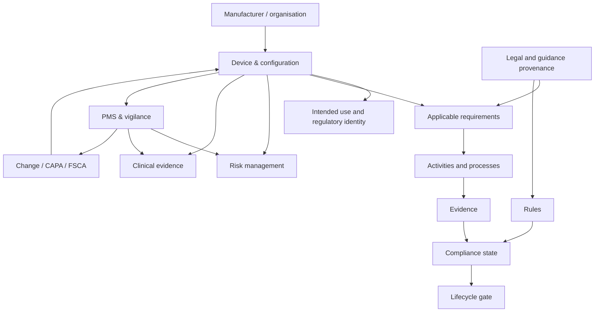
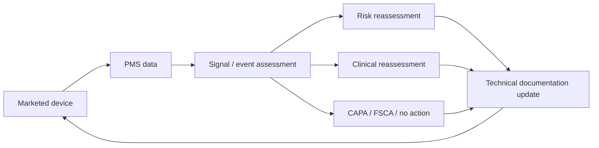

# EU MDR Manufacturer-Centric Ontology and Obsidian/Quartz Vault Specification

> [!important]
> This specification describes a manufacturer-oriented regulatory knowledge system. It is an engineering and educational specification, not legal advice. Device-specific regulatory decisions must remain reviewable by appropriately qualified personnel, and legally significant rules must retain explicit provenance to authoritative sources.

## 1. Purpose

The project SHALL implement an EU Medical Device Regulation (MDR) knowledge vault from the **medical-device manufacturer's operational point of view**.

The ontology SHALL answer the manufacturer's practical question:

> For this exact device and configuration, at this lifecycle state and point in time, what must be true, what work must be performed, what evidence must exist, who is responsible, and what prevents the next lifecycle action?

The project outcome SHALL be:

1. an **Obsidian-friendly vault** whose canonical authored content consists primarily of Markdown files;
2. a **Quartz 5 local website** generated from the same Markdown content;
3. a machine-readable graph/index generated from the Markdown source for deterministic validation and LLM retrieval;
4. an explicit ontology containing entities, relations, rules, constraints, provenance and temporal state;
5. a question layer containing approximately ninety manufacturer competency questions and ontology-based answer plans.

The ontology SHALL NOT be organised primarily as a mirror of MDR Articles and Annexes. Legal provisions SHALL be represented as provenance for manufacturer requirements, rules and decisions.

## 2. Normative language

Within this specification:

- **MUST/SHALL** means required for conformance.
- **SHOULD** means strongly recommended unless an implementation-specific reason is documented.
- **MAY** means optional.
- **Canonical** means the source from which generated representations are derived.
- **Derived** means generated by a deterministic rule, build step or reasoner and not manually asserted as source truth.

## 3. Goals

The implementation SHALL support:

- device- and configuration-specific compliance reasoning;
- lifecycle gates such as design freeze, conformity assessment and market release;
- traceability from requirement to activity to evidence to compliance state;
- traceability from a manufacturer decision back to legal or guidance provenance;
- risk-management and clinical-evidence feedback loops;
- post-market signals propagating to affected controlled artefacts;
- change-impact analysis;
- temporal reasoning about current versus superseded evidence, certificates, registrations and rules;
- human-readable navigation in Obsidian and Quartz;
- graph-grounded retrieval for an LLM;
- deterministic validation before LLM answer generation;
- explicit representation of missing information and unresolved compliance gaps.

## 4. Non-goals

The initial implementation SHALL NOT:

- attempt to replace qualified regulatory, clinical, quality or legal judgement;
- model EU law primarily for court-like legal reasoning;
- infer device-specific facts that are absent from the vault;
- treat MDCG, Team-NB, harmonised standards or internal procedures as legally equivalent to the MDR;
- rely on an opaque vector database as the canonical knowledge store;
- require a proprietary Obsidian plugin to preserve semantic meaning;
- store only PDF/document filenames without modelling the concepts and evidence contained in them;
- equate a UDI identifier with the device entity itself;
- equate document existence with compliance.

---

# Part I — Ontology concepts

## 5. What an ontology is

An ontology is a formalised description of **what kinds of things exist in a domain, how those things can relate, what can be inferred from those relations, and what states are valid or invalid**.

For this project, an ontology contains at least six semantic primitives:

1. **Classes** — categories such as `DeviceModel`, `Risk`, `ClinicalEvaluation`, `Manufacturer`, `EvidenceItem`.
2. **Instances** — concrete objects such as a particular device model, CER version or classification decision.
3. **Relations** — typed connections such as `has_intended_purpose`, `mitigates`, `supported_by` or `derived_from`.
4. **Rules** — logic that derives new facts or obligations from existing facts.
5. **Constraints** — checks that identify incomplete, inconsistent, stale or invalid graph states.
6. **Provenance** — the source, authority, version, date and rationale behind an assertion.

A folder taxonomy alone is not an ontology. Tags alone are not an ontology. A database schema alone is not an ontology. They become ontology-like only when the semantics of classes and relations are explicit enough that both humans and software can distinguish, for example:

```text
DeviceModel
  has_intended_purpose -> IntendedPurpose
  classified_by -> ClassificationDecision
  identified_by -> UDIIdentifier
  covered_by -> Certificate
```

from:

```text
EvidenceItem
  supports -> ComplianceRequirementInstance
  applies_to_configuration -> DeviceConfiguration
  generated_by -> VerificationActivity
```

The direction and meaning of each relation matter.

## 6. Why the manufacturer viewpoint changes the ontology

A legal-reasoning model tends to centre on:

```text
LegalProvision -> Norm -> LegalSubject -> Obligation -> Exception -> Consequence
```

The manufacturer model SHALL centre on:

```text
Manufacturer
  -> Device / configuration
  -> lifecycle state
  -> applicable compliance requirement
  -> required activity
  -> evidence
  -> compliance state
  -> next permitted or blocked action
```

A legal provision such as an MDR Article is therefore not normally the root of the graph. It is a source node linked by relations such as:

```text
ComplianceRequirementInstance -> derived_from -> LegalProvision
Rule -> implements -> LegalProvision
Decision -> justified_by -> EvidenceItem
Decision -> derived_under -> Rule
```

The ontology therefore functions as a **digital regulatory thread**.

## 7. Ontology versus document repository

The implementation MUST distinguish a semantic object from the document that records it.

Bad model:

```text
CER.pdf
RiskManagementFile.pdf
PMSPlan.pdf
```

Preferred model:

```text
ClinicalEvaluation
  documented_by -> CERVersion

RiskManagementProcess
  documented_by -> RiskManagementFileVersion

PMSSystem
  planned_by -> PMSPlanVersion
```

A document is evidence and a controlled representation of a concept; it is not necessarily the concept itself.

## 8. Ontology versus taxonomy

A taxonomy supports questions such as:

> Is a PSUR a kind of post-market report?

An ontology additionally supports:

> Which marketed devices require a PSUR, which PSUR version currently covers each device, when is the next update due, which PMS findings changed its conclusions, and which legal rule produced that due date?

The second question requires relations, rules, constraints, time and provenance.

---

# Part II — Using the ontology with an LLM

## 9. Role of the ontology in LLM reasoning

The ontology SHALL be used to **constrain and organise LLM reasoning**, not to make the LLM itself the source of regulatory truth.

The preferred reasoning architecture is:


The LLM SHOULD perform:

- natural-language intent recognition;
- entity disambiguation;
- explanation;
- synthesis across retrieved facts;
- comparison of alternatives;
- description of uncertainty;
- generation of human-readable decision traces.

The LLM SHOULD NOT be entrusted to:

- silently invent missing device characteristics;
- silently choose a classification rule without exposing the controlling facts;
- calculate compliance state without deterministic constraints when a rule is encoded;
- treat an outdated source as current merely because it is semantically similar;
- promote non-binding guidance to binding law;
- use evidence from an obsolete product configuration as though it covered the released configuration.

## 10. Graph-grounded reasoning cycle

For every substantive question, the LLM integration SHOULD execute this cycle:

1. **Resolve context.**
   - manufacturer;
   - device/model/variant/configuration;
   - intended purpose;
   - lifecycle state;
   - market/jurisdiction;
   - relevant date.
2. **Resolve the question type.**
   - qualification;
   - classification;
   - requirement applicability;
   - evidence sufficiency;
   - process responsibility;
   - conformity/market gate;
   - traceability;
   - PMS/vigilance;
   - change impact.
3. **Traverse the ontology.**
4. **Run encoded rules.**
5. **Run constraints.**
6. **Collect assertion provenance.**
7. **Identify missing facts rather than guessing them.**
8. **Assemble an answer using a declared answer pattern.**
9. **Expose the reasoning path and unresolved gaps.**

## 11. Required LLM answer contract

The application SHOULD ask the LLM to structure substantive manufacturer answers as:

```markdown
## Answer
Concise manufacturer-oriented conclusion.

## Device and context
The exact manufacturer, device/configuration, intended purpose, market and date used.

## Controlling facts
The graph facts that materially affect the conclusion.

## Ontology reasoning path
The entities, relations and rules traversed.

## Compliance/evidence state
What is satisfied, missing, stale, conflicting or not applicable.

## Required actions
Actions, owners, lifecycle gates or due dates derived from the ontology.

## Assumptions and unresolved facts
Information not present or not validated.

## Sources
Binding legal provenance first, followed by relevant guidance, standards and internal evidence.

## Related nodes
Wikilinks to the relevant device, requirement, evidence, process, change and question notes.
```

## 12. Explainability requirement

Every derived conclusion that can affect a compliance decision SHOULD be explainable as:

```text
input facts
+ rule
+ source of rule
+ derived assertion
+ constraints checked
+ supporting evidence
= conclusion
```

The project SHALL make this trace available to both humans and the LLM.

---

# Part III — Core ontology architecture

## 13. High-level semantic layers



## 14. Core entity domains

| Domain | Principal classes |
|---|---|
| Organisation | `Organisation`, `Manufacturer`, `ManufacturingSite`, `AuthorisedRepresentative`, `Importer`, `Distributor`, `NotifiedBody`, `CompetentAuthority`, `Supplier`, `Person`, `Role`, `PRRC`, `ResponsibilityAssignment` |
| Product | `DeviceFamily`, `DeviceModel`, `DeviceVariant`, `DeviceConfiguration`, `Accessory`, `Component`, `System`, `SoftwareVersion`, `PackagingConfiguration` |
| Intended use | `IntendedPurpose`, `Indication`, `Contraindication`, `TargetPopulation`, `IntendedUser`, `UseEnvironment`, `ClinicalClaim`, `UseLimitation` |
| Regulatory identity | `DeviceClass`, `ClassificationRule`, `ClassificationDecision`, `BasicUDIDI`, `UDIDI`, `UDIPI`, `EMDNCode`, `SRN` |
| Requirements | `RegulatoryRequirement`, `GSPRRequirement`, `ComplianceRequirementInstance`, `StandardRequirement`, `InternalRequirement` |
| Risk | `Hazard`, `SequenceOfEvents`, `HazardousSituation`, `Harm`, `Risk`, `RiskControlMeasure`, `ResidualRisk`, `BenefitRiskDetermination` |
| Clinical | `ClinicalEvaluation`, `ClinicalEvaluationPlan`, `ClinicalEvaluationReport`, `ClinicalEvidence`, `ClinicalInvestigation`, `EquivalenceAssessment`, `StateOfTheArt`, `PMCFPlan`, `PMCFReport`, `SSCP` |
| QMS/process | `QMS`, `QMSProcess`, `DesignProcess`, `SupplierControlProcess`, `ProductionProcess`, `ReleaseProcess`, `CAPA`, `Audit`, `Training`, `ManagementReview` |
| Technical documentation | `TechnicalDocumentationSet`, `Document`, `DocumentVersion`, `EvidenceItem`, `TestReport`, `VerificationEvidence`, `ValidationEvidence`, `Label`, `IFU`, `Translation` |
| Conformity | `ConformityAssessment`, `ConformityAssessmentRoute`, `NotifiedBodyApplication`, `Certificate`, `DeclarationOfConformity`, `CEMarkingState`, `MarketReleaseGate` |
| Traceability/EUDAMED | `EUDAMEDModule`, `ActorRegistration`, `DeviceRegistration`, `CertificateRegistration`, `Submission`, `RegistrationState`, `TraceabilityRecord` |
| Post-market | `PMSSystem`, `PMSPlan`, `PMSDataSource`, `Complaint`, `Event`, `IncidentAssessment`, `SeriousIncident`, `Trend`, `Signal`, `PMSReport`, `PSUR`, `FSCA`, `FSN` |
| Change/configuration | `Change`, `ChangeImpactAssessment`, `ConfigurationBaseline`, `DesignChange`, `SoftwareChange`, `SupplierChange`, `ManufacturingChange`, `LabellingChange`, `RegulatoryChange` |
| Supply continuity | `SupplyStatus`, `SupplyForecast`, `SupplyInterruption`, `SupplyDiscontinuation`, `ShortageRisk`, `Article10aAssessment`, `Article10aNotification` |
| Lifecycle | `LifecycleState`, `LifecycleGate`, `GateDecision`, `ComplianceState`, `ComplianceGap` |
| Provenance | `Source`, `LegalSource`, `LegalProvision`, `Guidance`, `Standard`, `CommonSpecification`, `InternalSource`, `SourceFragment` |
| Semantic infrastructure | `OntologyClass`, `RelationDefinition`, `Rule`, `Constraint`, `Assertion`, `Decision`, `CompetencyQuestion`, `AnswerPattern` |

## 15. Product hierarchy

The ontology MUST separate product identity from regulatory identifiers.

Recommended hierarchy:

```text
DeviceFamily
  has_model -> DeviceModel
DeviceModel
  has_variant -> DeviceVariant
DeviceVariant
  has_configuration -> DeviceConfiguration
DeviceConfiguration
  includes_software_version -> SoftwareVersion
DeviceConfiguration
  uses_packaging_configuration -> PackagingConfiguration
```

Identifiers SHALL be linked rather than used as the product node itself:

```text
DeviceModel/Grouping -> identified_by -> BasicUDIDI
DeviceVariant/TradeItem -> identified_by -> UDIDI
ProductionUnit/ProductionAttribute -> identified_by -> UDIPI
Device/Registration -> classified_under_nomenclature -> EMDNCode
```

## 16. Device configuration as a central object

`DeviceConfiguration` SHOULD be the default scope for compliance evidence.

A configuration can include:

- device model and variant;
- hardware revision;
- software version;
- material set;
- accessory combination;
- packaging;
- sterilisation state/process;
- label/IFU version;
- intended-purpose version;
- manufacturing baseline;
- target market.

Evidence MUST be able to state the configuration(s) it covers.

## 17. ComplianceRequirementInstance

`ComplianceRequirementInstance` is the central bridge between generic regulation and a manufacturer's concrete obligation.

Minimum semantics:

```text
ComplianceRequirementInstance
  applies_to -> DeviceConfiguration
  instantiates -> RegulatoryRequirement
  applicable_at -> LifecycleState
  applicable_in -> Market
  responsible_party -> Organisation/Role
  requires_activity -> Activity
  requires_evidence -> EvidenceType
  satisfied_by -> EvidenceItem
  has_status -> ComplianceState
  derived_from -> LegalProvision
  evaluated_at -> Date
```

The ontology SHOULD distinguish:

- the generic requirement;
- the device-specific requirement instance;
- evidence claimed to satisfy it;
- the evaluation that concludes whether it is satisfied.

---

# Part IV — Relations

## 18. Relation design principles

Every relation definition SHALL specify:

- stable predicate name;
- human-readable label;
- domain class(es);
- range class(es);
- inverse relation where useful;
- whether the relation is transitive, symmetric or functional;
- whether provenance is required;
- whether temporal qualification is required.

Predicate names SHOULD use `snake_case`.

## 19. Core relation catalogue

### 19.1 Structural/product relations

| Predicate | Domain → Range | Meaning |
|---|---|---|
| `has_model` | DeviceFamily → DeviceModel | family contains model |
| `has_variant` | DeviceModel → DeviceVariant | model contains variant |
| `has_configuration` | DeviceVariant → DeviceConfiguration | variant has controlled configuration |
| `includes_component` | DeviceConfiguration → Component | component is part of configuration |
| `includes_accessory` | DeviceConfiguration → Accessory | accessory is included/claimed |
| `includes_software_version` | DeviceConfiguration → SoftwareVersion | released configuration includes software |
| `manufactured_by` | Device → Manufacturer | legal manufacturer |
| `manufactured_at` | DeviceConfiguration → ManufacturingSite | manufacturing site |

### 19.2 Intended-use relations

| Predicate | Domain → Range |
|---|---|
| `has_intended_purpose` | Device/Configuration → IntendedPurpose |
| `has_indication` | IntendedPurpose → Indication |
| `has_target_population` | IntendedPurpose → TargetPopulation |
| `has_intended_user` | IntendedPurpose → IntendedUser |
| `has_use_environment` | IntendedPurpose → UseEnvironment |
| `has_contraindication` | IntendedPurpose → Contraindication |
| `makes_clinical_claim` | Device/Label → ClinicalClaim |
| `limited_by` | IntendedPurpose/Claim → UseLimitation |
| `asserted_in` | IntendedPurpose/Claim → DocumentVersion |

### 19.3 Classification/identity relations

| Predicate | Domain → Range |
|---|---|
| `classified_by` | DeviceConfiguration → ClassificationDecision |
| `concludes_class` | ClassificationDecision → DeviceClass |
| `considers_rule` | ClassificationDecision → ClassificationRule |
| `based_on_characteristic` | ClassificationDecision → Assertion |
| `identified_by` | Device/Registration → Identifier |
| `classified_under_nomenclature` | Device → EMDNCode |

### 19.4 Requirement/evidence relations

| Predicate | Domain → Range |
|---|---|
| `has_applicable_requirement` | DeviceConfiguration → ComplianceRequirementInstance |
| `instantiates_requirement` | ComplianceRequirementInstance → RegulatoryRequirement |
| `requires_activity` | ComplianceRequirementInstance → Activity |
| `requires_evidence` | ComplianceRequirementInstance → EvidenceType |
| `satisfied_by` | ComplianceRequirementInstance → EvidenceItem |
| `demonstrates_compliance_with` | EvidenceItem → Requirement |
| `generated_by` | EvidenceItem → Activity |
| `applies_to_configuration` | EvidenceItem → DeviceConfiguration |
| `supersedes` | DocumentVersion/EvidenceItem → earlier version |

### 19.5 Risk relations

| Predicate | Domain → Range |
|---|---|
| `has_hazard` | DeviceConfiguration → Hazard |
| `can_lead_to` | Hazard/SequenceOfEvents → HazardousSituation |
| `may_cause` | HazardousSituation → Harm |
| `has_risk` | DeviceConfiguration → Risk |
| `mitigates` | RiskControlMeasure → Risk |
| `verified_by` | RiskControlMeasure → VerificationEvidence |
| `results_in_residual_risk` | RiskControlMeasure → ResidualRisk |
| `evaluated_by` | ResidualRisk → BenefitRiskDetermination |

### 19.6 Clinical relations

| Predicate | Domain → Range |
|---|---|
| `evaluates` | ClinicalEvaluation → DeviceConfiguration |
| `supports_claim` | ClinicalEvidence → ClinicalClaim |
| `supports_intended_purpose` | ClinicalEvidence → IntendedPurpose |
| `uses_evidence` | ClinicalEvaluation → ClinicalEvidence |
| `compares_with` | EquivalenceAssessment → ComparatorDevice |
| `documented_by` | ClinicalEvaluation → CER |
| `updated_by` | ClinicalEvaluation → PMSFinding/PMCFResult |

### 19.7 Process/responsibility relations

| Predicate | Domain → Range |
|---|---|
| `owned_by` | Process/Activity → Organisation/Role |
| `responsible_party` | Requirement/Activity → Organisation/Role |
| `performed_by` | Activity → Person/Role/Organisation |
| `approved_by` | Decision/DocumentVersion → Person/Role |
| `outsourced_to` | Process → Supplier |
| `controls_supplier` | Manufacturer → Supplier |
| `covered_by_qms` | Process → QMS |

### 19.8 Post-market/change relations

| Predicate | Domain → Range |
|---|---|
| `collects_from` | PMSSystem → PMSDataSource |
| `produces_signal` | PMSData → Signal |
| `triggers` | Signal/Event/Gap → Assessment/CAPA/Change |
| `updates` | PMSFinding → RiskManagement/ClinicalEvaluation/TechnicalDocumentation |
| `results_in` | Assessment → CAPA/FSCA/NoActionDecision |
| `impacts` | Change → Device/Requirement/Risk/Evidence/Certificate/UDI |
| `requires_reassessment_of` | Change → Assessment/Document/Decision |

### 19.9 Provenance relations

| Predicate | Domain → Range |
|---|---|
| `derived_from` | Requirement/Rule/Assertion → Source/LegalProvision |
| `interpreted_by` | LegalProvision → Guidance |
| `supported_by` | Assertion/Decision → EvidenceItem |
| `derived_by_rule` | Assertion → Rule |
| `invalidated_by` | Assertion → Change/SourceUpdate/EvidenceUpdate |

---

# Part V — Assertions, decisions and provenance

## 20. When to reify a relation as an Assertion note

Simple descriptive links MAY be stored directly in frontmatter.

A relation SHOULD become an explicit `Assertion` note when any of the following applies:

- it is derived by a rule;
- it is time-dependent;
- it can be disputed or superseded;
- it needs source provenance;
- it has confidence/review status;
- it is a regulatory decision;
- it affects a lifecycle gate;
- it depends on a specific device configuration.

Example:

```text
DeviceConfiguration -> classified_as -> ClassIIb
```

SHOULD be represented through a `ClassificationDecision` or `Assertion` rather than only as an unqualified property.

## 21. Assertion model

Minimum fields:

```yaml
id: AST-000123
type: assertion
subject: "[[DEV-CFG-0001]]"
predicate: classified_as
object: "[[CLASS-IIb]]"
assertion_status: accepted
assertion_kind: derived
valid_from: 2026-06-01
valid_to:
derived_by_rule: "[[RULE-CLASS-001]]"
supported_by:
  - "[[EVD-CLASS-RATIONALE-0001]]"
source_provisions:
  - "[[PROV-MDR-ANNEX-VIII]]"
reviewed_by:
  - "[[ROLE-REGULATORY-AFFAIRS]]"
```

## 22. Decision model

Use a dedicated `Decision` subtype for classification, qualification, equivalence, reportability, market release and change impact.

A decision SHOULD contain:

- question/decision type;
- controlled input facts;
- candidate alternatives;
- rules considered;
- conclusion;
- rationale;
- supporting evidence;
- reviewer/approver;
- decision date;
- next review trigger;
- source provenance.

---

# Part VI — Rules

## 23. Rule types

The implementation SHALL support at least:

1. **Derivation rules** — derive a fact.
2. **Applicability rules** — derive which requirement applies.
3. **Scheduling rules** — derive due dates/intervals.
4. **Lifecycle-gate rules** — determine whether transition is allowed.
5. **Change-impact rules** — derive reassessments from a change.
6. **Feedback rules** — propagate PMS findings.
7. **Conflict rules** — surface contradictory assertions.
8. **Source-validity rules** — invalidate or warn when a source is superseded.

## 24. Rule note representation

Each rule SHALL be a Markdown note with flat frontmatter metadata and a machine-readable body block.

Example:

```markdown
---
id: RULE-PMS-PSUR-001
type: rule
rule_kind: scheduling
status: active
source_provisions:
  - "[[PROV-MDR-ARTICLE-86]]"
---

# PSUR cadence rule

```yaml ontology-rule
when:
  all:
    - subject_type: DeviceConfiguration
    - fact: risk_class
      in: [IIb, III]
then:
  assert:
    - predicate: requires_report_type
      object: PSUR
  derive:
    - field: maximum_update_interval
      value: P1Y
```
```

The exact substantive rule MUST be verified against the current authoritative source before being marked `status: active`.

## 25. Example rule families

### Qualification

```text
product facts + intended purpose + regulatory definitions
-> QualificationDecision
```

### Classification

```text
controlled device characteristics
-> candidate classification rules
-> rule evaluations
-> resulting classes
-> strictest applicable outcome
-> ClassificationDecision
```

### Requirement applicability

```text
device characteristics + intended purpose + lifecycle state + market
-> applicable ComplianceRequirementInstances
```

### Market-release gate

```text
MarketReleaseReady(DeviceConfiguration)
only if:
  all required requirement instances are satisfied or justified N/A
  AND required technical documentation is current
  AND risk-management conclusion is acceptable
  AND clinical evaluation is current
  AND conformity assessment state is valid
  AND declaration/registration/UDI prerequisites are satisfied
```

### PMS feedback

```text
PMSFinding
-> reassess affected Risk
-> reassess ClinicalEvaluation when clinically relevant
-> reassess GSPR evidence when affected
-> reassess Label/IFU when risk communication changes
-> create Change/CAPA/FSCA when action threshold is met
```

### Change impact

```text
Change affects IntendedPurpose
-> reassess qualification
-> reassess classification
-> reassess clinical evaluation
-> reassess conformity-assessment impact
-> reassess UDI/registration impact
```

---

# Part VII — Constraints

## 26. Constraint categories

The implementation SHALL support:

| Constraint family | Purpose |
|---|---|
| Cardinality | required number of relationships |
| Completeness | required nodes/evidence exist |
| Consistency | mutually incompatible states are absent |
| Temporal | due dates, expiry and validity are correct |
| Configuration | evidence covers current released configuration |
| Traceability | requirements have rationale/evidence/provenance |
| Lifecycle | gate prerequisites are satisfied |
| Authority/provenance | conclusion has appropriate source basis |
| Versioning | current/superseded artefacts are not confused |
| Responsibility | required owner/approver exists |

## 27. Constraint examples

```text
CON-MFR-001
Every marketed DeviceConfiguration MUST link to exactly one current legal Manufacturer.

CON-CLASS-001
Every market-release candidate MUST have one current accepted ClassificationDecision.

CON-GSPR-001
Every applicable GSPR RequirementInstance MUST have:
  applicability rationale
  compliance method
  compliance status
  evidence or open gap
  source provenance

CON-EVID-001
Evidence marked "current" MUST cover the released DeviceConfiguration or a justified equivalent scope.

CON-DOC-001
A superseded document version MUST NOT satisfy a lifecycle gate unless a documented justification explicitly permits it.

CON-PMS-001
A marketed device MUST have an applicable PMS system/plan.

CON-CHANGE-001
A released Change MUST have a completed impact assessment covering all mandatory impact domains for its change type.

CON-SOURCE-001
A rule marked active MUST reference at least one current source provision or an explicitly documented internal policy basis.
```

## 28. Constraint result model

A failed constraint SHALL create or update a `ComplianceGap`:

```yaml
id: GAP-000123
type: compliance-gap
constraint: "[[CON-EVID-001]]"
subject: "[[DEV-CFG-0001]]"
severity: major
status: open
detected_at: 2026-08-14
evidence:
  - "[[EVD-000456]]"
owner: "[[ROLE-QUALITY]]"
```

The system SHOULD NOT silently discard invalid states.

---

# Part VIII — Temporal and configuration semantics

## 29. Time is a first-class dimension

The graph MUST distinguish:

- `created_at`;
- `effective_from`;
- `effective_to`;
- `approved_at`;
- `superseded_at`;
- `evaluated_at`;
- `next_review_due`;
- `source_consolidated_as_of`;
- `retrieved_at`.

A question such as "Can this legacy device still be placed on the market?" is meaningless without a relevant date.

## 30. Current state

The build/reasoning layer SHOULD derive `is_current` from validity fields rather than relying on manually maintained booleans where possible.

## 31. Configuration baselines

A `ConfigurationBaseline` SHALL identify the set of released product artefacts that define a regulated configuration.

Example:

```text
ConfigurationBaseline
  includes -> HardwareRevision
  includes -> SoftwareVersion
  includes -> MaterialSpecification
  includes -> PackagingConfiguration
  includes -> LabelVersion
  includes -> IFUVersion
  uses -> ManufacturingProcessVersion
  has_intended_purpose -> IntendedPurposeVersion
```

Evidence SHALL state which baseline(s) it covers.

---

# Part IX — Source and authority model

## 32. Source classes

At minimum:

- `EURegulation`
- `EUAmendingAct`
- `EUDelegatedAct`
- `EUImplementingAct`
- `CommissionDecision`
- `LegalProvision`
- `CommonSpecification`
- `MDCGGuidance`
- `HarmonisedStandard`
- `NonHarmonisedStandard`
- `TeamNBGuidance`
- `CompetentAuthorityGuidance`
- `InternalProcedure`
- `InternalEvidence`
- `ScientificLiterature`

## 33. Normative status

Every external source SHOULD have:

```yaml
normative_status: binding | non-binding-guidance | voluntary-presumption | best-practice | scientific-evidence | internal-control
```

This field MUST NOT be interpreted as a simple numerical ranking of truth.

Examples:

- MDR provision: `binding`
- MDCG guidance: `non-binding-guidance`
- harmonised standard whose reference is published in the OJEU: `voluntary-presumption` for the requirements it covers
- Team-NB BPG: `best-practice`

## 34. Source versioning

Source notes SHOULD capture:

```yaml
document_id:
publisher:
title:
version:
publication_date:
effective_from:
effective_to:
consolidated_as_of:
official_url:
retrieved_at:
normative_status:
supersedes:
superseded_by:
```

Rules SHALL point to source notes or provision notes rather than embedding undocumented legal logic.

## 35. Current reference baseline for initial seeding

The coding agent SHOULD seed, at minimum, source notes for:

- Regulation (EU) 2017/745, current consolidated English text used by the project;
- Commission MDR guidance index;
- relevant current MDCG guidance;
- EUDAMED official module/status pages;
- harmonised-standard official Commission page;
- UDI and EMDN official Commission pages;
- Team-NB BPG Technical Documentation V4 as non-binding best-practice material;
- Quartz 5 documentation needed for the implementation.

The build SHOULD make source freshness visible and SHOULD NOT assume that a source remains current indefinitely.

---

# Part X — Manufacturer operational domains

## 36. Organisation and responsibility

The ontology SHALL be able to answer:

```text
Who is responsible for this requirement/activity/evidence?
Which responsibilities remain with the manufacturer when work is outsourced?
Who approved the regulatory decision?
Which economic operator relationship applies?
```

`ResponsibilityAssignment` SHOULD be used when responsibility needs scope, validity or evidence.

## 37. Intended purpose and claims

The ontology SHOULD model the intended purpose semantically rather than only as free text.

Suggested components:

- medical purpose;
- indication;
- target population;
- intended user;
- use environment;
- anatomical site;
- duration/frequency;
- route/mode of use;
- principal operating principle;
- contraindications;
- limitations;
- clinical claims.

The exact approved wording SHALL still be stored as a controlled text/version.

## 38. Classification

A `ClassificationDecision` SHOULD be an auditable reasoning object:

```text
ClassificationDecision
  concerns -> DeviceConfiguration
  considers -> ClassificationRule[]
  based_on -> DeviceCharacteristicAssertion[]
  concludes_class -> DeviceClass
  documented_by -> ClassificationRationale
  approved_by -> Role
  derived_from -> MDR Annex VIII provision(s)
```

A bare `risk_class: IIb` property is insufficient as the sole regulatory record.

## 39. GSPR and standards

For each applicable GSPR the graph SHOULD support:

```text
GSPRRequirement
  -> ComplianceRequirementInstance
  -> applicability rationale
  -> compliance method
  -> risk-control linkage
  -> standard/common-specification linkage
  -> objective evidence
  -> compliance status
```

The standard node MUST distinguish harmonisation status and OJEU citation status from mere standard use.

## 40. Risk-management causal graph

Recommended semantic chain:

```text
Hazard
  -> SequenceOfEvents
  -> HazardousSituation
  -> Harm
  -> Risk
  -> RiskControlMeasure
  -> VerificationEvidence
  -> ResidualRisk
  -> BenefitRiskDetermination
```

Post-market evidence SHOULD be able to update probability/severity assumptions or expose new hazards.

## 41. Clinical evidence graph

Recommended chain:

```text
ClinicalClaim
  <- supports_claim - ClinicalEvidence
ClinicalEvaluation
  -> evaluates -> DeviceConfiguration
  -> uses_evidence -> ClinicalEvidence[]
  -> considers -> StateOfTheArt
  -> evaluates -> BenefitRiskDetermination
  -> documented_by -> CERVersion
PMS/PMCF
  -> updates -> ClinicalEvaluation
```

## 42. QMS/process graph

The QMS SHOULD be represented as a network of controlled processes and outputs rather than only a certificate.

Example:

```text
QMS
  covers -> DesignProcess
  covers -> RiskManagementProcess
  covers -> SupplierControlProcess
  covers -> ProductionProcess
  covers -> PMSProcess
  covers -> VigilanceProcess
  covers -> CAPAProcess
```

## 43. Technical documentation and evidence

`EvidenceItem` SHOULD be a superclass for:

- test report;
- verification result;
- validation result;
- clinical evidence;
- supplier evidence;
- manufacturing validation;
- audit evidence;
- PMS analysis;
- registration evidence.

Each evidence item SHOULD carry:

- scope;
- version;
- status;
- author/approver;
- date;
- covered configuration;
- supported requirements/claims/risks;
- source location;
- validity or next review trigger.

## 44. Conformity assessment and market gate

The ontology SHOULD make CE marking a **result of satisfied prerequisites**, not an isolated tag.

Example:

```text
MarketReleaseGate
  checks -> ComplianceRequirementInstance[]
  checks -> CurrentTechnicalDocumentation
  checks -> CurrentClassificationDecision
  checks -> ConformityAssessmentState
  checks -> CertificateState
  checks -> DeclarationOfConformity
  checks -> UDI/RegistrationState
  -> GateDecision
```

## 45. UDI and EUDAMED

The internal device master record SHALL be distinct from EUDAMED registration state.

```text
DeviceMasterData
  synchronises_with -> EUDAMEDDeviceRegistration
```

A registration can be:

- draft;
- submitted;
- accepted/registered;
- rejected;
- superseded;
- correction-needed.

EUDAMED module availability and mandatory-use status SHALL be temporal source data, not hard-coded ontology structure.

## 46. PMS and vigilance closed loop



The graph SHOULD permit a query such as:

> Show PMS signals whose impact has not yet propagated to all affected risk, clinical, labelling and technical-documentation nodes.

## 47. Change management

`Change` SHALL be a first-class entity.

Recommended subtypes:

- design;
- software;
- material;
- supplier;
- manufacturing process;
- sterilisation;
- packaging;
- labelling;
- intended purpose;
- clinical;
- regulatory/source;
- organisational.

Every released change SHOULD have a `ChangeImpactAssessment`.

## 48. Supply continuity

The model SHOULD include:

```text
SupplyInterruption
  concerns -> Device
  has_forecast_duration -> Duration
  affects_market -> Market
  assessed_by -> Article10aAssessment
  may_require -> Article10aNotification
```

This domain is cross-cutting and may be expanded beyond the initial 90 competency-question seed set.

---

# Part XI — Markdown/Obsidian canonical representation

## 49. Canonical-source principle

Markdown files in the vault SHALL be the canonical authored representation.

Generated artefacts MAY include:

- `graph.json`;
- search indexes;
- RDF/Turtle export;
- SHACL export;
- generated dashboards;
- generated answer context packets.

Generated artefacts MUST be reproducible from the Markdown source and MUST NOT become the only location of regulatory meaning.

## 50. Vault root

The recommended implementation is to use the Quartz `content/` directory itself as the Obsidian vault.

```text
repo/
├─ content/                 # open this folder as the Obsidian vault
├─ scripts/
├─ tests/
├─ generated/               # non-canonical machine outputs if kept outside content
├─ quartz.config.yaml
├─ quartz.layout.ts
├─ package.json
└─ README.md
```

## 51. Vault folder structure

```text
content/
├─ index.md
├─ 00-Ontology/
│  ├─ classes/
│  ├─ relations/
│  ├─ rules/
│  ├─ constraints/
│  └─ vocabularies/
├─ 01-Ontology instances/02-organisations/
│  ├─ manufacturers/
│  ├─ sites/
│  ├─ suppliers/
│  ├─ notified-bodies/
│  ├─ economic-operators/
│  ├─ roles/
│  └─ people/
├─ 01-Ontology instances/03-devices/
│  ├─ families/
│  ├─ models/
│  ├─ variants/
│  ├─ configurations/
│  ├─ intended-purpose/
│  ├─ claims/
│  ├─ identifiers/
│  └─ classification/
├─ 01-Ontology instances/04-requirements/
│  ├─ regulatory/
│  ├─ gspr/
│  ├─ standards/
│  └─ instances/
├─ 01-Ontology instances/05-risk/
│  ├─ hazards/
│  ├─ risks/
│  ├─ controls/
│  └─ benefit-risk/
├─ 01-Ontology instances/06-clinical/
│  ├─ evaluations/
│  ├─ evidence/
│  ├─ investigations/
│  ├─ equivalence/
│  ├─ state-of-the-art/
│  ├─ pmcf/
│  └─ sscp/
├─ 01-Ontology instances/07-qms/
│  ├─ processes/
│  ├─ suppliers/
│  ├─ capa/
│  ├─ audits/
│  └─ training/
├─ 01-Ontology instances/08-technical-documentation/
│  ├─ sets/
│  ├─ documents/
│  ├─ evidence/
│  ├─ labels/
│  └─ translations/
├─ 01-Ontology instances/09-conformity/
│  ├─ assessments/
│  ├─ applications/
│  ├─ certificates/
│  ├─ declarations/
│  └─ release-gates/
├─ 01-Ontology instances/10-traceability/
│  ├─ udi/
│  ├─ eudamed/
│  ├─ registrations/
│  └─ traceability-records/
├─ 01-Ontology instances/11-post-market/
│  ├─ pms-plans/
│  ├─ complaints/
│  ├─ incidents/
│  ├─ signals/
│  ├─ psur/
│  ├─ trends/
│  ├─ fsca/
│  └─ fsn/
├─ 01-Ontology instances/12-changes/
│  ├─ changes/
│  └─ impact-assessments/
├─ 01-Ontology instances/13-supply-continuity/
├─ 02-Sources/
│  ├─ legislation/
│  ├─ guidance/
│  ├─ standards/
│  ├─ team-nb/
│  └─ internal/
├─ 06-Infpump FlowGuard ontology notes/
│  └─ <ontology-note-class>/
├─ 05-Questions/
│  ├─ 01-device-definition-and-intended-purpose/
│  ├─ 02-device-classification/
│  ├─ 03-gspr/
│  ├─ 04-qms/
│  ├─ 05-clinical-evidence/
│  ├─ 06-technical-documentation/
│  ├─ 07-conformity-assessment/
│  ├─ 08-traceability/
│  └─ 09-pms-vigilance/
├─ 04-Views/
│  ├─ compliance-dashboard.md
│  ├─ open-gaps.md
│  ├─ due-dates.md
│  ├─ change-impact.md
│  ├─ source-freshness.md
│  └─ question-index.md
├─ 07_Other/Use-case demonstrations/
└─ 07_Other/
   ├─ 00-Meta/
   │  ├─ ontology-overview.md
   │  ├─ modelling-conventions.md
   │  ├─ id-registry.md
   │  └─ answer-patterns.md
   └─ _generated/
      ├─ device-compliance/
      ├─ graph-views/
      └─ question-context/
```

## 52. File naming and IDs

Every semantic note SHALL have a globally unique stable `id`.

The ID MUST NOT depend on the filename.

Recommended prefixes:

| Prefix | Type |
|---|---|
| `ORG-` | organisation |
| `ROLE-` | role |
| `DEVF-` | device family |
| `DEVM-` | device model |
| `DEVV-` | device variant |
| `DEVC-` | device configuration |
| `IP-` | intended purpose |
| `CLD-` | classification decision |
| `REQ-` | generic requirement |
| `CRI-` | compliance requirement instance |
| `GSPR-` | GSPR |
| `HAZ-` | hazard |
| `RISK-` | risk |
| `RCM-` | risk control measure |
| `EVD-` | evidence |
| `DOC-` | document |
| `CER-` | CER |
| `PMS-` | PMS object |
| `PSUR-` | PSUR |
| `CHG-` | change |
| `CIA-` | change impact assessment |
| `SRC-` | source |
| `PROV-` | legal/source provision |
| `AST-` | assertion |
| `RULE-` | rule |
| `CON-` | constraint |
| `GAP-` | compliance gap |
| `CQ-` | competency question |

Filename pattern SHOULD be:

```text
<ID>-<human-readable-slug>.md
```

Example:

```text
DEVM-0001-infusion-pump-x.md
```

## 53. Base frontmatter schema

```yaml
---
id: DEVM-0001
type: device-model
title: Infusion Pump X
aliases:
  - Pump X
status: active
version: "1"
created: 2026-08-14
modified: 2026-08-14
valid_from: 2026-08-14
valid_to:
tags:
  - ontology/device
draft: false
---
```

## 54. Wikilinks in properties

Links SHOULD be quoted strings so they remain valid YAML:

```yaml
manufacturer:
  - "[[ORG-MFR-0001 Example Medical Oy]]"
has_variant:
  - "[[DEVV-0001 Pump X Adult]]"
```

Property names SHOULD be stable ontology predicates where practical.

## 55. Device note example

```markdown
---
id: DEVM-0001
type: device-model
title: Example Device
manufacturer:
  - "[[ORG-MFR-0001]]"
has_intended_purpose:
  - "[[IP-0001]]"
has_variant:
  - "[[DEVV-0001]]"
classified_by:
  - "[[CLD-0001]]"
identified_by:
  - "[[UDI-BASIC-0001]]"
status: active
---

# Example Device

## Regulatory summary

- Current intended purpose: [[IP-0001]]
- Classification decision: [[CLD-0001]]
- Current released configurations: [[DEVC-0001]]

## Compliance

See [[VIEW-DEVM-0001-COMPLIANCE]].

## Evidence

Generated from backlinks and requirement-instance relationships.
```

## 56. Evidence note example

```yaml
---
id: EVD-0001
type: verification-evidence
title: Electrical safety report, Example Device, Rev A
status: approved
applies_to_configuration:
  - "[[DEVC-0001]]"
demonstrates_compliance_with:
  - "[[CRI-000145]]"
generated_by:
  - "[[ACT-VER-0007]]"
approved_at: 2026-07-10
supersedes: []
source_location: "controlled-document-system://..."
---
```

## 57. Competency-question note schema

```yaml
---
id: CQ-02-01
type: competency-question
title: Which classification rules are candidates for this device?
requirement_class: device-classification
answer_pattern: "[[AP-CLASS]]"
starts_from:
  - DeviceConfiguration
requires_context:
  - intended_purpose
  - duration
  - invasiveness
  - anatomical_site
  - active_characteristic
  - software_function
traverses:
  - classified_by
  - considers_rule
  - based_on_characteristic
applies_rule_families:
  - classification
checks_constraints:
  - "[[CON-CLASS-001]]"
---
```

---

# Part XII — Build-time graph and validation

## 58. Markdown graph compiler

The project SHOULD provide a build script that:

1. scans all Markdown files;
2. parses frontmatter;
3. validates IDs and note types;
4. resolves wikilinks;
5. constructs typed graph nodes and edges;
6. parses `ontology-rule` and `ontology-constraint` blocks;
7. validates relations against domain/range definitions;
8. evaluates deterministic rules;
9. evaluates constraints;
10. produces generated views and machine indexes;
11. fails CI/build on configured fatal validation errors.

## 59. Generated graph format

A `graph.json` MAY contain:

```json
{
  "nodes": [
    {"id": "DEVC-0001", "type": "device-configuration", "path": "..."}
  ],
  "edges": [
    {
      "subject": "DEVC-0001",
      "predicate": "has_intended_purpose",
      "object": "IP-0001",
      "source_note": "..."
    }
  ],
  "assertions": [],
  "derived_assertions": [],
  "validation_results": []
}
```

`graph.json` is a cache/index, not the canonical source.

## 60. Optional semantic exports

The build MAY export:

- RDF/Turtle for ontology inspection;
- SHACL shapes for constraint tooling;
- JSON-LD for interchange.

These exports MUST be generated from the Markdown representation.

---

# Part XIII — Answer patterns

## 61. Reusable answer patterns

### AP-QUAL

Conclusion → controlling product facts → applicable definitions → decision rationale → boundary/ambiguity → evidence → provenance → unresolved facts.

### AP-CLASS

Classification conclusion → controlled device characteristics → candidate rules → rule-by-rule evaluation → strictest applicable result → classification evidence/rationale → provenance.

### AP-REQ

Applicable requirement(s) → applicability rationale → compliance method → linked risk/control → objective evidence → gap/status → provenance.

### AP-PROC

Required process/control → owner/responsibility → inputs → activities/decision criteria → outputs/records → effectiveness/compliance state → provenance.

### AP-EVID

Evidence objective → device/claim scope → evidence set → relevance/quality → sufficiency conclusion → gaps/actions → update triggers → provenance.

### AP-DOC

Required artefact/set → configuration coverage → required contents → cross-document traceability → version/approval state → completeness gaps → provenance.

### AP-MARKET

Regulatory route/status → prerequisites → notified-body/certificate implications → required submissions/declarations → lifecycle gate decision → date-sensitive provenance.

### AP-TRACE

Actor/device identity → applicable identifier/registration/verification duty → current record state → responsibility → retention/synchronisation → provenance.

### AP-PMS

Post-market trigger/data → assessment rule → decision → reporting/action/deadline → feedback to risk/clinical/QMS/technical documentation → evidence → provenance.

The answer pattern is not the answer itself. It tells the LLM and generated question page **which ontology objects must be assembled and in which order**.

A question note SHOULD link to one of these patterns and MAY override it for special cases.

---

# Part XIV — Manufacturer competency questions

## 62. Purpose of competency questions

Competency questions are test questions for the ontology.

A competency question is successful when the ontology can identify:

1. the context required to answer it;
2. the graph path needed to retrieve relevant facts;
3. the rules that must be evaluated;
4. the constraints that must be checked;
5. the evidence and provenance needed;
6. missing information that prevents a reliable answer;
7. a human-readable answer structure.

The following ninety questions intentionally cover the same broad manufacturer requirement classes as the referenced MDR education site while being specified here as ontology tests rather than copied FAQ content.

For each question:

- **Ontology path** is the primary semantic traversal, not necessarily the only traversal.
- **Pattern** identifies the answer-assembly pattern from Part XIII.
- Actual legal answers SHALL be generated only from current source-grounded rules and facts.

## 63.1 Device definition and intended purpose

Default answer pattern: **AP-QUAL**.

| ID | Competency question | Primary ontology path | Pattern |
|---|---|---|---|
| `CQ-01-01` | Does this product fall within the MDR medical-device concept for the intended EU use? | `DeviceCandidate → IntendedPurpose → ModeOfAction → RegulatoryDefinition → QualificationDecision` | `AP-QUAL` |
| `CQ-01-02` | Which legal entity is the manufacturer for this device and configuration? | `DeviceModel → placedUnderNameOf → Organisation → ManufacturerRole → ResponsibilityAssignment` | `AP-QUAL` |
| `CQ-01-03` | How specific must the controlled intended-purpose statement be for this product? | `DeviceModel → IntendedPurpose → Indication/Population/User/Environment → ControlledClaim → SourceProvision` | `AP-QUAL` |
| `CQ-01-04` | Which controlled records determine the authoritative intended purpose? | `IntendedPurpose → assertedIn → Label/IFU/TechnicalDocumentation/ClinicalEvaluation/MarketingClaim → ConsistencyAssertion` | `AP-QUAL` |
| `CQ-01-05` | What patient or user population is within the intended scope? | `IntendedPurpose → TargetPopulation → Inclusion/ExclusionCharacteristic → ClinicalEvidence → Risk` | `AP-QUAL` |
| `CQ-01-06` | How should indication, intended purpose and clinical claim be distinguished for this device? | `IntendedPurpose ↔ Indication ↔ ClinicalClaim → terminologyDefinition → LegalSource` | `AP-QUAL` |
| `CQ-01-07` | How are contraindications, warnings and use limitations established and maintained? | `Hazard/Risk/ClinicalEvidence/PMSFinding → UseLimitation → Label/IFU → ChangeControl` | `AP-QUAL` |
| `CQ-01-08` | Is an accessory, component or system element regulated as a separate device? | `ProductElement → Function → IntendedPurpose → AccessoryDefinition/DeviceDefinition → QualificationDecision` | `AP-QUAL` |
| `CQ-01-09` | Does a proposed product change alter the intended purpose? | `Change → affectedCharacteristic/Claim → IntendedPurposeVersion → ImpactAssessment → RegulatoryDecision` | `AP-QUAL` |
| `CQ-01-10` | Where is the intended purpose inconsistent across controlled artefacts? | `DeviceConfiguration → IntendedPurposeVersion → assertedIn documents → ConsistencyConstraint → ComplianceGap` | `AP-QUAL` |

## 63.2 Device classification

Default answer pattern: **AP-CLASS**.

| ID | Competency question | Primary ontology path | Pattern |
|---|---|---|---|
| `CQ-02-01` | Which Annex VIII classification rules are candidates for this device? | `DeviceConfiguration → IntendedPurpose/Duration/Invasiveness/Anatomy/Activity/SoftwareFunction → CandidateClassificationRule` | `AP-CLASS` |
| `CQ-02-02` | What duration-of-use category applies to the intended use scenario? | `IntendedUseScenario → UseEpisode/ContinuousUse → DurationCategory → ClassificationRule` | `AP-CLASS` |
| `CQ-02-03` | Is the device invasive or surgically invasive for classification purposes? | `DeviceConfiguration → RouteOfAccess/BodyOrifice/SurgicalProcedure → InvasivenessCharacteristic → ClassificationRule` | `AP-CLASS` |
| `CQ-02-04` | Is the product an active device under the MDR classification concepts? | `DeviceConfiguration → EnergySource/Action → ActiveDeviceCharacteristic → ClassificationRule` | `AP-CLASS` |
| `CQ-02-05` | How should the software be classified for its intended medical function? | `SoftwareVersion → MedicalFunction → InformationUse/DecisionImpact → SoftwareClassificationRule → ClassificationDecision` | `AP-CLASS` |
| `CQ-02-06` | Does the device meet the implantable-device concept? | `DeviceConfiguration → Placement/Duration/Removal → ImplantableCharacteristic → ClassificationRule` | `AP-CLASS` |
| `CQ-02-07` | Do the substance-based device rules apply? | `DeviceConfiguration → SubstanceComposition/Administration/Absorption/Dispersion → Rule21Assessment` | `AP-CLASS` |
| `CQ-02-08` | What happens when more than one classification rule or sub-rule applies? | `CandidateClassificationRule[] → RuleEvaluation[] → ResultingClass[] → StrictestApplicableOutcome → ClassificationDecision` | `AP-CLASS` |
| `CQ-02-09` | How is an accessory classified relative to the associated device? | `Accessory → IntendedPurpose → AccessoryClassificationAssessment → ClassificationRule → ClassificationDecision` | `AP-CLASS` |
| `CQ-02-10` | What evidence and rationale must support the final classification conclusion? | `ClassificationDecision → basedOn facts/rules → supportedBy EvidenceItem → approvedBy Role → sourceProvision` | `AP-CLASS` |

## 63.3 General Safety and Performance Requirements

Default answer pattern: **AP-REQ**.

| ID | Competency question | Primary ontology path | Pattern |
|---|---|---|---|
| `CQ-03-01` | Which Annex I GSPRs are applicable to this exact device configuration? | `DeviceConfiguration → characteristics/intendedPurpose → ApplicabilityRule → GSPRRequirement → RequirementInstance` | `AP-REQ` |
| `CQ-03-02` | What information should a device-specific GSPR compliance matrix contain? | `RequirementInstance → applicabilityStatus/complianceMethod/evidence/source → GSPRMatrix` | `AP-REQ` |
| `CQ-03-03` | When is use of a harmonised standard optional, relevant or useful as presumption-of-conformity evidence? | `GSPRRequirement → Standard → HarmonisationStatus/OJEUReference → ComplianceMethod → Evidence` | `AP-REQ` |
| `CQ-03-04` | How are applicable GSPRs connected to hazards, risks and risk controls? | `GSPRRequirement ↔ Hazard/Risk → RiskControlMeasure → VerificationEvidence → ComplianceStatus` | `AP-REQ` |
| `CQ-03-05` | What biological evaluation or testing is justified for patient-contacting materials? | `Material/ContactType/Duration → BiologicalRisk → EvaluationPlan → ExistingEvidence/TestEvidence → Gap` | `AP-REQ` |
| `CQ-03-06` | What electrical-safety and EMC evidence is applicable to the configuration? | `DeviceConfiguration → ElectricalCharacteristic/Environment → RequirementInstance → Standard/TestPlan → TestReport` | `AP-REQ` |
| `CQ-03-07` | What software and cybersecurity evidence is needed for the released software version? | `SoftwareVersion → SoftwareRequirement/CybersecurityRisk → Verification/Validation → EvidenceItem → GSPRRequirement` | `AP-REQ` |
| `CQ-03-08` | What usability-engineering work is required for the intended users and use environment? | `IntendedUser/UseEnvironment → UseRelatedHazard → UsabilityEngineeringProcess → ValidationEvidence → RiskControl` | `AP-REQ` |
| `CQ-03-09` | What sterile-device, sterilisation and packaging evidence is required? | `SterileConfiguration → SterilisationProcess/PackagingSystem/ShelfLife → ValidationEvidence → GSPRRequirement` | `AP-REQ` |
| `CQ-03-10` | Which language requirements apply to labels and instructions in each target market? | `MarketCountry → NationalLanguageRequirement → LabelVersion/IFUVersion → Translation → ReleaseConstraint` | `AP-REQ` |

## 63.4 Quality management system

Default answer pattern: **AP-PROC**.

| ID | Competency question | Primary ontology path | Pattern |
|---|---|---|---|
| `CQ-04-01` | Does an ISO 13485 certificate by itself demonstrate all MDR manufacturer obligations? | `Manufacturer → QMS → Certification → MDRQMSRequirement[] → CoverageAssessment → Gap` | `AP-PROC` |
| `CQ-04-02` | What activities and regulatory processes must the manufacturer's QMS scope cover? | `Manufacturer → DevicePortfolio/LifecycleProcesses → QMSProcess → MDRRequirement → ScopeCoverage` | `AP-PROC` |
| `CQ-04-03` | Which design or manufacturing activities may be outsourced without transferring manufacturer responsibility? | `Manufacturer → OutsourcedProcess → Supplier → ResponsibilityAssignment → SupplierControl → Evidence` | `AP-PROC` |
| `CQ-04-04` | How should suppliers and subcontractors be selected, qualified and monitored? | `Supplier → suppliedComponent/Process → Criticality → SupplierControlPlan → QualificationEvidence/MonitoringEvidence` | `AP-PROC` |
| `CQ-04-05` | Which design controls must connect needs, requirements, outputs, verification and validation? | `UserNeed → DesignInput → DesignOutput → Verification → Validation → DesignReview → ReleaseGate` | `AP-PROC` |
| `CQ-04-06` | How should product, software, supplier and manufacturing changes be controlled? | `Change → ChangeType → ImpactAssessment → affected Device/Risk/Clinical/UDI/Certificate → Approval → Implementation` | `AP-PROC` |
| `CQ-04-07` | What makes a CAPA record complete and effective? | `Nonconformity/Signal → Investigation → RootCause → CorrectiveAction/PreventiveAction → EffectivenessCheck → Closure` | `AP-PROC` |
| `CQ-04-08` | What responsibilities should be assigned to the PRRC? | `PRRC → Qualification → ResponsibilityAssignment → ComplianceProcess → EvidenceOfPerformance` | `AP-PROC` |
| `CQ-04-09` | How long must specific QMS and regulatory records be retained? | `RecordType → DeviceType/ImplantableStatus → RetentionRule → RetentionPeriod → DisposalConstraint` | `AP-PROC` |
| `CQ-04-10` | What evidence demonstrates readiness for a notified-body audit? | `AuditScope → QMSProcess/RequirementInstance → ObjectiveEvidence → OpenGap → AuditReadinessView` | `AP-PROC` |

## 63.5 Clinical evidence

Default answer pattern: **AP-EVID**.

| ID | Competency question | Primary ontology path | Pattern |
|---|---|---|---|
| `CQ-05-01` | Which devices and intended purposes require a clinical evaluation? | `DeviceConfiguration → IntendedPurpose → ClinicalEvaluationRequirement → ClinicalEvaluation` | `AP-EVID` |
| `CQ-05-02` | How should the required level of clinical evidence be justified? | `DeviceRisk/Novelty/Claims/Population → EvidenceNeed → ClinicalEvidenceSet → SufficiencyAssessment → Gap` | `AP-EVID` |
| `CQ-05-03` | When can published literature contribute enough evidence without a new clinical investigation? | `ClinicalClaim → LiteratureEvidence → Relevance/Quality/Applicability → EvidenceSufficiency → InvestigationNeed` | `AP-EVID` |
| `CQ-05-04` | When may another device be used as an equivalent device in the clinical evaluation? | `SubjectDevice ↔ CandidateEquivalentDevice → Technical/Biological/ClinicalCharacteristics → EquivalenceAssessment → DataAccess` | `AP-EVID` |
| `CQ-05-05` | Can evidence from multiple comparator devices be combined to support equivalence claims? | `SubjectDevice → ComparatorDevice[] → EquivalenceCharacteristic[] → EvidenceAggregationRule → SufficiencyAssessment` | `AP-EVID` |
| `CQ-05-06` | What facts trigger or support the need for a clinical investigation? | `EvidenceGap/Risk/Novelty/Claim → InvestigationNeedRule → ClinicalInvestigation → EvidencePlan` | `AP-EVID` |
| `CQ-05-07` | When is PMCF required, and how is a justification for reduced or no PMCF represented? | `DeviceConfiguration → ResidualRisk/EvidenceGap/PMSHistory → PMCFRequirement → PMCFPlan/Justification` | `AP-EVID` |
| `CQ-05-08` | When should the clinical evaluation be reviewed or updated? | `ClinicalEvaluation → UpdateTrigger/PMSFinding/PMCFResult/Change → ReviewDue → CERVersion` | `AP-EVID` |
| `CQ-05-09` | How is the relevant state of the art represented and kept current? | `ClinicalQuestion → StateOfTheArtSource → Benchmark/Alternative → BenefitRiskContext → ReviewDate` | `AP-EVID` |
| `CQ-05-10` | Does this device require an SSCP and what evidence must it trace to? | `DeviceClass/ImplantableStatus → SSCPRequirement → SSCP → ClinicalEvidence/Risk/PMS → Validation/PublicationState` | `AP-EVID` |

## 63.6 Technical documentation

Default answer pattern: **AP-DOC**.

| ID | Competency question | Primary ontology path | Pattern |
|---|---|---|---|
| `CQ-06-01` | Which artefacts make up the technical documentation for this device? | `DeviceConfiguration → TechnicalDocumentationSet → AnnexII/AnnexIIISection → EvidenceItem` | `AP-DOC` |
| `CQ-06-02` | How detailed must the device description and specification be? | `DeviceModel/Variant/Configuration → DeviceDescription → DesignCharacteristic/Accessory/Variant → RequirementCoverage` | `AP-DOC` |
| `CQ-06-03` | Which design and manufacturing information belongs in the technical documentation? | `DeviceConfiguration → DesignOutput/ManufacturingProcess/Site/Supplier → TechnicalDocumentationSection` | `AP-DOC` |
| `CQ-06-04` | What should each row of the GSPR compliance documentation point to? | `RequirementInstance → applicabilityRationale/complianceMethod/Standard/EvidenceLocation → TraceabilityConstraint` | `AP-DOC` |
| `CQ-06-05` | How should risk-management outputs be integrated with the technical documentation? | `RiskManagementFile → Hazard/Risk/Control/ResidualRisk → GSPR/Clinical/PMS/Evidence → TechnicalDocumentation` | `AP-DOC` |
| `CQ-06-06` | Which verification and validation reports are expected for this configuration? | `DesignRequirement/ProcessRequirement → VerificationOrValidationActivity → EvidenceItem → ConfigurationCoverage` | `AP-DOC` |
| `CQ-06-07` | When can multiple models or variants share a technical-documentation set? | `DeviceModel[] → SharedCharacteristic/BasicUDI-DI/IntendedPurpose/RiskClass → GroupingDecision → CoverageConstraint` | `AP-DOC` |
| `CQ-06-08` | How are document versions and product changes kept synchronized? | `Change → DocumentImpact → DocumentVersion → ConfigurationBaseline → Approval/EffectiveDate` | `AP-DOC` |
| `CQ-06-09` | How are translations controlled and linked to the approved source text? | `MasterLabel/IFU → Translation → Language/Market → TranslationReview → ReleasedVersion` | `AP-DOC` |
| `CQ-06-10` | When is the technical documentation complete enough for the next lifecycle gate? | `LifecycleGate → RequiredArtifact/RequirementInstance[] → CompletenessConstraint → ComplianceGap[] → GateDecision` | `AP-DOC` |

## 63.7 Conformity assessment and CE marking

Default answer pattern: **AP-MARKET**.

| ID | Competency question | Primary ontology path | Pattern |
|---|---|---|---|
| `CQ-07-01` | Which conformity-assessment route is available for this device and manufacturer? | `DeviceClass/DeviceType → ConformityAssessmentRule → RouteOption[] → SelectedRoute → Rationale` | `AP-MARKET` |
| `CQ-07-02` | Which Class I configurations require notified-body involvement? | `DeviceClassI → Sterile/Measuring/ReusableSurgicalCharacteristic → NBInvolvementRule → ConformityAssessment` | `AP-MARKET` |
| `CQ-07-03` | For which devices is notified-body involvement required across the conformity assessment? | `DeviceClass/Characteristic → NBInvolvementRule → AssessmentScope → CertificateType` | `AP-MARKET` |
| `CQ-07-04` | How should a manufacturer identify a suitable notified body for the device scope? | `Device/Code/Technology → NotifiedBodyDesignationScope → CandidateNB → SelectionAssessment` | `AP-MARKET` |
| `CQ-07-05` | What information and evidence should be ready for a notified-body application? | `SelectedRoute → ApplicationRequirement → QMS/TechnicalDocumentation/DeviceList → SubmissionPackage` | `AP-MARKET` |
| `CQ-07-06` | How is notified-body sampling or review coverage of technical documentation represented? | `DevicePortfolio → SamplingPlan/AssessmentPlan → ReviewedTechnicalFile → CoverageAssertion → Finding` | `AP-MARKET` |
| `CQ-07-07` | What information belongs in the EU Declaration of Conformity for this device? | `Device/BasicUDI-DI/Manufacturer/ConformityRoute → DoCRequirement → DeclarationOfConformityVersion` | `AP-MARKET` |
| `CQ-07-08` | What conditions must be satisfied before CE marking and market placement? | `DeviceConfiguration → ComplianceRequirementInstance[]/Certificate/DoC/Registration → MarketReleaseGate → CEMarkingState` | `AP-MARKET` |
| `CQ-07-09` | Which changes require notified-body assessment, approval or notification? | `Change → Certificate/QMS/DeviceImpact → NBChangeRule/ContractualRequirement → NotificationOrApproval` | `AP-MARKET` |
| `CQ-07-10` | Can a legacy MDD/AIMDD device still rely on transitional provisions at a given date? | `LegacyDevice → LegacyCertificate/TransitionCondition/Date/ChangeHistory → TransitionalRule → MarketStatus` | `AP-MARKET` |

## 63.8 Traceability and regulatory accountability

Default answer pattern: **AP-TRACE**.

| ID | Competency question | Primary ontology path | Pattern |
|---|---|---|---|
| `CQ-08-01` | How do Basic UDI-DI, UDI-DI and UDI-PI relate to the product hierarchy? | `DeviceFamily/Model/Variant/ProductionUnit → BasicUDI-DI/UDI-DI/UDI-PI → IdentificationRelation` | `AP-TRACE` |
| `CQ-08-02` | Does a proposed device or packaging change require assignment of a new UDI-DI? | `Change → UDITriggerCharacteristic → UDIRule → CurrentUDI-DI/NewUDI-DI → RegistrationImpact` | `AP-TRACE` |
| `CQ-08-03` | Which manufacturer and device data must be registered in EUDAMED now? | `Manufacturer/Device → EUDAMEDModule → RegistrationRequirement → RegistrationRecord → SubmissionState` | `AP-TRACE` |
| `CQ-08-04` | What does the manufacturer's SRN identify and where is it used? | `EconomicOperator → ActorRegistration → SRN → RegulatorySubmission/Registration` | `AP-TRACE` |
| `CQ-08-05` | When must a manufacturer outside the EU appoint an authorised representative? | `ManufacturerLocation → EUPlacement → AuthorisedRepresentativeRequirement → Mandate → Registration` | `AP-TRACE` |
| `CQ-08-06` | Which manufacturer-controlled facts must be available for importer verification? | `ImporterVerificationRequirement → Device/Label/CE/DoC/Registration → Evidence/VerificationRecord` | `AP-TRACE` |
| `CQ-08-07` | Which facts must be available for distributor verification and traceability? | `DistributorVerificationRequirement → Device/Label/UDI/Storage → VerificationRecord/TraceabilityRecord` | `AP-TRACE` |
| `CQ-08-08` | When is a PRRC required and how is availability/qualification represented? | `ManufacturerSize/RoleModel → PRRCRequirement → Person/ExternalPRRC → QualificationEvidence → ResponsibilityAssignment` | `AP-TRACE` |
| `CQ-08-09` | How are responsibilities between manufacturer, AR, importer and distributor represented? | `EconomicOperator[] → ResponsibilityAssignment/Mandate/Agreement → Process/Obligation → Evidence` | `AP-TRACE` |
| `CQ-08-10` | Which traceability records must be retained for devices and economic operators? | `DeviceIdentifier/EconomicOperatorTransaction → TraceabilityRecord → RetentionRule → AvailabilityConstraint` | `AP-TRACE` |

## 63.9 Post-market surveillance and vigilance

Default answer pattern: **AP-PMS**.

| ID | Competency question | Primary ontology path | Pattern |
|---|---|---|---|
| `CQ-09-01` | What PMS plan applies to each marketed device or justified device group? | `MarketedDevice/Group → PMSRequirement → PMSPlan → DataSource/Method/Owner/Indicator/Threshold` | `AP-PMS` |
| `CQ-09-02` | Which proactive and reactive data sources should the PMS system collect? | `DeviceRisk/Claims/MarketHistory → PMSObjective → PMSDataSource[] → CollectionMethod → ReviewActivity` | `AP-PMS` |
| `CQ-09-03` | Does this device require a PMS report or a PSUR? | `DeviceClass → PostMarketReportRule → PMSReport/PSUR → ReportingRequirementInstance` | `AP-PMS` |
| `CQ-09-04` | What is the next required PSUR review or update date? | `DeviceClass → PSURCadenceRule → LastApprovedPSUR → NextDueDate → TemporalConstraint` | `AP-PMS` |
| `CQ-09-05` | Does a reported event meet the serious-incident criteria? | `Event → Outcome/DeviceRelationship/Seriousness → IncidentAssessmentRule → SeriousIncidentDecision` | `AP-PMS` |
| `CQ-09-06` | What reporting deadline applies to this vigilance case? | `SeriousIncidentDecision → EventSeverity/ThreatType/AwarenessDate → ReportingDeadlineRule → DueDate` | `AP-PMS` |
| `CQ-09-07` | When is trend reporting required for a statistically or clinically significant increase? | `EventSeries/ComplaintSeries → Baseline/Threshold → TrendAnalysis → TrendReportingRule → ReportDecision` | `AP-PMS` |
| `CQ-09-08` | What corrective action qualifies as an FSCA and what communications follow? | `SafetyIssue → RiskAssessment → FieldAction → FSCADecision → FSN/AuthorityCommunication → Effectiveness` | `AP-PMS` |
| `CQ-09-09` | How does PMCF feed into the wider PMS and clinical-evaluation system? | `PMCFPlan → PMCFData → PMSFinding → ClinicalEvaluation/RiskManagement/BenefitRisk → Action` | `AP-PMS` |
| `CQ-09-10` | Which controlled documents and decisions must be reconsidered after a PMS signal? | `PMSignal → ImpactAssessment → Risk/CER/PMCF/GSPR/Label/Design/CAPA → Change → UpdatedEvidence` | `AP-PMS` |

## 64. How ontology-organised answers differ from ordinary FAQ answers

An ordinary FAQ page commonly starts with prose and then cites sources.

An ontology-organised answer SHOULD instead be assembled from a reusable semantic package:

```text
Question
  -> resolved context
  -> controlling entity facts
  -> applicable rules
  -> derived assertions
  -> constraint results
  -> evidence
  -> source provenance
  -> answer pattern
  -> natural-language answer
```

This makes the same underlying knowledge reusable for:

- an FAQ page;
- a device-specific compliance dashboard;
- an audit-preparation report;
- a change-impact report;
- an LLM response;
- a due-date alert;
- a source-freshness review.

## 65. Example: classification question answer assembly

For `CQ-02-01`:

```text
Question:
Which classification rules are candidates for Device Configuration A?

Resolve:
Device Configuration A
  -> current intended purpose
  -> duration
  -> invasiveness
  -> anatomical location
  -> active/non-active characteristics
  -> software function
  -> implantability/substance characteristics

Retrieve:
ClassificationRule nodes potentially applicable to those facts.

Evaluate:
Each candidate rule against controlled facts.

Derive:
RuleEvaluation objects and resulting classes.

Select:
Strictest applicable resulting class according to the encoded rule logic.

Check:
CON-CLASS-001 and evidence/provenance constraints.

Assemble:
Conclusion
+ controlling facts
+ candidate rules
+ rule-by-rule reasoning
+ final class
+ classification rationale/evidence
+ legal provenance
+ missing facts.
```

## 66. Example: PMS question answer assembly

For `CQ-09-04`:

```text
Resolve:
Device configuration + current class + last approved PSUR + relevant date.

Evaluate:
PSUR applicability and cadence rule.

Derive:
Next due date.

Check:
Temporal constraint.

Retrieve:
Current PSUR, approval date, PMS signals since last period, unresolved gaps.

Assemble:
Required report type
+ current report state
+ next due date
+ overdue/not overdue
+ signals affecting the update
+ responsible role
+ source provenance.
```

## 67. Question-page rendered sections

Every question page SHOULD render:

```markdown
# <Question>

> [!summary] Manufacturer answer
> Generated or curated concise answer.

## Required context
What must be known before answering.

## Ontology path
Mermaid or text path.

## Current rule result
Deterministically derived result where available.

## Evidence and compliance state
Relevant device evidence and open gaps.

## Source basis
Binding sources first; guidance/best-practice clearly labelled.

## Assumptions and human-review triggers
Missing facts, ambiguous boundary conditions, conflicts.

## Related questions
Wikilinks.

## Related entities
Wikilinks/backlinks to device, requirements, evidence, processes and decisions.
```

---

# Part XV — LLM retrieval implementation

## 68. Retrieval units

The LLM retrieval layer SHOULD retrieve **semantic neighbourhoods**, not arbitrary top-k chunks only.

Useful retrieval operations:

```text
get_entity(id)
get_current_assertions(id)
get_neighbors(id, predicates, depth)
get_requirement_instances(device_configuration)
get_open_gaps(device_configuration)
evaluate_rule(rule_id, context)
validate_subject(subject_id)
get_provenance(assertion_or_rule_id)
get_change_impacts(change_id)
get_question_plan(question_id)
```

## 69. Context packet

Before calling the LLM, the application SHOULD create a compact context packet:

```yaml
question:
resolved_entities:
relevant_date:
facts:
derived_facts:
rules_evaluated:
constraint_results:
evidence:
open_gaps:
sources:
source_authority_notes:
answer_pattern:
```

The LLM prompt SHOULD state that facts absent from this packet are not to be invented.

## 70. Retrieval priority

For regulatory reasoning, retrieval SHOULD prioritise:

1. the exact device/configuration;
2. current accepted assertions;
3. applicable requirement instances;
4. active rules and constraints;
5. evidence covering the configuration;
6. current source provisions;
7. relevant guidance;
8. related historic/superseded material only when needed for temporal reasoning.

Semantic similarity MAY supplement this traversal but SHOULD NOT replace it.

## 71. Missing-information semantics

Missing information SHALL be represented explicitly.

Examples:

```text
unknown
not_assessed
not_applicable
not_available
conflicting
stale
pending_review
```

These states MUST NOT all be collapsed into `null`.

## 72. Human-review triggers

The LLM SHOULD flag human review when:

- classification facts are incomplete;
- two accepted assertions conflict;
- source validity is unclear;
- a rule is marked draft or needs-review;
- equivalence evidence depends on unavailable technical data;
- the question turns on Member-State-specific requirements not represented in the vault;
- a vigilance decision is close to a reporting threshold or lacks critical event facts;
- a significant market action depends on unresolved legal interpretation.

---

# Part XVI — Quartz website requirements

## 73. Quartz compatibility

The project SHOULD use Quartz 5's support for:

- Markdown content;
- Obsidian-flavoured Markdown;
- wikilinks;
- frontmatter;
- backlinks;
- graph views;
- Mermaid diagrams;
- search.

The local development command SHOULD be documented as:

```bash
npx quartz build --serve
```

## 74. Published versus internal notes

Use `draft: true` for notes that should be filtered from the default Quartz site, or explicitly configure a publication filter if the project later requires `publish: true`.

Sensitive manufacturer data MUST NOT be assumed safe merely because a note is excluded from rendering. Repository/file access controls are separate concerns.

## 75. Required website landing pages

At minimum:

- Home / ontology overview
- Device explorer
- Requirement explorer
- Evidence explorer
- Risk explorer
- Clinical explorer
- QMS/process explorer
- Conformity/market-access explorer
- UDI/EUDAMED explorer
- PMS/vigilance explorer
- Change-impact explorer
- Source/provenance explorer
- Open compliance gaps
- Due dates
- 90 competency questions
- Glossary

## 76. Generated device page

A generated device view SHOULD show:

```text
Device identity
Intended purpose
Current classification
Current configurations
Basic UDI-DI / UDI-DI
Current lifecycle state
Applicable requirements
Compliance summary
Open gaps
Risk summary
Clinical evidence state
Technical-documentation state
Conformity/certificate state
EUDAMED/registration state
PMS/PSUR state
Open changes
Upcoming due dates
Source freshness warnings
```

## 77. Generated requirement page

A GSPR or other requirement page SHOULD show:

- source/provision;
- applicability semantics;
- devices for which it is applicable;
- compliance methods used;
- linked standards;
- linked risks and controls;
- linked evidence;
- open gaps.

## 78. Generated change-impact page

A change page SHOULD show:

```text
Change description
Affected baseline/configuration
Impacted intended-purpose elements
Impacted risks
Impacted clinical evidence
Impacted GSPRs
Impacted verification/validation
UDI impact
EUDAMED impact
Certificate/notified-body impact
Labelling impact
PMS/PMCF impact
Required approvals
Open actions
Release decision
```

---

# Part XVII — Validation and test strategy

## 79. Schema tests

Tests SHALL verify:

- every semantic note has an ID and known type;
- IDs are unique;
- wikilink targets exist unless explicitly external;
- predicates are defined;
- domain/range are valid;
- date fields parse;
- status values belong to controlled vocabularies.

## 80. Ontology integrity tests

Examples:

```text
A ClassificationDecision must conclude exactly one current class.
A ComplianceRequirementInstance must instantiate one generic requirement.
Evidence used to satisfy a requirement must cover the relevant configuration.
A current market-release gate may not depend on an expired certificate.
A superseded intended-purpose version may not be the current intended purpose.
```

## 81. Rule tests

Every active rule SHALL have:

- positive test case;
- negative test case;
- boundary case where practical;
- source provenance;
- expected derived assertions.

## 82. Competency-question tests

Each of the 90 competency questions SHALL have an automated test that verifies at least:

1. a question note exists;
2. required ontology classes exist;
3. declared predicates exist;
4. declared answer pattern exists;
5. at least one relevant source path can be retrieved;
6. a synthetic seed device can produce an answer context packet;
7. missing facts are surfaced rather than fabricated.

## 83. Golden-answer tests

A subset of high-risk questions SHOULD have human-reviewed golden answer structures, for example:

- device qualification;
- classification;
- GSPR applicability;
- clinical-evidence sufficiency;
- CE-marking gate;
- serious-incident reportability;
- reporting deadline;
- change requiring notified-body interaction.

The test SHOULD compare semantic components, not exact prose.

## 84. Source-freshness tests

The build SHOULD flag:

- expired/superseded sources;
- guidance with a known newer revision;
- rules referencing a superseded source;
- source notes with stale `retrieved_at` beyond a configurable review interval.

---

# Part XVIII — Seed content and implementation sequence

## 85. Minimum seed ontology

Before adding real manufacturer data, implement:

- all core classes;
- all relation definitions;
- controlled vocabularies;
- source model;
- assertion model;
- rule/constraint model;
- answer patterns;
- 90 competency-question notes;
- synthetic example manufacturer;
- synthetic device family/model/variant/configuration;
- synthetic risk/evidence/clinical/PMS/change data.

## 86. Recommended implementation phases

### Phase 1 — Vault skeleton

- create Quartz 5 project;
- establish `content/` vault;
- add ontology conventions;
- add ID registry;
- add note templates.

### Phase 2 — Ontology schema

- create class notes;
- relation notes;
- vocabularies;
- source/authority model;
- assertion/decision model.

### Phase 3 — Compiler/validator

- frontmatter parser;
- ID/link validation;
- typed graph builder;
- generated graph index.

### Phase 4 — Rules and constraints

- rule parser;
- constraint evaluator;
- validation reports;
- compliance-gap generation.

### Phase 5 — Manufacturer domains

- device/configuration;
- intended purpose;
- classification;
- GSPR;
- risk;
- clinical;
- technical documentation;
- QMS;
- conformity;
- traceability;
- PMS;
- change;
- supply continuity.

### Phase 6 — Competency questions

- generate the 90 question notes;
- connect each to answer pattern, entities, predicates, rules and sources;
- add synthetic test contexts.

### Phase 7 — LLM integration

- entity resolution;
- graph neighbourhood retrieval;
- deterministic reasoning tool calls;
- context packet;
- answer synthesis;
- citation/provenance rendering.

### Phase 8 — Quartz views

- device overview;
- requirement overview;
- evidence traceability;
- compliance dashboard;
- due dates;
- open gaps;
- question explorer.

### Phase 9 — Source maintenance

- source freshness tooling;
- update workflow;
- re-evaluate affected rules/requirements when source versions change.

---

# Part XIX — Acceptance criteria

## 87. Functional acceptance criteria

The implementation is acceptable when:

- the vault opens cleanly in Obsidian;
- Quartz builds and serves locally;
- wikilinks resolve;
- every ontology entity has a stable ID;
- the graph compiler can build a typed graph from Markdown;
- rules can derive assertions;
- constraints can create validation results/compliance gaps;
- provenance is retained through derivation;
- evidence can be scoped to device configurations;
- change impact can traverse into risk, clinical, documentation, UDI and conformity domains;
- PMS findings can propagate to affected downstream artefacts;
- all 90 competency questions have machine-readable answer plans;
- the LLM can produce an answer context packet without relying on unrestricted semantic search;
- missing information is explicitly surfaced;
- derived answers can show their reasoning and source path.

## 88. Quality acceptance criteria

The ontology SHOULD demonstrate:

- manufacturer-centric rather than Article-centric navigation;
- minimal duplication of semantic facts;
- clear distinction between current and superseded state;
- clear distinction between legal source, guidance and internal evidence;
- configuration-specific evidence;
- auditable regulatory decisions;
- deterministic reasoning where rules are known;
- explainable LLM synthesis;
- extensibility to other regulatory frameworks without rewriting the product ontology.

---

# Part XX — Reference basis for the initial implementation

## 89. Regulatory and guidance references

Initial source notes SHOULD include and verify against official/current versions where possible:

1. **Regulation (EU) 2017/745 on medical devices — consolidated text**
   - EUR-Lex ELI: `https://eur-lex.europa.eu/eli/reg/2017/745/2026-01-01/eng`
2. **European Commission — MDCG endorsed documents and other guidance**
   - `https://health.ec.europa.eu/medical-devices-sector/new-regulations/guidance-mdcg-endorsed-documents-and-other-guidance_en`
3. **European Commission — EUDAMED overview**
   - `https://health.ec.europa.eu/medical-devices-eudamed/overview_en`
4. **European Commission — UDI**
   - `https://health.ec.europa.eu/medical-devices-topics-interest/unique-device-identifier-udi_en`
5. **European Commission — EMDN**
   - `https://health.ec.europa.eu/medical-devices-topics-interest/european-medical-devices-nomenclature-emdn_en`
6. **European Commission — harmonised standards**
   - `https://health.ec.europa.eu/medical-devices-topics-interest/harmonised-standards_en`
7. **Team-NB — BPG Technical Documentation V4**
   - treat as non-binding best-practice, not MDR law.

## 90. Technical references

1. **Quartz 5**
   - `https://quartz.jzhao.xyz/`
2. **Quartz — Obsidian compatibility**
   - `https://quartz.jzhao.xyz/features/obsidian-compatibility`
3. **Quartz — wikilinks**
   - `https://quartz.jzhao.xyz/features/wikilinks`
4. **Quartz — frontmatter**
   - `https://quartz.jzhao.xyz/plugins/frontmatter`
5. **Quartz — local build**
   - `https://quartz.jzhao.xyz/cli/build`

## 91. Competency-question reference

The initial question taxonomy was aligned to the manufacturer-facing coverage of:

- `https://mvattulainen.github.io/mdreducation/`

The implementation specified here differs by making the questions explicit ontology competency tests and by requiring graph paths, rules, constraints, evidence and provenance for answer construction.

---

# Part XXI — Final design principle

## 92. Semantic centre of the project

The ontology's semantic centre SHOULD remain:

```text
Manufacturer
  × DeviceConfiguration
  × LifecycleState
  × ApplicableRequirement
  × ResponsibleParty
  × RequiredActivity
  × Evidence
  × ComplianceStatus
  × Time
  × Provenance
```

The most useful manufacturer-facing question is therefore not:

> What does Article X say?

It is:

> For this exact product configuration and lifecycle action, what must be true, how do we know it is true, what evidence demonstrates it, what is missing, who is responsible, and which regulatory sources justify the conclusion?

The implemented vault, graph compiler, Quartz site and LLM integration SHALL all be designed around answering that question.
